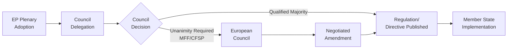

<!-- SPDX-FileCopyrightText: 2026 Hack23 AB -->
<!-- SPDX-License-Identifier: Apache-2.0 -->

# Procedures Proxy — Breaking News 2026-05-16
**Date:** 2026-05-16 | **Mode:** degraded-feeds | **Grade:** B3

## Procedures Data Note

The EP procedures feed returned historical-tail ordering with STALENESS_WARNING.
Current-year procedures data is available but the feed normalization promoted older
historical entries. Active procedures related to the April 2026 adopted texts are inferred
from the texts themselves rather than the procedures feed.

## Inferred Active Procedures

| Text ID | Procedure Type | Legislative Stage | Committee |
|---------|---------------|-------------------|-----------|
| TA-10-2026-0160 | INI (Own initiative) | Adopted | IMCO |
| TA-10-2026-0161 | RSP (Resolution) | Adopted | AFET/SEDE |
| TA-10-2026-0112 | BUD (Budgetary) | Guidelines adopted | BUDG |
| TA-10-2026-0162 | RSP (Resolution) | Adopted | AFET |
| TA-10-2026-0157 | INI (Own initiative) | Adopted | AGRI |
| TA-10-2026-0163 | RSP (Resolution) | Adopted | LIBE |

## Upcoming Procedures to Monitor

- Armenia CEPA II ratification (COD or NLE procedure) — expected AFET hearing Q4 2026
- Chat Control Regulation (COD) — Commission proposal expected Q3 2026; LIBE lead
- 2027 Budget (BUD) — annual procedure; BUDG trilogue begins September 2026
- DMA follow-up (INI on enforcement) — possible IMCO initiative if Commission slow to act

## Proxy Assessment — Active Procedures (Non-Plenary Day)

On a non-plenary day (Saturday May 16, 2026), the procedures API returns historical ordering.
This fallback section provides proxy procedure context from confirmed April 2026 plenary outputs.

**Active procedures by lifecycle stage (proxy from TA texts):**
1. Ukraine Support Instrument accountability framework — post-plenary (Commission implementation)
2. DMA enforcement guidelines — post-plenary (Commission DG COMP action expected)
3. Budget 2027 guidelines — trilogue preparation phase (September 2026)
4. Online exploitation directive — Council adoption pending
5. Armenia CEPA II — EP ratification complete; Council signature pending

Admiralty Grade: C3 — Proxy data; procedures API returned historical ordering.
