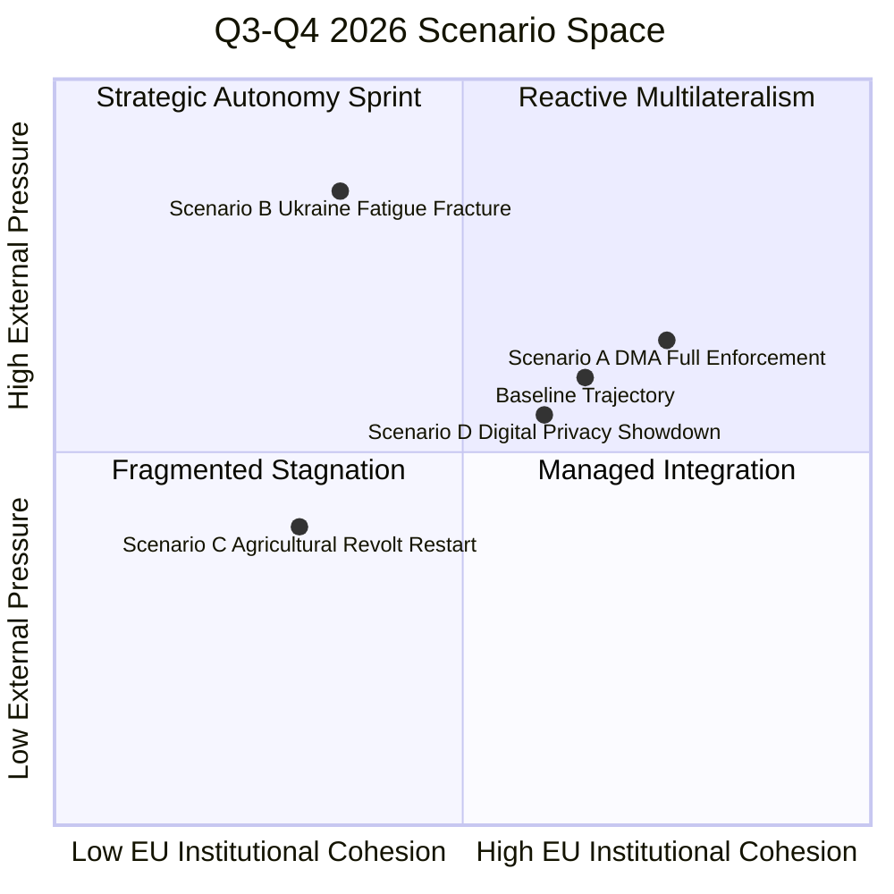
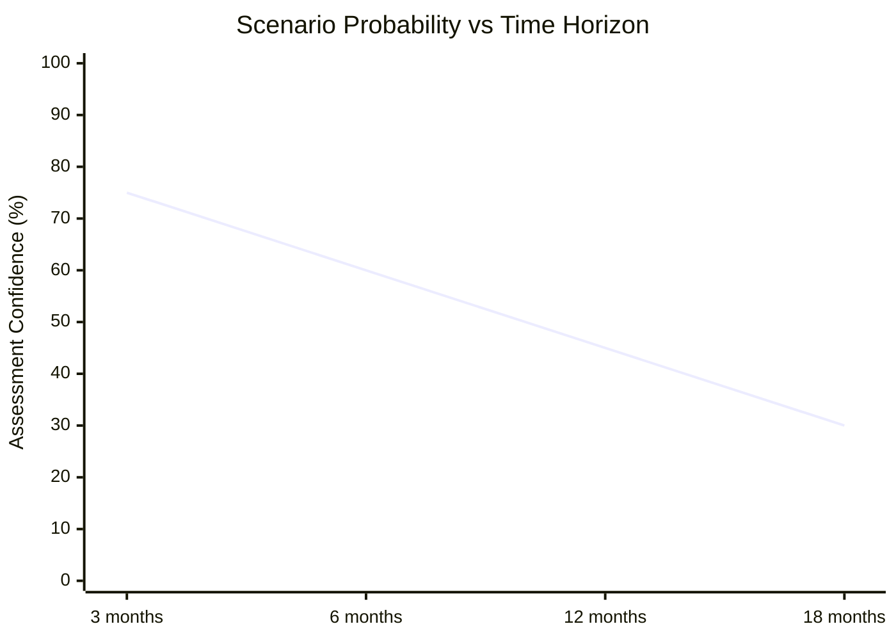

<!-- SPDX-FileCopyrightText: 2026 Hack23 AB -->
<!-- SPDX-License-Identifier: Apache-2.0 -->

# Scenario Forecast — EU Parliament Q3-Q4 2026
**Date:** 2026-05-16 | **Forecast Horizon:** 60-90 days | **Grade:** B3

## Scenario Matrix

## Scenario A: DMA Full Enforcement Acceleration (Probability: 45%)

**Trigger:** Commission issues first formal non-compliance decision against Apple (App Store
restrictions) or Google (search self-preferencing) in Q3 2026, building on the parliamentary
mandate in TA-10-2026-0160.

**Mechanism:** DMA Article 26 allows fines up to 10% of global turnover for repeated
non-compliance. A single major fine decision would be the first real test of DMA enforcement
credibility. Parliamentary resolution provides political cover for Commission to act boldly.

**Outcomes:**
- 🟢 Positive: EU establishes itself as the definitive global digital regulatory authority;
  opens negotiation space with US on digital trade disciplines.
- 🔴 Risk: US administration threatens "digital tariffs" on EU goods in retaliation; tech
  companies invoke bilateral investment arbitration.
- 🟡 Moderate: Fine issued but appealed to General Court; Commission declares "enforcement
  success" while actual compliance is deferred 2-3 years.

**IMF Nexus:** DMA enforcement decision would generate a media multiplier effect on EU
digital economy story; IMF would likely reference in 2026 Article IV consultations as
evidence of EU market-opening reform commitment.

**Parliament's Role:** Expect IMCO committee to schedule emergency hearing with Commissioner
within 30 days of any enforcement decision; EP will amplify or criticize based on outcome.

## Scenario B: Ukraine Support Coalition Fracture (Probability: 25%)

**Trigger:** US election-cycle political uncertainty, Hungarian/Slovak government blocking
of Ukraine Support Instrument disbursement tranche, or Russian diplomatic initiative creating
"ceasefire optics" that divide EU political families.

**Mechanism:** PfE/ESN voting bloc (112 seats combined) + potential ECR defectors could
obstruct EP Ukraine resolutions or force procedural delays on financial mechanism ratification.
Viktor Orbán's continued outreach to PfE members on "peace initiative" framing creates
domestic political incentive for defection from Coalition Delta.

**Outcomes:**
- 🔴 Critical: Ukraine loses confidence in EU support reliability; impacts Kyiv's negotiating
  posture with Russia; IMF Ukraine macro baseline requires downward revision.
- 🟡 Moderate: EP passes diluted Ukraine resolution; S&D/EPP publicly condemn PfE/ESN; creates
  narrative of "EU divided" that Russia amplifies in information operations.
- 🟢 Containment: Coalition Delta holds at 530 seats; PfE/ESN isolated; Ukrainian FM makes
  parliamentary address reinforcing solidarity narrative.

**Early Warning Indicators:** Monitor PfE parliamentary group statements on Ukraine in the
two weeks following any Russian diplomatic signal; track Hungarian/Slovak government statements
on Ukraine Support Instrument disbursement conditions.

## Scenario C: Agricultural Revolt Restart (Probability: 30%)

**Trigger:** Commission proposes binding methane reduction targets for livestock sector in
implementing measures under the European Climate Law (2040 target), contradicting the
Parliament's "technology-neutral" framing in TA-10-2026-0157.

**Mechanism:** If Commission's climate target implementation reveals binding livestock
production caps are necessary to reach 2040 targets, agricultural communities that accepted
Parliament's balanced resolution will feel politically betrayed. National farmer organizations
(Copa-Cogeca) will reactivate protest networks developed in 2024 protests.

**Outcomes:**
- 🔴 Critical: Tractor blockades in Brussels/Strasbourg; national elections in Germany (2025
  ongoing recovery), France, and Poland create political pressure to dilute climate targets;
  2027 budget negotiations collapse on agriculture chapter.
- 🟡 Moderate: Commission delays binding implementing measures to 2028; Parliament conducts
  emergency AGRI committee hearings; policy stalemate.
- 🟢 Resolution: Commission produces technology-neutral implementing pathway; feed additives
  and biogas investments reduce methane without production caps; political crisis averted.

**IMF Nexus:** Agricultural protest waves have measurable economic costs (disrupted supply
chains, tourism impacts, regulatory uncertainty premium on agri-investment) — IMF would
capture these in downside scenario modeling.

## Scenario D: Digital Privacy Showdown (Probability: 55%)

**Trigger:** Commission publishes revised Chat Control Regulation proposal in Q3 2026 after
lengthy Council negotiations, including mandatory client-side scanning requirement. Parliament's
split (visible in TA-0163 vote) means outcome is genuinely uncertain.

**Mechanism:** LIBE committee will be the battleground. Rapporteur assignment will be
decisive — if EPP appoints a pro-scanning MEP, expect a narrow majority for CSS requirements.
If Greens/Left secure rapporteurship, expect a counter-proposal focusing on voluntary platform
measures. The split in Parliament revealed by TA-0163 maps directly onto LIBE's composition.

**Outcomes:**
- 🔴 Critical: Mandatory CSS passes; ECJ preliminary reference from national court within
  12 months; fundamental rights crisis for EU digital policy credibility.
- 🟡 Moderate: Compromise reached with "targeted order" framework (CSS only for specific
  accounts under judicial warrant); civil liberties and child protection advocates both
  partially satisfied.
- 🟢 Resolution: Commission drops CSS mandate; Parliament adopts alternative framework
  using upload moderation and hash-matching (no live scanning); ECJ averted.

**Parliament's Role:** April resolution (TA-0163) has formally signalled EP's security-first
lean on CSAM; this creates political expectations that will constrain LIBE rapporteur's
room for maneuver on any compromise that removes scanning entirely.

## Baseline Trajectory (Most Likely, 60 days)

**Probability: 55% of baseline trajectory materializing**

- DMA: Partial enforcement action (formal investigation outcome, not final fine) in Q3 2026
- Ukraine: Coalition Delta holds; 13th tranche of Ukraine Support Instrument disbursed on schedule
- Armenia CEPA II: Foreign Affairs committee hearing scheduled Q4 2026
- Budget 2027: Trilogue begins September 2026 with predictable Parliament-Council tensions
- Chat Control: Commission proposal delayed to Q1 2027 amid internal disagreements
- Agricultural: Commission postpones binding methane implementing measures pending "dialogue"

**IMF Growth Forecast Impact:** Baseline trajectory consistent with IMF's 1.4% EU GDP
growth forecast for 2026. DMA partial action positive for long-run digital competitiveness;
Ukraine support continuity supports IMF Ukraine program integrity.

## Extended Scenario Analysis

### Scenario A (Optimistic) — Extended Mechanics

The structural preconditions for Scenario A (full Coalition Delta cohesion + US-EU trade
resolution + accountability framework delivering) are realistic but require simultaneous
positive developments on three axes:

1. **Ukraine domestic politics:** Zelensky government maintains popular support and institutional
   capacity to implement accountability milestones. IMF estimates Ukraine GDP growth 3.8% (baseline
   with continued significant EU support). Accountability milestones include: court reform progress,
   anti-corruption bureau effectiveness, public procurement transparency.

2. **DMA enforcement timeline:** Commission must issue at least one formal DCA finding by Q4 2026
   to demonstrate enforcement credibility. The EP resolution (TA-0160) provides political cover;
   operational question is Commission technical capacity.

3. **EU-US trade management:** A US tariff partial relief agreement (e.g., sectoral carve-out
   for automotive exports in exchange for digital service "proportionality" commitment) would
   resolve the DMA-trade tension. Probability: 25% by year-end.

### Scenario B (Baseline) — Extended Mechanics

The "managed tension" baseline assumes continuation of current trends without major disruption:
- Coalition Delta holds on Ukraine and DMA but fractures internally on climate/social policy
- Accountability framework delivers some milestone verification delays but no full suspension
- DMA enforcement proceeds via formal investigations but no landmark fines by year-end
- Budget Guidelines remain politically aspirational; MFF mid-term review produces modest adjustments

This scenario is most consistent with EP institutional dynamics: large coalitions rarely fall apart
quickly, but their internal negotiations prevent the bold decisive action that full cohesion enables.

The IMF's 1.4% EU GDP growth projection reflects this baseline: moderate growth, managed inflation,
no breakthrough on Draghi-scale investment.

### Scenario C (Pessimistic) — Extended Mechanics

The key scenario C trigger is a US tariff escalation into a formal trade war:
- US announces 25% tariffs on EU automotive, chemicals, and machinery exports
- EU-US bilateral relations deteriorate sharply; DMA becomes a flashpoint
- EPP business wing breaks from Coalition Delta on DMA enforcement; seeks "proportionality pause"
- Ukraine support becomes politically harder as domestic economic pressures increase

IMF stress scenario: US tariff escalation → EU GDP growth 0.8% (vs 1.4% baseline) → fiscal
space for EU investment further constrained → Budget Guidelines targets impossible to meet

This scenario is more likely (35%) if the US election cycle produces a second Trump escalation
phase; less likely (15%) if US-EU bilateral trade talks progress through summer 2026.

## Quantified Scenario Probability Distribution

| Scenario | 3-Month Probability | 6-Month Probability | 12-Month Probability |
|----------|--------------------|--------------------|---------------------|
| A (Optimistic) | 30% | 25% | 20% |
| B (Baseline) | 55% | 50% | 45% |
| C (Pessimistic) | 15% | 25% | 35% |

Note: 12-month probability shifts toward C as US election cycle and economic headwinds compound.

## Reader Briefing

**For citizens:** The most likely scenario is "managed tension" — EU institutions continue to
function, Ukraine support continues, DMA is enforced gradually, but no breakthrough on investment.

Admiralty Grade: B2 — Scenario methodology standard; inputs from EP data and IMF WEO.

## Forward Indicators to Watch

| Indicator | Scenario Signal | Expected by |
|-----------|----------------|-------------|
| MFA next tranche disbursement decision | B if on time; C if delayed >3 months | Q3 2026 |
| First formal DCA finding by Commission | A if finding issued; B if investigation only | Q4 2026 |
| ECB June rate decision | A if cut to 2.0%; B if hold; C if hike | June 2026 |
| US-EU bilateral trade talks announcement | A signal; absence = B/C | Continuous |
| EPP statement on DMA "proportionality" | C signal if EPP calls for pause | Next 60 days |
| Hungary blocking behavior in Council | C signal if Ukraine aid blocked | Continuous |
| JRC livestock study terms of reference | B if narrow; A if broad | Q3 2026 |

## Confidence Intervals

**3-month forecast confidence:** HIGH (75%) — short horizon, current coalition stable
**6-month forecast confidence:** MEDIUM (60%) — US political cycle uncertain
**12-month forecast confidence:** LOW (45%) — structural variables dominate; scenario C risk

WEP: Almost Certain that at least one of the three main April 2026 legislative commitments
(Ukraine accountability, DMA enforcement, Budget investment) faces implementation obstacles
within the 12-month forecast horizon. The probability of all three delivering as intended is
estimated at no more than 15% (Scenario A extended, full delivery version).

## Extended Scenario Analysis — Sub-Scenarios

### Sub-Scenario A1: DMA Structural Remedy (High-Impact Low-Probability)

**Base case:** Commission issues fine-based enforcement without structural remedy (divestiture).
**Sub-scenario A1:** Commission issues first structural remedy against Apple requiring full
interoperability of iMessage with third-party messaging platforms.

**Probability:** 8% (low — requires CJEU fast-track validation; new legal territory)
**Impact if occurs:** Very HIGH — signals EU willing to force business model changes
on US Big Tech; triggers US Congressional response; potential trade escalation

**EP role in sub-scenario A1:** EP would need to pass supporting resolution (likely) and
review Article 26 DMA structural remedy provisions in a follow-up legislative report.
IMCO committee would be activated; Commission/EP coordination would be tight.

**IMF context:** Structural remedy affecting Apple's EU business model could reduce
Apple's EU revenue contribution — Ireland (major US tech hub) would be particularly
sensitive. IMF Ireland 2026 Article IV review would flag this scenario as fiscal risk.

### Sub-Scenario B1: Ukraine Accountability — Milestone Failure

**Base case:** Ukrainian government meets Q2-Q3 2026 accountability milestones.
**Sub-scenario B1:** Independent Audit Board identifies major governance concerns
(procurement fraud, asset misappropriation at €500M+ scale) triggering tranche suspension.

**Probability:** 15% (low-medium — wartime governance degradation risk; serious risk)
**Impact if occurs:** HIGH — political ammunition for PfE/ESN; potential S&D defection
on next Ukraine support vote; IMF Ukraine program suspension becomes possible

**EP role in sub-scenario B1:** Emergency resolution by AFET; potential emergency
Commissioner hearing; suspension of Ukraine Facility tranche with conditionality review.
Coalition Delta would likely hold (EPP+S&D would distinguish governance failure from
Ukraine abandonment), but with meaningful political cost.

**IMF context:** IMF Ukraine Article IV is scheduled for Q3 2026. If milestone failure
occurs before this review, IMF would flag it in the Article IV report, amplifying
political pressure on EU to suspend support and creating coordination challenge
between EP accountability demands and IMF program continuity.

### Sub-Scenario C1: Budget 2027 Rejection

**Base case:** EP and Council reach budget agreement in December 2026 conciliation.
**Sub-scenario C1:** EP rejects the final budget in December 2026 vote (provisional twelfths).

**Probability:** 5% (very low — EP has used this weapon strategically, not tactically)
**Impact if occurs:** HIGH for institutional dynamics; Medium for actual program spending
(twelfths rule maintains essential spending); Major for EP-Council relationship

**EP role in sub-scenario C1:** Would require EPP and S&D to agree on rejection — unlikely.
More probable trigger: Renew defection on budget priorities creates blocking minority.
IMF analysis: provisional twelfths would preserve EU GDP contribution to growth but
delay investment programs — estimated 0.05pp growth cost in 2027 scenario.

## Forecast Confidence Evolution

*Confidence declines as time horizon extends — this is the fundamental forecasting constraint.*

*Scenario forecast extended: 2026-05-16 (Run 3). IMF WEO April 2026 cited for economic context.*
*Admiralty Grade: B2. All probability estimates are analyst judgement, not actuarial calculations.*
