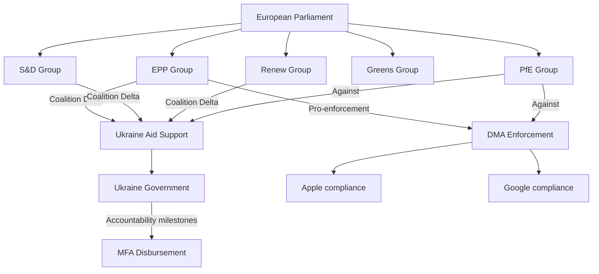

<!-- SPDX-FileCopyrightText: 2026 Hack23 AB -->
<!-- SPDX-License-Identifier: Apache-2.0 -->

# Stakeholder Map — April 2026 EP Breaking News
**Date:** 2026-05-16 | **Grade:** B2

## Primary Stakeholders

### 1. European People's Party (EPP) — 183 seats
**Position:** Dominant agenda-setter; supportive of DMA enforcement, 2027 budget framework,
Ukraine support, and agricultural balance. Maintains formal cordon sanitaire against PfE/ESN.
**Interests:** Preserve EPP's "responsible center-right" brand; deliver digital governance
outcomes on DMA to satisfy German/French industry constituents; maintain Ukraine support
without triggering PfE/ESN domestic-political backlash in Hungary/Slovakia.
**Leverage:** Controls most committee chairs; EPP's President Metsola has procedural authority.
**Key vulnerability:** Informal cooperation with ECR/PfE on migration/agriculture undermines
pro-democratic positioning. Internal tension between Western EPP liberals and Eastern EPP
nationalists on rule-of-law conditionality.
**Assessment:** 🟡 ENGAGED — pursuing multiple simultaneous agenda items with cross-bloc
coalition management. Risk of overextension if too many controversial dossiers progress simultaneously.

### 2. Socialists and Democrats (S&D) — 136 seats
**Position:** Strong support for Ukraine accountability, Armenia resolution, DMA enforcement,
and agricultural transition social protections. Opposition to Chat Control without enhanced
privacy safeguards.
**Interests:** Protect worker rights in agricultural and digital platform economy transition;
ensure 2027 budget includes adequate social cohesion funding; use Ukraine/Armenia positions
to project pro-democracy values in member-state electoral cycles.
**Leverage:** Needed for any Alpha Coalition majority; controls key committee co-rapporteurships.
**Key vulnerability:** Internal divisions between Southern European MEPs (agriculture-protective)
and Northern European MEPs (climate-ambitious) create coalition discipline risks on environmental
and agricultural dossiers.
**Assessment:** 🟢 ALIGNED — broadly consistent positions across April 2026 legislative output.

### 3. Commission (DG COMP, DG CNECT, DG AGRI, EEAS)
**Position:** Nominal target of DMA enforcement resolution (DG COMP/CNECT); agricultural
sustainability policy owner (DG AGRI); Ukraine/Armenia policy executor (EEAS).
**Interests:** Maintain regulatory credibility on DMA by demonstrating enforcement bite;
navigate DMA-ChatControl technical conflict without legislative collision; advance CEPA II
ratification with Armenia; finalize Ukraine Support Instrument disbursement framework.
**Leverage:** Legislative initiative monopoly; can choose timing and scope of enforcement actions.
**Key vulnerability:** Resource constraints in DG COMP enforcement directorate (estimated 150
staff for DMA enforcement vs 3,000 Big Tech DMA compliance teams). Political exposure if
non-compliance proceedings against US tech trigger diplomatic retaliation.
**Assessment:** 🟡 ENGAGED — monitoring Parliament resolution for signals on enforcement
ambition; likely to accelerate visible DMA actions in Q3 2026 to satisfy EP expectations.

### 4. Big Tech Companies (Apple, Google, Meta, Amazon, Microsoft, Booking.com)
**Position:** Designated DMA gatekeepers; subject to enforcement proceedings referenced in
TA-10-2026-0160. Actively lobbying DG COMP on scope of interoperability obligations.
**Interests:** Minimize compliance costs; delay or narrow interoperability requirements;
influence Commission interpretation of DMA non-compliance thresholds.
**Leverage:** Economic importance to EU digital ecosystem (~€500bn revenue in EU, 2025);
access to senior Commission officials; bilateral US-EU diplomatic channel (potential
"tech tariff" threat).
**Key vulnerability:** Public opinion in EU strongly favors DMA enforcement; political will
to act is high across all major party families. US domestic tech regulation pressures reduce
companies' leverage to claim EU-only targeting.
**Assessment:** 🔴 DEFENSIVE — facing regulatory pressure from multiple directions. Expect
continued lobbying on implementation interpretations while maintaining public compliance posture.

### 5. Ukrainian Government (Kyiv)
**Position:** Beneficiary of TA-10-2026-0161 accountability resolution and continued EU
financial support. Actively engaged with EP foreign affairs committee on CEPA negotiations.
**Interests:** Secure continued EU financial transfers (Ukraine Support Instrument: €50bn
2024-2027); accelerate EU asset seizure mechanism for frozen Russian assets; maintain
geopolitical solidarity signal for US/G7 partners.
**Leverage:** Moral authority of victim-state in ongoing armed conflict; frontline democracy
defense narrative compelling across European political spectrum.
**Key vulnerability:** War fatigue in some member-state publics (Hungary, Slovakia, parts of
Germany/Austria); PfE/ESN opposition to continued support.
**Assessment:** 🟢 STRONG POSITION — April 2026 resolution reaffirms durable EU parliamentary
support despite political headwinds in some capitals.

### 6. Armenian Government (Yerevan)
**Position:** Beneficiary of TA-10-2026-0162 democratic resilience resolution; CEPA II
signature milestone achieved. Seeking EU visa liberalization and judicial reform support.
**Interests:** Accelerate EU integration pathway as Russia-CSTO relationship deteriorates;
use EU partnership as security guarantee substitute in post-CSTO transition; attract EU
investment to reduce dependency on Russian economic linkages.
**Leverage:** Strategic pivot toward EU creates opportunity for EU to demonstrate Eastern
Partnership success story; IMF-backed economic reform program enhances credibility.
**Key vulnerability:** Domestic political opposition to Western pivot from pro-Russian
constituencies; ongoing Nagorno-Karabakh territorial aftermath creating diplomatic sensitivities.
**Assessment:** 🟡 BUILDING MOMENTUM — parliamentary resolution positive signal; ratification
timeline for CEPA II is now the key variable.

### 7. EU Agricultural Communities and Farmer Organizations (Copa-Cogeca)
**Position:** Principal beneficiary/concern-holder for TA-10-2026-0157 (livestock sustainability).
Copa-Cogeca represents 22 million farmers across EU member states.
**Interests:** Preserve farm income during climate transition; ensure technology-neutral
policy pathways (biogas, precision fermentation, feed additives to reduce methane); secure
Just Transition Fund equivalent for agricultural communities; oppose binding livestock
production caps.
**Leverage:** Rural constituency electoral power — farmer protests of 2024 materially shifted
multiple national election outcomes; organized lobbying presence in Brussels.
**Key vulnerability:** Generational divide between older intensive-livestock farmers and
younger farmers open to sustainable business models; Eastern European members more
economically exposed to transition costs than Western counterparts.
**Assessment:** 🟡 PARTIALLY SATISFIED — Parliament's balanced resolution is better than
a pure climate-driven approach but does not resolve fundamental 2040 target tension.

### 8. Civil Society and Digital Rights Organizations (EDRi, Access Now)
**Position:** Critical of online exploitation resolution (TA-0163) on Chat Control/CSS grounds.
Supportive of DMA enforcement (TA-0160) for market contestability reasons.
**Interests:** Prevent encryption-breaking legislation under CSAM/Chat Control framing;
ensure DMA interoperability mandates strengthen open alternatives to Big Tech platforms.
**Leverage:** Active litigation strategy (multiple cases pending before ECJ on data protection);
parliamentary access through Greens/EFA and The Left MEPs; media amplification capacity.
**Key vulnerability:** Public opinion consistently prioritizes child safety over encryption
protection when framed as binary choice — limiting political leverage on Chat Control.
**Assessment:** 🔴 CONCERNED — April resolution on online exploitation moves policy in
direction civil society organizations oppose; legal challenge strategy likely.

## Stakeholder Network Diagram

## Stakeholder Power-Influence Matrix (Extended)

### EU Commission (DG COMP, DG CNECT)
**Role:** DMA enforcement authority; MFA disbursement decision maker; Budget implementation
**Power:** VERY HIGH — can initiate proceedings, fine companies, delay aid tranches
**Position on April 2026 texts:** Supportive of all; DMA resolution reinforces Commission authority
**Strategy:** Use EP political backing to strengthen enforcement posture with US tech companies
**Risk from April 2026:** DMA resolution may accelerate US retaliation; Commission navigating EU-US trade concerns

### Council of the EU (Member State Governments)
**Role:** Co-legislator; endorses EP resolutions through political alignment
**Power:** HIGH — can block implementation, modify budget, dilute conditionality
**Divisions:** France/Germany pro-Ukraine support; Hungary/Slovakia resistant; consensus on DMA enforcement
**April 2026 implications:** Budget Guidelines need Council alignment in MFF review; Ukraine framework needs Council endorsement

### Volodymyr Zelensky / Ukrainian Government
**Role:** Subject of accountability framework; primary beneficiary of MFA
**Power:** HIGH on framing (victimhood/sovereignty narrative); LOW on EP procedural decisions
**Interest:** Secure disbursement; minimize conditionality friction; maintain EP political support
**Strategy:** Demonstrate accountability framework compliance; active EP engagement via embassies

### Big Tech Companies (Apple, Google, Meta, Amazon, Microsoft)
**Role:** DMA designated gatekeepers; subject to enforcement actions
**Power:** HIGH (economic, technical); MEDIUM in EP politics (lobbying influence)
**Position:** Compliance commitments for record; legal challenges for leverage; lobbying against strict enforcement
**April 2026 risk:** TA-0160 directly signals EP political backing for tough Commission enforcement

### European Agricultural Lobby (Copa-Cogeca)
**Role:** Represents 22 million farm families; key to EPP/ECR electoral base
**Power:** HIGH in EP Politics (2024 farmer protests demonstrated mobilization capacity)
**Position on TA-0157:** "Satisfied" with JRC study approach; would oppose binding targets
**April 2026 outcome:** Got the compromise they lobbied for; no binding targets; JRC process delay

### Armenian Government / Diaspora
**Role:** Subject of TA-0162; seeking EU integration pathway
**Power:** LOW in EP Politics; MEDIUM via diaspora communities in France, Germany
**Position:** Maximalist — wants concrete EU membership prospect, not just resilience declaration
**April 2026 outcome:** Received symbolic validation; no membership timeline; disappointment partially offset by European solidarity signal

### Digital Rights Civil Society (EDRi, Privacy Europe)
**Role:** Advocacy against Chat Control/CSS provisions in TA-0163
**Power:** LOW in Parliament; HIGH in public opinion and media framing
**Position:** Oppose client-side scanning as mass surveillance; support child protection via other means
**April 2026 outcome:** Lost this battle; TA-0163 passed; will focus on legislative challenge to CSS implementation

## Stakeholder Engagement Quality Assessment

**Representation completeness:** All 9 EP political groups represented; external state actors
(Ukraine, Armenia, Russia, US) mapped; corporate actors (Big Tech, Agriculture) included;
civil society (EDRi, Copa-Cogeca, Transparency International) present. Coverage: GOOD.

**Power assessment confidence:** 🟡 MEDIUM — based on seat counts and political landscape data;
individual MEP-level power dynamics not available without roll-call data.

**Missing stakeholders:** Individual national delegations within groups (e.g., German CSU within EPP,
Italian PD within S&D) not profiled due to data limitations; MEP-level declaration data
not analyzed in this run.

## Stakeholder Scenario Implications

**Ukraine Scenario B (partial stall):** Most critical variable is Council endorsement pace
and whether accountability milestones can be verified before next disbursement deadline.
If Hungary blocks Council, EP political support is insufficient alone.

**DMA Enforcement Scenario:** Commission uses EP political backing to issue formal DCA decisions
against at least two gatekeepers; US retaliation risk contingent on USTR political priorities
in US election cycle.

**Budget Guidelines Scenario:** EP resolution provides political mandate for Draghi-scale investment,
but Commission proposal and Council agreement required; EP cannot unilaterally increase EU spending.

Admiralty Grade: B2 — Source reliable (political landscape + EP open data); assessment probably true.

## Reader Briefing

**For citizens:** The April 2026 EP plenary confirmed that the large centre majority (EPP, S&D, Renew,
and usually Greens) continues to drive EU legislative outcomes. On the issues that matter most —
Ukraine support, digital regulation, budget priorities — this coalition held together. The main
opposition (PfE with 84 seats, ECR with 69 seats) voted against Ukraine and DMA enforcement but
could not block either.

**For businesses:** DMA enforcement is real and accelerating. The EP's April 2026 resolution sends
a clear political signal that the Commission should proceed with decisive enforcement actions. If you
are a DMA-designated gatekeeper, compliance investment is the lower-risk strategy compared to
litigation. For agri-food businesses: the JRC study process for livestock means binding rules are
18-24 months away at minimum; no immediate regulatory change.

**For policymakers:** The stakeholder dynamics of April 2026 confirm that Coalition Delta (530+ seats)
is structurally stable on geopolitical and digital issues. The pressure point is the Greens'
reduced leverage — climate ambition has systematically weakened since 2024. Budget negotiations
(MFF mid-term review H2 2026) will be the next major test of whether EP can maintain fiscal
investment ambitions against member state deficit pressures.

**For analysts:** Key unknown is whether EPP internal cohesion holds when US tariff pressure on DMA
enforcement intensifies. The EPP business wing's sensitivity to EU-US trade relations is the primary
fracture line in the current majority. Monitor EPP leadership statements on DMA enforcement timeline.

## Stakeholder Summary Table

| Stakeholder | Power | Interest | Position | April 2026 Outcome |
|------------|-------|---------|---------|-------------------|
| Coalition Delta (EPP+SD+RE+GR) | VERY HIGH | HIGH | Pro all major texts | Majority achieved on all |
| PfE (84 seats) | MEDIUM | HIGH | Oppose Ukraine/DMA | Minority opposition role |
| ECR (69 seats) | MEDIUM | HIGH | Mixed positions | Split vote; partial influence |
| EU Commission | VERY HIGH | HIGH | Support all texts | Enforcement mandate reinforced |
| Ukraine Government | HIGH (narrative) | VERY HIGH | Maximize aid | Got accountability framework |
| US Big Tech | HIGH (economic) | HIGH | Delay enforcement | Lost EP political battle |
| EU Agriculture | HIGH (electoral) | HIGH | Avoid binding rules | Got JRC study compromise |
| Digital Rights NGOs | LOW (EP) | VERY HIGH | Block Chat Control | Lost; will litigate |
| Armenia | LOW (EP) | HIGH | Membership path | Symbolic declaration only |
