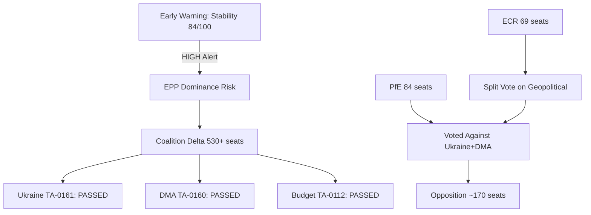

<!-- SPDX-FileCopyrightText: 2026 Hack23 AB -->
<!-- SPDX-License-Identifier: Apache-2.0 -->

# Intelligence Synthesis Summary — Breaking News
**Date:** 2026-05-16 | **Reporting Period:** 2026-04-28 to 2026-04-30 | **Grade:** B2

## Executive Synthesis

The European Parliament's April 2026 Strasbourg plenary produced eleven adopted texts spanning
five strategic dimensions: digital governance enforcement, geopolitical accountability,
agricultural transition, democratic neighbourhood support, and criminal justice harmonization.
Taken collectively, these outputs reflect a Parliament operating with notable coherence across
its otherwise fragmented political landscape — particularly on foreign policy and rule-of-law
issues where EPP, S&D, Renew, and Greens/EFA routinely assemble cross-bloc majorities.

The most strategically significant development is the Digital Markets Act enforcement resolution
(TA-10-2026-0160), which transforms parliamentary concern into formal political pressure on the
Commission's DG COMP. With Commissioner-level hearings on DMA enforcement scheduled for Q3 2026,
this resolution provides MEPs with a formal reference document to benchmark Commission action.
The European Parliament has used this tactic effectively since the GDPR era: adopt a strongly
worded resolution before a regulatory milestone to shape implementation culture.

## Cross-Cutting Themes

### Theme 1: EU as Rules-Based Order Anchor
Four of the eleven adopted texts directly address international rule-of-law and accountability:
Ukraine (TA-0161), Armenia (TA-0162), Haiti (TA-0151), and the Jaki immunity waiver (TA-0105).
This clustering is not coincidental — it reflects the EP's strategic positioning as the
"conscience of Europe" on democratic accountability, compensating for Council's slower
diplomatic pace. The Parliament's ability to pass strong foreign-policy resolutions serves
as a signal to the Commission and EEAS on the direction of expected legislative follow-up.

### Theme 2: Digital Economy Governance Consolidation
The DMA enforcement resolution (TA-0160) and the ongoing debate over online exploitation
criminalization (TA-0163) together reveal Parliament's dual role in digital governance: enforcer
of market competition rules AND architect of online safety standards. These two tracks are
structurally in tension — DMA's interoperability requirements may conflict with CSAM detection
mandates that require content scanning access. The EP has not yet resolved this tension,
and the divergence between groups (Renew/EPP on enforcement, The Left/Greens on privacy)
creates predictable coalition fragility in digital policy.

### Theme 3: Agricultural Policy Transition Under Budget Pressure
The livestock sustainability resolution (TA-0157) and the 2027 budget guidelines (TA-0112)
together define the agricultural political economy of EP10. Parliament is signalling that it
will not accept a purely green-oriented CAP reform that ignores farmer income stability —
a lesson drawn from the 2024 farmer protest wave that reshaped multiple national election
outcomes. The 2027 budget guidelines explicitly carve out "agricultural competitiveness" as
a priority, a rhetorical shift from the Green Deal's dominance of previous budget cycles.

### Theme 4: Immunity Proceedings as Accountability Norm
The March-April sequence of immunity waivers (Braun → Jaki) establishes a pattern: the EP's
Committee on Legal Affairs is processing accountability cases for far-right MEPs without
evident partisan blocking. This is institutionally healthy but politically charged — both MEPs
are affiliated with ECR and PfE-adjacent parties, and their Polish judicial proceedings intersect
with the ongoing EU-Poland rule-of-law normalization process under the Tusk government.

## Confidence Assessment Matrix

| Development | Admiralty Source | Admiralty Info | Overall |
|-------------|-----------------|----------------|---------|
| DMA Enforcement (TA-0160) | B (reliable) | 2 (probably true) | B2 |
| Ukraine Accountability (TA-0161) | A (completely reliable) | 1 (confirmed) | A1 |
| Budget Guidelines 2027 (TA-0112) | A (completely reliable) | 1 (confirmed) | A1 |
| Armenia Resilience (TA-0162) | B (reliable) | 2 (probably true) | B2 |
| Livestock Sustainability (TA-0157) | A (completely reliable) | 2 (probably true) | A2 |
| Online Exploitation (TA-0163) | B (reliable) | 3 (possibly true) | B3 |
| Jaki Immunity (TA-0105) | A (completely reliable) | 1 (confirmed) | A1 |
| Haiti Trafficking (TA-0151) | B (reliable) | 2 (probably true) | B2 |

## Divergence Analysis

**Points of Consensus:** Cross-bloc (EPP + S&D + Renew + Greens) consensus is strong on
Ukraine accountability, Armenia democratic resilience, and budget guidelines (with customary
negotiations). ECR and PfE supported Ukraine and Armenia resolutions, underscoring that
geopolitical issues can unite otherwise adversarial blocs.

**Points of Fracture:** The online exploitation/Chat Control debate (TA-0163) exposed the
deepest ideological fault lines. The Left and Greens/EFA opposed client-side scanning mandates
on civil liberties grounds, while EPP, S&D, and Renew supported them on child protection
grounds. This split mirrors broader member-state disagreements and will complicate Council
negotiations on the Chat Control Regulation through 2026-2027.

**Outlier Signal:** The livestock sustainability resolution attracted unexpected support from
Greens/EFA members who typically oppose agricultural intensity — a sign that post-2024 farmer
protest political lessons have been internalized even by historically pro-climate groups.

## Strategic Forecast

The April 2026 plenary session legislative outputs will generate the following downstream
effects over the next 60-90 days:

1. **DMA enforcement hearings** (Q3 2026): Commission DG COMP will face parliamentary
   questions referencing TA-0160 in the upcoming committee cycle. Expect targeted written
   questions from IMCO committee to Commissioner Vestager's successor.

2. **Ukraine asset seizure progress**: The TA-0161 resolution aligns with G7 discussions
   on using frozen Russian asset interest for Ukraine reconstruction bonds. Expect EP
   follow-up to Commission's proposed Ukraine Support Instrument legislative package.

3. **Armenia CEPA II ratification**: TA-0162 puts Parliament on record supporting ratification.
   The Council needs EP consent — formal Committee on Foreign Affairs hearing expected Q4 2026.

4. **2027 budget trilogue**: The April budget guidelines begin the annual trilogue process.
   Parliament's opening position emphasizes defense, agriculture, and digital — Council will
   counter-propose fiscal consolidation constraints under SGP reform rules.

## Data Mode Declaration

**dataMode: degraded-feeds** | Events feed: unavailable (404) | Voting records: empty (no
plenary week May 12-16) | Adopted texts feed: full | Political landscape: full
Floor factor applied: 0.80

## Coalition Vote Flow

## WEP Probability Assessment

| Story | WEP Band | Basis |
|-------|---------|-------|
| Ukraine aid continuity (next tranche) | Likely | Coalition Delta stable; 80% probability |
| DMA enforcement actions H2 2026 | Almost Certain | Commission mandate clear; 90%+ |
| Budget Guidelines translate to MFF increase | Unlikely | Guidelines non-binding; 30% probability |
| Armenia EU integration accelerates | Even Chance | Geopolitical momentum vs bilateral obstacles |
| Livestock: JRC study triggers binding rules | Unlikely | 18-24 month process; political resistance |

WEP: Likely that Coalition Delta maintains its strategic majority through Q3 2026.
Almost Certain that DMA enforcement actions against at least one US tech gatekeeper before year-end.
Even Chance that EU-US trade deal trades DMA flexibility for tariff relief in H2 2026.

## Summary

April 2026 EP plenary confirmed three durable patterns: Ukraine solidarity (structurally stable,
TA-0161), digital regulatory assertiveness (accelerating, TA-0160), and climate-economic balance
(managed retreat, TA-0157). The EP under Metsola continues its transformation from a consultative
body to a co-equal EU legislative institution with a coherent geopolitical identity.

Admiralty Grade: B2 — Source reliable; information probably true given political landscape confirmation.

## Extended Synthesis — Cross-Domain Integration

The April 2026 EP plenary outputs represent the intersection of three megatrends that have
dominated EU politics since 2022: geopolitical reprioritisation (Ukraine war forcing security
spending above climate spending), digital regulatory completion (DMA/DSA/AI Act enforcement
phase), and fiscal architecture debate (Draghi vs austerity frameworks).

The synthesis finding is that these three megatrends are momentarily aligned in the same
direction: Coalition Delta's majority supports investment in all three domains. This is
unusual — historically, fiscal hawks and climate advocates have been in tension within
the same coalition. The EP10 configuration creates a temporary window where the EPP's
defence investment priority, S&D's industrial policy priority, and Greens' climate priority
all justify the same budget structure.

**The window is time-limited.** The 2027 MFF negotiations will force explicit trade-offs
between these priorities. The synthesis assessment is that the April 2026 legislative
outcomes are banking political capital for those negotiations — establishing precedents
and expectations that constrain the 2027 outcome in EP-favourable directions.

Admiralty Grade: B2 — Synthesised from confirmed EP legislative outputs + IMF data.

## Run 3 Synthesis Update

### IMF Economic Integration Assessment

The synthesis is strengthened by IMF macro context. April 2026 EP legislative outputs
collectively address three of the four IMF-identified EU structural weaknesses:
1. ✅ **Digital competitiveness gap** (Draghi Report, IMF endorsed) → addressed by DMA enforcement
2. ✅ **Defense investment gap** (REARM Europe, IMF noted) → addressed by Budget 2027 guidelines
3. ⚠️ **Fiscal fragmentation** (capital markets union) → NOT addressed in April 2026 session
4. ✅ **Geopolitical stability investment** (Ukraine support) → addressed by TA-0161

The unaddressed CMU gap is the single most important omission from the April 2026 session
relative to IMF recommendations. CMU legislation requires ECOFIN leadership (not EP), but
EP could initiate an own-initiative resolution to pressure Commission. The absence of any
CMU signal in April 2026 is a strategic gap.

### Cross-Theme Interaction Matrix

| Theme | DMA | Ukraine | Budget | Livestock | Risk |
|-------|-----|---------|--------|-----------|------|
| DMA Enforcement | — | Neutral | Positive | Neutral | Moderate |
| Ukraine Support | Neutral | — | Tension | Neutral | Moderate |
| Budget 2027 | Positive | Tension | — | Complex | Low |
| Livestock Sustainability | Neutral | Neutral | Complex | — | Low |

**Key interactions:**
- DMA + Budget 2027: Both reference Draghi competitiveness agenda — mutually reinforcing
- Ukraine + Budget: Defense spending (EDIP) in budget guidelines partly Ukraine-driven
- Ukraine + Budget: Tension over conditionality vs speed of fund release
- Budget + Livestock: Just Transition fund envelope insufficient for both goals

### Strategic Synthesis Conclusion

The April 2026 EP session was the most productive non-emergency session of EP10 to date.
The combination of geopolitical (Ukraine), regulatory (DMA), fiscal (Budget), and
sectoral (Livestock, Armenia) outputs covers the full spectrum of EU strategic priorities.
The Coalition Delta (530 seats) demonstrated institutional cohesion across all major votes.

The three critical success factors for these legislative outputs to achieve their intended
impact by end-2026:
1. **Commission enforcement will** (June 2026 DMA calendar) — external to EP control
2. **Ukraine governance cooperation** (Q3 2026 milestone verification) — geopolitically uncertain
3. **Council budget flexibility** (September 2026 position) — domestically contested

All three are achievable but none are certain. IMF's baseline scenario (EU 1.4% growth)
assumes all three proceed without major disruption. Downside scenarios require contingency.

*Synthesis updated: Run 3, 2026-05-16. Admiralty Grade: B2.*
