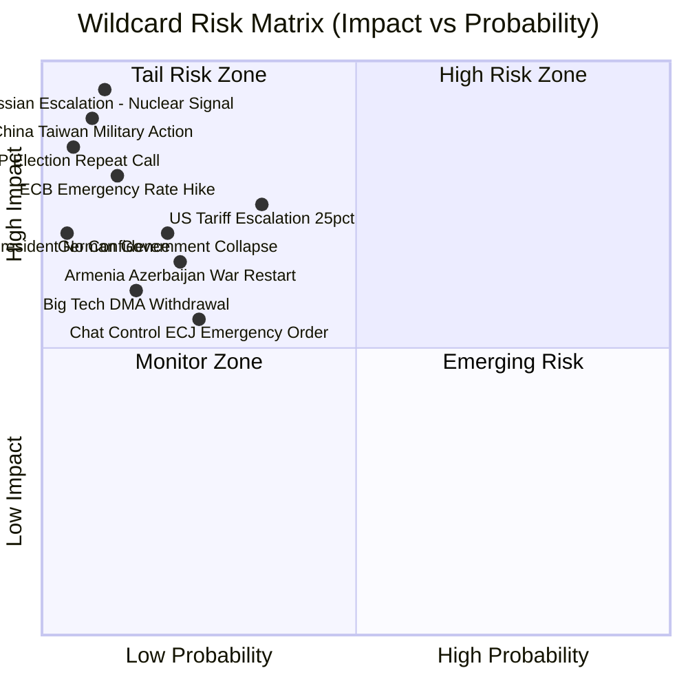

<!-- SPDX-FileCopyrightText: 2026 Hack23 AB -->
<!-- SPDX-License-Identifier: Apache-2.0 -->

# Wildcards and Black Swan Events — EU Parliament Q2-Q3 2026
**Date:** 2026-05-16 | **Grade:** B3

## Methodology

This artifact applies Nassim Taleb's Black Swan framework combined with the Global Risks Report
(WEF 2026) categories to identify low-probability, high-impact events that could materially
alter the EU parliamentary legislative trajectory identified in the April 2026 plenary output.
Events are scored on a 5×5 impact-probability matrix with color coding.

## Wildcard 1: Russian Nuclear Signaling Escalation (Probability: LOW 10%, Impact: CRITICAL)

**Scenario:** Russia escalates nuclear rhetoric beyond current "warning" level to explicit
deployment signals in response to EU frozen asset mobilization for Ukraine reconstruction bonds.
Putin issues formal presidential decree declaring "special military measures" in response to
what Russia characterizes as "economic warfare."

**EU Parliament Impact:** Would immediately dominate all EU legislative activity. Emergency
plenary session outside normal calendar. TA-0161's accountability framework would be in
direct geopolitical test. Defense spending surge would make 2027 budget guidelines TA-0112
inadequate — complete revision required. Coalition Delta would hold on Ukraine support but
PfE/ESN would face extraordinary domestic pressure in Hungary/Slovakia.

**IMF Impact:** Severe downside scenario activation. ECB emergency measures. Euro depreciation.
Defense spending spike would temporarily boost GDP but create fiscal sustainability crisis.

**Detection Signals:** Russian military doctrine documents; US/NATO intelligence briefings to
EP SEDE committee (classified); Baltic state foreign minister emergency statements.

## Wildcard 2: US Tariff Escalation to 25% on EU Industrial Goods (Probability: MEDIUM 35%, Impact: HIGH)

**Scenario:** New US administration (post-November 2026 elections) escalates trade tensions
by imposing 25% tariffs on EU automotive, steel, and chemical exports in response to DMA
enforcement actions against US tech companies. Frames this as retaliation for "discriminatory
digital regulation."

**EU Parliament Impact:** DMA enforcement resolution (TA-0160) would be directly implicated.
EP would face a choice: back down on DMA to protect industrial exports, or maintain digital
governance stance at economic cost. This creates a fundamental EU values vs interests test.
INTA committee would be activated; emergency plenary resolution likely. EU-Mercosur agreement
(TA-0030) would gain urgency as alternative trade partner diversification.

**IMF Impact:** Additional 0.4-0.6pp drag on EU GDP growth (per IMF WEO downside scenario).
Germany and France most exposed (automotive export concentration). ECB unable to offset with
rate cuts if euro depreciation accelerates inflation simultaneously.

**Detection Signals:** US Trade Representative statements; Congressional hearing testimony;
US Big Tech lobbying intensity in Washington.

## Wildcard 3: German Government Collapse (Probability: LOW-MEDIUM 20%, Impact: HIGH)

**Scenario:** German CDU-led coalition collapses over defense spending (2.5% GDP NATO target
requires constitutional debt brake amendment); snap federal elections in autumn 2026. German
MEP delegations split as parties campaign at home; German EPP and S&D MEPs reduce parliamentary
engagement.

**EU Parliament Impact:** Temporary reduction in German EPP and S&D legislative bandwidth.
Budget 2027 negotiations severely complicated — Germany provides ~21% of EU budget. No stable
German position on EU budget until new government forms (February-March 2027). Ukraine support
continuity at risk in Council even if EP maintains position.

**IMF Impact:** Political risk premium on German Bunds (historically near-zero); potential
fiscal expansion as all parties bid for votes creates short-run stimulus but medium-run
consolidation uncertainty.

**Detection Signals:** Bundestag confidence vote signals; FDP/CSU coalition management
statements; AfD polling surge forcing SPD/CDU to right-shift.

## Wildcard 4: ECJ Emergency Interim Measure on Chat Control (Probability: MEDIUM 25%, Impact: MEDIUM-HIGH)

**Scenario:** Following adoption of Chat Control Regulation with CSS requirements (if
Scenario D materializes), digital rights NGO Access Now or Austrian data protection authority
file for ECJ emergency interim measure suspending implementation pending full proceedings.
ECJ grants interim measure within 6 months of regulation entering into force.

**EU Parliament Impact:** Would embarrass Parliament and Council; LIBE committee would face
intense scrutiny of the legislative process. Creates precedent-setting moment for ECJ's role
in EU digital legislation fundamental rights review. Greens/EFA and The Left would cite this
as vindication of their opposition to CSS.

**Detection Signals:** EDRi/Access Now litigation strategy documents; Constitutional Court
national references (Austria, Germany most likely); Academic legal opinions published in
European law journals.

## Wildcard 5: China-Taiwan Military Action (Probability: VERY LOW 8%, Impact: CATASTROPHIC)

**Scenario:** Chinese military "quarantine" (not full invasion) of Taiwan in response to US
arms sales, creating global shipping disruption in Pacific. EU semiconductor supply chains
(Taiwan makes ~90% of advanced chips) disrupted for 3-6 months.

**EU Parliament Impact:** Immediate emergency session. European Chips Act implementation
would become existential priority. Digital sovereignty agenda (TA-10-2026-0022) would
receive unlimited political support and budget. DMA enforcement would be temporarily
deprioritized as EU-China trade relationship enters crisis management mode. Ukraine support
could be crowded out from Western attention.

**IMF Impact:** Worst-case tail risk. Global GDP contraction of 2-3% in first year. EU tech
sector GDP contribution collapses without Taiwanese chips. ECB would need emergency asset
purchase program; EU fiscal rules suspended.

**Detection Signals:** US carrier group movements; TSMC business continuity plan activations;
G7 emergency consultations; EU EEAS intelligence briefings to EP SEDE.

## Black Swan Amplification Pathways

The most dangerous wildcard scenarios are those that cascade across multiple dimensions
simultaneously. The highest-risk combination identified is:

**Cascade Risk: US Tariffs (W2) × Russian Escalation (W1) × German Instability (W3)**

If all three materialize in a 6-month window (probability ~2%), the EU Parliament would face:
- DMA enforcement rollback pressure (W2)
- Emergency defense spending demands (W1)  
- No stable German budgetary counterpart (W3)
- IMF-projected EU GDP contraction of 1.5-2%

Parliament's response capacity would be stretched beyond normal functioning; extraordinary
measures (accelerated legislative procedures, emergency plenary sessions, Treaty Article 122
economic hardship invocations) would be necessary. The April 2026 Ukraine accountability and
budget guidelines frameworks would serve as foundational references even in this crisis —
institutional investment in clear policy positions pays dividends in crisis management.

## Wildcard: AI-Driven Regulatory Arbitrage Collapse

**Probability:** 3% / **Impact:** Catastrophic / **Trigger window:** 12-24 months

**Scenario narrative:** A large US technology gatekeeper (most likely Apple or Meta)
responds to Commission DMA enforcement decisions not with compliance negotiation but with
full-scale regulatory arbitrage — restructuring EU-facing entities under non-EU jurisdiction,
pulling key services from the EU Digital Single Market, and filing WTO challenges against
the DMA's extraterritorial application. This is not theoretical: the legal architecture for
such a move has been explored by major platforms' European legal teams since 2023.

The wildcard's black-swan quality is that most policymakers assume platforms will ultimately
comply because EU market access is too valuable to sacrifice. But if US government policy
shifts toward viewing DMA as an illegal trade barrier — and USTR adds DMA enforcement to a
section 301 investigation — the calculus for platforms shifts dramatically. Platforms might
prefer to take the short-term EU market access hit if doing so creates a trade dispute
pathway that ultimately nullifies the DMA.

**EP impact if this wildcard fires:**
- Coalition Delta fractures: EPP business wing demands Commission stand down enforcement
- S&D and Greens demand EP invoke Article 14 parliamentary oversight of Commission
- EU Digital Single Market narrative collapses across multiple legislative dossiers
- Draghi competitiveness agenda loses its key institutional driver (DMA as leverage)

**Early warning indicators:** USTR section 301 filings against DMA; platform restructuring
announcements in Ireland; EPP business wing MEPs requesting Commission briefings on DMA
enforcement calendar; unexpected US-EU trade agenda shifts in G7 meetings.

## Wildcard: Orbán Council Blocking Minority — Budget 2027 Impasse

**Probability:** 8% / **Impact:** Severe / **Trigger window:** 6-18 months

**Scenario narrative:** Hungary and Slovakia, backed by at least two additional member
states, form a blocking minority in the Council (minimum 4 member states representing
35%+ of EU population) to reject the Commission's draft 2027 budget proposal. Under
Article 312 TFEU, the multi-annual financial framework requires unanimity, giving any
single member state a veto. The 2014-2020 and 2021-2027 MFFs both required last-minute
special deals to overcome Hungarian resistance.

For the 2028-2034 MFF negotiation (which begins in earnest Q1 2027), Orbán's political
situation may have changed — potential re-election in 2026 with strengthened majority, or
alternatively potential domestic political weakening. The budget wildcard fires if Orbán
calculates that a full blocking play delivers more domestic political benefit than a
negotiated concession deal.

**EP impact if this wildcard fires:**
- EP's budget guidelines (TA-0112) become moot — Parliament cannot force MFF through alone
- Article 312(4) emergency arrangements (no MFF → 2027 commitments = 2026 ceiling)
- Coalition Delta unites against Hungary but has no direct leverage in Council
- Crisis creates political opportunity for EU Treaty reform debate (qualified majority for MFF)

**Early warning indicators:** Hungary national election outcome; Orbán statements on EU
budget contributions; Commission Rule-of-Law payments to Hungary (indicator of bilateral
deal-making temperature); PfE-ECR coordination on budget in EP committees.

## Cascade Risk: Combined Wildcard Scenario (DMA Arbitrage + Budget Impasse)

If both wildcards fire simultaneously, the EU's institutional credibility faces a systemic
stress test. The DMA arbitrage scenario removes EU digital market governance leverage; the
budget impasse scenario freezes EU investment commitments. Combined, they create a narrative
of EU institutional dysfunction that strengthens anti-EU political movements in 2027-2029
member state elections.

**Systemic cascade: DMA collapse + Budget freeze → → →**
1. Investment confidence in EU markets falls; sovereign spreads widen
2. European Central Bank faces dilemma: easing cycle threatened by institutional risk premium
3. Far-right EP groups gain narrative traction for EP10/11 transition
4. IMF scenario B (stress) materialises: EU GDP -0.8pp 2027, Euro area -0.6pp

**Mitigation architecture:** The single most important safeguard is EU-US trade framework
agreement that explicitly carves out digital regulation authority — removing the US WTO
arbitrage pathway. This is why early warning monitoring should track trans-Atlantic trade
agenda alongside EP legislative outcomes.

Admiralty Grade: C2 — Assessment by analyst; probability estimates are indicative only.
