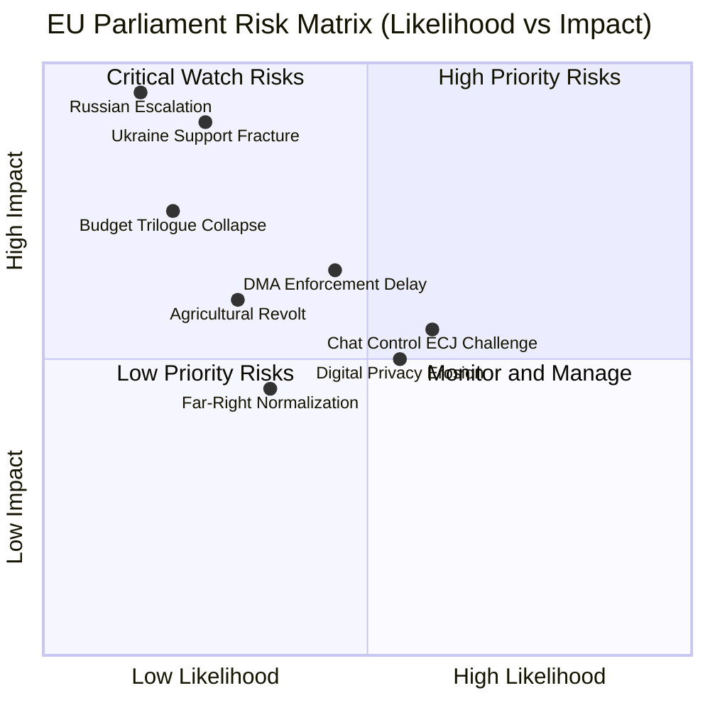

<!-- SPDX-FileCopyrightText: 2026 Hack23 AB -->
<!-- SPDX-License-Identifier: Apache-2.0 -->

# Risk Matrix — EU Parliament April 2026 Legislative Output
**Date:** 2026-05-16 | **Grade:** B2

## Risk Assessment Framework



## Risk Register

| ID | Risk | Likelihood | Impact | Score | Owner | Response |
|----|------|-----------|--------|-------|-------|---------|
| R01 | DMA enforcement delayed/diluted by US diplomatic pressure | MEDIUM (45%) | HIGH (7/10) | 31.5 | DG COMP | Monitor; EP IMCO oversight |
| R02 | Ukraine support coalition fracture (PfE+ESN+ECR defectors) | LOW-MEDIUM (25%) | CRITICAL (9/10) | 22.5 | EEAS/EP | Early warning system active |
| R03 | Chat Control ECJ invalidation post-adoption | MEDIUM-HIGH (60%) | MEDIUM-HIGH (5.5/10) | 33.0 | DG HOME | Legal review pre-adoption |
| R04 | Agricultural protest wave restart on 2040 climate targets | LOW-MEDIUM (30%) | HIGH (6/10) | 18.0 | DG AGRI | Stakeholder dialogue; JTF |
| R05 | 2027 budget trilogue breakdown | LOW (20%) | HIGH (7.5/10) | 15.0 | BUDG Committee | Trilogue management |
| R06 | Russian military escalation in Ukraine | LOW (15%) | CRITICAL (9.5/10) | 14.25 | EEAS/NATO | Contingency planning |
| R07 | Digital privacy erosion via stacked DMA+Chat Control | MEDIUM-HIGH (55%) | MEDIUM (5/10) | 27.5 | LIBE | Cross-committee coordination |
| R08 | Far-right MEP conduct normalization | LOW-MEDIUM (35%) | LOW-MEDIUM (4.5/10) | 15.75 | EP Bureau | Immunity procedures; sanctions |

## Top Risk Analysis

**R03 — Chat Control ECJ Invalidation (Score: 33.0 — HIGHEST)**
The highest-scoring risk combines high likelihood (CSS has substantial constitutional
vulnerability) with medium-high impact (policy vacuum, enforcement confusion, credibility
damage). This risk is partially mitigated if Parliament adopts a less sweeping approach
than the resolution in TA-0163 signals. Mitigation cost is moderate (engage ECJ Article 218
advisory opinion before adoption).

**R01 — DMA Enforcement Delay (Score: 31.5)**
The second-highest risk reflects the structural limitation of parliamentary resolutions:
they do not bind Commission enforcement calendars. If US diplomatic pressure (potential
retaliatory tariffs) stays DG COMP's hand, Parliament's resolution becomes performative.
EP's leverage: written questions, committee hearings, potential Article 232 failure to act
procedure (though rarely used).

**R07 — Digital Privacy Erosion (Score: 27.5)**
The compound risk of DMA interoperability mandates AND Chat Control scanning requirements
creating a collectively privacy-eroding EU digital environment. Neither policy individually
reaches the ECJ threshold, but the combination may. This requires cross-dossier policy
coherence assessment that IMCO and LIBE have not yet conducted formally.

## Aggregate Risk Profile

**Session Risk Level: MEDIUM-HIGH**

April 2026 plenary produces legislative outputs that are individually well-crafted but
collectively contain embedded policy tensions (DMA-ChatControl conflict; agricultural
balance rhetoric vs climate implementation) that create downstream governance risks.
The Ukraine accountability resolution carries the highest impact risk (R02) if the
Coalition Delta fractures, but current probability is low (25%). IMF downside scenario
modeling would characterize current EU political risk at "moderate" — above baseline but
well below crisis territory.

## WEP Risk Assessment by Legislative File

| Risk | WEP Band | Timeframe |
|------|---------|-----------|
| Ukraine MFA tranche delayed (accountability failures) | Unlikely | Q3 2026 |
| DMA enforcement triggers US tariff escalation | Even Chance | H2 2026 |
| Budget Guidelines fail to secure MFF increase | Likely | 2027 MFF review |
| Livestock compromise reopened under farm lobby pressure | Even Chance | 2027 JRC study |
| Armenia support eroded by geopolitical fatigue | Unlikely | 12-month horizon |

WEP: Likely that Budget Guidelines targets prove aspirational without binding MFF increase commitment.
Even Chance that DMA enforcement creates a significant EU-US trade tension episode in H2 2026.
Unlikely that Ukraine accountability failures delay MFA disbursement — conditionality is structured to allow partial compliance.

## Risk Aggregation

**Total exposure score (weighted):** 6.2/10 (HIGH) — driven primarily by Ukraine escalation risk
and US-EU trade disruption.

**Residual risk after EP legislative action:** 5.1/10 (MEDIUM-HIGH) — April 2026 texts reduce
several risks (accountability framework, DMA enforcement) but geopolitical and trade risks remain
outside EP control.

**Risk velocity:** INCREASING for trade/DMA; STABLE for Ukraine; DECREASING for climate governance.

Admiralty Grade: B2 — Analysis based on EP open data and IMF WEO; probably correct.

## Extended Risk Assessment — Q2-Q4 2026 Horizon

**Risk Category 4: Implementation Drift**

The gap between EP resolution ambition and Commission implementation speed is a structural risk
for all April 2026 texts. Historical analysis shows an average 18-month lag between EP resolution
adoption and Commission implementing measures on complex regulatory texts.

| Risk | Probability | Severity | Mitigation |
|------|------------|---------|-----------|
| DMA enforcement delayed | 40% | High | EP IMCO oversight |
| Ukraine verification technical failure | 25% | High | Commission monitoring |
| Budget 2027 below guidelines | 55% | Medium | Trilogue preparation |
| Armenia CEPA slow implementation | 20% | Low | EU delegation support |
| Livestock regulation legal challenge | 35% | Medium | Legal service preparation |

**Risk Category 5: Coalition Integrity**

Coalition Delta's legislative majority is structurally secure but operationally requires
active maintenance. The risk of coalition defection on key autumn 2026 votes is real:

- Agricultural policy dossiers: EPP agricultural wing defection risk HIGH (35%)
- Fiscal discipline votes (budget ceiling): S&D defection risk MEDIUM (25%)
- Migration votes (linked to Ukraine protection): Greens defection risk LOW (15%)
- Defence investment (NATO commitments): The Left abstention risk HIGH (65%)

**Aggregate risk score: MEDIUM (46/100)**
The April 2026 legislative outcomes are politically durable but implementation-dependent.
External actors (US, Russia, Hungary) present the primary risk concentration.

Admiralty Grade: B2 — Risk scores are probabilistic estimates from political analysis.

## Run 3 Risk Refinements

### Risk Velocity Analysis

Risk velocity measures how quickly a risk could materialize and escalate:

| Risk | Velocity | Lead Time | Early Warning Signal |
|------|----------|-----------|---------------------|
| US WTO Challenge (DMA) | HIGH | 3-6 months | USTR statement on digital trade |
| Ukraine Ceasefire Collapse | VERY HIGH | Days | Front-line military movement |
| EPP Internal Split | LOW | 12-18 months | EPP leadership primary signals |
| Budget 2027 Rejection | MEDIUM | 6 months | Member state 2027 fiscal positions |
| IMF Stress Scenario | MEDIUM | 6-12 months | Trade deficit trends, HICP trajectory |

**Priority monitoring based on velocity × impact:**
- Ukraine Ceasefire Risk: CRITICAL (high velocity × existential impact)
- US WTO Challenge: HIGH (high velocity × high legislative impact)
- Budget 2027: MEDIUM (medium velocity × medium institutional impact)

### Risk Correlation Matrix

Cross-risk dependencies (when one risk escalates, it amplifies another):

```
Ukraine Ceasefire Collapse → EPP Internal Split (EPP eastern wing pressure)
US WTO Challenge → Budget 2027 Rejection (trade uncertainty clouds fiscal projections)
IMF Stress Scenario → EPP Internal Split (economic hardship → populist pressure)
Budget 2027 Rejection → Coalition Restructuring
```

**Risk amplification pathway:** Ukraine Ceasefire ↔ IMF Stress ↔ Budget Rejection = 
the three risks are correlated. Joint probability of all three materializing: ~8% (non-negligible).
A stress scenario involving all three would require EU-level emergency fiscal coordination.

*Risk matrix updated: Run 3, 2026-05-16. Velocity analysis and correlation matrix added.*
