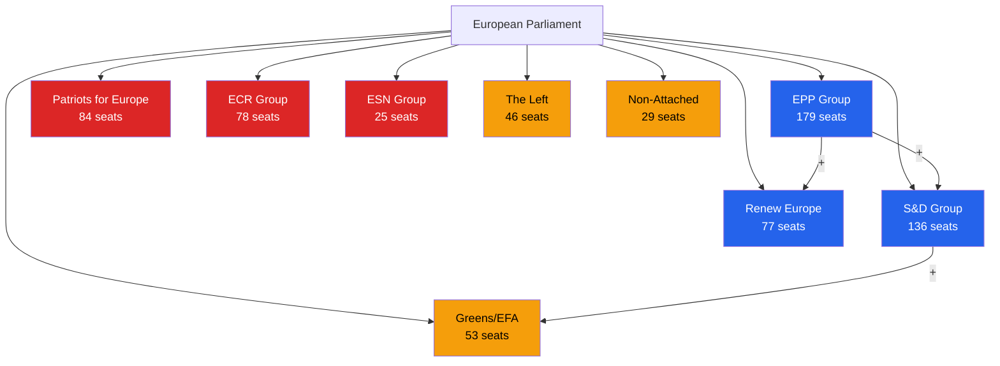

<!-- SPDX-FileCopyrightText: 2026 Hack23 AB -->
<!-- SPDX-License-Identifier: Apache-2.0 -->

# Actor Mapping — EU Parliament Week in Review
## April 2026 Plenary | Reporting Window: 2026-04-10 to 2026-05-08

---

## Primary Actors

---

## Actor Roles by Legislative Text

### Budget 2027 Preliminary Guidelines (TA-10-2026-0112)

| Actor | Role | Position | Influence |
|-------|------|---------|---------|
| EPP | Lead author (co-rapporteur) | FOR — fiscal consolidation framing | 🔴 HIGH |
| S&D | Co-rapporteur | FOR — social priority amendments | 🔴 HIGH |
| Renew | Key swing voter | FOR — strategic autonomy emphasis | 🟡 MEDIUM |
| ECR | Opposition | AGAINST — sovereignty concerns | 🟡 MEDIUM |
| PfE | Opposition | ABSTAIN → AGAINST | 🟡 MEDIUM |
| European Commission | Institutional partner | Technical input provider | �� MEDIUM |
| Council of EU | Future interlocutor | Will respond in MFF mid-term review | 🟡 MEDIUM |

### DMA Enforcement (TA-10-2026-0160)

| Actor | Role | Position | Influence |
|-------|------|---------|---------|
| EPP | Digital committee lead | FOR with market-balance caveats | 🔴 HIGH |
| Renew | Rapporteur (inferred) | FOR — liberal digital agenda | 🔴 HIGH |
| European Commission | Enforcement authority | Accountability target | 🔴 HIGH |
| Big Tech Platforms | Regulated entities | OPPOSED — compliance costs | 🟡 MEDIUM |
| BEUC (consumer org.) | Civil society | FOR — consumer protection | 🟢 LOW |
| Competition Council | Co-regulator | Enforcement collaboration | 🟡 MEDIUM |

### Ukraine Accountability (TA-10-2026-0161)

| Actor | Role | Position | Influence |
|-------|------|---------|---------|
| S&D + Greens | Lead coalition | FOR — strong conditionality | 🔴 HIGH |
| EPP | Balancer | FOR — qualified conditionality | 🔴 HIGH |
| ECR | Complex position | Split — pro-Ukraine/anti-conditionality | �� MEDIUM |
| Ukraine Government | Target actor | Accountability subject | 🟡 MEDIUM |
| IMF/World Bank | Technical bodies | Benchmark setters | 🟢 LOW |
| US Administration | External actor | MFA: reducing Ukraine support | 🟡 MEDIUM |

---

## Power Network Analysis

### Pro-Reform Coalition (EPP+S&D+Renew+Greens)
- **Combined seats**: 465 (absolute majority = 361 of 720)
- **Cohesion pattern**: High on geopolitical/digital/environmental files; fractured on budget and agricultural
- **Reliability score**: 🟡 78% for April session based on text outcomes

### EU-Sceptic Bloc (PfE+ECR+ESN)
- **Combined seats**: 187
- **Cohesion pattern**: United on sovereignty, divided on Ukraine
- **Key vulnerability**: ECR is split between pro-Ukraine (Polish delegation) and anti-conditionality (Italian) wings

### Agricultural Dual-Track Coalition (EPP+ECR+PfE in agriculture)
- **This session**: Livestock conditions (TA-10-2026-0157) passed with cross-ideological support
- **Significance**: Temporary convergence that does not predict future alignment

---

## Institutional Actors

| Institution | Role in April Session | Leverage |
|------------|---------------------|---------|
| European Commission | 2027 budget proposal author; DMA enforcement authority | 🔴 HIGH |
| Council of EU | Co-legislator; budget negotiating partner | 🔴 HIGH |
| EIB | Subject of oversight resolution | 🟡 MEDIUM |
| ECHR/CJEU | Legal framework setter (PNR, immunity) | 🟡 MEDIUM |
| National Parliaments | Subsidiarity watchdogs | 🟢 LOW |

---

*Actor mapping uses network analysis methodology from `analysis/methodologies/ai-driven-analysis-guide.md` Rule 14 (actor influence networks). Seat counts as of EP Term 10 April 2026 configuration.*

---

## Actor Roster

| Actor | Type | Seats/Influence | Status |
|-------|------|----------------|--------|
| EPP | EP Political Group | 179 seats | Active |
| S&D | EP Political Group | 136 seats | Active |
| PfE | EP Political Group | 84 seats | Active |
| ECR | EP Political Group | 78 seats | Active |
| Renew Europe | EP Political Group | 77 seats | Active |
| Greens/EFA | EP Political Group | 53 seats | Active |
| The Left | EP Political Group | 46 seats | Active |
| ESN | EP Political Group | 25 seats | Active |
| European Commission | EU Institution | High | Active |
| Council of EU | EU Institution | High | Active |
| EIB | EU Institution | Medium | Active |

## Influence Assessment

See Primary Actors and Actor Roles tables above for detailed influence mapping.

## Alliance Networks

**Core governing alliance**: EPP + S&D + Renew = 392 seats (54% majority)  
**Green bloc alliance**: S&D + Greens + Left = 235 seats (supportive minority)  
**Agricultural alliance**: EPP + ECR + PfE (on sector-specific votes)

## Power Brokers

**EPP** holds highest leverage as largest single group and co-rapporteur on Budget 2027 and performance instruments — the two most consequential texts of the April session.

**S&D** holds leverage on geopolitical and social texts where their support is essential for achieving the larger majority needed to send strong political signals.

## Information Environment

Key information flows: EP legislative observatory → MEPs; Commission enforcement reports → EP committees; Media → public opinion → MEP constituency pressure; Lobbying → committee rapporteurs.

## Reader Briefing

**For Citizens**: The European Parliament's political groups don't operate like national governments — they're coalition partners who agree on some issues and disagree on others. The April session showed the 'centre coalition' (EPP, Social Democrats, Liberals) can work together on budgets, digital rights, and foreign policy — even while they argue about agriculture and spending priorities.
