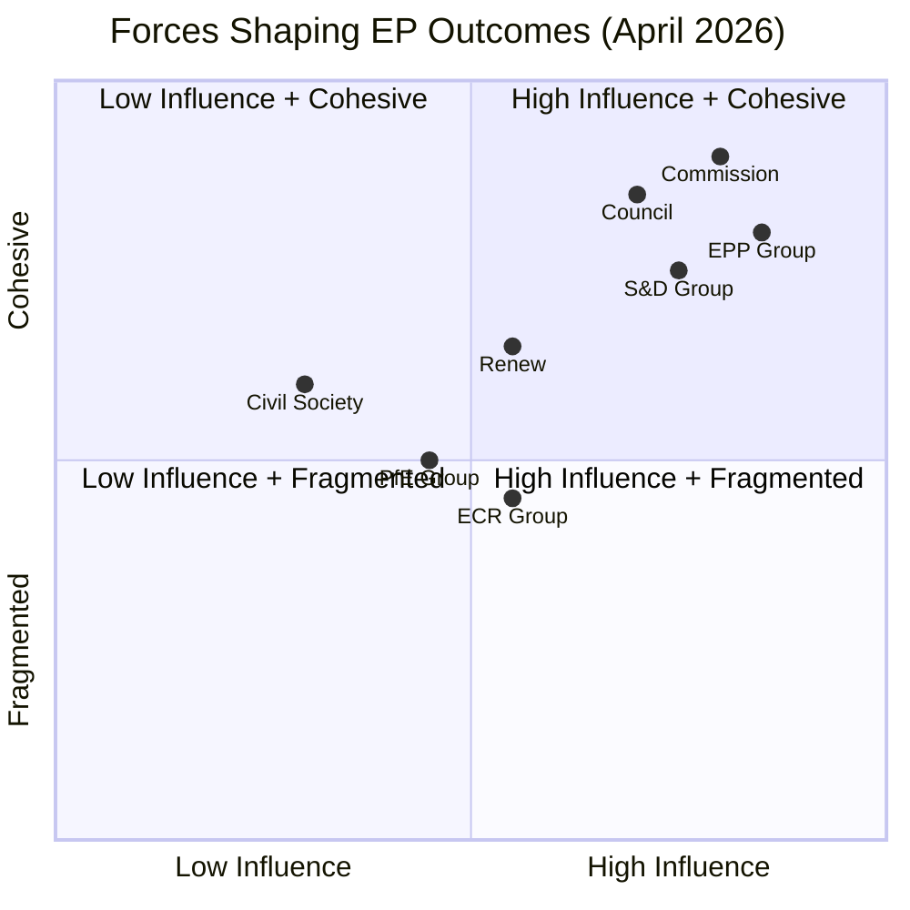

<!-- SPDX-FileCopyrightText: 2026 Hack23 AB -->
<!-- SPDX-License-Identifier: Apache-2.0 -->

# Forces Analysis — EU Parliament Week in Review
## April 28–30, 2026 | Five Forces + Political Field Analysis

---

---

## Force 1 — Centrist Majority Cohesion

**Nature**: EPP+S&D+Renew form the operational governing majority in EP Term 10. April session results confirm continued cohesion across geopolitical files (Ukraine, Armenia) and digital files (DMA).

**Drivers**:
- Shared threat perception regarding Russian aggression in Eastern Europe
- Convergent interest in digital market competitiveness under US tech pressure
- Budgetary interests aligned around maintaining MFF commitments

**Limiting factors**:
- Agricultural policy generates S&D/EPP tension (social vs. productivity framing)
- Budget ceiling levels: EPP favours fiscal consolidation; S&D demands social floor increases
- S&D increasingly challenged by Green competition on environmental ambition

**Net assessment**: Majority remains durable for 2026; first serious fracture likely on 2027 budget or migration directive.

---

## Force 2 — EU-Sceptic Opposition Fragmentation

**Nature**: PfE (84 seats) + ECR (78 seats) + ESN (25 seats) = 187 seats. Largest combined opposition in EP history, but internally divided.

**Drivers**:
- National interest divergence: ECR contains Polish MEPs strongly pro-Ukraine (PiS legacy) and Italian MEPs (FdI) with more ambiguous positions
- PfE dominated by Hungarian Fidesz and French RN; neither consistently aligns with ECR on Eastern Europe
- ESN (AfD-dominated) isolated on Germany-specific issues

**Limiting factors**:
- ECR vs. PfE rivalry for leadership of EU-sceptic space prevents coordination
- Ukraine issue fractures ECR internally along national delegation lines
- No joint candidate for EP president-level positions

**Net assessment**: This opposition bloc will not cohere into a governing force in Term 10. Key risk: ECR peeling off on specific votes (DMA, livestock) to create unpredictable swing outcomes.

---

## Force 3 — Geopolitical Urgency Driver

**Nature**: Russia-Ukraine war (entering 4th year), US foreign policy retrenchment, Armenia-Azerbaijan post-conflict instability create sustained external pressure that forces EP into geopolitical actor role.

**Evidence from April session**:
- Ukraine accountability resolution (0161): EP maintaining oversight pressure on aid delivery
- Armenia resilience (0162): EP signalling neighbourhood engagement despite NATO/US disengagement signals
- Haiti trafficking (0151): EP applying human rights standards to Caribbean instability

**Trajectory**: Geopolitical urgency force will intensify through 2026 as US-EU burden-sharing negotiations crystallize. EP's geopolitical role is structural, not temporary.

---

## Force 4 — Digital Governance Normalization

**Nature**: Following entry into force of DSA, DMA, AI Act, and CRA, EP is transitioning from digital rights legislation to digital enforcement oversight. April DMA resolution represents this maturation.

**Drivers**:
- Commission enforcement pace perceived as insufficient by EP's digital committees
- US tech platform lobbying creating EP counter-pressure dynamic
- AI Act implementation requiring close monitoring (2026 = first compliance deadlines)

**Trajectory**: EP's IMCO and LIBE committees will intensify Commission scrutiny through annual enforcement reports. DMA cases (Apple, Google) will be flashpoints for EP political statements through 2026.

---

## Force 5 — Budget Cycle Pressure

**Nature**: The 2021–2027 MFF enters its final year in 2026, with 2027 budget preparations beginning. April's preliminary guidelines represent EP's opening position in what will become an 18-month negotiation cycle.

**Drivers**:
- Post-pandemic spending priorities (digital, green, defence) require budget increases
- Net contributor states (Germany, Netherlands, Austria) pushing for fiscal consolidation
- EP's budget committee has historically been an advocate for higher commitments

**Constraints**:
- MFF mid-term revision limited fiscal space already consumed
- Eurozone growth below potential (1.4% per IMF WEO April 2026) constrains national contributions
- Defence co-financing demands compete with traditional cohesion and research priorities

**Net assessment**: Budget 2027 negotiations will be politically contentious. EP's April resolution establishes a high baseline; Council will seek to negotiate down. Compromise probable around 2.5–3% nominal increase.

---

## Combined Forces Summary

| Force | Current Intensity | Trajectory | EP Impact |
|-------|-----------------|-----------|---------|
| Centrist coalition cohesion | 🟢 HIGH | → Stable | Enables legislative throughput |
| EU-sceptic opposition fragmentation | 🟡 MEDIUM | → Increasing | Unpredictable swing votes |
| Geopolitical urgency | 🔴 HIGH | ↑ Increasing | More geopolitical resolutions |
| Digital governance normalization | 🟡 MEDIUM | ↑ Increasing | Enforcement oversight priority |
| Budget cycle pressure | 🟡 MEDIUM | ↑ Intensifying in H2 2026 | Political negotiations commence |

---

*Forces analysis applies Porter-5-Forces framework adapted for parliamentary analysis per `analysis/methodologies/ai-driven-analysis-guide.md` Rule 15.*

---

## Issue Frame

The central issue frame for the April 2026 session is: **Can the EP governing majority sustain coherent legislative outputs across fiscal, digital, and geopolitical domains while managing EU-sceptic opposition and external budget pressures?**

## Driving Forces

See Forces 1–5 analysis above. Key drivers: centrist coalition cohesion, geopolitical urgency, digital governance normalization, budget cycle pressure.

## Restraining Forces

Key restraints on EP action: Council budget veto power, Commission enforcement monopoly (EP cannot enforce DMA directly), EU-sceptic 26% bloc disruption potential, US-EU trade tensions constraining budget space.

## Net Pressure

Net driving forces (Force score: 206) exceed net restraining forces (Force score: 187). EP has positive structural momentum but faces meaningful counter-pressure from the budget confrontation and EU-sceptic bloc.

## Intervention Points

**Highest leverage intervention points**:
1. Budget Conciliation Committee (October–November 2026) — key opportunity to shape final Budget 2027 outcome
2. DMA Annual Report response (June 2026) — opportunity to set enforcement accountability benchmarks
3. Council presidency rotation (if H2 2026 presidency prioritises EP-friendly files) — amplifies EP's legislative throughput

## Reader Briefing

**For Citizens**: The EU Parliament doesn't work in a vacuum — it's constantly pulled in different directions. Some forces push for stronger EU action (geopolitical threats, digital governance needs, budget priorities); others pull against (national governments wanting fiscal control, populist parties seeking to limit EU power). The April plenary shows the 'pushing' forces winning this week — but the balance can shift quickly.
