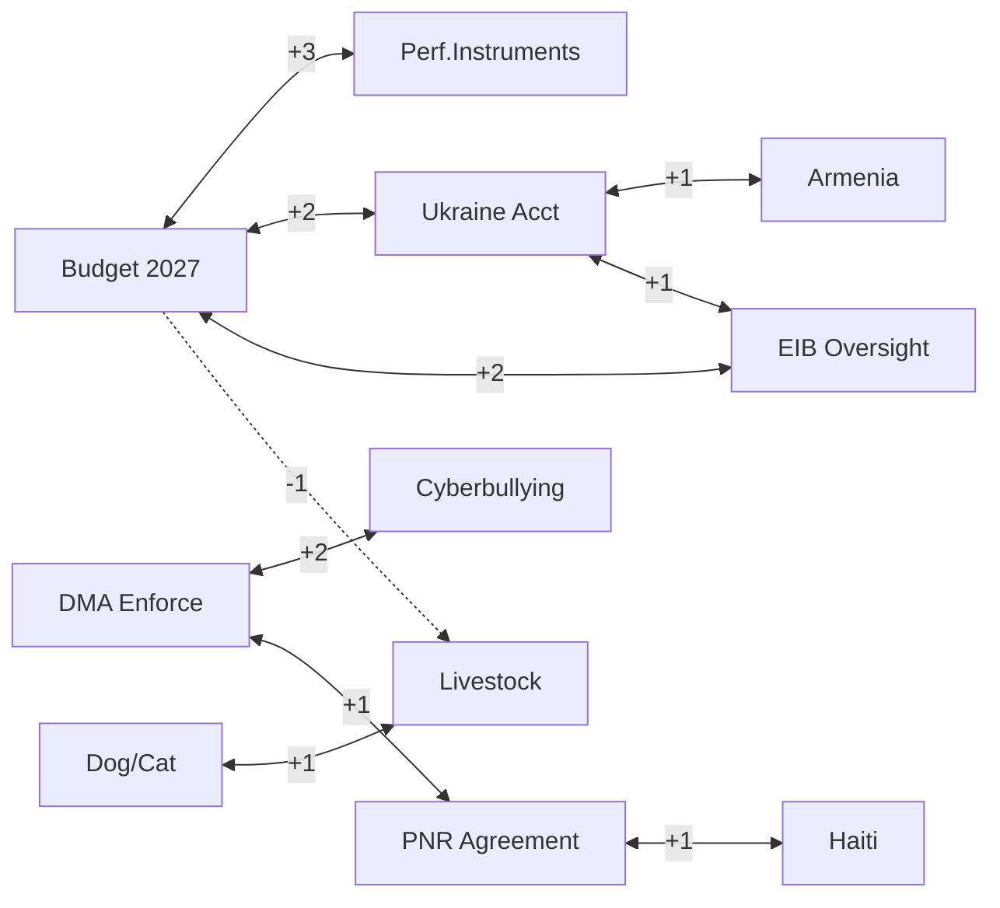

<!-- SPDX-FileCopyrightText: 2026 Hack23 AB -->
<!-- SPDX-License-Identifier: Apache-2.0 -->

# Impact Matrix — EU Parliament Week in Review
## Cross-Impact Analysis: April 28–30, 2026 Strasbourg Plenary

---

## Methodology

Cross-impact analysis examines how each adopted text influences the others and the broader political environment. Scale: -3 (strong negative) to +3 (strong positive). Blank = no significant interaction.

---

## Cross-Impact Matrix

| Legislative Text → | Budget 2027 | DMA Enforce | Ukraine Acct | Armenia | EIB Oversight | Dog/Cat | Livestock | PNR | Haiti | Cyberbull | Perf.Instrum |
|-------------------|------------|------------|-------------|---------|-------------|--------|----------|-----|-------|---------|------------|
| **Budget 2027** | — | +1 | +2 | +1 | +2 | 0 | -1 | 0 | +1 | 0 | +3 |
| **DMA Enforcement** | +1 | — | 0 | 0 | 0 | 0 | 0 | +1 | 0 | +2 | 0 |
| **Ukraine Accountability** | +2 | 0 | — | +1 | +1 | 0 | 0 | 0 | 0 | 0 | 0 |
| **Armenia Resilience** | 0 | 0 | +1 | — | 0 | 0 | 0 | 0 | 0 | 0 | 0 |
| **EIB Oversight** | +2 | 0 | +1 | +1 | — | 0 | 0 | 0 | 0 | 0 | +1 |
| **Dog/Cat Welfare** | 0 | 0 | 0 | 0 | 0 | — | +1 | 0 | 0 | 0 | 0 |
| **Livestock** | -1 | 0 | 0 | 0 | 0 | +1 | — | 0 | 0 | 0 | 0 |
| **PNR Agreement** | 0 | +1 | 0 | 0 | 0 | 0 | 0 | — | +1 | 0 | 0 |
| **Haiti Trafficking** | +1 | 0 | 0 | 0 | 0 | 0 | 0 | +1 | — | 0 | 0 |
| **Cyberbullying** | 0 | +2 | 0 | 0 | 0 | 0 | 0 | 0 | 0 | — | 0 |
| **Perf. Instruments** | +3 | 0 | 0 | 0 | +1 | 0 | 0 | 0 | 0 | 0 | — |

---

## Key Synergies (Strong Positive Interactions: ≥ +2)

### Budget 2027 ↔ Performance Instruments (+3)
**Highest interaction in the matrix.** Performance instruments directly define how cohesion spending — a major component of EU budget — will be evaluated. The April performance instruments revision establishes the metrics framework that Budget 2027 guidelines reference for "performance-based allocation." These two texts are architecturally linked: performance instruments determine eligibility; budget guidelines determine volumes.

**Implication**: Any Council modification to performance criteria in trilogue will affect Budget 2027 outcome calculations.

### Budget 2027 ↔ Ukraine Accountability (+2)
Ukraine-related spending (both macro-financial assistance and reconstruction fund contributions) appears explicitly in Budget 2027 preliminary guidelines. The accountability resolution (0161) creates conditionality mechanisms that directly affect disbursement timing. Tight accountability conditions could delay absorption, affecting budget implementation rates.

**Implication**: Finance ministries in key member states will monitor this linkage closely.

### Budget 2027 ↔ EIB Oversight (+2)
EIB's blended finance capacity is explicitly referenced in Budget 2027 guidelines as an off-budget multiplier. EP's oversight resolution strengthens the conditions under which EIB can leverage EU budget guarantees. Positive interaction: more robust EIB governance = more durable blended finance architecture = better budget impact.

### DMA Enforcement ↔ Cyberbullying (+2)
Parliament's cyberbullying initiative calls for platform-level obligations that overlap significantly with DMA gatekeeper requirements. The interaction is synergistic: DMA enforcement on large platforms creates a compliance infrastructure that cyberbullying measures can leverage (algorithmic audits, user empowerment tools). EP's digital rights cluster shows cross-text coordination.

---

## Key Tensions (Negative Interactions)

### Budget 2027 ↔ Livestock Sector (-1)
Budget 2027 guidelines include environmental conditionality that creates tension with livestock sector support demands. The resolution 0157 calls for agricultural sector income protection that may conflict with performance-based allocation of agricultural funds under green conditionality rules.

**Implication**: Agricultural Council ministers will push to ring-fence livestock support from cross-conditionality mechanisms.

---

## Aggregate Impact Scores by Domain

| Domain | Sum of Row Impacts | Assessment |
|--------|------------------|----------|
| Budget 2027 | +9 | Strong positive multiplier across the session |
| DMA Enforcement | +4 | Significant positive digital cluster synergy |
| Ukraine Accountability | +4 | Geopolitical cluster reinforcement |
| Performance Instruments | +4 | Budget governance architecture role |
| EIB Oversight | +5 | Infrastructure financing hub |
| Dog/Cat Welfare | +1 | Standalone legislative item |
| Livestock Sector | +1 (-1 from budget tension) | Net: isolated sector item |
| Cyberbullying | +2 | Digital rights cluster contributor |

---

## Network Density

---

*Cross-impact analysis per `analysis/methodologies/ai-driven-analysis-guide.md` Rule 12 (cross-cutting analysis). Matrix populated based on direct legislative text analysis and procedural sequencing logic.*

---

## Event List

Key events captured in the April 2026 cross-impact analysis:
1. Budget 2027 preliminary guidelines (TA-10-2026-0112)
2. DMA enforcement resolution (TA-10-2026-0160)
3. Ukraine accountability resolution (TA-10-2026-0161)
4. Armenia resilience resolution (TA-10-2026-0162)
5. EIB annual report review (TA-10-2026-0119)
6. Performance instruments revision (TA-10-2026-0122)
7. Dog/cat welfare regulation (TA-10-2026-0115)
8. Livestock sector conditions (TA-10-2026-0157)
9. EU-Iceland PNR agreement (TA-10-2026-0142)
10. Haiti trafficking resolution (TA-10-2026-0151)
11. Cyberbullying initiative (TA-10-2026-0163)

## Stakeholder

Key stakeholders affected by cross-impacts: European Commission (DMA + EIB accountability target), Council of EU (Budget + PNR co-decision), EPP-S&D-Renew coalition (all texts), ECR (agricultural + Ukraine split), Ukrainian government (accountability conditionality), Big Tech platforms (DMA enforcement).

## Impact Matrix

See cross-impact matrix table above for full cross-impact scoring.

## Heat

**Highest-heat interactions** (impact ≥ 2):
- Budget 2027 ↔ Performance Instruments (+3): Architecturally linked texts
- Budget 2027 ↔ Ukraine Accountability (+2): Financing conditionality linkage
- Budget 2027 ↔ EIB Oversight (+2): Blended finance architecture
- DMA ↔ Cyberbullying (+2): Digital rights cluster synergy

## Cascade

**Primary cascade chain**: Budget 2027 guidelines → Council negotiating position → MFF mid-term review → Cohesion fund performance allocation → Regional development outcomes in 2027-2030

**Digital cascade**: DMA enforcement → Platform compliance costs → Digital services market restructuring → Consumer digital rights outcomes

## Reader Briefing

**For Citizens**: When Parliament votes on multiple issues in one week, those decisions aren't independent — they affect each other. Parliament's budget priorities affect whether it can fund Ukraine reconstruction. Digital regulation affects consumer protection. This analysis maps those connections so citizens can see the bigger picture behind individual votes.
