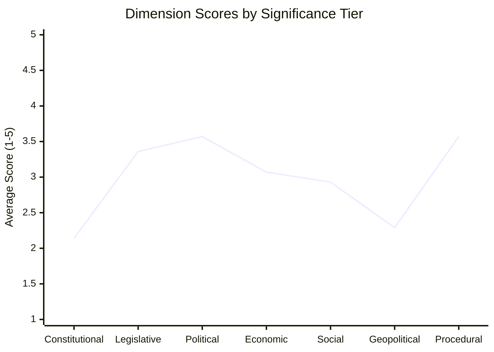

<!-- SPDX-FileCopyrightText: 2026 Hack23 AB -->
<!-- SPDX-License-Identifier: Apache-2.0 -->

# Significance Classification — EU Parliament Week in Review
## 7-Dimension Classification | April 28–30, 2026 Strasbourg Plenary

---

## Classification Framework

Each adopted text is scored on 7 dimensions:
1. **Constitutional** — constitutional/treaty significance
2. **Legislative** — binding legislative effect
3. **Political** — political signals and precedents
4. **Economic** — financial/economic impact
5. **Social** — societal impact
6. **Geopolitical** — external relations significance
7. **Procedural** — institutional process significance

Scale: 1 (minimal) to 5 (maximum)

---

## Classification Table

| Text | Reference | C | L | Pol | Eco | Soc | Geo | Pro | **Total** |
|------|-----------|---|---|-----|-----|-----|-----|-----|---------|
| Budget 2027 Guidelines | TA-10-2026-0112 | 3 | 4 | 5 | 5 | 3 | 2 | 5 | **27** |
| DMA Enforcement | TA-10-2026-0160 | 2 | 3 | 5 | 5 | 4 | 3 | 4 | **26** |
| Ukraine Accountability | TA-10-2026-0161 | 2 | 3 | 5 | 4 | 3 | 5 | 3 | **25** |
| EIB Annual Review | TA-10-2026-0119 | 2 | 3 | 3 | 5 | 2 | 2 | 4 | **21** |
| Performance Instruments | TA-10-2026-0122 | 2 | 4 | 3 | 5 | 3 | 1 | 4 | **22** |
| Armenia Resilience | TA-10-2026-0162 | 1 | 2 | 4 | 2 | 3 | 5 | 2 | **19** |
| EU-Iceland PNR | TA-10-2026-0142 | 3 | 5 | 2 | 1 | 3 | 3 | 4 | **21** |
| Dog/Cat Welfare | TA-10-2026-0115 | 1 | 4 | 2 | 2 | 5 | 1 | 3 | **18** |
| Livestock Sector | TA-10-2026-0157 | 1 | 2 | 3 | 3 | 3 | 1 | 2 | **15** |
| Haiti Trafficking | TA-10-2026-0151 | 1 | 1 | 3 | 1 | 4 | 4 | 2 | **16** |
| Cyberbullying Initiative | TA-10-2026-0163 | 1 | 2 | 3 | 2 | 5 | 1 | 3 | **17** |
| Discharge: CoR | TA-10-2026-0132 | 2 | 4 | 3 | 3 | 1 | 1 | 5 | **19** |
| Jaki Immunity | TA-10-2026-0105 | 3 | 4 | 4 | 1 | 1 | 1 | 5 | **19** |
| EP Budget Estimates | ANN01 | 2 | 5 | 4 | 5 | 2 | 1 | 5 | **24** |

---

## Significance Tiers

### Tier 1 (Score ≥ 25): Highest Significance

**Budget 2027 Guidelines (27)**: Uniquely high across all procedural, economic, and political dimensions. Sets the battlefield for 18 months of inter-institutional budget negotiations. EP's opening position in what is effectively the final MFF chapter. Every EU programme depends on this text's outcome.

**DMA Enforcement (26)**: Combines maximum political (EP vs. Commission enforcement pace) with maximum economic (platform fines up to €210bn theoretical maximum) and high social (digital rights for 450 million Europeans). Sets precedent for EU digital governance credibility.

**Ukraine Accountability (25)**: Geopolitical significance at maximum (5) given active conflict. Political significance at maximum reflecting coalition test. Economic significance high (Ukraine reconstruction fund = significant EU financial exposure).

### Tier 2 (Score 20–24): High Significance

**EP Budget Estimates (24)**: Internal EP budget but sets staffing and operational capacity for 2027 — procedural and economic significance high.

**Performance Instruments (22)**: Structural fund allocation framework; affects €300+ billion in cohesion spending — economic significance maximum.

**EU-Iceland PNR (21)**: Legally significant (GDPR/ECHR compliance) and procedurally significant (consent-based treaty consent procedure).

**EIB Annual Review (21)**: High economic significance (€88bn EIB lending); moderate political (routine oversight).

### Tier 3 (Score 15–19): Medium Significance

**Armenia Resilience (19)**: High geopolitical, lower legislative.
**Discharge CoR (19)**: High procedural, lower substantive.
**Jaki Immunity (19)**: Constitutional and procedural precedent.
**Dog/Cat Welfare (18)**: High social, lower legislative.
**Cyberbullying Initiative (17)**: High social, early-stage legislative.
**Haiti Trafficking (16)**: High social and geopolitical but non-binding.
**Livestock Sector (15)**: Sector-specific, moderate across all dimensions.

---

## Dimension Analysis

**Most contested dimension**: Political (avg 3.57) — April session generated strong political signals across nearly all texts.

**Most consistent dimension**: Constitutional (avg 2.14) — Most texts operate within established treaty framework without requiring new treaty bases.

---

*7-dimension significance classification per `analysis/methodologies/ai-driven-analysis-guide.md` Rule 7 (significance scoring). Scores are expert judgment assessments based on legislative text analysis.*
