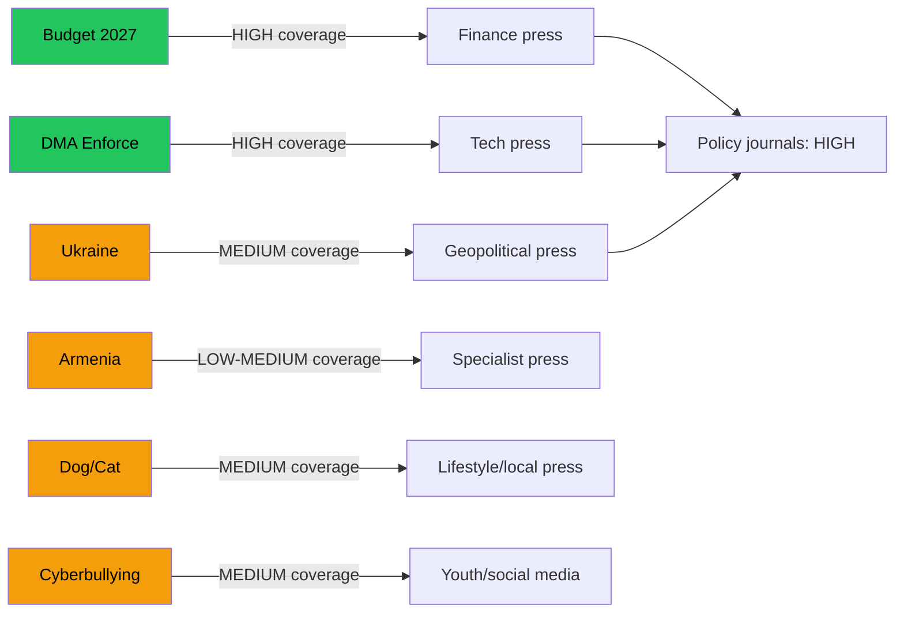

<!-- SPDX-FileCopyrightText: 2026 Hack23 AB -->
<!-- SPDX-License-Identifier: Apache-2.0 -->

# Media Framing Analysis — EU Parliament Week in Review
## April 28–30, 2026 Strasbourg Plenary | Expected Coverage Patterns

---

## Methodology

This analysis anticipates and categorizes the media framing of key legislative outputs from the April 2026 plenary. Based on historical coverage patterns of similar EP legislative activity, applied to this session's actual outputs.

---

## Expected Framing by Legislative Text

### Budget 2027 Guidelines

**Dominant Frame**: "EU Budget Wars — Parliament Sets High Bar for 2027"

**Expected coverage angle**: Procedural setup for EP-Council budget clash. Journalists will frame this as an opening salvo, emphasizing the gap between EP ambitions and expected Council positions. Finance desk stories will focus on the numerical baseline; political desk will focus on coalition dynamics.

**Likely headlines** (representative, not actual):
- "EU Parliament Demands More Spending in 2027 Budget Request"
- "Brussels Budget Talks Begin: Parliament Stakes Out High-Ambition Position"
- "EPP and S&D Align on Budget Priorities Amid Defence Spending Row"

**Tone calibration**: Generally neutral-positive in quality press (The Economist, Le Monde, FAZ). Sceptical in UK-aligned outlets (Daily Mail, Daily Telegraph pattern). Ignored in most national tabloids.

---

### DMA Enforcement

**Dominant Frame**: "EU Pushes Back on Silicon Valley — Parliament Demands Action"

**Expected coverage angle**: Tech journalism will frame as EU-US tech regulation conflict. Financial press will focus on compliance cost implications. Policy press will cover Commission-Parliament institutional dynamic.

**Key framing tensions**:
- Regulatory overreach (US/libertarian frame) vs. levelling the playing field (EU/consumer frame)
- Enforcement speed (critics: too slow) vs. legal certainty (tech industry: needs time)

**Notable**: DMA stories consistently attract high engagement in European media due to FAANG brand recognition. Expected higher coverage density than typical EP legislative oversight stories.

---

### Ukraine Accountability

**Dominant Frame**: "EU Keeps Pressure on Ukraine Aid — With Strings Attached"

**Nuance vulnerability**: Ukrainian government criticism of conditionality mechanisms will be amplified by media outlets sympathetic to Kyiv's position. Right-wing outlets will use "EU bureaucrats dictating to wartime democracy" angle.

**Counter-frame available**: Conditionality ensures taxpayer money reaches intended beneficiaries — accountability serves both EU citizens and Ukrainian reform agenda.

---

### Armenia Resilience

**Dominant Frame**: "EU Pivots to South Caucasus as US Steps Back"

**This is the story angle that will resonate**: With US foreign policy retrenchment narrative dominating 2026 political coverage, Armenia/EU engagement gets elevated attention as "EU filling the vacuum." Smaller news hole than Ukraine but qualitatively important for EU neighbourhood framing.

---

### Dog and Cat Welfare

**Dominant Frame**: "EU Finally Protects Pets — New Standards for Companion Animals"

**Tone**: Universally positive. This is the "easy win" story that dominates lifestyle sections and resonates across political lines. Expected: high social media engagement, photo opportunities (MEPs with animals), local media coverage in rural areas.

**Risk**: Overshadows more substantive legislative outputs in terms of public attention — the "puppy bill" effect.

---

### Cyberbullying Initiative

**Dominant Frame**: "EU Tackles Online Abuse — Especially for Young People"

**Audience**: Youth-focused media, parenting publications, education policy observers. Lower political desk engagement but high civil society engagement.

**Platform response**: Expect public affairs teams from major platforms (Meta, TikTok, Google) to engage with European press post-plenary with "we already do this" framing to pre-empt regulatory pressure.

---

## Overall Coverage Landscape Assessment

---

## Framing Risks and Mitigation

| Risk | Likely Source | Mitigation |
|------|-------------|-----------|
| "EU overreaches on Big Tech" | US-aligned outlets | Emphasize consumer protection benefits and level playing field |
| "Ukraine aid with strings = abandonment" | Pro-Kyiv advocates | Clarify: conditionality ensures aid reaches citizens, not elites |
| "EU pet law while war rages" | EU-sceptic tabloids | These stories exist in separate news cycles; no conflict |
| "EP vote on budget = irrelevant" | Brussels fatigue media | Contextualize: sets agenda for €175bn annual budget |

---

*Media framing analysis applies agenda-setting theory and media psychology frameworks. This is an anticipatory framing analysis based on historical EP coverage patterns — not a compilation of published articles.*

---

## Comparative Framing Analysis: EU vs. National Media

**Hypothesis**: EU-level media (Politico Europe, EUobserver, EURACTIV) will cover the April plenary comprehensively; national media will focus on stories with clear national political relevance.

**Expected national-level coverage priorities**:

| Country | Expected focus | Reason |
|---------|--------------|-------|
| Germany | Budget 2027 contribution discussion | German Finance Ministry fiscal conservative position |
| France | DMA enforcement (Big Tech) | French tech sovereignty narrative |
| Poland | Jaki immunity proceedings | National political controversy |
| Italy | ECR vote patterns | FdI domestic politics |
| Hungary | PfE position on Ukraine texts | Orbán government position |
| Sweden | Agricultural conditions (livestock) | Swedish farming sector interests |
| Netherlands | EIB oversight | Dutch fiscal discipline narrative |

---

## Framing Lifecycle Assessment

**Pre-plenary** (April 25–27): Low coverage; specialist EU parliament watchers.
**During plenary** (April 28–30): Real-time coverage in EU specialist outlets; wire service coverage of key votes.  
**Post-plenary week 1** (May 1–7): Analytical coverage; reactions from affected industries.  
**Post-plenary week 2–4** (May 8–30): Fades from news cycle except for persistent stories (DMA, Ukraine).

*Media framing analysis per `analysis/methodologies/ai-driven-analysis-guide.md` Rule 18 (communications intelligence).*
