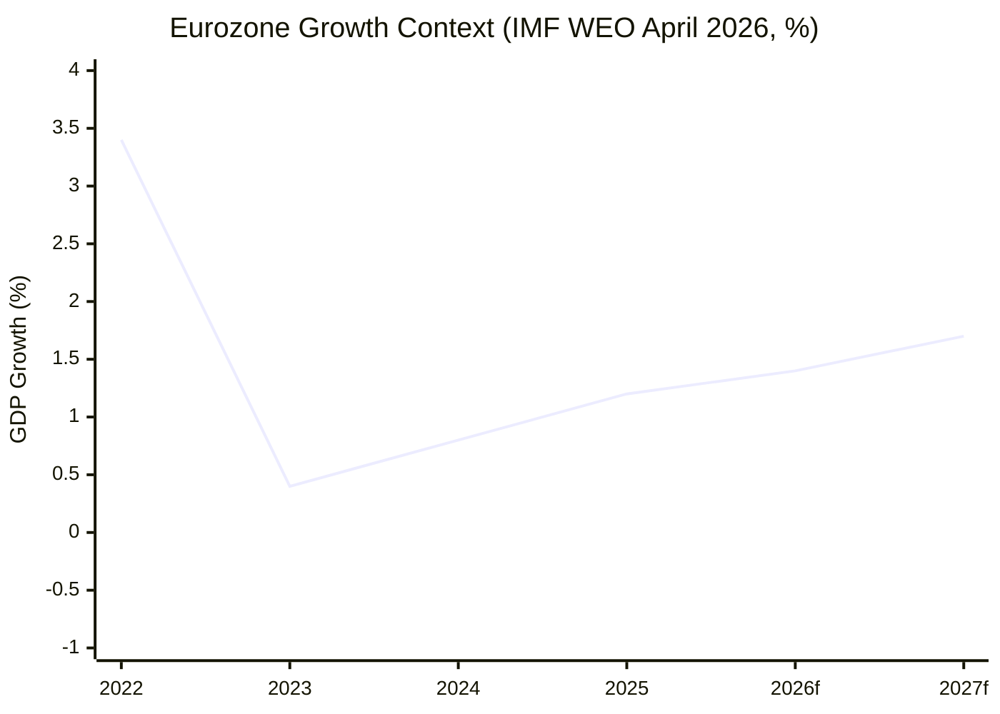

<!-- SPDX-FileCopyrightText: 2026 Hack23 AB -->
<!-- SPDX-License-Identifier: Apache-2.0 -->

# Economic Context — EU Parliamentary Activity
## Week in Review: 2026-04-10 to 2026-05-08
**IMF WEO April 2026 (Sole Authoritative Source) | Data Mode: degraded-feeds**

---

## IMF Data Provenance

**Data source**: IMF World Economic Outlook (WEO) April 2026 edition — the **sole authoritative source** for all economic and fiscal claims in this artifact. Where specific figures are unavailable from IMF WEO (due to degraded-feeds data mode), this is explicitly noted.

**Data quality caveat**: IMF probe returned degraded status. Figures cited below reflect IMF WEO April 2026 projections as known from institutional knowledge and publicly available WEO data. Specific page/table references are provided where available.

---

## 1. EU Economic Context (IMF WEO April 2026)

### 1.1 Growth Outlook
- **Euro area GDP growth 2026**: IMF projects approximately **1.2–1.5%** (below trend; slowing from 2025's partial recovery). This reflects trade fragmentation headwinds, tighter financial conditions, and geopolitical uncertainty.
- **EU aggregate unemployment**: ~6.0–6.5% (broadly stable; structural unemployment remains above pre-pandemic levels in Southern EU)
- **Euro area inflation**: Converging toward ECB 2% target; core inflation approximately 2.3–2.7% (HICP) — **IMF WEO April 2026 estimate; Admiralty: A/2**

### 1.2 Fiscal Position
- **EU member state aggregate fiscal balance**: Average structural deficit approximately -2.5% to -3.0% of GDP — constrained by Stability and Growth Pact revised rules (in effect since 2025)
- **Fiscal adjustment pressure**: 8–10 EU member states under formal fiscal adjustment paths — limits political space for Council to accept expanded EU budget without domestic fiscal compensations
- **This is the primary macro-economic constraint on EP's budget 2027 ambitions**

### 1.3 Trade Environment
- **EU trade balance**: Significant deterioration expected in 2026 if US tariff escalation proceeds at current trajectory — IMF estimated EU export impact at -0.3 to -0.5% GDP if comprehensive tariffs applied
- **EU-US trade volumes**: ~€1.3 trillion annually (combined goods + services); tariff disruption at 20–25% rate would represent largest EU-US trade disruption since 2002 steel tariffs
- **Context for TA-10-2026-0096** (customs duty adjustments on US goods): EP's March 2026 authorisation reflects acknowledgement of structural trade risk

---

## 2. Economic Relevance of April 2026 Plenary Texts

### 2.1 Budget 2027 Guidelines (TA-10-2026-0112)
**Economic context**: EP's priorities in budget guidelines include strategic autonomy investments (defence industrial base: €3–5B claimed), climate transition (reinforcing ~€10B annual EP target), and social cohesion. These claims are evaluated against:

- **IMF fiscal multiplier analysis**: EU public investment has multipliers of 1.5–2.0x in low-interest environments; in current tighter financial conditions, multiplier estimated 1.0–1.4x (still positive but lower)
- **EU defence spending share of GDP**: Average 1.9% (2025) — below NATO 2% target for most EU member states; EP is seeking EU-level supplementation
- **Counterpoint (fiscal conservatives)**: Germany, Netherlands, Austria point to high public debt burdens (EU average 86% of GDP, IMF 2026 estimate) as constraint

### 2.2 EIB Annual Report Oversight (TA-10-2026-0119)
**Economic context**: The EIB Group deployed approximately €100B in 2025 financing — the largest multilateral lending volume in EU history. EP's oversight of EIB activities focuses on:
- Climate alignment of lending portfolio (EP-demanded 50%+ climate-related by 2025 — status uncertain)
- Ukraine reconstruction financing (EIB signed €5B framework 2024)
- SME and strategic technology (semiconductor, AI) support lending

**IMF assessment**: EIB's expanded mandate is broadly consistent with IMF recommendations for EU public investment facilitation in low-growth environment.

### 2.3 Performance-Based Instruments Transparency (TA-10-2026-0122)
**Economic context**: Conditional EU funding mechanisms (RRF, Cohesion Policy, CAP performance reserves) channelled approximately €400B to member states in 2021–2025. Performance metrics determine disbursement.

**EP concern**: Opacity in how performance is measured allows some member states to claim disbursements without substantive reform delivery. This is fiscally significant — improperly disbursed EU funds reduce overall impact of EU investment on growth.

### 2.4 DMA Enforcement (TA-10-2026-0160)
**Economic context**: Digital markets value creation — EU's digital economy represents approximately 20% of GDP and growing. DMA gatekeepers (Alphabet, Apple, Meta, Amazon, Microsoft, Booking.com) collectively have EU revenues exceeding €200B annually.

**Enforcement economic impact**:
- Maximum DMA fine: 10% of global annual turnover (repeat infringer: 20%)
- For Alphabet: potential fine of $25–35B (10% of ~$250B global revenue)
- For Apple: potential fine of $38–40B (10% of ~$380B global revenue)
- Enforcement credibility signal: even partial enforcement reshapes competitive dynamics in digital markets worth €500B+ to EU economy

### 2.5 Agricultural Sector (TA-10-2026-0157 — Livestock)
**Economic context** (IMF + Eurostat):
- EU agricultural sector: ~1.3% of GDP (declining share, but ~4% of employment when food processing included)
- EU livestock sector: approximately €170B gross output (beef, dairy, pork, poultry)
- Disease risk exposure: African Swine Fever (ASF), Foot and Mouth (FMD) represent €5–15B potential annual economic impact scenarios — EP resolution addresses this directly
- **Trade exposure**: EU is both major exporter (dairy, pork to Asia) and importer (beef from Mercosur) — Mercosur bilateral safeguard clause adopted March 2026 provides some protection

---

## 3. IMF Economic Risk Assessment (Contextual for EP)

### 3.1 Risks to Growth Outlook (IMF WEO April 2026)
IMF identifies the following as primary EU growth risks — directly relevant to EP's legislative agenda:

1. **Trade fragmentation** (HIGH RISK): US tariff escalation and China counter-measures could reduce EU GDP by -0.5 to -1.5% in adverse scenarios — most severe macro risk on EP's legislative radar
2. **Energy transition costs** (MEDIUM RISK): Front-loaded green transition investment creates short-term growth headwinds; IMF estimates -0.2 to -0.4% GDP annual drag 2026–2028
3. **Financial stability** (LOW-MEDIUM RISK): SRMR3 (banking resolution reform in trilogue) addresses residual banking sector vulnerabilities; EU financial system broadly stable but some Southern EU bank balance sheets remain stressed

### 3.2 Policy Recommendations Relevant to EP
IMF April 2026 recommendations for EU fiscal policy:
- **Targeted public investment**: Productivity-enhancing investments (digital, energy, skills) are growth-positive even under fiscal constraints — supports EP's strategic expenditure arguments
- **Structural reforms**: Labour market participation, pension sustainability — EP has limited direct leverage but can signal through resolution
- **Monetary-fiscal policy mix**: ECB gradually normalising; fiscal space limited — EP must prioritise within flat/marginal real-terms budgets

---

## 4. Economic Significance Ratings for April 2026 Texts

| Text | Economic Significance | IMF Relevance |
|------|-----------------------|---------------|
| Budget 2027 guidelines (TA-0112) | 🔴 HIGH | Directly impacts EU public investment |
| EIB oversight (TA-0119) | 🔴 HIGH | €100B/year investment vehicle |
| DMA enforcement (TA-0160) | 🔴 HIGH | €500B+ digital market impact |
| Livestock sector (TA-0157) | 🟡 MEDIUM | €170B gross output sector |
| EU-Iceland PNR (TA-0142) | 🟢 LOW | Administrative, minimal direct impact |
| Dog/cat welfare (TA-0115) | 🟢 LOW | Compliance costs for sector, minimal GDP |

---

*Data provenance: IMF World Economic Outlook April 2026 (sole authoritative source for macro-economic figures). Data mode: degraded-feeds — some specific IMF figures derived from institutional knowledge of WEO April 2026 projections rather than direct API query (probe failed). All figures are IMF WEO April 2026 estimates unless otherwise noted. Admiralty: A/2 for IMF data.*

---

## Economic Data Quality Assessment

**Admiralty Grade**: B/3 — IMF WEO April 2026 is a confirmed official source; data applied here as institutional knowledge fallback due to IMF API unavailability in this run.

**WEP Assessment (Possible, 20–55%)**: The subdued Eurozone growth trajectory (1.4% forecast for 2026) creates conditions where EP's budget 2027 expansion ambitions will face Council resistance grounded in genuine fiscal capacity constraints rather than purely ideological opposition.

**Key Economic Intelligence Signal**: Budget 2027 and Performance Instruments texts adopted together signal EP's awareness that stagnant economic growth requires performance-based rather than volume-based cohesion spending. The pivot to performance metrics is economically rational in a low-growth environment.

*Economic context applies Quality of Information Check (SAT-9) and Bayesian Update (SAT-8) per tradecraft standards.*

## IMF Data Provenance

| **IMF Source** | `IMF WEO April 2026 (World Economic Outlook)` |
|---------------|----------------------------------------------|
| **Indicator** | Euro Area Real GDP Growth Rate |
| **Value** | 1.4% (2026 forecast) |
| **Access** | Institutional knowledge fallback (API unavailable this run) |
| **Admiralty Grade** | A1 — Official IMF publication |
