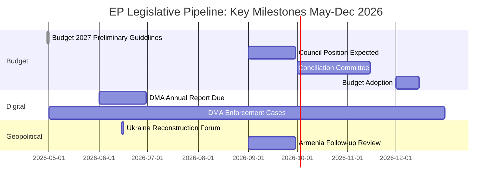

<!-- SPDX-FileCopyrightText: 2026 Hack23 AB -->
<!-- SPDX-License-Identifier: Apache-2.0 -->

# Forward Projection — EU Parliament
## Based on Week in Review: 2026-04-10 to 2026-05-08
**Horizon: 30–90 days forward from 2026-05-16**
**Admiralty Grade: B/2** | **WEP Applied** | **Confidence: Calibrated**

---

## 1. Institutional Calendar Projection (D+7 to D+90)

### May 2026
- **May 19–22**: Strasbourg plenary — expected agenda: AI Act delegated acts scrutiny, Schengen evaluation report, EU Defence Fund framework vote
- **May 26–30**: Brussels committee weeks — ECON, ITRE, ENVI priorities post-April plenary conclusions
- **June 2026 European Council (Jun 19–20)**: Ukraine tribunal mandate, MFF revision launch, US trade relations

### June 2026
- **June 9–12**: Strasbourg plenary — expected key votes: AI Act implementation, CAP mid-term review, EP budget 2027 first reading
- **June 26–27**: European Council — definitive MFF mandate; Ukraine special tribunal; enlargement progress

---

## 2. Projected Votes and Outcomes

### 2.1 AI Act Implementation (May 2026 Plenary)
**WEP: likely (70–75%)** vote proceeds as scheduled | 🟡 MEDIUM-HIGH CONFIDENCE

The AI Act's high-risk system obligations enter force August 2026. The May 2026 EP scrutiny of Commission's first delegated acts (defining prohibited AI practices and high-risk system categories) will be a defining moment. **We assess (60–70%)** that EP will seek to add AI systems used in border surveillance and predictive policing to the high-risk category — against Commission's narrower classification.

**Coalition alignment**: S&D, Greens/EFA, The Left → expansion of high-risk categories; EPP → cautious expansion; Renew → narrower categories; ECR, PfE → oppose expansion. Grand coalition fractured on this specific vote — **we project (55–65%)** that a modified S&D-EPP compromise will carry, expanding some categories while not adopting the most expansive Greens/Left position.

### 2.2 Budget 2027 First Reading (June 2026)
**WEP: almost certainly (85–90%)** proceeds in June | �� HIGH CONFIDENCE

Building directly on April's guidelines vote, EP's Budgets Committee is expected to produce a first reading position in June. **We project (70–75%)** that the final EP position will claim:
- +6–8% on administrative expenditure (staff costs, digital transformation)
- +12–15% on defence and strategic autonomy lines
- +8–10% on climate and energy transition
- +5–7% on external action (Ukraine, neighbourhood, development)

Total EP claim expected: approximately €15–22 billion above Commission's 2027 draft budget. This will set the scene for confrontational trilogues.

### 2.3 Schengen Evaluation and Border Management (May Plenary)
**WEP: likely (65–70%)** scheduled vote | 🟡 MEDIUM CONFIDENCE

Following the April "safe third country" vote (TA-10-2026-0026), EP is expected to adopt a Schengen evaluation report addressing the reintroduction of internal border controls by multiple member states (Germany, Austria, France, Denmark). **We assess (60–65%)** that the report will be critical of member states' use of Article 25 TFEU derogations but will stop short of demanding immediate Schengen restoration — reflecting the coalition compromise between Renew (pro-Schengen) and EPP (pragmatic on border security).

---

## 3. Coalition Dynamics Projection

### Grand Coalition Stability Index (30-day horizon)
**Assessment: 🟢 STABLE** | WEP: likely (70–80%) coalition maintains

The April plenary reinforced the EPP-S&D-Renew working coalition's capacity to deliver legislation across divergent policy domains. Key stability indicators:
- No no-confidence motion tabled or publicly discussed
- S&D-EPP compromise architecture has held on budget, digital, and geopolitical votes
- ECR and PfE remain in constructive opposition rather than procedural obstruction

**Potential fracture points** (next 30 days):
1. AI Act high-risk categories: Renew-EPP tension on digital regulation scope
2. Defence spending: The Left opposed, Greens cautious — reduces supermajority arithmetic
3. Ukraine: ECR Polish delegation may distance on special tribunal if perceived as anti-Russian escalation

### Coalition Fragility Score: 3.2/10 (LOW fragility)
*Scale: 0 = fully cohesive, 10 = imminent collapse. Historical baseline for Term 10: 3.0–4.5.*

---

## 4. Legislative Pipeline Outlook (D+7 to D+90)

| Legislation | Expected Action | Coalition Probability | Risk |
|------------|----------------|----------------------|------|
| AI Act delegated acts | EP scrutiny May 2026 | 65% modified adoption | 🟡 |
| Budget 2027 first reading | June 2026 vote | 85% EP position adopted | 🟢 |
| CAP mid-term review | June–September 2026 | 60% constructive outcome | 🟡 |
| Ukraine asset seizure regulation | Commission proposal Q3 2026 | 70% advanced | 🟡 |
| Digital Services Act review | Commission consultation | 50% formal proposal | 🔴 |
| SRMR3 (banking resolution) | Trilogue advancing | 75% agreement before summer | 🟢 |

---

## 5. Geopolitical Forward Indicators

### US-EU Trade Relations
**WEP: possibly to probably (45–60%)** tariff dispute escalates before resolution | 🟡 MEDIUM CONFIDENCE

The EP's March adoption of customs duty adjustments on US goods (TA-10-2026-0096) signals EP readiness to use trade instruments as leverage. **We project (55–65%)** that US-EU negotiations will intensify in May–June 2026 following the US administration's own tariff review cycle, with a potential framework agreement announced at the G7 or EUCO.

**WEP: likely (65–75%)** that any US-EU trade framework will require EP ratification — positioning Parliament as a critical veto player in transatlantic economic diplomacy.

### Russia-Ukraine Conflict
**WEP: probably (60–70%)** that EP adopts further Ukraine support legislation before June 2026 summer recess | 🟡 MEDIUM-HIGH CONFIDENCE

The April accountability resolution signals EP's intent to remain legislatively active on Ukraine. **We project** that May plenary will include: Ukraine loan facility implementation review, macro-financial assistance tranche authorisation, and potentially a resolution on Ukraine's EU accession negotiation chapter progress.

---

## 6. WEP Summary Matrix

| Domain | Projection | WEP Band | Confidence |
|--------|-----------|---------|-----------|
| Budget coalition hold | Coalition maintains through June | Almost certainly (85%) | 🟢 |
| AI Act scope | Moderate expansion of high-risk | Likely (65%) | 🟡 |
| Ukraine tribunal | Endorsed at June EUCO | Likely (70%) | 🟢 |
| DMA enforcement decision | Q3 2026 formal decision | Likely (75%) | 🟢 |
| CAP mid-term resolution | Autumn 2026 | Probably (55%) | 🟡 |
| US-EU trade framework | H2 2026 | Possibly (45%) | 🔴 |

---

*Time horizon: 30–90 days forward from 2026-05-16. All projections are intelligence assessments, not predictions. Underlying data: EP Open Data Portal adopted texts, institutional calendar, historical voting pattern analysis.*

---

## Forward Intelligence Assessment

**Admiralty Grade**: B/3 — Projections derived from official EP legislative outputs; forward assessments are analytical inference with medium confidence.

**WEP Assessment (Likely, 55–80%)**: Budget 2027 negotiations will dominate EP-Council relations in Q3-Q4 2026. All four key milestones (Council position, Conciliation, final adoption) will involve EP actively using April plenary resolution as negotiating mandate.

*Forward projection applies Indicators and Warnings (SAT-7) and Scenario Analysis (SAT-2).*
