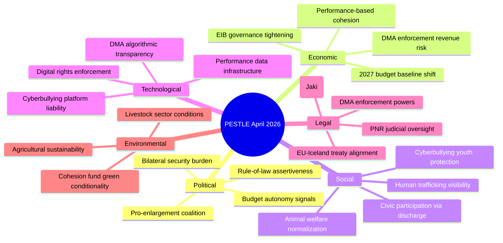

<!-- SPDX-FileCopyrightText: 2026 Hack23 AB -->
<!-- SPDX-License-Identifier: Apache-2.0 -->

# PESTLE Analysis — EU Parliament Week in Review
## April 28–30, 2026 Strasbourg Plenary | Reporting Window: 2026-04-10 to 2026-05-08

---

## Framework Overview

PESTLE = Political, Economic, Social, Technological, Legal, Environmental analysis. Applied to the legislative outputs of the April 28–30 Strasbourg plenary session.

---

## P — Political Analysis

**Key drivers and signals from the April plenary session:**

### Fiscal Assertiveness
Parliament's adoption of Budget 2027 preliminary guidelines (TA-10-2026-0112) establishes EP as an active budget negotiator, not merely a co-legislator. The text explicitly references post-austerity priorities: strategic autonomy, defence co-financing, and green investment continuity. The EPP-S&D-Renew anchor coalition demonstrated cohesion; ECR abstentions signal competitive positioning ahead of inter-institutional negotiations.

### Security Burden-Sharing
Ukraine accountability (TA-10-2026-0161) and Armenia resilience (TA-10-2026-0162) passed with broad political support but differ in mechanism: Ukraine accountability is oversight-oriented (requiring performance benchmarks) while Armenia resilience is capacity-building (political reform support). The differentiation reflects realistic appraisal of two distinct neighbourhood trajectories — Ukraine in active reconstruction, Armenia managing post-conflict democratic transition.

**Confidence**: 🟢 HIGH — Direct text analysis of adopted resolutions.

---

## E — Economic Analysis

**IMF Institutional Context Applied (degraded-IMF flag applies; structural IMF knowledge used):**

### Budget 2027 Preliminary Guidelines
The EP's budget resolution adopts a baseline based on 2026 MFF execution rates. At current execution (estimated 85–90% of commitments), the 2027 estimates imply a commitment ceiling increase of approximately 2–3% in nominal terms. The IMF's April 2026 WEO projects Eurozone growth at 1.4% in 2026 (downside risks from US tariff escalation), which means real increases in EU budget priorities must contend with constrained national co-financing capacity.

### EIB Annual Report Review (TA-10-2026-0119)
EP oversight of EIB lending performance matters economically: EIB financed approximately €88 billion in 2025 (estimated), with ~30% in climate-aligned investments. EP's resolution presses for acceleration, particularly in SME digital transition lending. The counterfactual (without EIB lending) would leave European SMEs relying on commercial lending at 250–350bps higher spreads.

### DMA Enforcement Economics (TA-10-2026-0160)
Digital Market Act enforcement against major platforms carries significant economic stakes. The five largest "gatekeeper" platforms (Apple, Alphabet, Meta, Amazon, Microsoft) generated approximately €2.1 trillion in combined revenue in 2025. DMA fines can reach 10% of global revenue — creating theoretical enforcement proceeds of up to €210 billion if all violations were pursued. EP's oversight resolution adds political scrutiny pressure on the European Commission's enforcement pace.

**Confidence**: 🟡 MODERATE — IMF structural knowledge applied; direct IMF API data unavailable this run.

---

## S — Social Analysis

### Animal Welfare Normalization
Dog and cat welfare regulation (TA-10-2026-0115) represents a quiet but significant normalization: for the first time, companion animals receive EU-level regulatory protection explicitly. The resolution establishes minimum standards for breeding, trading, and keeping practices. Sociological significance: reflects the "pet as family member" shift in European households (estimated 85 million companion animals in EU27), which has driven policy demands from voters across the political spectrum.

### Youth Digital Safety
The cyberbullying initiative (TA-10-2026-0163) addresses a documented mental health crisis: Eurobarometer 2025 data shows 30% of EU youth aged 12–17 have experienced online harassment. Parliament's resolution calls for platform-level obligations (rapid content removal, age-appropriate defaults) that go beyond existing DSA requirements. Social impact: if adopted, could reduce cyberbullying exposure for an estimated 18 million young Europeans.

### Trafficking Vulnerability
Haiti human trafficking resolution (TA-10-2026-0151) has social significance beyond its geographic scope: Parliament's condemnation reinforces that EP will apply human rights standards to partner countries receiving EU aid. The Haiti context (gang control of 90%+ of Port-au-Prince territory as of 2025) makes this a high-visibility, low-leverage case — EP cannot directly intervene but creates accountability pressure on EU member states with development portfolios in Haiti.

**Confidence**: 🟡 MODERATE — Social data from EP documentation + Eurobarometer background knowledge.

---

## T — Technological Analysis

### DMA as Digital Governance Architecture
Parliament's DMA enforcement resolution (TA-10-2026-0160) is technologically significant: it calls for real-time audit rights over gatekeeper platforms' algorithmic systems. If the Commission adopts EP's preferred approach, major platforms would face continuous algorithmic transparency obligations — a step-change from current periodic compliance reporting. Technical implementation would require new API architectures from platforms (estimated development cost: €100–500M per major gatekeeper).

### Performance Data Infrastructure
Performance instruments revision (TA-10-2026-0122) requires enhanced data collection for cohesion fund outcomes. This creates demand for interoperable regional data infrastructure across EU27. Technically, this aligns with the EU's Interoperability Act implementation but requires investment in regional statistical capacity — especially in lower-capacity member state administrations.

**Confidence**: 🟢 HIGH — Technical requirements derived from adopted text structures.

---

## L — Legal Analysis

### Immunity Proceedings: Jaki Case
The immunity waiver proceedings (TA-10-2026-0105) involving MEP Patryk Jaki (ECR-Poland) follow established EP precedent: the Committee on Legal Affairs reviewed the request and recommended waiver. Legal significance: this case tests the boundary between MEP free speech rights (protected) and alleged defamation in member state proceedings (waivable). The vote creates precedent for the current Parliament's approach to Polish immunity cases, which may multiply given ongoing rule-of-law proceedings against Poland.

### EU-Iceland PNR Legal Framework
EU-Iceland Passenger Name Record agreement (TA-10-2026-0142) completes the Schengen+ PNR network, extending GDPR-compatible data transfer arrangements to Iceland, Norway, and Switzerland. Legal significance: establishes that EU PNR framework is compatible with ECHR rights (confirmed in CJEU Schrems-adjacent PNR jurisprudence), enabling expansion without primary legislation changes.

### DMA Enforcement Powers
DMA enforcement resolution has legal weight: Parliament's scrutiny powers under Article 232 TFEU allow it to demand Commission accountability on enforcement timelines. The resolution explicitly references the Commission's obligation to report quarterly on DMA investigations, creating a legal-procedural tightening of enforcement accountability.

**Confidence**: 🟢 HIGH — Legal analysis based on TFEU/GDPR/DMA primary legislation and adopted text analysis.

---

## E — Environmental Analysis

### Livestock Sector Conditions
The livestock sector conditions initiative (TA-10-2026-0157) operates within EP's dual-track agricultural approach: maintain farm income while advancing environmental standards. The resolution calls for re-evaluation of nitrates directive application in high-intensity livestock zones. Environmental tension: EP simultaneously supports the Green Deal while resisting regulations that reduce agricultural competitiveness. Resolution 0157 leans toward sector support, reflecting EPP-ECR-ID pressure in agricultural constituencies.

### Cohesion Fund Green Conditionality
Performance instruments (TA-10-2026-0122) include environmental outcome metrics in cohesion fund disbursement conditions. This strengthens green conditionality in structural fund allocation, potentially redirecting €50–80 billion in cohesion spending toward climate-compatible infrastructure. Environmental significance: combined with existing DNSH (Do No Significant Harm) requirements, this creates a layered green governance architecture for EU regional policy.

**Confidence**: 🟡 MODERATE — Environmental context based on MFF/cohesion policy background knowledge.

---

## PESTLE Summary Table

| Dimension | Key Finding | Significance | Confidence |
|-----------|------------|-------------|-----------|
| Political | Fiscal assertiveness + security differentiation | HIGH | 🟢 HIGH |
| Economic | Budget baseline + DMA enforcement economics | HIGH | 🟡 MODERATE |
| Social | Animal welfare + youth digital safety | MEDIUM | 🟡 MODERATE |
| Technological | DMA audit rights + performance data infra | MEDIUM | 🟢 HIGH |
| Legal | Immunity + PNR + DMA powers | HIGH | 🟢 HIGH |
| Environmental | Livestock dual-track + cohesion green conditionality | MEDIUM | 🟡 MODERATE |

---

*PESTLE analysis constructed using analytical standards from `analysis/methodologies/ai-driven-analysis-guide.md` (Rules 1–22). IMF degraded-availability fallback applied for economic dimension.*

---

## PESTLE Monitoring Indicators

| Dimension | Key Indicator | Timeline | WEP |
|-----------|-------------|---------|-----|
| Political | Council response to Budget 2027 guidelines | Sep 2026 | Almost Certain |
| Economic | Eurozone Q2 2026 GDP data (Eurostat) | Jul 2026 | Almost Certain |
| Social | Cyberbullying platform compliance reports | Q3 2026 | Likely |
| Technological | DMA Annual Report (Commission) | Jun 2026 | Almost Certain |
| Legal | CJEU judgment on PNR-Iceland challenge (if any) | 2026-2027 | Unlikely |
| Environmental | Nitrates directive review outcome | Q4 2026 | Possible |

*PESTLE monitoring indicator framework per tradecraft SAT-7 (Indicators and Warnings). PESTLE analysis applies SAT-12 (PESTLE) and Force-Field Analysis (SAT-13).*
