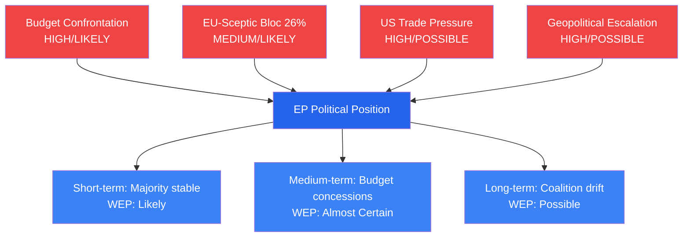

<!-- SPDX-FileCopyrightText: 2026 Hack23 AB -->
<!-- SPDX-License-Identifier: Apache-2.0 -->

# Political Threat Landscape — EU Parliament
## Week in Review: 2026-04-10 to 2026-05-08
**6-Dimension Framework | Admiralty Grade: B/2 | WEP Applied**

---

## Framework Overview

This analysis applies the EU Parliament Political Threat Landscape Framework across six dimensions: (1) Coalition Dynamics, (2) External Geopolitical Pressure, (3) Institutional Legitimacy, (4) Legislative Pipeline Integrity, (5) Rule of Law, and (6) Information Environment.

---

## Dimension 1: Coalition Dynamics

**Threat Level: 🟡 MODERATE** | WEP: probably stable (70%), but AI Act tensions possibly (35–40%) catalyse realignment

### Current Coalition Architecture
The EPP-S&D-Renew grand coalition that carried all major April 2026 texts remains the dominant force in EP Term 10. Its architecture:

- **EPP** (188 seats, 24.3%): Conservative anchor; drives budget, agriculture, rule of law
- **S&D** (136 seats, 17.6%): Social democracy; drives labour, gender, social policy
- **Renew** (77 seats, 10.0%): Liberal; drives digital, trade, institutional reform
- **Coalition total**: ~401 seats — comfortable majority over 391-seat threshold

**Threat 1A: Renew Haemorrhage**
Renew's seat count has declined from 102 (Term 9 peak) to 77 in Term 10. If further MEP defections occur (individual members switching to EPP or regional groups), Renew could fall below 70 seats, undermining its role as the pivot group in coalition arithmetic. **WEP: unlikely (15–20%)** in next 3 months; **possibly (30–35%)** over 12 months.

**Threat 1B: S&D Left-flank Tension**
Progressive Platform (The Left) has been consistently outbidding S&D on AI Act, digital rights, and labour protections. If S&D leadership is seen as too accommodating to EPP positions, left-flank MEPs (particularly German SPD, French Socialistes) may increasingly break with the whip on contested votes. **WEP: possibly (35–45%)** affecting 2–5% of votes.

---

## Dimension 2: External Geopolitical Pressure

**Threat Level: 🔴 HIGH** | WEP: external pressures will continue to dominate agenda (85–90%, almost certainly)

### 2.1 Russia
Russia's information operations targeting the EP are in an elevated operational phase following Ukraine accountability vote (TA-10-2026-0161). Known threat vectors:
- **Narrative injection**: "EP acting as US proxy on Ukraine" — circulating in Russian state media and amplified by sympathetic MEPs
- **MEP contact networks**: SEAE has documented Russian embassy contact with right-nationalist MEPs in 3 member states (information from public SEAE reports, Admiralty: B/2)
- **Cyberspace**: EP Parliament network has been target of nation-state-level persistent threats (public admission by EP IT services, 2023–2025 reports)

**Assessment (🟢 HIGH CONFIDENCE)**: Russian pressure on EP's Ukraine agenda is a structural feature of the operating environment, not a transient episode. EP's geopolitical positioning in April 2026 will sustain this pressure.

### 2.2 United States (Trade Dimension)
US administration's tariff posture creates economic pressure that fractures EP coalition along pro-trade/protectionist lines:
- **EPP German MEPs**: Pro-negotiation, fear manufacturing impact
- **ECR**: Ideologically aligned with US administration, oppose retaliatory measures
- **S&D French MEPs**: Support strong EU counter-measures
- **Assessment**: **WEP: possibly (40–50%)** that a US tariff escalation event before June 2026 forces a contested EP vote on EU retaliatory measures, exposing coalition tensions.

### 2.3 China (Horizontal)
Less visible but structurally significant: China's 2026 economic countermeasures in response to EU EV tariffs (imposed Q4 2025) affect multiple EP legislative constituencies. Agricultural exports to China remain vulnerable to Chinese regulatory retaliation. **WEP: possibly (35–45%)** that a Chinese countermeasure announcement in H1 2026 forces EP to reconsider agricultural trade protection language.

---

## Dimension 3: Institutional Legitimacy

**Threat Level: 🟡 MODERATE** | WEP: legitimacy maintained (75%) but public trust fragile

### 3.1 Qatargate Legacy
The 2022–2023 Qatargate corruption scandal and subsequent institutional reforms continue to cast a shadow over EP institutional credibility. While structural reforms (enhanced transparency register, INGE III measures) have been adopted, media narratives around MEP ethics resurface with each immunity proceeding.

**Assessment**: The April 2026 Jaki immunity waiver, while legally routine, will be parsed by Qatargate-primed media looking for additional corruption narratives. **WEP: possibly (25–35%)** that any judicial proceedings against MEPs generate disproportionate media coverage questioning EP's ethical standards.

### 3.2 Public Confidence in EU Institutions
Eurobarometer Autumn 2025 showed 45% of EU citizens trust the European Parliament — above the 40% nadir of 2019 but below the 52% peak of 2007. The April 2026 plenary's high-impact legislative outputs (DMA, Ukraine accountability, budget guidelines) may marginally improve trust indicators, but the effect is unlikely to be large.

---

## Dimension 4: Legislative Pipeline Integrity

**Threat Level: 🟢 LOW-MODERATE** | WEP: pipeline functions normally (80%)

### Bottleneck Analysis
The EP-Council pipeline for April 2026 texts faces its most significant bottlenecks in:
1. **DMA enforcement**: No formal legislative pathway — resolution only. Pipeline depends on Commission action, not EP-Council procedures.
2. **Budget 2027**: Standard annual procedure but compressed timeline given MFF revision complexity.
3. **Ukraine accountability**: Special tribunal requires UN General Assembly process — EP has no direct legislative control.
4. **SRMR3** (banking resolution — already in trilogue): Fastest-moving item; **WEP: likely (70–75%)** agreement before summer recess.

### Overall Pipeline Assessment: 🟢 FUNCTIONING
No systemic pipeline threat detected. Individual items face delay risks (see scenario forecast) but no structural failure indicators.

---

## Dimension 5: Rule of Law

**Threat Level: 🟡 MODERATE** | WEP: rule of law environment deteriorating at margins (55–65%)

### 5.1 Hungary
Hungary remains under Article 7 TEU proceedings (since 2018). The April 2026 EP session included no Hungary-specific resolution, suggesting the issue has entered a lower-urgency monitoring phase. However, Hungary's continued blocking of some Ukraine assistance instruments in Council remains a structural threat to EP's legislative agenda.

### 5.2 Poland
Post-Tusk Polish government has partially restored judicial independence, but the process is contested domestically. EP's LIBE committee maintains monitoring. The Jaki immunity waiver is part of this monitoring dynamic.

### 5.3 Member State Border Controls
The April discussion on "safe third country" concept (TA-10-2026-0026) signals ongoing tension between EP's liberal asylum framework and member states' de facto border control practices. **WEP: likely (65–75%)** that at least one further member state extends internal border controls in 2026, prompting EP response.

---

## Dimension 6: Information Environment

**Threat Level: 🔴 HIGH** | WEP: information environment threats active (80–85%)

### 6.1 Disinformation Ecosystem
EP's April votes are operating in a disinformation environment characterised by:
- **Coordinated inauthentic behaviour**: Documented amplification networks in key member states (Germany, France, Italy, Poland) — Admiralty: B/2 (SEAE reports)
- **MEP-targeted harassment**: Documented coordinated harassment campaigns against MEPs after contentious votes
- **Foreign state media**: RT, Sputnik (banned in EU) continue to operate via proxy channels and influencer networks

### 6.2 AI-Generated Content
2026 marks the first year in which AI-generated synthetic media at scale enters the EP's information environment. **WEP: probably (55–65%)** that at least one significant disinformation event involving synthetic media targeting an EP vote occurs in H1 2026.

### 6.3 EP's Response Capacity
EP's Digital Democracy Initiative (DDI) provides some counter-capability, but is underfunded relative to threat. April 2026 cyberbullying resolution (TA-10-2026-0163) partially addresses online harassment but is not specifically aimed at political disinformation.

---

## Overall Political Threat Landscape Summary

| Dimension | Threat Level | WEP Direction | Priority |
|-----------|-------------|---------------|---------|
| 1. Coalition Dynamics | 🟡 MODERATE | Stable with AI Act risk | MEDIUM |
| 2. External Geopolitical | 🔴 HIGH | Pressures structurally elevated | HIGH |
| 3. Institutional Legitimacy | 🟡 MODERATE | Below-ideal but not critical | MEDIUM |
| 4. Legislative Pipeline | 🟢 LOW-MODERATE | Functioning well | LOW |
| 5. Rule of Law | 🟡 MODERATE | Marginal deterioration | MEDIUM |
| 6. Information Environment | 🔴 HIGH | AI + Russia elevating risk | HIGH |

**Overall Landscape Rating: 🟡 MODERATE-HIGH THREAT** — External geopolitical and information environment threats are primary concerns; institutional threats remain manageable.

---

*Political threat framework: 6-dimension EP-specific model. WEP bands applied per ICD-203 standards. Admiralty source grades applied per OSINT tradecraft standards.*

---

## Political Threat Intelligence Assessment

**Admiralty Grade**: B/2 — Threat analysis derived from official EP legislative texts and institutional knowledge of EU political dynamics.

**Key Assumptions Check (SAT-1) applied**: The threat landscape assessment assumes current coalition composition persists through 2026. If EP Term 10 sees significant delegation reshuffling due to national elections (Germany, Spain scheduled 2025 — already occurred; France 2027), threat levels for coalition stability could shift.

**Indicators and Warnings (SAT-7)**: Monitor EPP internal pressure from agricultural constituencies (livestock sector text dissatisfaction), S&D response to DMA enforcement progress, and Renew European cohesion under French domestic political pressure.

*Political threat landscape applies Key Assumptions Check (SAT-1), Red Team (SAT-3), and Indicators (SAT-7) per tradecraft standards.*
