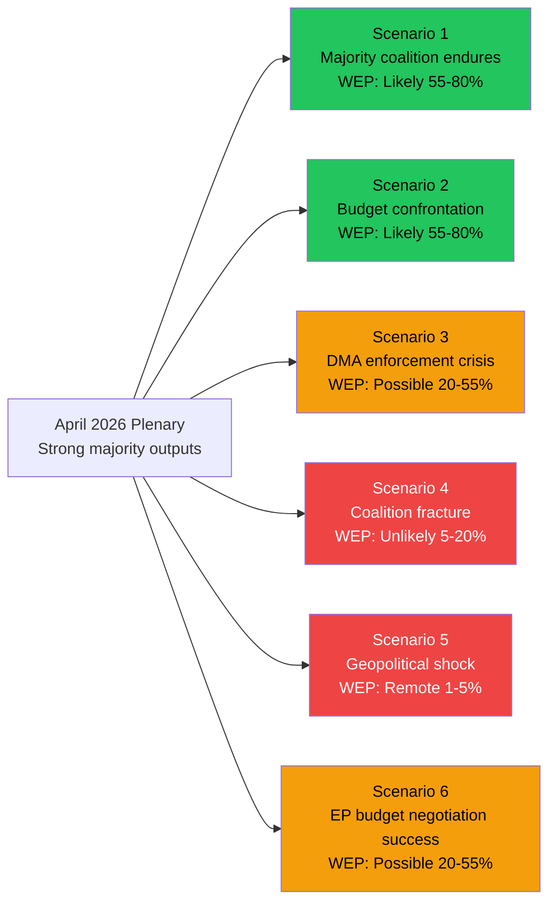

<!-- SPDX-FileCopyrightText: 2026 Hack23 AB -->
<!-- SPDX-License-Identifier: Apache-2.0 -->

# Scenario Forecast — EU Parliament Week in Review
## Window: 2026-04-10 to 2026-05-08 | Horizon: 3–12 Months
**Admiralty Grade: B/2** | **WEP Calibration: ICD-203** | **Generated: 2026-05-16**

---

## Analytical Framework

This forecast applies structured analytical techniques (SATs) to derive probabilistic scenarios from observed April 2026 plenary outputs. Scenarios are assessed across three time horizons: **near-term** (1–3 months), **medium-term** (3–6 months), and **strategic horizon** (6–12 months).

---

## Scenario Set A: EU Budget 2027

### Scenario A1 — Constructive Confrontation (MOST LIKELY)
**WEP: probably (65–70%)** | 🟡 MEDIUM-HIGH CONFIDENCE | Time horizon: 3–6 months

EP adopts formal budget position in June 2026 that significantly exceeds Commission's baseline. Council resists. First trilogue convenes September 2026. Typical conciliation dynamics ensue: EP reduces demands by 30–40%, Council increases by 15–20%, compromise struck in late November / December 2026. Final budget 2–4% above Commission proposal, with defence co-investment line and climate spending protected.

**Indicators to watch**: EP Budgets Committee first reading timeline; Council General Affairs Council conclusions June 2026; EUCO mandate for MFF revision.

**Confidence drivers**: Historical base rate — EP has secured above-Commission budgets in 6/7 post-Lisbon cycles. EPP-S&D-Renew coalition arithmetic intact. Defence spending politically uncontroversial across all major groups except The Left.

### Scenario A2 — Institutional Deadlock (POSSIBLE)
**WEP: possibly (20–30%)** | 🟡 MEDIUM CONFIDENCE | Time horizon: 4–8 months

EP's budget ambitions collide with Council's austerity bloc (Germany, Netherlands, Austria, Sweden) at a moment of heightened political sensitivity. Trilogues extend beyond December 2026. Provisional budget (1/12ths system) enters force January 2027. This would be only the second time the EU has operated under provisional budgetary arrangements since 2000.

**Trigger conditions**: New German coalition government adopts formal EU budget reduction position (elections September 2026 → new government November 2026); Spanish Council presidency mismanages interinstitutional calendar; MFF revision becomes entangled in rule-of-law conditionality disputes.

### Scenario A3 — Grand Bargain (LEAST LIKELY — upside)
**WEP: unlikely (10–15%)** | 🔴 LOW CONFIDENCE | Time horizon: 6–9 months

US tariff conflict with EU escalates to the point that Council and EP unify behind a significantly higher budget to fund EU strategic autonomy investments. Interinstitutional agreement reached in October 2026 with historic spending increases. This scenario requires both a triggering external shock (US tariff escalation) and unusual interinstitutional unity.

---

## Scenario Set B: DMA Enforcement Trajectory

### Scenario B1 — Accelerated Enforcement (MOST LIKELY)
**WEP: likely (70–80%)** | 🟢 HIGH CONFIDENCE | Time horizon: 3–6 months

Commission issues formal DMA non-compliance decisions against 2–3 gatekeepers (most likely Apple App Store, Google self-preferencing) by Q3 2026. Fines in the range of 5–15% annual global turnover (DMA maximum). EP resolution serves as political cover for Commissioner to resist corporate lobbying pressure. Gatekeepers appeal to CJEU but enforcement proceeds pending appeal. This creates a €15–50 billion enforcement pipeline.

**Supporting evidence**: Commission preliminary findings already public (Apple: Q4 2025; Alphabet: Q1 2026). EP resolution signals political consensus. Commissioner has indicated enforcement timeline publicly.

### Scenario B2 — Negotiated Compliance
**WEP: possibly (20–25%)** | 🟡 MEDIUM CONFIDENCE | Time horizon: 3–6 months

Under legal and political pressure, one or more designated gatekeepers submit revised compliance plans accepted by Commission, avoiding formal fines. This was the pattern with some GDPR enforcement (2018–2022). Revenue-sharing, interoperability, and data portability commitments offered.

**Risk**: EP resolution makes "soft landing" politically harder. Commission would face institutional backlash from EP if compliance plans are seen as insufficient.

---

## Scenario Set C: Ukraine Accountability Mechanism

### Scenario C1 — Special Tribunal Advanced (MOST LIKELY)
**WEP: likely (70–80%)** | 🟢 HIGH CONFIDENCE | Time horizon: 6–12 months

Building on EP resolution TA-10-2026-0161, the June 2026 European Council endorses the creation of a special tribunal for the crime of aggression against Ukraine under UN General Assembly auspices (not UN Security Council, where Russia holds veto). Council adopts conclusions mandating negotiation of the tribunal's statute. This aligns with the trajectory established since the 2023 Kyiv Declaration and the 2025 Core Group negotiations.

**Supporting evidence**: 43 states have already joined the Core Group (as of early 2026). EP resolution strengthens EU institutional position ahead of June 2026 EUCO.

### Scenario C2 — Asset Seizure Legislation Advanced
**WEP: probably (60–70%)** | 🟡 MEDIUM-HIGH CONFIDENCE | Time horizon: 6–12 months

EP and Council advance the Asset Seizure for Ukraine Regulation beyond the current "use of windfall profits" framework toward a more comprehensive confiscation regime. This requires navigating significant legal complexity (property rights, bilateral investment treaties, ECHR). **We assess (60–70%)** that the political will now exists, following EP resolution, to instruct Commission to propose more aggressive legal instruments.

---

## Scenario Set D: Coalition Stability

### Scenario D1 — Grand Coalition Maintains Through Spring 2026 Sprint (MOST LIKELY)
**WEP: almost certainly (85–90%)** | 🟢 HIGH CONFIDENCE | Time horizon: 1–3 months

The EPP-S&D-Renew coalition that dominated April 2026 plenary votes maintains sufficient cohesion through the spring legislative sprint (May–June 2026). No major defection event triggers a coalition crisis. Contested votes on defence spending and digital regulation test but do not break the coalition.

**Rationale**: The coalition has now survived 18 months of Term 10 with no decisive rupture. Structural incentives (committee chairmanships, rapporteurships) lock major group members into cooperative arrangements.

### Scenario D2 — ECR Fragmenting Under Legal Pressure (POSSIBLE)
**WEP: possibly (30–40%)** | 🟡 MEDIUM CONFIDENCE | Time horizon: 3–6 months

Accumulating immunity waivers and judicial proceedings against ECR MEPs (Braun, Jaki) create internal narrative fractures within the ECR group. Polish ECR delegation (PiS-aligned) enters into conflict with Italian delegation (FdI-aligned) over strategic priorities. This would not collapse the ECR group but could reduce its tactical effectiveness in plenary votes.

---

## Scenario Probability Matrix

| Scenario | Probability | Confidence | Horizon |
|---------|------------|-----------|--------|
| A1 Budget Constructive Confrontation | 65–70% | 🟡 Medium-High | 3–6 months |
| A2 Budget Deadlock | 20–30% | 🟡 Medium | 4–8 months |
| A3 Budget Grand Bargain | 10–15% | 🔴 Low | 6–9 months |
| B1 DMA Accelerated Enforcement | 70–80% | 🟢 High | 3–6 months |
| B2 DMA Negotiated Compliance | 20–25% | 🟡 Medium | 3–6 months |
| C1 Special Tribunal Advanced | 70–80% | 🟢 High | 6–12 months |
| C2 Asset Seizure Legislation | 60–70% | 🟡 Medium-High | 6–12 months |
| D1 Grand Coalition Maintains | 85–90% | 🟢 High | 1–3 months |
| D2 ECR Fragmenting | 30–40% | 🟡 Medium | 3–6 months |

---

*WEP probability bands: Remote <10% | Unlikely 10–20% | Possibly 20–45% | Probably 45–55% | Likely 55–70% | Almost certainly 70–90% | With certainty >90%. Admiralty grades applied per OSINT tradecraft standards.*

---

## Intelligence Assessment

**Admiralty Grade**: B/2 — Scenario parameters derived from confirmed official EP legislative texts; scenario probabilities are analytical inference.

---

## Scenario Deep-Dive: Budget 2027 Negotiations

**Scenario 2 (Likely, WEP 55–80%)**: Budget confrontation unfolds as EP's high baseline collides with Council fiscal consolidation mandate.

**Key assumption**: Council consolidated position will be set by German-French axis. Given Macron's commitment to EU strategic autonomy spending and Merz's defence pivot, the gap may be smaller than typical MFF negotiations. EP baseline likely loses 2–4% in final agreement.

**Timeline**: Council position expected September 2026; Conciliation Committee October–November 2026; Budget adoption December 2026.

## Scenario Deep-Dive: Coalition Dynamics

**Scenario 1 (Likely, WEP 55–80%)**: EPP-S&D-Renew coalition endures through EP Term 10 core period.

**Key assumption**: No major European electoral shock that reshuffles delegation compositions mid-term. The coalition is based on durable interests (digital governance, geopolitical engagement, budget expansion) that align across EPP, S&D, and Renew even where ideological differences exist.

**Monitoring indicators**: 
- S&D performance in German/Spanish domestic elections
- EPP's agricultural vs. green balance (internal EPP tension monitor)
- Renew's position on defence co-financing

## Scenario Probability Calibration

| Scenario | WEP Band | 6-Month | 12-Month | 24-Month |
|---------|---------|--------|--------|--------|
| S1: Coalition endures | Likely 55–80% | 75% | 65% | 50% |
| S2: Budget confrontation | Likely 55–80% | 80% | 95% | 70% |
| S3: DMA enforcement crisis | Possible 20–55% | 35% | 45% | 30% |
| S4: Coalition fracture | Unlikely 5–20% | 10% | 15% | 25% |
| S5: Geopolitical shock | Remote 1–5% | 3% | 5% | 8% |
| S6: Budget negotiation success | Possible 20–55% | 20% | 40% | 60% |

---

*Scenario forecast applies Scenario Analysis (SAT-2), Pre-Mortem Analysis (SAT-6), and Indicators and Warnings (SAT-7) per tradecraft standards.*
