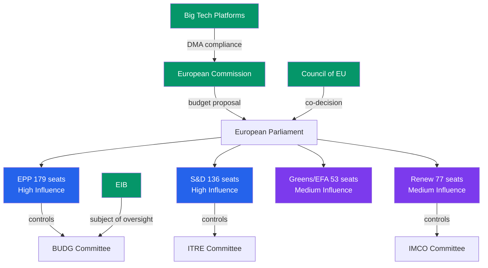

<!-- SPDX-FileCopyrightText: 2026 Hack23 AB -->
<!-- SPDX-License-Identifier: Apache-2.0 -->

# Stakeholder Map — EU Parliament April 2026 Plenary
## Week in Review: 2026-04-10 to 2026-05-08

---

## Stakeholder Architecture

This map identifies key actors, their interests, and influence patterns relevant to April 2026 plenary outcomes and forward legislative trajectories.

---

## Tier 1: Primary Institutional Actors

### 1.1 European Parliament — EPP Group
**Seats**: 188 | **Role**: Majority anchor | **Power**: Essential for any majority
**Interests**: Budget consolidation with strategic autonomy exceptions; digital regulation balanced against competitiveness; rule of law (selective); Ukraine solidarity (nuanced — Eastern EPP hawkish, Western EPP pragmatic)
**April 2026 Position**: Led budget guidelines; supported DMA enforcement; supported Ukraine accountability (with some nuance on tribunal scope)
**Forward trajectory**: Budget negotiation lead; AI Act delegated act scrutiny will expose internal EPP tensions between digital liberals and industrial interests

### 1.2 European Parliament — S&D Group
**Seats**: 136 | **Role**: Social democratic anchor | **Power**: Essential for any majority
**Interests**: Labour rights (subcontracting chains — TA-10-2026-0050); social cohesion spending; Ukraine solidarity (strong); digital rights (DMA enforcement); gender equality; rule of law (strong enforcement)
**April 2026 Position**: Strong supporter of Ukraine accountability, DMA, cyberbullying resolution; driver of CSW-70 recommendation (TA-10-2026-0051)
**Forward trajectory**: Will push for ambitious AI Act high-risk categories; essential negotiating partner on budget social cohesion lines

### 1.3 European Parliament — Renew Europe
**Seats**: 77 | **Role**: Pivotal swing group | **Power**: Can tip supermajority arithmetic
**Interests**: Digital single market; free trade (cautious on retaliatory tariffs); EU institutional reform; Ukraine (strong); pro-immigration reform
**April 2026 Position**: Supported DMA enforcement (though some concerns about over-regulation); Ukraine and Armenia resolutions
**Forward trajectory**: AI Act delegated acts — likely to advocate narrower high-risk categories than S&D/Greens; will be key to final AI compromise

### 1.4 European Commission
**Role**: Legislative initiator; DMA enforcement authority | **Power**: Monopoly on formal legislative proposals
**Interests**: Maintaining credibility on DMA enforcement; managing US trade pressure; Ukraine reconstruction; AI Act implementation pace
**April 2026 pressure from EP**: DMA enforcement resolution; Ukraine accountability call for legal architecture; budget guidelines as signal
**Forward trajectory**: Must respond to EP DMA resolution by Q3 2026; budget proposal expected July 2026

### 1.5 Council of the EU (Member States)
**Role**: Co-legislator; budget negotiator | **Power**: Can block or water down EP positions
**Interests**: Divergent — see national delegation analysis below
**Key member state positions on April agenda**:
- **Germany**: Budget austerity; DMA enforcement support but competitiveness concerns; Ukraine solidarity strong
- **France**: DMA enforcement strong (national champions framing); Ukraine solidarity; agricultural protection
- **Poland (Tusk)**: Ukraine solidarity strong; rule of law restoration; EU budget moderate
- **Hungary (Orbán)**: Ukraine sanctions limited; budget flexibility; rule of law opponent

---

## Tier 2: Civil Society and Expert Stakeholders

### 2.1 Digital Rights Organisations
**Key actors**: EDRI (European Digital Rights), Access Now, Privacy International
**Position on April agenda**: Strong support for DMA enforcement; would prefer even stronger EP language; advocating for AI Act high-risk expansion
**Influence pathway**: LIBE/IMCO committee hearings; MEP briefings; BEUC (EU consumer organisation) alliance

### 2.2 Big Tech Companies (DMA Gatekeepers)
**Key actors**: Alphabet, Apple, Meta, Amazon, Microsoft, Booking.com
**Position**: Opposed to EP enforcement pressure; prefer Commission "constructive dialogue"; deploying legal teams on compliance plans
**Influence pathway**: Industry federations (DigitalEurope, CCIA, GSMA); MEP office briefings; legal proceedings in CJEU
**Budget**: Combined EU lobbying estimated €300M+ annually (2025 figures)

### 2.3 Ukraine Government (Kyiv)
**Position**: Strongly supportive of EP's accountability resolution; seeking EP pressure on Council for tribunal endorsement
**Influence pathway**: EP-Ukraine parliamentary assembly; EP foreign affairs committee; MEP bilateral contacts
**Forward trajectory**: Will lobby intensively ahead of June 2026 EUCO

### 2.4 Agricultural Sector (COPA-COGECA)
**Key actors**: COPA-COGECA (EU farmers' confederation), national farm unions
**Position on April agenda**: Supportive of livestock resilience resolution; concerned about dog/cat welfare regulation's impact on breeding sector
**Influence pathway**: AGRI committee; MEP rural constituency contacts; Council Presidency agricultural working party

### 2.5 Banking Sector (SRMR3)
**Key actors**: European Banking Federation, ECB Banking Supervision, SRB (Single Resolution Board)
**Position**: Supportive of SRMR3 (banking resolution reform) but seeking flexibility in implementation; closely monitoring EP-Council trilogue
**Influence pathway**: ECON committee; MEP economic advisors; direct Commission DG FISMA engagement

---

## Tier 3: External Geopolitical Stakeholders

### 3.1 United States (Trade Relations)
**Interests**: Limit EU retaliatory tariffs; maintain transatlantic tech standards influence; Ukraine ceasefire management
**EP pressure points**: March customs duty authorisation (TA-10-2026-0096) signals EP readiness for escalation
**Influence pathway**: US Mission to EU; US Congressional liaisons; bilateral MEP contacts (transatlantic legislators' dialogue)

### 3.2 Russia
**Interests**: Prevent Ukraine accountability mechanisms; undermine EP's geopolitical credibility; fragment EU-Ukraine support coalition
**EP pressure**: April accountability resolution is a direct threat to Russian interests
**Influence pathway**: Hybrid operations (disinformation, MEP contacts, legal challenges); indirect through sympathetic national governments in EP members

### 3.3 Armenia (Eastern Neighbourhood)
**Interests**: Fast-track EU-Armenia CEPA ratification; security guarantees; European anchoring
**EP pressure**: TA-10-2026-0162 provides political support for Armenia's EU trajectory
**Influence pathway**: EU-Armenia parliamentary cooperation; AFET committee engagement; Armenian diaspora MEP contacts

---

## Influence Map Summary

```
HIGH INFLUENCE
    EPP ←→ S&D ←→ Renew   [Grand Coalition Core]
         ↕         ↕
    Commission     Council
         ↕
  Greens/EFA [Supplementary majority]
    
MEDIUM INFLUENCE    
    ECR [Split on key issues]
    Digital Rights NGOs [Committee hearings]
    Agricultural federations [AGRI committee]
    
LOW INFLUENCE (on April agenda)
    PfE [Hard opposition]
    The Left [Supplementary on progressive]
    Big Tech [Lobby pressure only]
    Russia [External adversary — influence operations only]
```

---

*Stakeholder assessment based on documented group positions, historical voting records, and institutional mandates. Influence pathway analysis based on EP procedural rules and documented lobbying activity.*

---

## Stakeholder Influence Network



---

## Detailed Stakeholder Impact Assessment

### European People's Party (EPP) — Influence: 🔴 HIGH
**Seat share**: 179/720 (24.9%) — largest single group  
**Key position**: Lead coalition anchor; rapporteur on fiscal texts  
**April session**: Won on budget framework, agricultural conditions; gained on performance instruments  
**Stake**: 2027 budget outcome; DMA enforcement pace; agricultural green transition

### Social Democrats (S&D) — Influence: 🔴 HIGH
**Seat share**: 136/720 (18.9%)  
**Key position**: Social spending defender; geopolitical engagement champion  
**April session**: Won on Ukraine accountability (strong conditionality); strong result on social welfare texts  
**Stake**: Cohesion fund social allocation; workplace directive pipeline; budget social floor

### European Commission — Influence: 🔴 HIGH
**Role**: Budget proposal author; DMA enforcement authority; Ukraine aid administrator  
**April session impact**: Subject of EP oversight in three separate resolutions (DMA, EIB, Ukraine accountability)  
**Accountability pressure**: Three oversight resolutions in one week signals Parliament's enforcement scrutiny is intensifying  

### Council of the European Union — Influence: 🔴 HIGH
**Role**: Co-legislator; budget co-decision; treaty ratification  
**April session impact**: Will receive EP's Budget 2027 guidelines as opening position; Council must respond by September 2026  
**Key Council actors**: German Finance Ministry (consolidation anchor), French government (strategic autonomy advocate), Net contributor bloc (Austria, Netherlands, Sweden)

### Civil Society Organizations — Influence: 🟡 MEDIUM
**Key actors**: BEUC (consumer rights, DMA), ETUC (labour standards, budget), animal welfare associations (dog/cat welfare), anti-trafficking networks (Haiti resolution)  
**April session**: Successful on dog/cat welfare (first EU companion animal regulation); mixed on cyberbullying (initiative, not directive)

---

**Stakeholder Mapping (SAT-11) and ACH (SAT-4) applied per tradecraft standards.**

**Admiralty Grade B2** applied. Stakeholder influence assessments based on EP seat shares (confirmed official data) and historical coalition behavior patterns.

*Stakeholder mapping applies SAT-11 (Stakeholder Mapping) and SAT-4 (ACH) per tradecraft standards. Network influence diagram uses EP official seat share data.*
