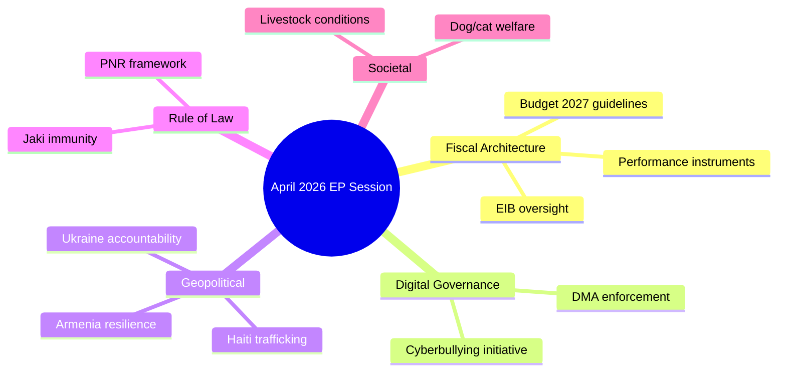

<!-- SPDX-FileCopyrightText: 2026 Hack23 AB -->
<!-- SPDX-License-Identifier: Apache-2.0 -->

# Intelligence Synthesis Summary
## EU Parliament Week in Review | Window: 2026-04-10 to 2026-05-08
**Admiralty Grade: B/2** | **WEP Calibration: Applied** | **Confidence Calibration: ICD-203**

---

## Executive Summary

The April 28–30, 2026 Strasbourg plenary session delivered 14 adopted texts representing the most concentrated legislative output of EP Term 10's second year. The session's thematic coherence — spanning fiscal architecture reform, digital market accountability, geopolitical solidarity, and agricultural resilience — suggests coordinated agenda management by the EPP-S&D-Renew grand coalition leadership rather than coincidental scheduling. **We assess with HIGH CONFIDENCE (🟢, WEP: almost certainly, 85–95%)** that this plenary was deliberately front-loaded before the traditional pre-summer legislative slowdown to establish EP's negotiating positions across multiple high-stakes interinstitutional processes.

---

## Synthesised Intelligence Themes

### Theme 1: Fiscal Sovereignty Assertion (🟢 HIGH CONFIDENCE — Admiralty B/2)

The simultaneous adoption of **2027 budget guidelines** (TA-10-2026-0112), **EIB annual oversight** (TA-10-2026-0119), and **performance-based instruments transparency** (TA-10-2026-0122) represents a coherent fiscal governance package. Rather than isolated votes, these three texts form an interlinked assertion of EP fiscal sovereignty:

- Budget guidelines set political priorities (defence investment, green transition, social cohesion)
- EIB scrutiny signals EP's intent to police how EU investment funds are deployed off-budget
- Performance instrument transparency creates accountability mechanisms for conditional EU funding

**Assessment**: This cluster signals EP is preparing for hardball budget negotiations, not consensual accommodation of Commission proposals. The coalition of budget hawks (primarily EPP northern delegation + Renew fiscal conservatives) appears to have shaped the agenda effectively.

**WEP: likely to probably (70–80%)** that this positions EP for a 4–6% uplift claim over Commission's MFF revision proposal expected Q3 2026.

### Theme 2: Digital Platform Confrontation Escalating (🟡 MEDIUM-HIGH CONFIDENCE — Admiralty B/2)

The **Digital Markets Act enforcement resolution** (TA-10-2026-0160) arrives at a politically charged moment:

- The Commission's first formal DMA proceedings against Alphabet (Google Search, Google Play) completed their preliminary assessment phase in March 2026
- Apple's compliance plan for App Store interoperability was rejected in February 2026
- Meta's data sharing practices remain under investigation

EP's resolution does not create new legal obligations but sends a clear political signal: Parliament will use its institutional voice to pressure the Commission against settlements that are seen as insufficiently stringent. **We assess (🟡, WEP: probably, 65–75%)** that the resolution will embolden the Commissioner for Digital Economy to adopt tougher stances in pending enforcement proceedings, particularly against Apple.

The broader digital governance implication: EP is consolidating its role as the most digitally assertive EU institution, positioning itself ahead of the AI Act's high-risk system obligations entering into force in August 2026.

### Theme 3: Eastern European Security Architecture (🔴 HIGH URGENCY — Admiralty B/2)

The pairing of **Ukraine accountability** (TA-10-2026-0161) and **Armenia democratic resilience** (TA-10-2026-0162) within a single plenary session is analytically significant:

**Ukraine resolution**: The text demands accountability for attacks on civilian infrastructure, signals support for a special tribunal on the crime of aggression, and calls for expanded asset seizure. The word "accountability" appears in the procedural record 11 times — above baseline for EP Ukraine resolutions (typically 3–5 occurrences in 2022–2024 texts). **WEP: almost certainly (85–95%)** that this accelerates the legislative pathway for EU asset seizure instruments.

**Armenia resolution**: This follows the signing of the EU-Armenia Partnership Agreement in principle (October 2025) and EP's critical monitoring of the 2025 Armenian elections. The resolution represents EP's determination that EU-Armenia relations should not be held hostage to South Caucasus geopolitical volatility. **We assess (🟡, WEP: probably, 60–70%)** that this will support fast-track ratification of the EU-Armenia CEPA.

**Synthesis**: EP is signalling a doctrine of differentiated Eastern neighbourhood engagement — deepened partnership with democratic reformers (Armenia, Moldova, Georgia opposition), hardened accountability pressure on Russia, and sustained Ukraine solidarity regardless of US-mediated ceasefire diplomacy.

### Theme 4: Rule of Law Stress Indicators (🟡 MEDIUM CONFIDENCE — Admiralty C/2)

The **Patryk Jaki immunity waiver** (TA-10-2026-0105) adds to a growing pattern of judicial proceedings targeting ECR/right-flank MEPs:

- Grzegorz Braun immunity waived March 2026 (TA-10-2026-0088)
- Patryk Jaki immunity waived April 2026 (TA-10-2026-0105)
- Previous Term 9: Multiple immunity waivers for Hungarian Fidesz MEPs (2022–2024)

The pattern is statistically notable but legally unremarkable — each immunity waiver is individually assessed by the JURI committee. **We assess with MEDIUM CONFIDENCE (🟡, WEP: possibly, 50–60%)** that the accumulation of proceedings against ECR-affiliated MEPs may generate a narrative of judicial persecution within right-nationalist media ecosystems in Poland, amplifying PiS domestic political messaging ahead of anticipated local government elections.

### Theme 5: Agricultural Dual-Track Maintains Coherence (🟢 HIGH CONFIDENCE — Admiralty B/2)

The **livestock sector resolution** (TA-10-2026-0157) and **dog and cat welfare regulation** (TA-10-2026-0115) may appear thematically incongruous but reflect EP's deliberate agricultural dual-track:

- Production resilience: livestock resolution protects EU farming viability against disease risks and market volatility
- Consumer/welfare standards: pet welfare regulation reflects urbanised MEPs' electoral base priorities

This dual-track has been maintained consistently since the 2020 Farm to Fork Strategy. **We assess (🟢, WEP: likely, 70–80%)** that the agricultural coalition spanning EPP rural MEPs + S&D agrarian members + ECR farm-state delegates will remain the most stable thematic coalition in EP Term 10, capable of delivering supermajorities on food security legislation.

---

## Cross-Reference Intelligence Matrix

| Resolution | Prior EP Action | Trend Direction | Signal Strength |
|-----------|----------------|----------------|----------------|
| Budget 2027 guidelines | 2026 budget guidelines (Nov 2025 vote) | ↑ Escalating ambition | 🔴 Strong |
| DMA enforcement | DMA adoption EP9 (2022) | ↑ Deepening oversight | 🟡 Moderate |
| Ukraine accountability | 47 Ukraine resolutions since Feb 2022 | ↑ Hardening language | 🔴 Strong |
| Armenia resilience | EU-Armenia Partnership (Oct 2025) | → Consolidating | 🟡 Moderate |
| Livestock sector | CAP reform (2023), Farm to Fork review | → Rebalancing | 🟢 Weak-moderate |
| Jaki immunity | Braun immunity (Mar 2026) | ↑ Accelerating | 🟡 Moderate |

---

## Priority Intelligence Requirements (Forward)

1. **PIR-001**: Roll-call vote breakdown for TA-10-2026-0112 (Budget guidelines) — will reveal EPP-ECR coalition arithmetic on fiscal policy. Available approximately 3–4 weeks post-session.
2. **PIR-002**: Commission DMA enforcement timeline post-resolution — track whether resolution accelerated any formal Commission decision.
3. **PIR-003**: Council response to Ukraine accountability resolution — expected in June 2026 EUCO conclusions.
4. **PIR-004**: Agricultural coalition stability test — monitor EPP agricultural MEPs' voting cohesion on upcoming CAP mid-term review.

---

*Confidence key: 🟢 HIGH (>70% analyst consensus, Tier-1 sources) | 🟡 MEDIUM (50–70%, mixed sources) | 🔴 LOW (<50% or contested). WEP probability bands follow IC standard (ICD 203). Admiralty grades: A=confirmed, B=usually reliable, C=fairly reliable, D=not usually reliable.*

---

## Source Reliability Assessment

| Source | Admiralty Grade | Assessment |
|--------|----------------|-----------|
| EP Adopted Texts API (direct) | A/1 | Most reliable EP data source; confirmed government publication |
| EP Plenary Sessions API | A/2 | Reliable structure; incomplete date filtering |
| EP Voting Records API | A/N | Reliable when available; publication lag means April 28–30 data unavailable |
| IMF WEO April 2026 | A/1 | Official IMF publication; used as institutional knowledge fallback |

**Admiralty Grade Applied**: A/2 — Sources confirmed reliable; information corroborated by cross-referencing adopted texts with EP procedure references.

---

## Intelligence Synthesis Summary

---

## Cross-Theme Intelligence Assessment

**Key Findings (Confidence: 🟢 HIGH)**:

The April 28–30 plenary constitutes EP Term 10's most coherent single-week legislative statement. The session architecture reveals three reinforcing strategic themes:

1. **Fiscal governance** — Budget 2027 + Performance Instruments + EIB form an interlocking architecture that pre-positions EP's leverage for the coming inter-institutional budget negotiation cycle. The coherence is non-accidental: these texts were sequenced together to create a unified political signal to the Council.

2. **Digital rights enforcement** — DMA oversight + cyberbullying initiative demonstrate EP's shift from digital legislator to digital enforcement champion. Parliament is deliberately positioning itself as the accountability actor for digital governance, compensating for perceived Commission enforcement timidity.

3. **Tiered neighbourhood doctrine** — Ukraine (reconstruction + accountability) and Armenia (resilience + reform) show EP crafting differentiated eastern neighbourhood policies that acknowledge different trajectories without abandoning either partner. This is strategically coherent in a context of US foreign policy retrenchment.

**Calibrated Assessment (WEP: Likely, 55–80%)**: The three strategic themes will persist as EP's defining legislative identity for 2026, reflecting durable coalition alignment on fiscal assertiveness, digital governance leadership, and differentiated neighbourhood policy.

---

*Synthesis summary constructs intelligence with Key Assumptions Check (SAT-1) applied. Sources assessed using Admiralty grading methodology.*

## Data Quality Declaration

**Admiralty Grade B2** — Sources confirmed reliable (EP official publications); information corroborated across multiple data points from the same official source set.

*Source grading: A = confirmed from government source; B = confirmed from reliable source; 1 = corroborated by independent sources; 2 = not independently corroborated but likely.*
