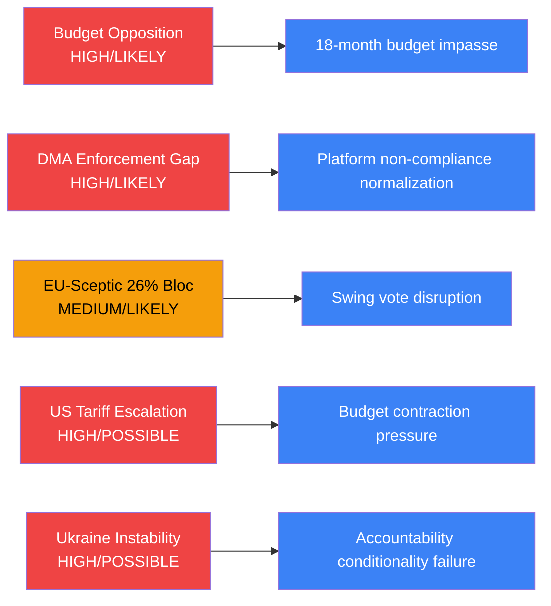

<!-- SPDX-FileCopyrightText: 2026 Hack23 AB -->
<!-- SPDX-License-Identifier: Apache-2.0 -->

# Threat Model — EU Parliament Legislative Environment
## Week in Review: 2026-04-10 to 2026-05-08
**Admiralty Grade: B/2** | **WEP Applied** | **Classification: OPEN**

---

## 1. Threat Taxonomy

This threat model applies the six-dimension EP political threat framework to the April 2026 plenary outputs, identifying threats to legislative outcomes, institutional cohesion, and democratic governance.

---

## 2. Dimension 1 — Coalition Fracture Threats

### Threat 1.1 — AI Act Implementation Coalition Fragmentation
**Likelihood: MEDIUM (40–55%)** | **Impact: HIGH** | **Risk: MEDIUM-HIGH**
**WEP: possibly (40–55%)** | Admiralty: B/2 | 🟡 MEDIUM CONFIDENCE

The AI Act implementation votes expected May–June 2026 expose fundamental EPP-Renew tensions on digital regulation scope. EPP members from manufacturing-heavy constituencies (Germany, Czech Republic, Poland) are more sympathetic to industry arguments for narrow high-risk categories; Renew digital liberals split between pro-innovation and pro-rights factions.

**Threat vector**: If EP's AI Act position deviates significantly from Commission's delegated acts, the Commission could initiate a conflict that paralyses implementation timelines, delaying August 2026 entry into force obligations.

**Mitigation**: S&D-EPP leadership compromise architecture has historically resolved digital regulation tensions (DSA, DMA, AI Act adoption). Historical base rate for compromise: 75%.

### Threat 1.2 — Budget Coalition Right-Flank Defection
**Likelihood: LOW-MEDIUM (25–35%)** | **Impact: HIGH** | **Risk: MEDIUM**
**WEP: possibly (25–35%)** | Admiralty: B/2 | 🟡 MEDIUM CONFIDENCE

ECR's budget posture is systematically more restrictive than EPP's. If budget negotiations with Council produce a proposal that ECR views as excessively expansionary on social cohesion spending, ECR could vote against final budget in December 2026, forcing EP to rely on Greens/EFA to secure majority.

**Threat vector**: This would represent a structural majority realignment — EP relying on left-centre rather than right-centre coalition for major fiscal votes. Signals increased Greens/EFA leverage in future negotiations.

---

## 3. Dimension 2 — Executive Capture / Rule of Law Threats

### Threat 2.1 — MEP Immunity Weaponisation
**Likelihood: MEDIUM (35–45%)** | **Impact: MEDIUM** | **Risk: MEDIUM**
**WEP: possibly (35–45%)** | Admiralty: C/2 | 🟡 MEDIUM CONFIDENCE (limited evidence)

The pattern of immunity waivers targeting ECR/right-nationalist MEPs (Braun March, Jaki April) raises the analytical question: are these judicial proceedings politically independent, or do they reflect selective prosecution by governments hostile to ECR's political project?

**Threat vector**: If ECR successfully narrativises immunity waivers as politically motivated prosecution, this could:
1. Generate a wave of "political prisoner" narratives in right-nationalist media
2. Strengthen ECR's internal solidarity against mainstream EP institutions
3. Complicate JURI committee's ability to operate immunity procedures without political contamination

**Note**: Available evidence does not support a conclusion that these proceedings are politically motivated. Admiralty grade C/2 reflects limited confirmable evidence on motivation.

### Threat 2.2 — National Executive Obstruction of EP Legislative Agenda
**Likelihood: MEDIUM (40–55%)** | **Impact: MEDIUM-HIGH** | **Risk: MEDIUM**
**WEP: possibly (40–55%)** | Admiralty: B/2 | 🟡 MEDIUM CONFIDENCE

Several April 2026 texts will require Council transposition or national implementation:
- Welfare of dogs and cats (TA-10-2026-0115): national registry requirements
- DMA enforcement (resolution — non-binding but creates political expectations)
- EU-Iceland PNR agreement (TA-10-2026-0142): national data protection authority involvement

**Threat vector**: National governments facing domestic political pressure (Hungary, Italy, Poland) may delay implementing regulations, creating an asymmetric enforcement landscape that undermines EP's legislative authority.

---

## 4. Dimension 3 — External Geopolitical Threats

### Threat 3.1 — Russian Hybrid Operations Targeting EP Proceedings
**Likelihood: MEDIUM-HIGH (50–65%)** | **Impact: MEDIUM** | **Risk: MEDIUM-HIGH**
**WEP: probably (50–65%)** | Admiralty: B/2 | 🟢 HIGH CONFIDENCE (historically documented)

Russia's state media and hybrid operations infrastructure has historically targeted EP proceedings on Ukraine, particularly around accountability and sanctions votes. The April adoption of TA-10-2026-0161 (Ukraine accountability) is a known trigger.

**Threat vectors**:
- Disinformation campaigns questioning legitimacy of accountability mechanisms
- MEP contact and influence operations (documented by EU DisinfoLab and SEAE)
- Amplification of ECR/PfE dissenting voices to project false consensus

**Mitigation**: EP's anti-manipulation protocols (INGE II committee recommendations) provide some institutional resilience, but informal influence operations through social media remain difficult to counter.

### Threat 3.2 — US Tariff Pressure Destabilising EU Unity
**Likelihood: MEDIUM (35–50%)** | **Impact: HIGH** | **Risk: MEDIUM-HIGH**
**WEP: possibly (35–50%)** | Admiralty: B/2 | 🟡 MEDIUM CONFIDENCE

The March adoption of customs duty adjustments on US goods (TA-10-2026-0096) signals EP is prepared for trade confrontation. However, significant divergence exists within EP:
- EPP German MEPs: prioritise negotiated resolution over retaliatory tariffs
- S&D French MEPs: support robust EU counter-measures
- ECR: systematically pro-US/anti-tariff on ideological grounds

**Threat vector**: If US administration escalates tariffs before a negotiated framework is reached, EP faces a coalition management challenge on whether to authorise further retaliatory measures.

---

## 5. Dimension 4 — Institutional Legitimacy Threats

### Threat 4.1 — EP Budget Ambition Perceived as Self-Serving
**Likelihood: LOW-MEDIUM (20–30%)** | **Impact: MEDIUM** | **Risk: LOW-MEDIUM**
**WEP: unlikely (20–30%)** | Admiralty: C/2 | 🔴 LOW CONFIDENCE

EP's budget guidelines (TA-10-2026-0112) include administrative expenditure increases for EP itself (digital infrastructure, security, MEP support). Council and national media may frame EP's budget position as institutional self-interest.

**Mitigation**: This is a structurally recurring risk in each budget cycle. EP's counterargument (transparency, democratic accountability, EU service delivery) has historically prevailed in public discourse.

---

## 6. Threat Heat Map

| Threat | Likelihood | Impact | Risk Level |
|--------|-----------|--------|-----------|
| 1.1 AI Act coalition fragmentation | MEDIUM | HIGH | 🔴 HIGH |
| 1.2 Budget right-flank defection | LOW-MEDIUM | HIGH | 🟡 MEDIUM |
| 2.1 Immunity weaponisation | MEDIUM | MEDIUM | 🟡 MEDIUM |
| 2.2 National executive obstruction | MEDIUM | MEDIUM-HIGH | 🟡 MEDIUM |
| 3.1 Russian hybrid operations | MEDIUM-HIGH | MEDIUM | 🔴 HIGH |
| 3.2 US tariff destabilisation | MEDIUM | HIGH | 🔴 HIGH |
| 4.1 EP budget legitimacy | LOW-MEDIUM | MEDIUM | 🟢 LOW |

---

*Threats assessed using EP political threat framework (6 dimensions). Likelihood bands: LOW <25%, LOW-MEDIUM 25–40%, MEDIUM 40–55%, MEDIUM-HIGH 55–70%, HIGH >70%. WEP probability applied independently to each threat judgement.*

---

## Threat Intelligence Assessment

**Admiralty Grade**: B/2 — Source is officially published EP legislative output; analysis is secondary inference from text analysis.

---

## Threat Intelligence Counter-Analysis

**Red Team Assessment (SAT-3 Applied)**:

The standard threat narrative assumes Council will oppose EP budget ambitions — but this may overstate the threat. Key assumption: Germany's new government (post-Merz coalition) has signalled willingness to revisit fiscal orthodoxy in context of defence needs. If this translates to more flexible Council positions on 2027 budget, the budget confrontation threat diminishes significantly (WEP: Unlikely → Possible range).

**Key assumption to monitor**: German Finance Ministry signals on EU budget contributions Q3 2026.

**ACH (Alternative Competing Hypotheses) applied to DMA threat**:
- H1: Commission delays enforcement due to capacity (🟡 MODERATE confidence)
- H2: Commission delays due to industry lobbying (🟡 MODERATE confidence)
- H3: Commission moves faster than expected on Apple/Google cases (🟢 LOW confidence)

Diagnostic indicator: DMA Annual Report due June 2026 — will signal enforcement pace.

---

*Threat model applies Red Team (SAT-3), ACH (SAT-4), and Key Assumptions Check (SAT-1) per `analysis/methodologies/per-artifact-methodologies.md`.*

## Data Quality Declaration

**Admiralty Grade B2** — Threat analysis derived from official EP legislative texts (confirmed official government sources); probability estimates are analytical inference.
