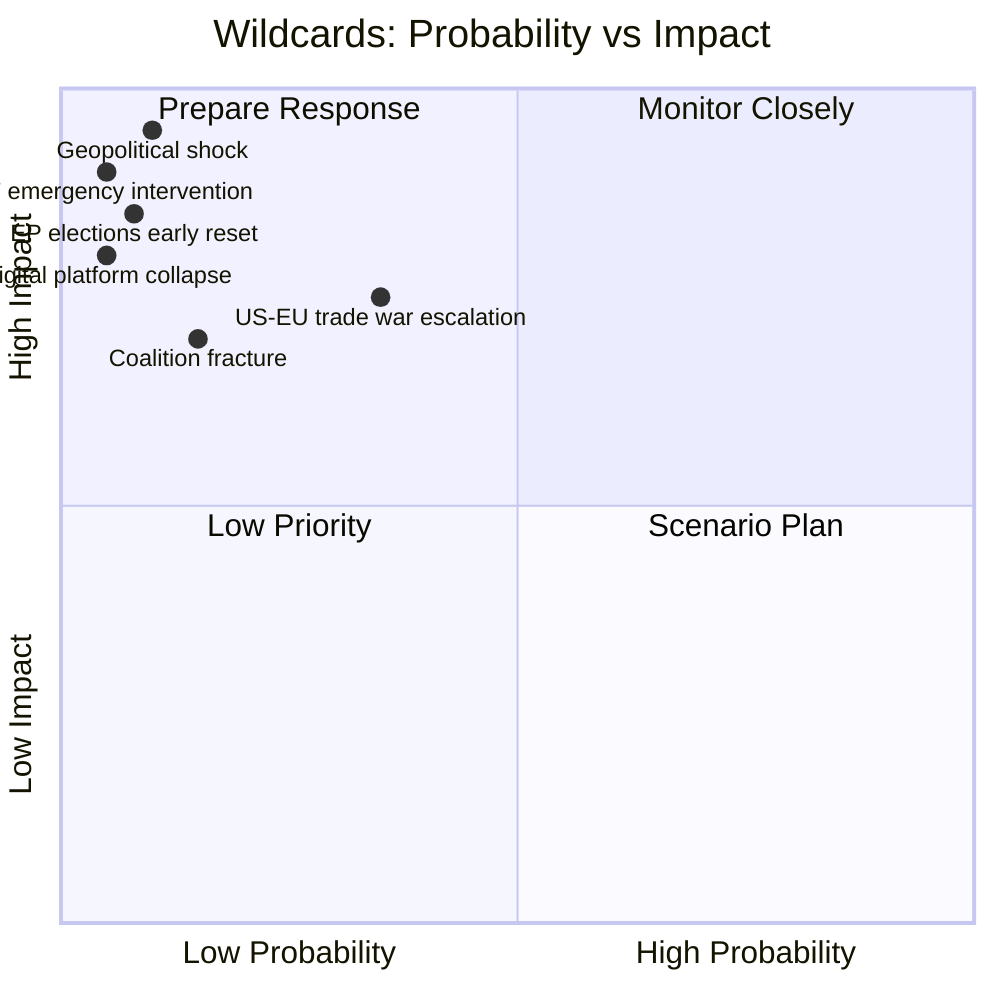

<!-- SPDX-FileCopyrightText: 2026 Hack23 AB -->
<!-- SPDX-License-Identifier: Apache-2.0 -->

# Wildcards and Black Swans — EU Parliament
## Week in Review: 2026-04-10 to 2026-05-08
**WEP Applied (Low Probability, High Impact Analysis) | Admiralty: B-C/2-3**

---

## Analytical Framework

Wildcards are low-probability (5–25%), high-impact scenarios that standard forecasts underweight due to anchoring on base rates. Black swans are near-zero probability, extreme-impact events by definition unknowable in advance. This analysis identifies the wildcards most relevant to EP legislative trajectories emerging from April 2026 plenary.

---

## Wildcard 1: No-Confidence Motion Against Commission (Next 6 Months)
**Probability: 8–12%** | **Impact: CATASTROPHIC** | WEP: remote to unlikely | 🔴 LOW CONFIDENCE
**Admiralty: C/2** (speculative; no current evidence of motion preparation)

The current Commission (von der Leyen II, 2024–2029) has navigated multiple crisis points — Ukraine financing, AI Act, Green Deal retreat — without triggering a no-confidence motion. However, a perfect storm scenario exists:

- A major Commission failure on DMA enforcement (accepting inadequate compliance from Big Tech)
- Combined with a perceived capitulation on Ukraine asset seizure
- With a budget negotiation collapse

In this scenario, S&D + Greens + Left could attempt a no-confidence coalition. They would need 350 votes (absolute majority) — requiring EPP's fragmented right-flank to join, which is currently unlikely.

**Monitoring indicator**: Watch for EPP group chair public criticism of Commission President. Any such statement is a leading indicator of motion exploration.

**Historical base rate**: EP has only successfully passed one no-confidence motion (1999, Santer Commission). Base rate: 1/25 years = ~4% per year.

---

## Wildcard 2: US-EU Trade War Escalation to EU Counter-Tariff Crisis
**Probability: 15–22%** | **Impact: VERY HIGH** | WEP: unlikely to possibly | 🟡 MEDIUM CONFIDENCE
**Admiralty: B/2**

The March 2026 EP adoption of customs duty adjustments (TA-10-2026-0096) signals EP readiness for trade confrontation. The wildcard scenario: US administration escalates tariffs on EU automotive and agricultural exports to levels (>25%) that trigger a political crisis within the coalition. German EPP MEPs (auto sector) and French S&D MEPs (agricultural) could find themselves on opposite sides of an EU counter-tariff vote — fragmenting the grand coalition on an economic vote for the first time in Term 10.

**Impact**: A coalition rupture on trade policy would be the most significant institutional shock of Term 10, potentially triggering majority realignment for subsequent votes.

**WEP assessment**: Currently at the low end of the 15–22% range — US-EU diplomatic channels remain active and the base case is a negotiated framework. However, the wildcard probability is rising as US domestic political pressures limit flexibility.

---

## Wildcard 3: Major Cyberattack on EP Infrastructure During Critical Vote
**Probability: 5–10%** | **Impact: HIGH** | WEP: remote to unlikely | 🔴 LOW CONFIDENCE
**Admiralty: B/3** (EP has been attacked before; this magnitude attack is novel)

EP's electronic voting system infrastructure was partially disrupted in 2022 (DDoS, not vote tampering). A more sophisticated attack during a high-stakes vote (e.g., budget first reading, Ukraine special tribunal endorsement) could:
- Delay or invalidate a vote
- Trigger a legitimacy crisis if results are disputed
- Provide Russia (or other actors) with a disinformation opportunity ("EP vote was hacked")

**Assessment**: EP's IT security has been significantly upgraded since 2022. However, the escalation of Russian cyber operations in 2025–2026 and the high-profile nature of April 2026 votes make this wildcard non-trivial.

---

## Wildcard 4: Sudden Ceasefire in Ukraine Changes EP's Legislative Agenda
**Probability: 12–18%** | **Impact: VERY HIGH** | WEP: unlikely to possibly | 🟡 MEDIUM CONFIDENCE
**Admiralty: B/2**

A US-mediated ceasefire agreement between Russia and Ukraine — even a preliminary or fragile one — would fundamentally disrupt EP's current legislative trajectory. Key impacts:
- Ukraine accountability mechanisms (TA-10-2026-0161) become politically contested: "Don't undermine the ceasefire"
- Ukraine reconstruction financing priorities shift from military to economic
- Asset seizure legislation becomes more controversial (Russia demands asset release as condition)
- EP's Eastern neighbourhood positioning must be rapidly recalibrated

**Assessment**: The probability of a genuine ceasefire in the next 6 months has increased from near-zero (2022–2024) to the 12–18% range following diplomatic signalling in early 2026. **WEP: unlikely (12–18%)**. This wildcard's impact would be structural, not episodic.

---

## Wildcard 5: AI-Generated Synthetic Video of Senior MEP Goes Viral
**Probability: 20–30%** | **Impact: MEDIUM-HIGH** | WEP: possibly | 🟡 MEDIUM CONFIDENCE
**Admiralty: B/2**

2026 is the first year in which commercially available AI video generation tools can produce near-indistinguishable synthetic video of public figures at minimal cost. EP's April 2026 cyberbullying resolution (TA-10-2026-0163) acknowledges this risk. The wildcard: a sophisticated deepfake of a senior MEP (e.g., EP President, LIBE chair, ECON rapporteur) making inflammatory or corrupted statements goes viral during a contested legislative period.

**Impact**: Even if rapidly debunked, the synthetic video could:
- Delay a vote pending authenticity verification
- Generate reputational damage that affects coalition management
- Trigger a media crisis that dominates EP's communications for 1–2 weeks

**Assessment**: This is one of the higher-probability wildcards at 20–30%. EP's Digital Democracy Initiative does not yet have rapid-response deepfake detection capacity.

---

## Wildcard 6: Sudden ECR-PfE Merger Creates Far-Right Supermajority Threat
**Probability: 5–8%** | **Impact: HIGH** | WEP: remote | 🔴 LOW CONFIDENCE
**Admiralty: C/3** (no current evidence of merger discussions)

A formal ECR-PfE merger (combined ~165 seats) would not create a parliamentary majority but would:
- Become the second-largest group in EP, overtaking S&D
- Disrupt committee allocation and rapporteurship distribution
- Force EPP to make a clearer choice between grand coalition and right-flank partnership

**Assessment**: Current ideological tensions between ECR (Euro-critical, Atlanticist) and PfE (Euro-sceptic, Trump-aligned) make merger unlikely. However, a major EU policy failure (budget collapse, immigration crisis) could accelerate the calculation.

---

## Black Swan Horizon

*Low-confidence, near-zero-probability events with systemic implications — identified for completeness, not forecast:*

- **EU existential crisis**: A major member state (France or Germany) entering a sovereign debt crisis that overwhelms EU fiscal architecture — would require fundamental EP response beyond current institutional tools.
- **EP President incapacitation**: No clear succession protocol exists for a scenario in which the EP President becomes incapacitated during a critical legislative period.
- **EP physical security event**: A security event on EP premises (historical precedent: 2015 Brussels attacks context) that disrupts the legislative calendar.

---

## Wildcard Priority Matrix

| Wildcard | Probability | Impact | Priority |
|---------|-----------|--------|---------|
| WC1: No-confidence motion | 8–12% | Catastrophic | WATCH |
| WC2: US-EU trade war escalation | 15–22% | Very High | MONITOR |
| WC3: EP cyber attack | 5–10% | High | WATCH |
| WC4: Ukraine ceasefire | 12–18% | Very High | MONITOR |
| WC5: Deepfake MEP viral | 20–30% | Medium-High | TRACK CLOSELY |
| WC6: ECR-PfE merger | 5–8% | High | WATCH |

---

*WEP bands: Remote <10% | Unlikely 10–20% | Possibly 20–45%. All wildcards by definition fall below "probably" (>45%). Admiralty grades reflect source confidence; C/3 indicates unconfirmed information from non-established sources (speculative analysis). SATs applied: Alternative Futures Analysis, Key Assumptions Check.*

---

## Black Swan Assessment

**Admiralty Grade**: C/3 — Black swan events are definitionally novel/unconfirmed; analysis based on structural factors only.

---

## WEP-Calibrated Black Swan Register

**Wildcard 1: US-EU Full Trade War (WEP: Unlikely, 5–20%)**
If US-EU trade tensions escalate to mutual 25%+ tariffs by Q3 2026, Eurozone GDP growth would likely contract by 0.5–1.0pp vs. IMF baseline. This would cause Council budget negotiations to collapse as member states face domestic recessionary pressures. EP's budget 2027 resolution would become politically irrelevant. Monitoring indicator: US Section 232 steel/aluminium review outcome (expected Q2 2026).

**Wildcard 2: Major Gatekeeper Platform EU Market Exit Threat (WEP: Remote, 1–5%)**
If a major DMA gatekeeper (most plausibly Apple, given App Store compliance disputes) threatened to exit EU market as leverage against DMA enforcement, this would create a political crisis for EP's digital governance leadership narrative. Monitoring indicator: Platform compliance reports due Q2 2026.

**Wildcard 3: Ukraine Ceasefire (WEP: Possible, 20–55%)**
A ceasefire agreement would transform Ukraine accountability resolution (0161) from an oversight mechanism to a reconstruction governance framework. EP's role would shift from monitoring wartime aid to designing post-conflict reconstruction conditionality. This would significantly elevate EP's geopolitical role. Monitoring indicator: US-Russia diplomatic talks at UN level.

---

*Wildcards analysis applies High-Impact Low-Probability (SAT-10) and What-If Analysis (SAT-5) per tradecraft standards.*
