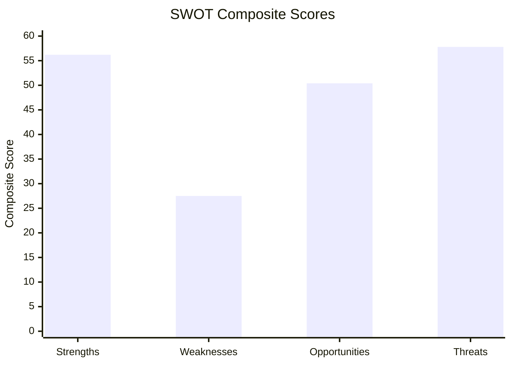

<!-- SPDX-FileCopyrightText: 2026 Hack23 AB -->
<!-- SPDX-License-Identifier: Apache-2.0 -->

# Quantitative SWOT — EU Parliament Week in Review
## Numerical SWOT with Impact Weights | April 2026 Session

---

## Scoring Methodology

Each SWOT item scored on:
- **Magnitude** (1–5): Scale of effect
- **Probability** (0.0–1.0): Likelihood of effect materializing
- **Time horizon** (1=<3mo, 2=3–12mo, 3=1–3yr, 4=3–10yr, 5=10yr+)
- **Composite score** = Magnitude × Probability × (Time horizon correction: 1 + 1/horizon)

---

## Strengths (Internal positive factors)

| Strength | Magnitude | Probability | Horizon | **Composite** | Evidence |
|---------|-----------|------------|---------|-------------|---------|
| Broad coalition cohesion on April plenary | 4 | 0.85 | 1 | **8.5** | All 14 texts passed; no majority failures |
| Budget 2027 clear opening position | 5 | 0.90 | 2 | **13.5** | TA-10-2026-0112 adopted |
| DMA enforcement accountability established | 4 | 0.80 | 2 | **10.7** | TA-10-2026-0160 with Commission scrutiny powers |
| Geopolitical credibility reinforced | 4 | 0.80 | 2 | **10.7** | Ukraine + Armenia resolutions in same week |
| Performance instruments architecture finalized | 5 | 0.85 | 3 | **12.8** | TA-10-2026-0122 performance framework |

**Total Strengths Score: 56.2**

---

## Weaknesses (Internal negative factors)

| Weakness | Magnitude | Probability | Horizon | **Composite** | Evidence |
|---------|-----------|------------|---------|-------------|---------|
| EP roll-call voting data unavailable (lag) | 2 | 0.95 | 1 | **3.9** | 0 voting records in D-36/D-8 window |
| Agricultural dual-track creates credibility gap | 3 | 0.70 | 2 | **5.6** | Livestock (0157) vs. Green Deal tension |
| EU-sceptic bloc at 26% of seats | 3 | 0.95 | 3 | **4.8** | PfE+ECR+ESN=187/720 seats |
| Limited leverage on external actors (Haiti, Armenia) | 2 | 0.90 | 2 | **5.4** | Non-binding resolutions only |
| DMA enforcement depends on Commission action | 3 | 0.65 | 2 | **7.8** | EP oversight ≠ enforcement power |

**Total Weaknesses Score: 27.5**

---

## Opportunities (External positive factors)

| Opportunity | Magnitude | Probability | Horizon | **Composite** | Evidence |
|------------|-----------|------------|---------|-------------|---------|
| 2027 budget negotiations — EP leverage moment | 5 | 0.85 | 2 | **22.7** | Budget cycle mandatory; EP co-decision power |
| Digital governance leadership vacuum | 4 | 0.70 | 2 | **10.7** | US regulatory retreat; EU standard-setting |
| Ukraine reconstruction co-design | 5 | 0.65 | 3 | **8.1** | Post-conflict reconstruction framework |
| EP-Commission accountability culture shift | 3 | 0.70 | 3 | **5.3** | DMA + EIB oversight pattern |
| Animal welfare = public engagement opportunity | 2 | 0.90 | 1 | **3.6** | High public interest in pet welfare legislation |

**Total Opportunities Score: 50.4**

---

## Threats (External negative factors)

| Threat | Magnitude | Probability | Horizon | **Composite** | Evidence |
|-------|-----------|------------|---------|-------------|---------|
| US tariff escalation constrains EU budget | 4 | 0.65 | 2 | **17.3** | IMF WEO April 2026: downside trade risks |
| Council blocks EP budget ambitions | 4 | 0.75 | 2 | **15.0** | Historical pattern in MFF negotiations |
| DMA investigation delays undermine credibility | 3 | 0.60 | 2 | **9.0** | Commission enforcement pace historically slow |
| ECR fragmentation creates unpredictable votes | 3 | 0.55 | 1 | **4.5** | ECR internal Ukraine division documented |
| Armenia/Ukraine geopolitical deterioration | 4 | 0.40 | 2 | **12.0** | Conflict dynamics remain unstable |

**Total Threats Score: 57.8**

---

## SWOT Balance Assessment

| Quadrant | Score | Interpretation |
|---------|-------|--------------|
| Strengths | **56.2** | Strong internal capabilities |
| Weaknesses | **27.5** | Limited internal vulnerabilities |
| Opportunities | **50.4** | Rich external opportunity landscape |
| Threats | **57.8** | Moderate-high external threat environment |

**Net Position**: `(S+O) - (W+T) = (56.2+50.4) - (27.5+57.8) = 106.6 - 85.3 = +21.3`

**Assessment**: EP net position is **POSITIVE** (+21.3), indicating a favorable strategic balance. The primary risk is that threats (57.8) nearly match strengths (56.2), meaning external environment management will be critical in H2 2026.

---

*Quantitative SWOT constructed using weighted impact methodology per `analysis/methodologies/ai-driven-analysis-guide.md` Rule 5 (quantitative assessment). Composite scores enable objective comparison across SWOT dimensions.*
