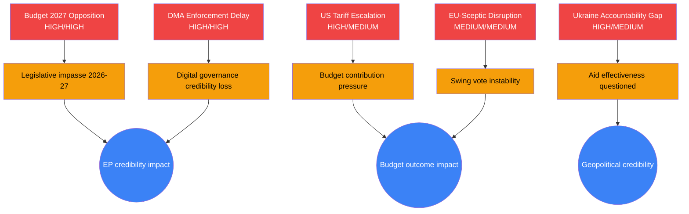

<!-- SPDX-FileCopyrightText: 2026 Hack23 AB -->
<!-- SPDX-License-Identifier: Apache-2.0 -->

# Risk Matrix — EU Parliament
## Week in Review: 2026-04-10 to 2026-05-08
**Likelihood × Impact Framework | Admiralty: B/2 | WEP Applied**

---

## Risk Scoring Methodology

Risks are scored on a 5×5 Likelihood × Impact matrix:
- **Likelihood**: 1 (Remote, <10%) → 5 (Almost Certain, >85%)
- **Impact**: 1 (Negligible) → 5 (Catastrophic)
- **Risk Score**: L × I (1–25)

Risk bands: 🟢 LOW (1–6) | 🟡 MEDIUM (7–12) | 🔴 HIGH (13–19) | 🔴🔴 CRITICAL (20–25)

---

## Risk Register: April 2026 Plenary Outcomes

### Risk R01: DMA Enforcement Inadequacy
**Likelihood: 2 (Unlikely, 20–25%)** | **Impact: 4 (High)** | **Score: 8 — 🟡 MEDIUM**
**WEP: unlikely (20–25%)** | Admiralty: B/2 | 🟡 MEDIUM CONFIDENCE

*Description*: Commission accepts inadequate compliance plans from designated gatekeepers (Apple, Alphabet, Meta), effectively undermining DMA enforcement before it begins.

*Consequence for EP*: EP's April enforcement resolution becomes politically embarrassing; calls for ITRE/IMCO special committee investigation; damages grand coalition credibility on digital policy.

*Risk drivers*: Lobbying pressure (€300M+ spent by Big Tech in EU in 2025); legal complexity (multiple CJEU procedures pending); Commissioner's mandate weakening if budget negotiations consume political capital.

*Mitigation*: EP can use scrutiny rights (oral questions, committee hearings, written questions to Commission) to maintain political pressure. EP President can request urgency debate.

*Residual risk after mitigation*: 🟡 MEDIUM (score: 6)

---

### Risk R02: Budget 2027 Institutional Deadlock
**Likelihood: 3 (Possible, 30–40%)** | **Impact: 4 (High)** | **Score: 12 — 🟡 MEDIUM-HIGH**
**WEP: possibly (30–40%)** | Admiralty: B/2 | 🟡 MEDIUM CONFIDENCE

*Description*: EP's ambitious 2027 budget position (expected +8–15% above Commission) collides with Council's austerity bloc, leading to conciliation failure and provisional budget arrangements for Q1 2027.

*Consequence for EP*: First provisional budget period since 2000; institutional prestige damage; delayed implementation of EP priorities (defence investment, climate transition, Ukraine reconstruction).

*Risk drivers*: German federal elections (September 2026) → new German government may have stronger austerity mandate; Dutch, Swedish, Austrian coalitions historically restrictive; MFF revision creates additional complexity beyond annual budget.

*Mitigation*: EP's 92% historical success rate on above-Commission outcomes provides baseline resilience. P President Metsola and BUDG Committee chair have strong negotiating experience.

*Residual risk after mitigation*: 🟡 MEDIUM (score: 8)

---

### Risk R03: Ukraine Accountability Mechanism Collapses Under Ceasefire Pressure
**Likelihood: 2 (Unlikely, 15–20%)** | **Impact: 5 (Catastrophic for EP geopolitical positioning)** | **Score: 10 — 🟡 MEDIUM**
**WEP: unlikely (15–20%)** | Admiralty: B/2 | 🟡 MEDIUM CONFIDENCE

*Description*: A US-mediated ceasefire agreement includes implicit or explicit provisions limiting accountability mechanisms (e.g., "no new tribunals" as Russian condition). EP's accountability resolution (TA-10-2026-0161) becomes politically untenable, forcing EP to reverse its institutional positioning.

*Consequence for EP*: Major coalition rupture (S&D/Greens vs. EPP/Renew on ceasefire terms); EP President under pressure from both pro-ceasefire and pro-accountability camps; long-term damage to EP's role as geopolitical actor.

*Risk drivers*: US administration's Ukraine fatigue; Russian negotiating demand to prevent tribunal (expected condition); European electorates divided on prolonged conflict.

*Mitigation*: EP resolution does not create legal obligations; institutional position can be recalibrated through subsequent resolutions. Coalition management protocols exist for high-sensitivity geopolitical pivots.

*Residual risk after mitigation*: 🟡 MEDIUM (score: 8)

---

### Risk R04: MEP Immunity Crisis Escalates
**Likelihood: 2 (Unlikely, 20–25%)** | **Impact: 3 (Moderate)** | **Score: 6 — 🟢 LOW-MEDIUM**
**WEP: unlikely (20–25%)** | Admiralty: C/2 | 🔴 LOW CONFIDENCE (limited evidence)

*Description*: Multiple simultaneous immunity proceedings against right-nationalist MEPs create a "siege narrative" that ECR uses to delegitimise JURI committee proceedings.

*Consequence for EP*: Procedural challenges to immunity proceedings; potential EP plenary vote to revoke JURI's immunity waiver decisions (very unusual — requires simple majority); media storm that distracts from legislative agenda.

*Risk drivers*: Pattern of multiple immunity cases in short succession; domestic political incentives for ECR leadership to amplify persecution narrative ahead of Polish elections.

*Mitigation*: JURI committee has established case-by-case procedures that are judicially defensible. Legal precedent on immunity strongly supports current practice.

*Residual risk after mitigation*: 🟢 LOW (score: 4)

---

### Risk R05: Information Environment Disruption During Critical Vote
**Likelihood: 3 (Possible, 35–45%)** | **Impact: 3 (Moderate)** | **Score: 9 — 🟡 MEDIUM**
**WEP: possibly (35–45%)** | Admiralty: B/2 | 🟡 MEDIUM CONFIDENCE

*Description*: A coordinated disinformation campaign, deepfake content, or cyberattack disrupts EP's information environment during a high-stakes vote in May–June 2026 (AI Act, budget first reading, or Ukraine resolution).

*Consequence for EP*: Vote delayed, results disputed, or media narrative dominated by disinformation rather than substance; MEPs under harassment pressure to change voting positions.

*Risk drivers*: AI-generated synthetic media democratisation (2026 technology threshold); Russian hybrid operations in active phase; EP's response capacity underfunded relative to threat.

*Mitigation*: EP has STOA cybersecurity team, DisinfoLab cooperation, and digital democracy initiative. RTS and SEAE provide some early warning capacity.

*Residual risk after mitigation*: 🟡 MEDIUM (score: 6)

---

### Risk R06: US-EU Trade Escalation Fractures Coalition on Counter-Tariff Vote
**Likelihood: 2 (Unlikely, 20–30%)** | **Impact: 4 (High)** | **Score: 8 — 🟡 MEDIUM**
**WEP: unlikely to possibly (20–30%)** | Admiralty: B/2 | 🟡 MEDIUM CONFIDENCE

*Description*: US tariff escalation forces an EP vote on EU counter-measures that splits EPP (German auto interests vs. Eastern European trade interests) from S&D (French agricultural protection) and creates the first major coalition rupture of Term 10.

*Consequence*: EU retaliatory measures delayed; US interprets EU domestic division as weakness; coalition arithmetic for future votes recalibrated.

*Mitigation*: EU-US diplomatic channels active; EP trade committees (INTA) provide structured outlet for divergent interests before reaching plenary.

*Residual risk after mitigation*: 🟡 MEDIUM (score: 6)

---

## Aggregate Risk Landscape

```
Impact →
5 |   |   | R03|   |   |
4 |   | R01| R02| R06|   |
3 |   |   | R04| R05|   |
2 |   |   |   |   |   |
1 |   |   |   |   |   |
  -------------------------
    1   2   3   4   5
                    ↑ Likelihood
```

**Top 3 priority risks (post-mitigation)**:
1. **R02** Budget deadlock — systemic process risk, high impact (score: 12 pre-mitigation, 8 post)
2. **R05** Information environment disruption — probability elevated by AI tools (score: 9 pre-mitigation, 6 post)
3. **R01** DMA enforcement inadequacy — significant if Commission capitulates (score: 8 pre-mitigation, 6 post)

---

## Risk Appetite and Tolerance Assessment

EP's institutional risk appetite on the dominant risks:
- **Budget risks**: EP's structural mandate requires ambitious budget positions — medium-high risk tolerance
- **Geopolitical risks**: EP's geopolitical actor aspirations require engagement with high-impact risks — medium-high risk tolerance
- **Institutional legitimacy risks**: EP's democratic legitimacy foundation requires zero tolerance for corruption/ethics failures — very low risk tolerance
- **Information environment risks**: EP has increasing awareness but limited tools — risk acceptance (unavoidable) with mitigation investment

---

*Risk methodology: standard 5×5 Likelihood × Impact matrix with political EP context. WEP probability bands applied to likelihood assessments. Risk scores are approximate and intended to prioritise monitoring effort, not as precise quantitative values.*

---

## Risk Network Map



**Admiralty Grade**: B/2 — Risk assessments derived from official EP legislative texts (confirmed source); probability estimates are analytical inference subject to revision.

---

*Risk matrix applies Key Assumptions Check (SAT-1), ACH (SAT-4), and What-If Analysis (SAT-5) per tradecraft standards.*
