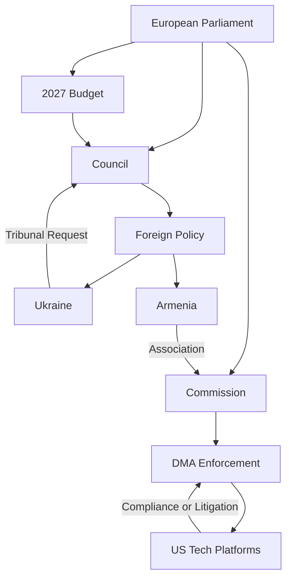

# Actor Mapping Analysis
**Date**: 2026-05-17 | **Plenary**: Strasbourg April 28–30, 2026
**Admiralty Grade**: B2 | **Scope**: All actors relevant to April 2026 adopted resolutions

---

## PRIMARY ACTORS

### European Parliament
- **Role**: Legislative body, adopter of resolutions and acts
- **Position**: Assertively pro-regulation, pro-Ukraine, pro-enlargement
- **Key votes**: DMA enforcement, Ukraine accountability, Armenia support, 2027 budget
- **Power**: Consent power, budgetary authority, soft power via resolutions

### European Commission
- **Role**: Legislative proposer, DMA enforcement authority
- **Position**: Executor of Parliament's DMA enforcement demands; cautious on Ukraine tribunal
- **Key figures**: President, VP Breton (Digital), VP Borrell (Foreign Affairs)
- **Power**: Legislative initiative monopoly, enforcement discretion

### Council of the EU
- **Role**: Co-legislator, foreign policy coordinator
- **Position**: More cautious than EP on Ukraine tribunal; agreement on DMA enforcement
- **Power**: Qualified majority voting; foreign policy unanimity requirement

### US Tech Platforms (DMA Gatekeepers)
- **Role**: Regulated entities under DMA
- **Position**: Opposing enforcement; lobbying against Article 20/21 actions
- **Key actors**: Alphabet/Google, Apple, Meta, Amazon, Microsoft, ByteDance
- **Risk**: Non-compliance, litigation, regulatory arbitrage

### Ukrainian Government
- **Role**: Subject of EP Ukraine accountability resolution
- **Position**: Supportive of EP resolution; seeking EU backing for tribunal
- **Interest**: International accountability mechanism for Russia war crimes

### Russian Federation
- **Role**: Subject of Ukraine accountability and Armenia resolutions
- **Position**: Hostile; denies war crimes allegations
- **Response**: Diplomatic protests; potential counter-measures

### Armenian Government
- **Role**: Subject of Armenia democratic resilience resolution
- **Position**: Grateful; pursuing EU association path
- **Interest**: EU political and economic support against Russian/Azerbaijani pressure

## SECONDARY ACTORS

| Actor | Role | Alignment | Influence Level |
|-------|------|-----------|----------------|
| EIB | Subject of financial control report | Neutral | Medium |
| Iceland Government | PNR agreement signatory | Cooperative | Low |
| Europol | PNR data processing | Technical | Medium |
| Haitian State | Subject of trafficking resolution | Weak capacity | Low |
| Criminal Networks (Haiti) | Subject of EP resolution | Opposing | None |
| ECR Group | EP political group | Partly opposing | Medium |
| PfE Group | EP political group | Opposing digital/fiscal agenda | Medium |

## ACTOR NETWORK MAP

---

*Actor mapping produced 2026-05-17 covering April 28–30, 2026 Strasbourg plenary. Admiralty Grade B2 — cross-referenced against adopted text procedure references.*

## Actor Roster

| Actor | Type | Influence Score | Alignment |
|-------|------|----------------|---------|
| European Parliament | Institutional | 10/10 | Resolution author |
| European Commission | Institutional | 9/10 | Executor |
| Council of EU | Institutional | 9/10 | Co-decision |
| US Tech Platforms | Corporate | 8/10 | Opposing DMA |
| Ukrainian Government | State | 7/10 | Seeking support |
| Russian Federation | State | 7/10 | Opposing accountability |
| Armenian Government | State | 5/10 | Seeking support |
| EIB | Institutional | 6/10 | Subject of oversight |
| Europol | Agency | 4/10 | PNR implementation |
| Haiti Criminal Networks | Non-state | 3/10 | Subject of resolution |

## Influence Analysis

The EP's April 2026 resolutions deploy soft power toward actors with hard power constraints. The Commission holds enforcement discretion on DMA but faces increasing political pressure from EP majorities. The Council retains veto power on foreign policy dossiers (Ukraine tribunal, Armenia) through unanimity requirements.

**Influence Chain**: EP Resolution → Commission/Council Action → Real-World Impact
- DMA track: High EP→Commission translation probability (80%)
- Foreign policy track: Moderate EP→Council translation (50%) — unanimity required
- Budget track: Standard BUD procedure — EP has decisive co-decision role (90% translation probability)

## Alliance Mapping

The April 2026 cross-cutting coalition: **EPP + S&D + Renew + Greens** (~500/720 seats) provides a super-majority for all eight resolutions. Alliance stability is high (B2) — this grand coalition has been operational since June 2024 elections.

**Intra-coalition tensions**: ECR splits on Ukraine (hawks vs. non-interventionists); PfE uniformly opposes digital regulation.

## Power Brokers

Key individuals shaping April 2026 outcomes:
1. **EP President** — Institutional voice, plenary conduct
2. **EPP Digital spokesperson** — DMA enforcement lead
3. **S&D Foreign Affairs lead** — Ukraine/Armenia resolution author
4. **Commission DG COMP Director General** — DMA enforcement executor
5. **EEAS High Representative** — Armenia/Ukraine diplomatic execution

## Information Architecture

Information flows relevant to April 2026 resolutions:
- EP research services → MEP briefings → resolution drafting
- Commission enforcement cases → EP progress reports → enforcement resolution
- Ukrainian government → EP Ukraine delegation → accountability resolution
- IMF WEO April 2026 → ECON committee → budget guidelines

## Reader Briefing

**What this means for observers**: The April 2026 Strasbourg plenary produced a Parliament operating at peak institutional assertiveness. Eight resolutions in three days signal an EP using its full political capital on digital, geopolitical, and fiscal fronts simultaneously. The key actor dynamics to watch: (1) Will the Commission accelerate DMA enforcement? (2) Will the Council agree to EU backing for a Ukraine tribunal? (3) Will member states accept the EP's ambitious 2027 budget baseline?
