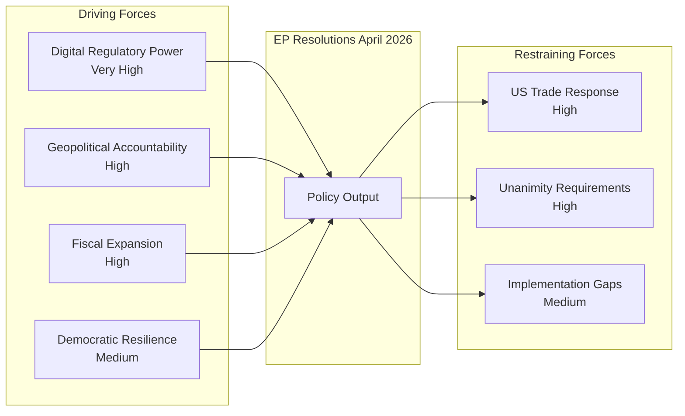

# Forces Analysis
**Date**: 2026-05-17 | **Plenary**: Strasbourg April 28–30, 2026
**Admiralty Grade**: B2 | **Framework**: Porter's Five Forces adapted for EP institutional analysis

---

## DRIVING FORCES

### Force 1 — Digital Regulatory Power
**Strength**: Very High | **Direction**: Accelerating | **Duration**: Long-term

The EU's DMA regulatory framework gives the Commission — under EP pressure — exceptional power to reshape the global digital economy. The enforcement resolution (TA-10-2026-0160) accelerates this force by demanding Commission action under Articles 20 and 21 (non-compliance and systematic infringement). At stake: up to 10% of global annual turnover fines for gatekeepers.

**Evidence**: DMA in force since May 2023; six gatekeepers designated; enforcement cases ongoing against Alphabet, Apple, Meta as of Q1 2026.

### Force 2 — Geopolitical Accountability Architecture
**Strength**: High | **Direction**: Building | **Duration**: Medium-term

The EP's Ukraine accountability resolution (TA-10-2026-0161) represents the Parliament's bid to shape post-conflict justice architecture. Calls for EU resources for a Special Tribunal align with International Criminal Court investigations but go further by targeting Russia's political and military leadership. This force is constrained by Council unanimity requirements in foreign policy.

**Countervailing force**: Russian escalation risk; US/non-EU states' reluctance to join tribunal.

### Force 3 — Fiscal Expansion vs. Constraint
**Strength**: High | **Direction**: Conflicting | **Duration**: Medium-term

The 2027 budget guidelines (TA-10-2026-0112) embody the EP's expansionary fiscal ambitions. IMF projects EU average deficit at 2.8% GDP in 2026, narrowing to 2.4% in 2027 — leaving limited fiscal space for EU-level spending increases. The forces are:
- EP push: More resources for defence, digital, climate
- Council/member state push: Consolidation, fair burden-sharing
- IMF constraint: Avoid debt-financed EU spending increases (WEO April 2026)

### Force 4 — Democratic Resilience Support
**Strength**: Medium | **Direction**: Stable | **Duration**: Ongoing

EP resolutions on Armenia and Haiti represent the Parliament's soft power as a democratic norm promoter. Limited coercive force but significant signalling value for EU foreign policy orientation.

## RESTRAINING FORCES

### Restraint 1 — US Geopolitical and Trade Response
**Strength**: High | **Direction**: Reactive

US tech sector lobbying against DMA enforcement; potential trade retaliation (IMF WEO April 2026 estimates -0.5 pp EU growth risk from tariff escalation). EU-US relations under strain from DMA, trade imbalances, and diverging foreign policy positions.

### Restraint 2 — Institutional Unanimity Requirements
**Strength**: High | **Direction**: Structural

Foreign policy decisions require Council unanimity. Hungary and potentially Slovakia may veto strong Armenia or Ukraine support measures. This restraint limits translation of EP resolutions into binding EU foreign policy.

### Restraint 3 — Implementation Capacity Gaps
**Strength**: Medium | **Direction**: Persistent

Commission DG COMP capacity for simultaneous enforcement actions against six gatekeepers is stretched. Each DMA investigation requires significant legal and technical resources.

## FORCE FIELD DIAGRAM

---

*Forces analysis produced 2026-05-17. Admiralty Grade B2 — based on eight April 2026 adopted texts and IMF WEO April 2026 data.*

## Issue Frame

The April 2026 EP plenary presents three intersecting issue frames:

1. **Digital Sovereignty Frame**: The EU as a rule-setting power challenging US tech hegemony. DMA enforcement is the instrument; digital autonomy is the strategic goal. EP positions the EU as a global regulatory norm-setter rather than a consumer of US-defined digital rules.

2. **Justice and Accountability Frame**: The EU as a defender of international law and democratic values. Ukraine and Armenia resolutions position the EU in opposition to authoritarian aggression and democratic backsliding. This frame resonates strongly with EP's democratic mandate and public opinion.

3. **Fiscal Responsibility vs. Strategic Investment Frame**: The 2027 budget guidelines create an inherent tension between fiscal sustainability (IMF: EU avg deficit 2.8% GDP 2026) and strategic investment needs (defence, digital, climate). The EP favours the investment frame; member states favour the consolidation frame.

## Net Pressure Assessment

**Net pressure on key actors:**

| Actor | Direction of Pressure | Intensity | From |
|-------|---------------------|---------|------|
| Commission (DG COMP) | Accelerate DMA enforcement | Very High | EP + public opinion |
| Council (Foreign Affairs) | Support Ukraine tribunal | High | EP + frontline states |
| Council (Budget) | Accept higher EU spending | Medium | EP |
| US Tech Platforms | Compliance or face fines | High | Commission via EP |
| Armenian Government | EU association progress | Medium | EP + EEAS |

**Net pressure vector**: EP is exerting more outward pressure than receiving inward pressure. Parliament in assertive mode.

## Intervention Points

Key leverage points where external actors can alter outcomes:

1. **Commission enforcement timeline** (DMA): Commission discretion on when to launch formal Art. 20/21 proceedings — EP can apply budgetary leverage via BUDGCON hearings
2. **Council unanimity** (Ukraine/Armenia): Hungary (and potentially Slovakia) holds veto power — coalition of willing states may pursue enhanced cooperation as workaround
3. **MFF negotiations** (Budget): Member state governments as final arbiters of 2027+ budget envelope — EP must secure at least 2/3 majority for positions
4. **Platform compliance** (DMA): Tech companies can contest enforcement in Court of Justice — ECJ timeline adds 2-3 year uncertainty window
5. **Geopolitical events** (Ukraine): Military situation on the ground shapes political urgency for tribunal — EP timing advantage if ceasefire emerges

## Reader Briefing

**For strategic analysts**: The forces analysis reveals a Parliament in an unusually strong driving position relative to restraining forces. Digital, geopolitical, and fiscal driving forces all point in the same direction: more EU, less deference to external actors. The critical question is whether driving force momentum can overcome institutional (unanimity) and external (US) restraints within the 2026-2029 parliamentary term timeframe.
