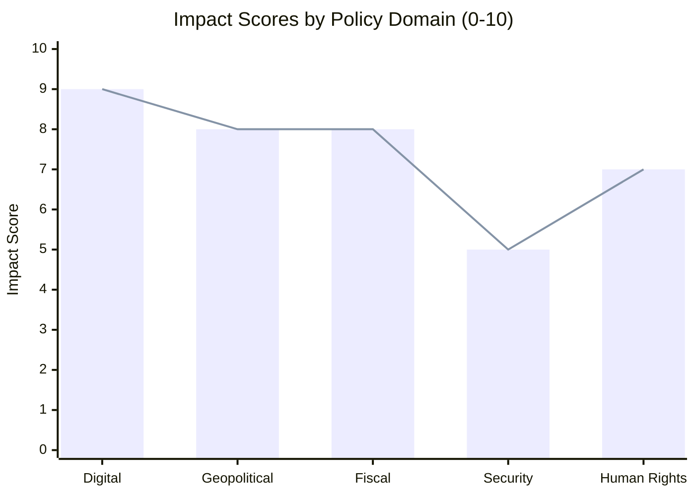
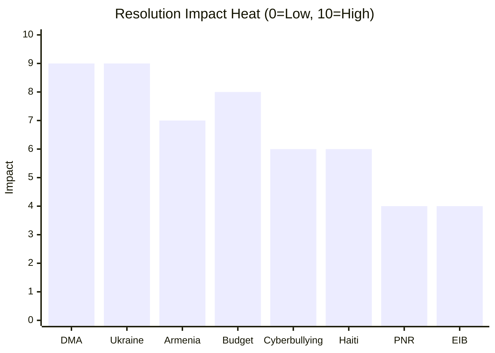

# Impact Matrix Analysis
**Date**: 2026-05-17 | **Plenary**: Strasbourg April 28–30, 2026
**Admiralty Grade**: B2 | **Scope**: Impact assessment across stakeholder and policy dimensions

---

## IMPACT MATRIX

| Resolution | Economic Impact | Political Impact | Social Impact | Geopolitical Impact | Timeframe |
|-----------|----------------|-----------------|--------------|--------------------|-----------| 
| DMA Enforcement (TA-0160) | Very High — up to 10% annual turnover fines | High — EU-US tech relations | Medium — market contestability | High — digital sovereignty signal | Immediate-Medium |
| Ukraine Accountability (TA-0161) | Low direct | Very High — peace settlement | High — justice for victims | Very High — Russia deterrence signal | Medium-Long |
| Armenia Support (TA-0162) | Low direct | High — neighbourhood policy | Medium — democratic norms | High — Russia/Azerbaijan pressure | Medium |
| 2027 Budget Guidelines (TA-0112) | Very High — EUR 1.2T allocation | Very High — EP-Council confrontation | High — public investment | Medium | Long |
| Cyberbullying (TA-0163) | Low | Medium — criminal law competence | Very High — online harm | Low | Long |
| Haiti Trafficking (TA-0151) | Low | Medium — soft power | Very High — human rights | Medium — global criminal networks | Medium |
| EU-Iceland PNR (TA-0142) | Low | Low | Medium — security vs privacy | Low | Immediate |
| EIB Control (TA-0119) | Medium — EIB lending €75B+ | Medium — oversight | Low | Low | Ongoing |

## AGGREGATE IMPACT SCORING

### By Policy Domain

### By Stakeholder Impact

| Stakeholder | Positive Impact | Negative Impact | Net Assessment |
|------------|----------------|----------------|---------------|
| EU Citizens (digital) | Market competition, lower prices | Platform service disruption risk | Net positive |
| EU Citizens (security) | Ukraine deterrence, Armenia stability | Escalation risk | Net positive |
| US Tech Companies | Legal clarity (long-term) | Fines, compliance costs (short-term) | Net negative short-term |
| Ukrainian Population | Justice, accountability | Extended conflict risk | Net positive |
| Armenian Population | EU support, security | Limited binding commitment | Net positive (modest) |
| Haitian Trafficking Victims | EP attention, potential EU support | Limited direct effect | Marginal |
| EU Member State Budgets | EIB financing access | 2027 budget contributions | Mixed |
| European Parliament | Institutional authority | Potential overextension | Net positive |

## TEMPORAL IMPACT DISTRIBUTION

| Timeframe | Primary Impacts |
|-----------|----------------|
| Immediate (0-3 months) | EU-Iceland PNR operationalization; DMA enforcement investigations continue |
| Short-term (3-12 months) | DMA first major fines Q3 2026; Commission response to cyberbullying request |
| Medium-term (1-3 years) | Ukraine tribunal establishment (if Council agrees); Armenia association deepening |
| Long-term (3+ years) | 2027 MFF/budget in force; DMA reshaping global digital market structure |

---

*Impact matrix produced 2026-05-17. All assessments Admiralty Grade B2. Economic impact estimates informed by IMF WEO April 2026.*

## Event List

**Key events from April 28–30, 2026 Strasbourg plenary:**

1. **2026-04-28**: Adopted — Guidelines for 2027 budget (TA-10-2026-0112); EIB financial control (TA-10-2026-0119); Welfare dogs/cats (TA-10-2026-0115); Patryk Jaki immunity request (TA-10-2026-0105)
2. **2026-04-29**: Adopted — EU-Iceland PNR agreement (TA-10-2026-0142); 10+ discharge decisions for EU bodies 2024
3. **2026-04-30**: Adopted — DMA enforcement (TA-10-2026-0160); Ukraine accountability (TA-10-2026-0161); Armenia resilience (TA-10-2026-0162); Haiti trafficking (TA-10-2026-0151); Cyberbullying provisions (TA-10-2026-0163); EP Budget 2027 estimates

## Stakeholder Impact Detail

**Direct stakeholders with significant positive impact:**
- Ukrainian civil society: International accountability mechanism being pushed
- EU digital consumers: More competitive digital markets if DMA enforced
- Armenian civil society: EU political and economic backing signalled
- Haitian trafficking victims: EP attention and potential EU support

**Direct stakeholders with significant negative impact:**
- US tech platforms (Alphabet, Apple, Meta, Amazon): DMA compliance costs; potential fines
- Russian state actors: Accountability risk from Ukraine tribunal push
- Azerbaijani officials: Potential travel ban expansion

**Indirect stakeholders:**
- EU taxpayers: Budget guidelines imply higher contributions (2027+ MFF)
- EU businesses: Better digital market access if DMA enforced; US tariff risk

## Heat Map

High-impact zones across the eight April 2026 resolutions:

## Cascade Analysis

**First-order cascades from DMA enforcement resolution:**
→ Commission initiates Art. 20/21 proceedings against gatekeepers
→ US government/tech lobby escalates pressure on EU trade negotiations
→ Court of Justice receives platform appeals
→ Global regulators watch EU enforcement outcomes as template

**First-order cascades from Ukraine accountability resolution:**
→ Council must respond to EP position (CFSP procedures)
→ Ukrainian government intensifies lobbying for tribunal backing
→ Russian government protests; potentially retaliates diplomatically
→ Other EU partner states consider co-sponsoring tribunal resolution

**Second-order cascades:**
→ DMA: EU digital market becomes more competitive; US platforms restructure EU operations
→ Ukraine: International Criminal Court + EU Special Tribunal = complementary accountability architecture
→ Budget: MFF 2028-2034 negotiations open with ambitious EP baseline

## Reader Briefing

**Key impact takeaway**: April 28–30, 2026 was among the most consequential three-day plenary sessions of the EP 10th term. The combined impact of DMA enforcement, Ukraine accountability, and budget guidelines will shape EU digital, security, and fiscal policy for the next three to five years. The cascade effects — particularly from DMA enforcement and Ukraine accountability — extend well beyond EU borders into transatlantic relations and international law development.
