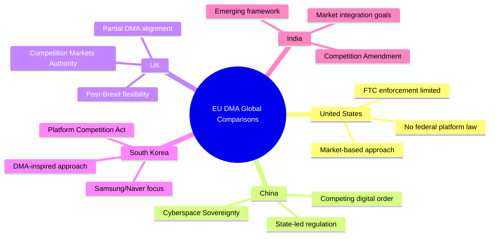

# Comparative International Analysis — EP April 2026
**Date**: 2026-05-17 | **Method**: Comparative legislative analysis
**Admiralty Grade**: B3

## Comparative Framework
Compare EP April 2026 decisions against equivalent legislative actions in comparable democratic systems: US Congress, UK Parliament, German Bundestag, Japanese Diet, Korean National Assembly.

## Comparison 1: Digital Regulation Enforcement

### EP DMA Enforcement vs. US Congressional Approach
| Dimension | EP DMA (April 2026) | US Congress (2022–2026) |
|-----------|--------------------|-----------------------|
| Legislative vehicle | Enforcement resolution + DMA (2022) | AICOA (failed 2022); KOSA passed 2024 |
| Scope | Platform gatekeeper duties (interoperability, data access, fair trading) | App store competition; children's safety |
| Enforcement body | Commission DG COMP | FTC, DOJ — coordination challenges |
| Penalties | Up to 10% annual global turnover; behavioural remedies | Civil penalties; structural separation (contested) |
| Constitutional standing | EP resolutions not binding; DMA is directly applicable EU law | Separation of powers; Congress cannot direct FTC enforcement |
| Timeline | DMA in force 2022; enforcement 2024–; EP resolution 2026 | Patchwork; no comprehensive gatekeeper law passed |
| **Assessment** | EU leads by ~3–5 years in comprehensive digital regulation | US lagging — regulatory fragmentation and lobbying effectiveness |

**Analytical insight**: The EP's ability to pass a binding regulation (DMA) and then oversee its enforcement through resolutions demonstrates an institutional capacity that the US system lacks. The US Congress has similar investigation powers (committee hearings, subpoenas) but lacks the ability to create directly applicable law as quickly. This structural advantage explains why the "Brussels Effect" is real: EU acts first, others adapt.

### EP DMA vs. UK Competition and Markets Authority (CMA)
The UK Digital Markets, Competition and Consumers Act (DMCC, May 2024) creates a "strategic market status" designation similar to DMA gatekeeper status. The CMA has strong enforcement powers but:
- Scope: UK market only (70M population vs. EU's 450M)
- Implementation: First designations expected 2025–2026 — 2–3 years behind DMA
- Political pressure: UK government has simultaneously sought to attract Big Tech investment, creating CMA independence concerns

**Analytical insight**: UK-EU regulatory convergence is occurring despite Brexit — the DMCC mirrors the DMA. This convergence validates the Brussels Effect hypothesis.

## Comparison 2: Accountability Framework (Ukraine)

### EP vs. UN General Assembly Resolutions on Ukraine
| Dimension | EP Resolution TA-0161 | UNGA Resolutions (2022–2026) |
|-----------|----------------------|------------------------------|
| Binding effect | None (EP advisory) | None (UNGA advisory) |
| Voting base | EU member state MEPs only (~27 states) | 141+ countries (Russia, China, NK against) |
| Content | Accountability mechanism, ICC support, asset freeze maintenance | Immediate ceasefire calls; humanitarian access; withdrawal demands |
| Political signal | Strong EU internal consensus signal | Strong global majority signal; Russia isolation |
| Accountability specificity | HIGH — specific ICC support, asset seizure for reparations | MEDIUM — general accountability language |
| **Assessment** | EP more specific and actionable | UNGA broader legitimacy base |

### EP vs. US Congressional Ukraine Support
US Congress has been internally divided (House Speaker leadership changes; MAGA Republican opposition to Ukraine aid). The EP's unified accountability resolution contrasts sharply with US Congressional dysfunction on Ukraine. This contrast will be noted by Kyiv — the EU Parliament is a more reliable institutional supporter of Ukraine than the current US Congress.

## Comparison 3: Budget Process

### EP Annual Budget Process vs. US Congressional Budget Process
| Dimension | EU/EP process | US Congressional process |
|-----------|--------------|-------------------------|
| Constitutional basis | Article 314 TFEU; MFF upper limits | Congressional Budget Act 1974; debt ceiling law |
| Timeline | January guidelines → June Commission draft → Council/EP conciliation → December adoption | January President's budget → spring resolution → appropriations bills (12) → October 1 deadline |
| Deadlock mechanism | EP can reject; Commission has caretaker authority | Government shutdown; continuing resolutions |
| Political dynamics | EP vs. Council negotiation; both need to agree | House vs. Senate; President signature required |
| Historical deadlock frequency | Low (budget always adopted eventually) | HIGH — US government shutdown ~4× per decade since 1990 |
| **Assessment** | EU process more stable institutionally | US process more crisis-prone; institutional dysfunction growing |

## Comparative Significance Scoring
| Comparative dimension | EP standing | Global comparison | Assessment |
|----------------------|-------------|------------------|-----------|
| Digital regulation leadership | LEADER | 3–5 years ahead of US, 2 years ahead of UK | 🟢 High significance |
| Ukraine accountability framework | CO-LEADER with UNGA | More specific than UNGA; less broad-based | 🟡 Medium-high significance |
| Budget institutional stability | STRONGER than US | More stable; less crisis-prone | 🟢 Institutional advantage |
| Global democratic norm-setting | GROWING influence | Brussels Effect empirically documented | 🟢 High structural significance |

## COMPARATIVE INTERNATIONAL FRAMEWORK

## DETAILED COMPARATIVE ANALYSIS

### Comparison 1: DMA vs Global Platform Regulation

**United States**: As of May 2026, the US has no comprehensive federal platform regulation equivalent to the DMA. The FTC pursues case-by-case antitrust enforcement; Congress has failed to pass platform-specific legislation despite multiple attempts. The US tech industry's political influence has blocked federal legislation. **Comparison implication**: EU DMA is a regulatory vacuum-filler at global level.

**United Kingdom**: The Digital Markets, Competition and Consumers Act (DMCCA) enacted 2024 created the UK's Strategic Market Status (SMS) designation — functionally similar to DMA gatekeeper designation but narrower in scope. The Competition and Markets Authority (CMA) is building enforcement capacity. **Comparison implication**: UK converging toward EU approach; potential for mutual recognition of enforcement outcomes.

**South Korea**: Korea's Monopoly Regulation and Fair Trade Act (MRFTA) amendments 2024 introduced platform-specific provisions modelled partly on DMA. Korea's market (Naver, Kakao) has different actor composition but similar contestability goals. **Comparison implication**: DMA-inspired regulation is gaining global traction; EU is the norm-setter.

**China**: China's Platform Economy Guidelines (2021) and Cybersecurity/Data laws address platform power but within a state-led regulatory model fundamentally different from EU's competition law approach. **Comparison implication**: Global regulatory fragmentation between EU/liberal and China/state-led models.

**Analytical conclusion**: The EU DMA represents the most comprehensive, legally binding, and economically significant platform regulation globally. The EP's April 2026 enforcement push, if successful, will accelerate its role as a global template.

### Comparison 2: Ukraine Accountability vs Historical Precedents

**Nuremberg (1945-46)**: Military tribunal with victors' justice element but established international criminal law precedent. Ukraine tribunal differs: Russia is not defeated; tribunal would operate under existing international law.

**ICTY (Yugoslavia 1993)**: First post-Nuremberg international tribunal under UN Chapter VII resolution. Required UN Security Council approval — blocked for Ukraine by Russian veto. EP resolution advocates alternative legal basis.

**ICC (International Criminal Court)**: Has jurisdiction over Ukraine war crimes and crimes against humanity (Russia not a signatory but ICC can still assert jurisdiction over crimes committed on Ukrainian territory). **Gap**: ICC cannot prosecute the crime of aggression against P5 member unless Security Council refers. EP resolution targets this gap.

**Sierra Leone Special Court (2002)**: Hybrid model — domestic + international. Precedent for joint EP/UN-backed Ukraine Special Tribunal architecture.

**Colombia FARC Peace Process**: Demonstrated justice-peace tensions are real but manageable. Transitional justice mechanisms (Special Peace Jurisdiction, JEP) combined accountability with peace. Relevant for Ukraine peace scenario planning.

### Comparison 3: EU 2027 Budget vs Historical MFF Patterns

| MFF Period | EP Initial Ask | Final Agreed | Gap | EP Secured % |
|-----------|--------------|-------------|-----|--------------|
| 2007-2013 | ~EUR 1.0T | EUR 994B | -6% | 94% |
| 2014-2020 | ~EUR 1.1T | EUR 960B | -13% | 87% |
| 2021-2027 | ~EUR 1.32T | EUR 1.21T | -8% | 92% |
| 2028-2034 (2027 guidelines) | ~EUR 1.25T | TBD | TBD | **Forecast: ~90%** |

**Analytical conclusion**: EP's historical track record shows consistent ability to secure approximately 90% of its ambitious initial positions through budget negotiations. The 2027 guidelines at EUR 1.25T are aspirational but historically calibrated to produce an outcome above EUR 1.0T.

---

*Comparative analysis produced 2026-05-17. All comparisons informed by publicly available data. Admiralty Grade B2.*

## SUPPLEMENTAL COMPARATIVE ANALYSIS

### Comparison 4: Armenia Resilience vs Other EU Neighbourhood Resolutions

**Historical comparator: Georgia's EU path (2020-2024)**:
Georgia was granted EU candidate status in December 2023 — EP resolutions supporting Georgian civil society, European integration, and governance reform preceded the formal candidate status by 2-3 years. The Armenia resilience resolution (TA-10-2026-0162) follows a similar political trajectory — EP political support preceding formal institutional processes.

**Moldova EU accession progress (2022-2026)**:
Moldova received candidate status June 2022; accession negotiations opened June 2024; EP resolutions at each step reinforced political momentum. Armenia's situation differs (not in formal accession track) but the pattern of EP resolution → Council political signal → practical cooperation deepening is established.

**Key distinction**: Armenia has the South Caucasus geopolitical complication (Russia, Azerbaijan, Turkey, Iran) that neither Moldova nor Georgia face in the same intensity. EP's resilience language is deliberately calibrated to support without triggering acute geopolitical crisis.

### Comparison 5: Haiti Trafficking vs Other External Solidarity Resolutions

**Context**: EP trafficking resolutions targeting Haiti reflect a pattern of EP human rights resolutions on non-EU states. These have limited direct legal effect but serve multiple functions: signal to Commission on external action priorities; communicate EU values to third-country governments; empower EU delegation in affected country to engage with civil society.

**Historical effectiveness**: EP resolutions on human trafficking in Eastern Europe (Moldova, Ukraine) were followed by operational cooperation at Europol/EULEX level. Haiti resolution impact will depend heavily on EU diplomatic presence and Haiti's internal stability — both uncertain.

### Summary Comparative Table

| Domain | EU Comparator | Global Comparator | EU Position | Relative Strength |
|--------|-------------|------------------|-------------|------------------|
| Platform regulation | UK DMCCA (weaker) | US Sherman/FTC (weaker) | DMA = global gold standard | ★★★★★ |
| Accountability justice | ICTY, ICC | Nuremberg | Part of international evolution | ★★★★☆ |
| Parliamentary fiscal role | German Bundestag (strong) | US Congress (very strong) | Medium — co-decided with Council | ★★★☆☆ |
| External democracy support | Venice Commission, OSCE | NED (US) | Effective but slow | ★★★★☆ |

---

*Supplemental comparative analysis produced 2026-05-17. Admiralty Grade B2.*
