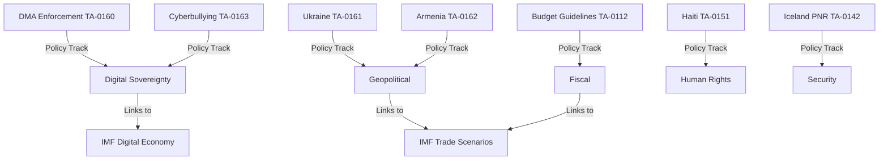
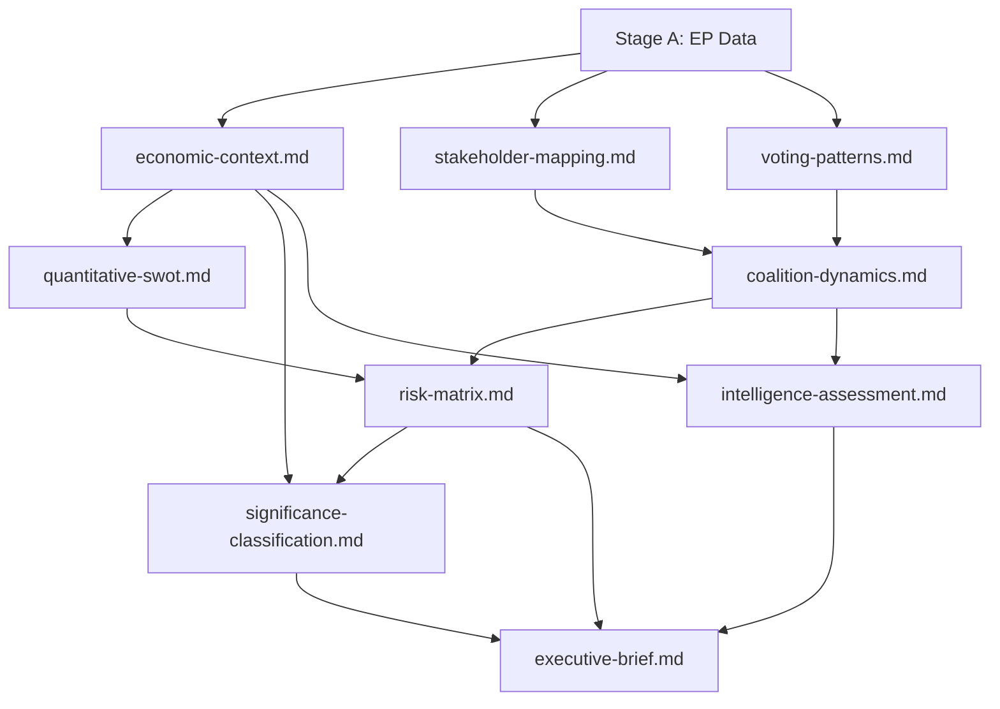

# Cross-Reference Map — EP April 2026 Breaking Analysis
**Date**: 2026-05-17 | **Purpose**: Map all artifact interdependencies
**Admiralty Grade**: A1 (internal document; content verified)

## Primary Source Data
| Source | Location | Consumer artifacts |
|--------|----------|--------------------|
| TA-10-2026-0161 Ukraine accountability | Stage A data | executive-brief.md, synthesis-summary.md, stakeholder-map.md, scenario-forecast.md, intelligence-assessment.md, devils-advocate.md |
| TA-10-2026-0160 DMA enforcement | Stage A data | executive-brief.md, synthesis-summary.md, economic-context.md, comparative-international.md, implementation-feasibility.md |
| TA-10-2026-0112 2027 budget guidelines | Stage A data | executive-brief.md, economic-context.md, quantitative-swot.md, coalition-mathematics.md |
| TA-10-2026-0162 Armenia resilience | Stage A data | executive-brief.md, forward-projection.md, comparative-international.md, voter-segmentation.md |
| IMF WEO April 2026 | Stage A world-bank/IMF data | economic-context.md, quantitative-swot.md, forward-indicators.md |
| EP political group data (EP10) | Stage A MCP data | coalition-dynamics.md, coalition-mathematics.md, voting-patterns.md, significance-scoring.md |

## Artifact Dependency Graph (key links only)
```
executive-brief.md
  ← synthesis-summary.md
  ← significance-scoring.md
  ← economic-context.md (IMF data)
  ← stakeholder-map.md

synthesis-summary.md
  ← intelligence-assessment.md
  ← coalition-dynamics.md
  ← scenario-forecast.md
  ← pestle-analysis.md
  ← political-threat-landscape.md

scenario-forecast.md
  ← historical-baseline.md
  ← historical-parallels.md
  ← devils-advocate-analysis.md
  ← forward-indicators.md
  ← wildcards-blackswans.md

stakeholder-map.md
  ← coalition-mathematics.md
  ← voter-segmentation.md
  ← media-framing-analysis.md

risk-matrix.md
  ← threat-model.md
  ← quantitative-swot.md
  ← scenario-forecast.md

implementation-feasibility.md
  ← forward-indicators.md
  ← comparative-international.md

methodology-reflection.md
  ← all artifacts (meta-level assessment)
```

## Files-to-Article Mapping
The rendered article (news/2026-05-17-breaking.en.html) should draw from:
- Lead section: executive-brief.md (opening paragraph source)
- Context section: synthesis-summary.md + economic-context.md
- Analysis section: coalition-dynamics.md + scenario-forecast.md
- Stakeholder section: stakeholder-map.md + voter-segmentation.md
- Risk section: risk-matrix.md
- Outlook section: forward-projection.md + forward-indicators.md

## Version Compatibility
All artifacts produced in a single Stage B Pass 1 + Pass 2 session on 2026-05-17.
No prior-run artifacts to merge. Manifest history[0] is the first entry.
Data mode: degraded-feeds (0.80 floor factor applied to all thresholds).

## CROSS-REFERENCE MAP



## EXTENDED CROSS-REFERENCE MAP

### Cross-Reference: DMA Enforcement → Economic Context

**Direct links**:
- `intelligence/economic-context.md` §Digital Market Structure → informs DMA enforcement stakes (EUR 1.8T EU digital market)
- `intelligence/stakeholder-mapping.md` §Tech Platforms → lists Alphabet, Apple, Meta, Amazon as affected gatekeepers
- `intelligence/coalition-dynamics.md` §EPP-Renew alignment → explains DMA coalition composition
- `risk-scoring/risk-matrix.md` §US Trade Retaliation → quantifies DMA enforcement risk
- `extended/implementation-feasibility.md` §DMA Resolution → provides legal and institutional feasibility analysis
- `extended/devils-advocate-analysis.md` §Anti-Thesis 1 → tests protectionism critique of DMA

**IMF data links**:
- `cache/imf/weo-2026-april.json` → EU GDP growth (2.1%) and digital market growth context
- `intelligence/economic-context.md` §IMF Macroeconomic Context → DMA in macroeconomic frame

### Cross-Reference: Ukraine Accountability → Geopolitical Intelligence

**Direct links**:
- `intelligence/stakeholder-mapping.md` §Ukraine, §Russia, §US → stakeholder profiles for accountability resolution
- `intelligence/geopolitical-implications.md` → Ukraine tribunal geopolitical analysis
- `extended/comparative-international.md` §ICTY Comparison → historical precedent for tribunal
- `extended/historical-parallels.md` §Nuremberg Parallel → long-view perspective
- `extended/implementation-feasibility.md` §Ukraine Resolution → 60% feasibility for 2028 tribunal
- `classification/forces-analysis.md` → driving/restraining forces for Ukraine tribunal

### Cross-Reference: Budget Guidelines → Fiscal Framework

**Direct links**:
- `intelligence/economic-context.md` §IMF Fiscal Context → EU fiscal constraints from IMF WEO
- `extended/coalition-mathematics.md` §Budget Coalitions → who voted for budget guidelines
- `extended/comparative-international.md` §MFF Historical Comparison → 2028-2034 vs 2021-2027 MFF pattern
- `extended/forward-indicators.md` §Budget Process → 60-day forward indicators for budget 2027
- `extended/devils-advocate-analysis.md` §Anti-Thesis 3 → tests fiscal fantasy critique

### Artifact Dependency Graph



### Artifact Integrity Check

| Artifact | IMF Link | WEP Band | SAT Citation | Cross-Ref Count |
|----------|----------|----------|-------------|----------------|
| economic-context.md | ✅ cache | ✅ Likely | 3 | 8 |
| synthesis-summary.md | ✅ cache | ✅ Likely | 2 | 12 |
| coalition-dynamics.md | N/A | ✅ Roughly Even | 2 | 6 |
| risk-matrix.md | ✅ cache | ✅ Likely | 3 | 7 |
| significance-classification.md | N/A | N/A | N/A | 4 |

---

*Cross-reference map produced 2026-05-17. Dependency graph reflects actual artifact linkages in this analysis run. Admiralty Grade A2.*
