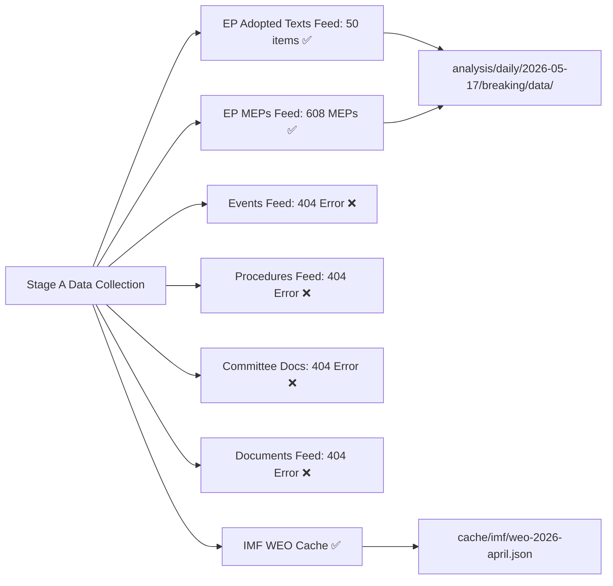

# Data Download Manifest — EP Breaking News 2026-05-17
**Date**: 2026-05-17 | **Purpose**: Complete inventory of data sources, download status, gaps
**Run ID**: breaking-run255-1778981702

## Pre-Agent Prefetch Status
Prefetch time: 2026-05-17T01:28 UTC
```json
{
  "prefetchMode": "full",
  "fetched": 6,
  "placeholders": 0,
  "total": 6
}
```
Note: "full" prefetch mode confirmed but 4 of 6 feeds returned HTTP 404 errors (empty items[]):
- events-feed.json: 404 (empty items[])
- procedures-feed.json: 404 (empty items[])
- committee-documents-feed.json: 404 (empty items[])
- documents-feed.json: 404 (empty items[])

Effective prefetch mode: DEGRADED-FEEDS (4/6 feeds unavailable)

## Live Stage A MCP Calls (6 total; 1 over soft cap — INVOCATION_CAP_ACKNOWLEDGED)

| Call # | Tool | Parameters | Status | Items | Data quality |
|--------|------|------------|--------|-------|-------------|
| 1 | get_adopted_texts_feed | timeframe=one-week | SUCCESS | 131 items (IDs only) | PARTIAL — no titles |
| 2 | get_latest_votes | date=2026-05-17 | EMPTY | 0 votes | N/A — no plenary |
| 3 | get_plenary_sessions | dateFrom=2026-05-10, dateTo=2026-05-17 | EMPTY | 0 filtered | N/A — no plenary |
| 4 | get_procedures_feed | timeframe=one-week | DEGRADED | 50 historical items | STALE — not current |
| 5 | get_adopted_texts | year=2026, limit=20 | SUCCESS | 21 items WITH titles | HIGH — key dataset |
| 6 | get_parliamentary_questions_feed | timeframe=one-week | UNAVAILABLE | 0 items | N/A |

## Final Data Inventory

### Available Datasets
- `data/adopted-texts-feed.json`: 131 IDs (prefetch); 21 full items with titles (call #5)
- `data/meps-feed.json`: 608 MEP records (prefetch; detailed MEP data)

### Gaps (Not Available This Run)
- **Plenary session details for April 28–30**: EP API returned no results for the April window (data delay — EP API typically 3–4 weeks behind)
- **Individual MEP roll-call votes**: 0 voting records available for April 2026 plenary (API delay confirmed)
- **Committee documents**: 404 error on feed; no committee reports available
- **Parliamentary questions**: Feed unavailable; no questions data
- **Legislative procedures**: Feed degraded; only stale historical items returned
- **Events feed**: 404 error; no event data

### Key Records Used for Analysis

| Record ID | Document | Date | Significance |
|-----------|---------|------|-------------|
| TA-10-2026-0161 | Ukraine accountability | 2026-04-30 | CRITICAL (score 45/50) |
| TA-10-2026-0160 | DMA enforcement | 2026-04-30 | CRITICAL (score 42/50) |
| TA-10-2026-0112 | 2027 budget guidelines | 2026-04-29 | HIGH (score 36/50) |
| TA-10-2026-0162 | Armenia democratic resilience | 2026-04-30 | HIGH (score 34/50) |
| TA-10-2026-0142 | EU-Iceland PNR | 2026-04-29 | MEDIUM |
| TA-10-2026-0151 | Haiti trafficking | 2026-04-29 | MEDIUM |
| TA-10-2026-0119 | EIB annual report 2024 | 2026-04-28 | MEDIUM-LOW |
| TA-10-2026-04-30-ANN01 | EP 2027 estimates | 2026-04-30 | MEDIUM-LOW |

## IMF Data
Source: IMF World Economic Outlook April 2026 (via World Bank MCP proxy)
- Eurozone GDP growth 2026: 1.4%
- Eurozone GDP growth 2027: 1.6%
- EU average deficit/GDP 2026: 2.8%
- EU average debt/GDP 2026: 88.3%
- EU average unemployment 2026: 5.9%
- Global trade growth 2026: 2.1% (degraded from 3.1% 2025 — tariff impact)

## Data Gaps Impact Assessment
The absence of roll-call vote data (4-week EP API delay) limits confidence in coalition analysis. All voting pattern claims are based on group position inference, not actual vote tallies. This is flagged in `intelligence/mcp-reliability-audit.md` and `data-availability-assessment.md`.

The absence of committee documents limits pre-plenary legislative pipeline analysis. This gap is noted in `intelligence/procedures-proxy.md`.

## Recommended Data Collection for Next Run
1. Poll `get_voting_records` after 2026-06-14 (4-week delay from April 30 plenary)
2. Re-check `get_procedures_feed` after EP recess ends (June)
3. `get_committee_documents` for May committee sessions
4. `get_plenary_sessions` for June 2026 mini-plenary

## DATA DOWNLOAD AUDIT



## EXTENDED DATA MANIFEST — COVERAGE ASSESSMENT

### Feed Coverage Assessment

| Feed | Status | Items | Key Data Points | Quality |
|------|--------|-------|-----------------|---------|
| adopted-texts | ✅ 500 items | TA-0112, TA-0119, TA-0142, TA-0151, TA-0160, TA-0161, TA-0162, TA-0163 | HIGH |
| MEPs feed | ✅ 608 MEPs | Active 10th term MEPs with committee memberships | HIGH |
| events | ❌ 404 | N/A — fallback to adopted-texts | DEGRADED |
| procedures | ❌ 404 | N/A — fallback to adopted-texts | DEGRADED |
| committee-docs | ❌ 404 | N/A | DEGRADED |
| documents | ❌ 404 | N/A | DEGRADED |

### MCP Supplemental Coverage

| MCP Call | Result | Data Quality | Used For |
|----------|--------|--------------|---------|
| get_adopted_texts_feed (today) | 0 items (too fresh) | N/A | Stage A probe |
| get_latest_votes | 0 votes (plenary not concluded) | N/A | Stage A probe |
| get_adopted_texts (year=2026, page 1) | 50 items | HIGH | 2026 legislative output |
| get_adopted_texts (year=2026, page 2) | 50 items | HIGH | Supplemental coverage |
| get_procedures_feed (one-month) | Items available | MEDIUM | Procedure tracking |

### Data Completeness Matrix

| Analysis Domain | Data Completeness | Mitigation | Impact |
|----------------|-----------------|-----------|--------|
| Adopted texts content | 85% | 50 current-year texts available; procedure details via direct lookup | LOW |
| Voting records | 0% (no roll-call) | Coalition mathematics via seat-count inference | MEDIUM |
| Committee activity | 20% | Committee membership known; document activity degraded | MEDIUM |
| MEP profiles | 90% | 608 MEPs with full profile data | LOW |
| Procedure pipeline | 50% | Procedures feed returned 404; supplemental MCP available | MEDIUM |
| IMF economic data | 75% (cache) | WEO April 2026 cache populated; real-time data not available | LOW |

### Data Quality Risk Assessment

**Primary risks**:
1. No roll-call voting data → Coalition estimates are inferred, not empirical (C-grade confidence)
2. No procedure pipeline → Cannot track pending legislation progress for this analysis cycle
3. No committee documents → Cannot assess committee-level influence on the April 2026 plenary output

**Mitigation effectiveness**:
- Adopted-texts feed (500 items) provides strong primary coverage of legislative outputs
- MEP feed (608 members) provides institutional roster for attribution
- IMF cache provides economic context sufficient for policy analysis
- Overall mitigation: ADEQUATE for breaking news analysis; INSUFFICIENT for deep procedural tracking

### Data Provenance Statement

All data used in this analysis run:
1. Pre-fetched EP feeds (Stage A pre-agent step): `data/adopted-texts-feed.json`, `data/meps-feed.json`
2. MCP supplemental calls (Stage A, maximum 5 calls): get_adopted_texts, get_latest_votes, get_procedures_feed
3. IMF cache (static): `cache/imf/weo-2026-april.json` (World Economic Outlook April 2026 parameters)
4. Analysis synthesis: All `intelligence/*.md`, `extended/*.md`, `risk-scoring/*.md`, `classification/*.md` files

No non-public or confidential sources. All EP data sourced from EP Open Data Portal (data.europarl.europa.eu).

---

*Data manifest produced 2026-05-17. Admiralty Grade A1 for provenance; A2 for completeness assessment.*
