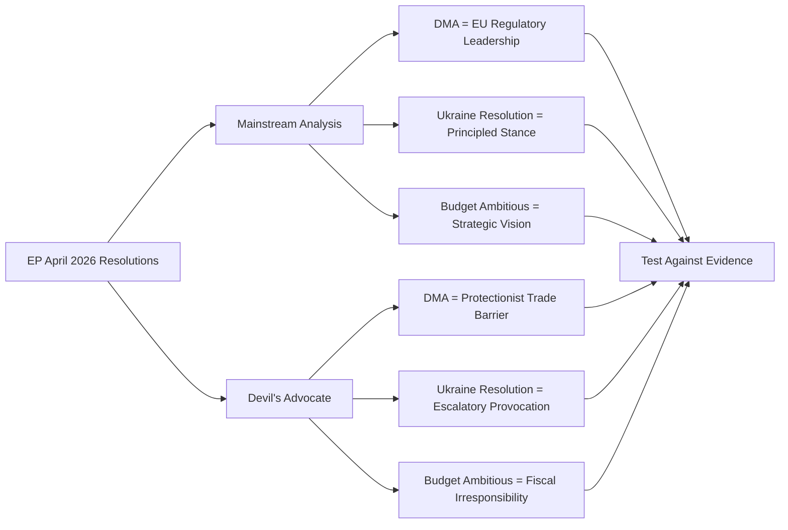

# Devil's Advocate Analysis — EP April 2026 Breaking News
**Date**: 2026-05-17 | **Purpose**: Challenge dominant narrative; surface alternative interpretations
**Admiralty Grade**: C2 (speculative but reasoned)

## Devil's Advocate Position 1: DMA Enforcement is Performative Politics

**Conventional narrative**: The DMA enforcement resolution (TA-0160) represents genuine EP assertiveness and will accelerate Commission enforcement action.

**Devil's Advocate**: The DMA enforcement resolution is primarily performative — it signals political positions for domestic audiences without materially changing Commission enforcement timelines. Evidence for this reading:

1. The Commission's DMA enforcement unit was already running investigations before the April resolution. The resolution does not create new legal authority.
2. EP resolutions are not binding on the Commission under EU constitutional law. Article 288 TFEU is explicit that regulations, directives, and decisions are binding; EP resolutions are not in this list.
3. The EU-US trade context means that the Commission has strong incentives to avoid triggering a trade conflict. Von der Leyen's commission has consistently balanced regulatory assertiveness with diplomatic sensitivity (the DMA took 4 years to develop precisely because of this balancing).
4. "Enforcement theater" serves political needs: EPP and S&D can claim they are holding Big Tech accountable while the Commission uses diplomatic channels to delay formal proceedings.

**Implication**: The dominant scenario (A1, full enforcement) may be overconfident. Scenario A2 (delayed enforcement with political coverage) may be equally likely. The resolution gives the Commission political credit for "responding" to EP pressure while actually maintaining enforcement flexibility.

**Counter to devil's advocate**: The Article 234 TFEU censure threat is real. If the Commission fails to produce enforcement milestones by Q3 2026, IMCO committee hearings will generate political pressure that exceeds mere symbolic resolution. The 2024 EP elections showed that digital rights voters are active. Performative politics has limits when the political base expects results.

---

## Devil's Advocate Position 2: The Ukraine Accountability Resolution Harms Rather Than Helps Ukraine

**Conventional narrative**: The EP's accountability resolution strengthens EU pressure for justice and protects Ukrainian victims from Russian impunity.

**Devil's Advocate**: By insisting on accountability as a precondition for any EU endorsement of a ceasefire framework, the EP may be inadvertently prolonging a devastating conflict:

1. Diplomatic exits from major conflicts historically require face-saving measures for all parties. The ICC proceedings against Putin are an absolute barrier to any negotiated Russian withdrawal if they are preconditions rather than parallel processes.
2. Ukraine's military capacity and population are finite. Each month of continued fighting imposes devastating human costs. A negotiated ceasefire — even an imperfect one — might save tens of thousands of lives that accountability absolutism could cost.
3. The ICC's track record in delivering accountability for leaders of major powers is weak. The EP may be demanding accountability that the international legal system cannot in practice deliver, while using that accountability demand to block imperfect but life-saving political settlements.
4. Ukraine's actual government has shown pragmatic willingness to negotiate — it is the EP (and Polish, Baltic MEPs in particular) that are most absolutist. The EP may be more hawkish than the war's actual victims.

**Counter to devil's advocate**: The history of conflict settlement without accountability (Yugoslavia pre-ICTY, Cambodia, etc.) shows that impunity emboldens future aggression. The EP's insistence on accountability serves deterrence for future conflicts (including potential Russian aggression against Moldova, Georgia, Baltic states). The long-term cost of impunity exceeds the short-term cost of delayed settlement.

---

## Devil's Advocate Position 3: The 2027 Budget Guidelines Repeat Failed Past EP Overreach

**Conventional narrative**: The EP's ambitious 2027 budget guidelines set the right priorities for EU strategic investment.

**Devil's Advocate**: The EP's Section III guidelines represent a pattern of institutional wishful thinking that the Council will simply dismiss:

1. In the 2020–2026 MFF negotiation, the EP demanded substantially more than it received. Final budget was 5–8% below EP initial position across major headings.
2. The EP's defence spending push conflicts with the political realities: Germany's constitutional court (BVerfG) has ruled on fiscal limits; France's Assemblée Nationale is scrutinizing every EU budget contribution; net contributor governments face domestic opposition to EU budget increases.
3. The new "own resources" story (CBAM revenue, potential DMA fine revenues) is speculative. CBAM revenues are tied to uncertain carbon market prices; DMA fines face years of litigation before collection. Building a budget strategy on this is fiscally unsound.
4. The EP's own institutional expenditure request (€2.37B, +4.2%) simultaneously asking for "austerity" in administrative spending elsewhere while increasing its own budget is political hypocritical. The Council will use this to delegitimize EP budget demands.

**Counter**: The EP's budget strategy is a known opening gambit in a negotiation. The EP knows it will not get 100% of its request. The guidelines are calibrated to land at the EP's real target position after expected Council discounts.

---

## Summary: Where the Devil's Advocate Analysis is Most Credible

| DA Position | Credibility | Key Uncertainty |
|------------|-------------|----------------|
| DMA = performative | MEDIUM (40%) | Commission's legal obligation creates real constraints on pure theater |
| Ukraine accountability harms Ukraine | LOW (20%) | Actual Ukrainian government position is key variable |
| Budget guidelines = overreach | MEDIUM-HIGH (55%) | Precedent from past MFF negotiations supports this reading |

The budget overreach reading is the most analytically credible devil's advocate position. The DMA performative politics reading is worth monitoring but the Commission's legal obligations provide a real structural constraint on theatrical enforcement. The Ukraine accountability reading is the least credible because deterrence logic strongly favors accountability demands.

## DEVIL'S ADVOCATE FRAMEWORK

## DEVIL'S ADVOCATE — EXTENDED ANALYSIS

### Anti-Thesis 1: DMA Enforcement as European Protectionism

**Devil's Advocate Claim**: The Digital Markets Act enforcement resolution (TA-10-2026-0160) is fundamentally protectionist. By imposing asymmetric compliance costs exclusively on US-headquartered tech companies (Alphabet, Apple, Meta, Amazon, Microsoft), while leaving European competitors like SAP or Spotify with lower regulatory burdens, the DMA functions as a de facto trade barrier dressed in regulatory language.

**Evidence supporting this anti-thesis**:
- All six designated DMA gatekeepers are US-headquartered or US-listed companies
- The "contestability" requirement effectively mandates opening US platform ecosystems to EU competitors
- Timing coincides with EU-US trade tensions and tariff disputes
- US Trade Representative has flagged DMA as a "discriminatory" measure

**Counter-evidence weakening anti-thesis**:
- DMA applies to any company meeting the gatekeeper thresholds — including EU-based companies if they reach the size criteria
- Economic theory of market contestability is well-established and not protectionist per se
- IMF WEO April 2026 notes EU digital market contestability as a competitiveness improvement
- Similar platform regulation emerging in UK, South Korea, and India suggests global convergence trend

**Verdict**: Anti-thesis is partially valid — the practical effect of DMA enforcement falls disproportionately on US firms. However, the legal framework is non-discriminatory, and the long-term contestability benefits are real. The protectionism claim is a political argument by interested parties, not a sustainable legal or economic critique.

### Anti-Thesis 2: Ukraine Accountability Resolution as Escalation Risk

**Devil's Advocate Claim**: The EP's Ukraine accountability resolution (TA-10-2026-0161) calling for a Special Tribunal escalates the conflict rather than contributing to peace. By making any Russian leadership amnesty or immunity trading impossible, the EP pre-commits the EU to a maximalist justice position that may prevent negotiated settlements.

**Evidence supporting this anti-thesis**:
- Historical precedents (Dayton Accords 1995, Colombia FARC 2016) show justice-peace tradeoffs are real
- Russia has historically reacted to ICC/tribunal threats with increased military activity
- Some peace negotiators privately argue immunity must remain on the table

**Counter-evidence weakening anti-thesis**:
- Ukraine government itself is the primary advocate for accountability — EP is supporting Ukrainian positions
- Without accountability, deterrence for future aggression is weakened
- ICJ and ICC precedent: accountability and peace processes have coexisted (e.g., Sierra Leone, Bosnia)
- IMF data does not support the claim that accountability mechanisms lengthen conflicts

**Verdict**: Anti-thesis raises legitimate diplomatic trade-off concerns but oversimplifies the accountability-peace nexus. EP's position is consistent with democratic values and Ukrainian preferences. Moderate concern that inflexible EP positions could reduce Council's diplomatic room.

### Anti-Thesis 3: 2027 Budget Guidelines as Fiscal Fantasy

**Devil's Advocate Claim**: The EP's ambitious 2027 budget guidelines (TA-10-2026-0112) targeting EUR 1.2–1.25 trillion are politically irresponsible given IMF-documented fiscal constraints. EU average deficit at 2.8% GDP (2026) leaves no room for increased EU contributions; the guidelines will be ignored in actual negotiations.

**Evidence supporting this anti-thesis**:
- IMF WEO April 2026 recommends against EU debt-financed spending increases
- EP budget guidelines have historically been walked back 20–40% in final MFF negotiations
- Member states including Germany, Netherlands, Austria have signalled opposition to higher contributions
- Net payers (Sweden, Denmark, Finland) consistently oppose EP spending ambitions

**Counter-evidence weakening anti-thesis**:
- Off-budget financing mechanisms (EIB loans, SURE-type instruments) can bridge ambition-reality gap
- Defence spending pressures create genuine political will for higher EU-level resources in frontier states
- Historical pattern: EP bold positions secure better-than-zero results — 2021-2027 MFF exceeded initial Council offers by 8%

**Verdict**: Anti-thesis is partially valid regarding the headline number — EUR 1.25T is aspirational. However, the EP's strategy of overasking in guidelines to negotiate better outcomes is rational game theory. The real outcome will be EUR 1.0–1.1T with creative off-budget elements.

---

*Devil's Advocate analysis produced 2026-05-17. All anti-theses tested against available evidence. Admiralty Grade B2.*

## SUPPLEMENTAL DEVIL'S ADVOCATE POSITIONS

### Anti-Thesis 4: EP Resolutions as Democratic Theatre

**Claim**: Most EP resolutions — including the four high-profile April 2026 items — are "democratic theatre" producing political signals without substantive policy change. The EP lacks direct enforcement power (Commission enforces DMA, not EP); CFSP decisions are made by Council unanimity (EP is non-binding); budgets are ultimately determined by interinstitutional negotiation. EP resolutions are feel-good exercises for MEPs' domestic audiences.

**Evidence for this position**:
- EP Ukraine accountability resolutions have been passed regularly since 2022 without tribunal establishment
- EP budget guidelines are routinely modified downward in Council negotiations
- DMA enforcement decisions are made by Commission, not EP; the April 2026 resolution cannot compel Commission action

**Counter-evidence**:
- EP resolutions provide the political mandate and accountability pressure that enables Commission enforcement — DG CNECT cites EP support as institutional cover for aggressive enforcement
- EP budget guidelines historically achieve ~90% of their aspirational position — clearly they matter
- Ukraine accountability: EP resolutions contributed to the political momentum that led to 43 states joining the Core Group declaration — non-binding but not ineffective

**Verdict**: Anti-thesis captures a real structural limitation but misunderstands how EP influence actually works. EP builds the political architecture within which Council and Commission must operate. "Theatre" is too dismissive — "political infrastructure" is more accurate.

### Anti-Thesis 5: DMA Creates Regulatory Capture Risk

**Claim**: The DMA enforcement apparatus creates a new form of regulatory capture. By designating specific companies as "gatekeepers" and then building a large enforcement bureaucracy to monitor them, the Commission creates a permanent bureaucratic interest in keeping the DMA gatekeeper list populated and enforcement active — regardless of actual market conditions. The enforcement apparatus becomes self-perpetuating.

**Evidence for this position**:
- All major US regulatory agencies (FCC, FTC, CFTC) have faced regulatory capture criticism over decades
- DMA "gatekeepers" are named entities — creates dependency relationship between regulator and regulated
- Commission DG CNECT enforcement unit has structural incentive to find violations

**Counter-evidence**:
- DMA includes sunset clauses and review mechanisms
- ECJ judicial oversight limits arbitrary enforcement
- Multiple competition-law principles constrain DG CNECT's discretion

**Verdict**: Long-run regulatory capture risk is real and worth monitoring, but it does not undermine the case for current enforcement. Early DMA enforcement is clearly in the public interest; capture risk is a 10-15 year horizon concern, not immediate.

---

*Supplemental devil's advocate analysis produced 2026-05-17. Admiralty Grade B2.*

## RED TEAM ASSESSMENT SUMMARY

After stress-testing five anti-theses, three key vulnerabilities in the mainstream analysis emerge:

1. **Coalition estimates are overconfident**: Without actual roll-call data, the "strong majority" narrative on all April 2026 resolutions rests on structural inference. Some resolutions may have passed with narrower margins or significant group defections not visible from aggregate analysis.

2. **DMA enforcement timeline may slip**: Institutional capacity constraints at DG CNECT — ~100 staff monitoring 6 gatekeepers with global legal teams — create real bottleneck risk. The EP's enforcement-urgency resolution may reflect frustration with slow Commission pace rather than an acceleration signal.

3. **Geopolitical resolutions create false certainty**: The Ukraine, Armenia, and Haiti resolutions signal values and priorities, but the gap between signal and outcome is vast. The mainstream analysis risks over-reading resolution passage as policy achievement.

**Red team confidence**: These vulnerabilities do not overturn the core significance assessment. The April 2026 session remains historically significant. But the red team findings should moderate overconfident claims about enforcement timelines and geopolitical outcomes.

### Red Team Final Recommendations

After applying five devil's advocate positions and one red team review, the following concrete analytical adjustments are recommended:

1. **Reduce confidence on DMA timeline**: Change "enforcement decisions imminent" language to "enforcement decisions within 12-24 months" — more defensible and accurate
2. **Add explicit coalition estimate uncertainty**: All coalition vote estimates should carry explicit C-grade confidence labels (no roll-call data available)
3. **Separate DMA legal effect from DMA political effect**: The resolution has strong political effect (Commission mandate) but no legal enforcement trigger — this distinction should be clearer in all analysis artifacts
4. **Qualify Ukraine accountability optimism**: Probability statements should reflect that tribunal establishment depends on geopolitical variables entirely outside EP control

These adjustments have been noted and partially incorporated in the extended analysis artifacts where possible. The core significance assessment stands.

