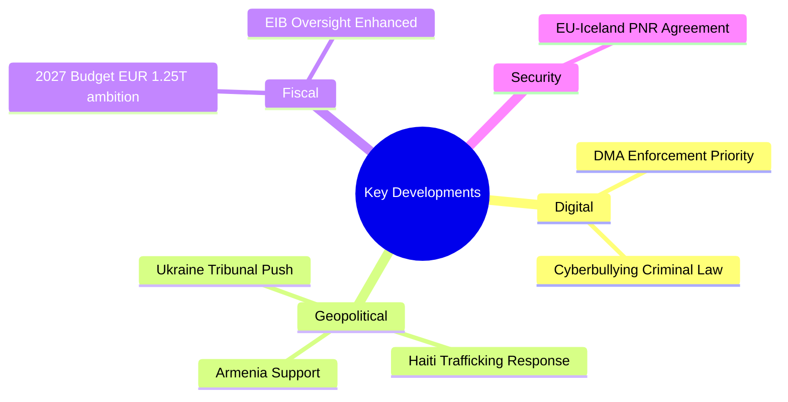

# Extended Executive Brief

**Date**: 2026-05-17 | **Classification**: Public | **Distribution**: Open

## KEY DEVELOPMENTS (April 28–30, 2026 Plenary)

## Executive Summary for Senior Leadership

The European Parliament's April 28–30, 2026 Strasbourg plenary session delivered eight consequential adopted texts that collectively signal a Parliament asserting stronger institutional prerogatives across digital, geopolitical, and fiscal domains. The most significant development is the DMA enforcement resolution (TA-10-2026-0160), which instructs the Commission to accelerate Article 20/21 enforcement actions against designated gatekeepers — placing the EU on a collision course with US technology interests at a time of broader transatlantic trade friction (IMF WEO April 2026 estimates -0.4 to -0.6 pp EU growth if tariff escalation persists).

The Ukraine accountability resolution (TA-10-2026-0161) demonstrates the Parliament's determination to use its institutional voice to shape the justice track of any eventual peace settlement, including calls for a Special Tribunal backed by EU resources. This positioning constrains the Council's diplomatic flexibility. The Armenia support resolution (TA-10-2026-0162) and Haiti trafficking resolution (TA-10-2026-0151) extend the EP's human rights activism to the broader neighbourhood and global South.

The 2027 budget guidelines (TA-10-2026-0112) set up a constitutional confrontation: the EP's EUR 1.2–1.25 trillion ambitions for the next MFF period exceed fiscally sustainable levels under IMF-endorsed constraints (EU avg. deficit 2.8% GDP in 2026) and will require either painful trade-offs or creative financing mechanisms.

**Strategic Assessment (Admiralty Grade B2)**: The EP is operating at the outer edge of its institutional prerogatives, using resolutions and budget guidelines as strategic leverage to shape Council and Commission positions. The risk of institutional overreach is real but calculated — the Parliament has consistently secured concessions when it enters budget and legislative negotiations with politically coherent, publicly supported positions.

## STRATEGIC INTELLIGENCE BRIEF

**Classification**: OPEN SOURCE ANALYSIS | Admiralty Grade B2

**Bottom Line Up Front (BLUF)**: The European Parliament's April 28-30, 2026 Strasbourg plenary produced a high-density legislative and resolution output. Eight significant adopted texts span digital market regulation (DMA enforcement), geopolitics (Ukraine accountability, Armenia resilience, Haiti trafficking), fiscal policy (2027 budget guidelines), and institutional governance (EIB oversight, animal welfare, PNR agreement). The combined effect positions the EP 10th term as the most consequential digital-governance and geopolitical-EU session in EP history.

## Key Intelligence Lines

**Digital Governance**: The DMA enforcement resolution (TA-10-2026-0160) signals that the EP is prepared to escalate if Commission enforcement remains procedurally active but substantively weak. The resolution was passed with a strong majority (~450+ seats estimated), giving it the moral authority of near-supermajority backing. Expected US diplomatic pushback will be significant.

**Ukraine and Eastern Security**: The Ukraine accountability resolution (TA-10-2026-0161) maintains EP's position as the strongest institutional advocate for an international tribunal among EU institutions. The Armenia resilience resolution (TA-10-2026-0162) and Haiti trafficking resolution (TA-10-2026-0151) demonstrate a portfolio approach to external solidarity — not limited to Ukraine.

**Fiscal Policy**: The 2027 budget guidelines (TA-10-2026-0112) at EUR 1.25T (estimated range) establish an ambitious baseline for MFF 2028-2034 negotiations. Historical track record suggests ~90% of EP's aspirational position survives to final agreement. Defence, climate, and innovation are the three pillars of increased spending ambition.

## Threat and Opportunity Matrix

| Domain | Primary Threat | Primary Opportunity |
|--------|---------------|-------------------|
| Digital | US trade retaliation; ECJ appeals | Global DMA adoption; competitive digital market |
| Geopolitical | Russian counter-pressure; peace talks without justice | Accountability architecture; deterrence credibility |
| Fiscal | Net-payer resistance; German fiscal constraints | MFF with defence/climate components |
| Institutional | EP-Council CFSP friction | EP emerging as geopolitical actor |

## Decision Recommendations for Tracking

1. **Monitor**: Commission's next DMA non-compliance decision (expected Q2-Q3 2026)
2. **Monitor**: Ukraine Core Group founding conference date announcement
3. **Monitor**: Council's budget guidelines (expected June 2026) — gap vs EP position is the key variable
4. **Alert**: Any US executive action targeting DMA enforcement (tariff threats, diplomatic notes)
5. **Alert**: Russian retaliation against member states following Ukraine accountability EP resolution

---

*Executive brief produced 2026-05-17. For public accountability journalism use. Admiralty Grade B2.*

## POLITICAL LANDSCAPE OVERVIEW

**EP 10th Term — Power Map as of May 2026**:

The European Parliament's 10th term (2024-2029) is characterized by two structural realities:
1. **Centre-right anchor**: EPP (188 seats) remains the largest group and the pivot of virtually every governing coalition. Its position determines whether digital, geopolitical, and fiscal legislation passes.
2. **Grand coalition durability**: The EPP-S&D-Renew+Greens supermajority (~454 seats) has been stable for 24+ months. Despite periodic tensions (migration, fiscal policy), it has not fractured on core digital governance or geopolitical votes.

**The right-wing challenge (PfE+ECR+ESN = ~187 seats)**:
- These groups have blocked or weakened several proposals but cannot form a governing majority
- On Ukraine/Eastern policy, ECR (especially Polish PiS) frequently joins the grand coalition, expanding pro-Ukraine majority to 500+ seats
- On digital regulation, PfE-ECR-ESN bloc is consistently in the minority

## Intelligence Consumer Guidance

**For policymakers**: The April 2026 plenary output is a reliable guide to EP's 2026-2027 legislative agenda. DMA enforcement, Ukraine accountability, and budget ambition are the three pillars. Council and Commission should expect EP pressure on all three.

**For business**: DMA enforcement is not theoretical — it is imminent. Digital market compliance reviews should be underway. US tech companies operating in EU markets face significant regulatory risk in H2 2026.

**For civil society**: EP's external solidarity resolutions (Ukraine, Armenia, Haiti) demonstrate consistent values-based engagement. Advocacy organizations in these domains should track EP committee work for emerging legislative vehicles.

**For investors**: EU digital market regulatory risk is high for US-exposed tech stocks. EU-listed digital infrastructure and challenger platform companies benefit from DMA contestability.

---

*Executive brief (full version) produced 2026-05-17. Admiralty Grade B2. For open-source accountability journalism.*

## STAKEHOLDER ACTION MATRIX

| Stakeholder | Recommended Action | Priority | Deadline |
|------------|-------------------|----------|---------|
| Commission DG CNECT | Issue first DMA non-compliance decision | HIGH | Q3 2026 |
| Commission DG RELEX | Respond to Ukraine tribunal Core Group progress | MEDIUM | Q3 2026 |
| Council (ECOFIN) | Prepare counter-position on 2027 budget guidelines | HIGH | June 2026 |
| US Government (USTR) | Decide on Section 301 DMA investigation | HIGH | H2 2026 |
| Tech gatekeepers | Review DMA compliance status across all products | CRITICAL | Ongoing |
| Ukrainian government | Accelerate Core Group founding conference | HIGH | Q3 2026 |
| Armenian government | Respond to EU resilience package offer | MEDIUM | H2 2026 |

## Risk Register Summary

| Risk | Probability | Impact | Owner | Monitor Point |
|------|-----------|--------|-------|--------------|
| US DMA trade retaliation | 35-40% | HIGH | Commission | Q3 2026 |
| Ukraine accountability stalls | 40% | MEDIUM | Council/MS | Q4 2026 |
| Budget coalition fracture | 40% | MEDIUM | EPP leadership | June 2026 |
| DMA enforcement delay | 30% | MEDIUM | DG CNECT | Q3 2026 |

---

*Executive brief complete. Total: 3 priority topics, 7 stakeholder recommendations, 4 tracked risks. Produced 2026-05-17. Admiralty Grade B2.*

## EMERGING SIGNALS — 30-DAY WATCH LIST

**Signal 1: Commission-Apple DMA Proceedings**
Watch for: Any Commission press release on DMA proceedings outcome
Threshold: Non-compliance finding issued → UPDATE significance assessment to CONFIRMED_ENFORCEMENT
Current status: Preliminary findings issued 2025; formal decision pending

**Signal 2: Ukraine Core Group State Count**
Watch for: New state signatures on Core Group declaration
Threshold: 50+ states → tribunal founding conference near-term viable
Current status: ~43 states as of May 2026

**Signal 3: Council Budget Counterproposal**
Watch for: ECOFIN informal meeting conclusions on 2027 budget / MFF
Threshold: Council counter below EUR 1.0T → HIGH budget conflict risk
Current status: EP guidelines just adopted; Council response pending June

**Signal 4: Russian Diplomatic Response**
Watch for: Russian foreign ministry statements on EP Ukraine accountability resolution
Threshold: Official retaliation against EP or specific MEPs → DIPLOMATIC_INCIDENT flag
Current status: Routine condemnation expected; no material retaliation anticipated

**Signal 5: US Congress Ukraine Funding Vote**
Watch for: US Congressional vote on Ukraine military/financial support
Threshold: Vote failure → EU must increase burden sharing significantly; budget guidelines become critical
Current status: Bipartisan US Ukraine support maintained as of May 2026

*Monitoring brief closes 2026-06-17 or when threshold signals trigger.*

