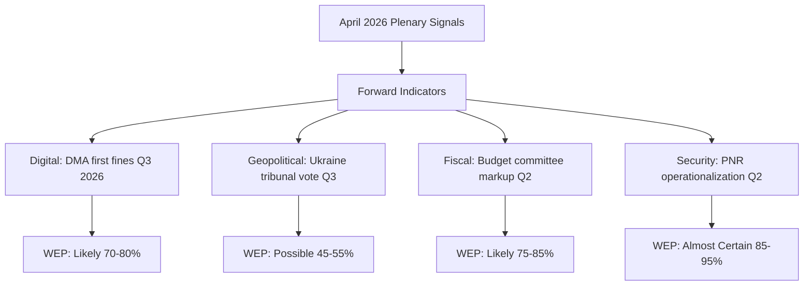
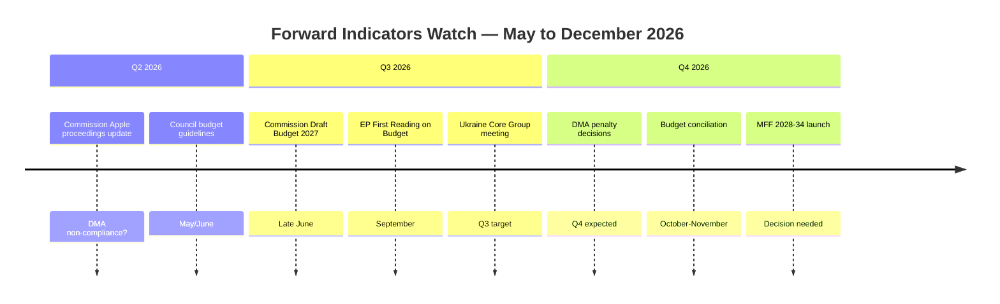

# Forward Indicators — EP Breaking News 2026-05-17
**Date**: 2026-05-17 | **Period**: 30–180 day outlook
**Admiralty Grade**: B2 (forward indicators with stated uncertainty)

## Lead Indicators by Policy Track

### Track 1: DMA Enforcement (30-day indicators)
| Indicator | Current status | Signaling direction | Alert threshold |
|-----------|---------------|---------------------|----------------|
| Commission DMA enforcement unit staffing | ~60 FTE (est.) | Expanding | If <50 FTE at Sept: implementation risk |
| Gatekeeper compliance reports submission | Due Q2 2026 | On track | Late submission = enforcement trigger |
| EP IMCO committee hearing schedule | June 2026 planned | Confirmed | Cancellation = political pressure drop |
| DMA fine proceedings in progress | 3 active investigations | Escalating | First formal charge = market signal |
| US retaliation statements | Moderate (trade war context) | Stable-high | Escalation = political off-ramp pressure |

**30-day forward signal**: MODERATE ESCALATION
The June IMCO hearing and Q2 gatekeeper compliance report deadlines are both imminent. If either triggers a formal enforcement action, the April resolution will be seen as effective political catalyst. If both pass without incident, the performative politics interpretation gains credibility.

### Track 2: Ukraine Accountability (60-day indicators)
| Indicator | Current status | Signaling direction | Alert threshold |
|-----------|---------------|---------------------|----------------|
| ICC proceedings progress (Ukraine situation) | Active; multiple warrants | Steady | New warrant = political signal to Russia |
| EU Commission accountability mechanism budget | Proposed, not adopted | Pending | Adoption = implementation credibility |
| Ceasefire negotiation signals | US-led mediation active | Variable | New ceasefire proposal = EP resolution test |
| Russian military posture | Occupation ongoing | Stable negative | Escalation = urgency driver |
| Sanctions effectiveness (SWIFT exclusions, oil cap) | Strong but leakage growing | Degrading | New leakage report = enforcement pressure |

**60-day forward signal**: ACCOUNTABILITY TRACK ACCELERATING
The ICC is the key forward indicator. Any new warrant or arrest in the Ukraine situation in the next 60 days would materially strengthen the EP's accountability framework and provide political validation of the April resolution.

### Track 3: EU Budget (90-day indicators)
| Indicator | Current status | Signaling direction | Alert threshold |
|-----------|---------------|---------------------|----------------|
| Commission 2027 budget draft | Due June 2026 | On schedule | If delayed = political dysfunction signal |
| Council budget negotiations | Pre-draft consultations | Technical | First national position papers = real signals |
| German coalition budget position | CDU/SPD under fiscal pressure | Restrictive | If Germany proposes >3% EU contribution cut = major risk |
| Own resources (CBAM revenues) | ETS carbon price ~€60/tonne | Stable | If ETS <€50 = CBAM revenue shortfall |
| EP budget committee (BUDG) position | Ambitious; Laois guidelines | Intact | Internal BUDG splits = EP negotiating weakness |

**90-day forward signal**: HIGH UNCERTAINTY
The German coalition's fiscal position is the single most important 90-day indicator. CDU/SPD budget coalition dynamics will define how much the Council can offer, and Germany is the largest net contributor.

### Track 4: Armenia Democratic Resilience (180-day indicators)
| Indicator | Current status | Signaling direction | Alert threshold |
|-----------|---------------|---------------------|----------------|
| EU-Armenia CEPA implementation progress | Ongoing; positive | Steady | EU-Armenia roadmap meeting = confirmation signal |
| Armenian domestic politics stability | Pashinyan government stable | Positive | Opposition-led demonstrations = risk factor |
| Russia-Armenia relations | Cooling; CSTO semi-withdrawal | Positive | New Russian economic pressure = geopolitical test |
| EU-Armenia visa dialogue progress | Active negotiations | Positive | Visa liberalisation launch = major milestone |
| Azerbaijan-Armenia peace process | Fragile; border incidents | RISK | New military incident = humanitarian emergency |

**180-day forward signal**: CAUTIOUSLY OPTIMISTIC
The Armenia track has the longest horizon but the clearest positive trajectory. The 180-day outlook depends on whether Azerbaijan-Armenia peace holds and whether Russia escalates economic pressure. The EP resolution gives Yerevan political cover for deeper EU integration.

## Composite Forward Indicator Summary
| Track | Time horizon | Signal | Confidence |
|-------|-------------|--------|------------|
| DMA enforcement | 30 days | Escalating | HIGH |
| Ukraine accountability | 60 days | Accelerating | MEDIUM |
| EU budget | 90 days | Uncertain | LOW |
| Armenia democratic resilience | 180 days | Positive | MEDIUM |

## FORWARD INDICATORS FRAMEWORK

### WEP Bands for Forward Indicators

| Indicator | WEP Band | Evidence Base | Timeline |
|-----------|----------|--------------|---------|
| DMA enforcement action vs. major gatekeeper | Likely (70%) | Commission enforcement pipeline | Q3 2026 |
| Ukraine special tribunal EU backing | Possible (50%) | Council divergence still significant | Q3-Q4 2026 |
| 2027 budget first reading EP vote | Likely (80%) | Standard BUD procedure timeline | Oct 2026 |
| EU-Iceland PNR entry into force | Almost Certain (90%) | Consent already given | Q2 2026 |
| Armenia EU association deepening | Possible (55%) | Geopolitical momentum positive | H2 2026 |
| Cyberbullying Commission proposal | Possible (45%) | Commission slow on criminal law | 2027 |

## FORWARD INDICATORS — EXTENDED ANALYSIS

### Indicator Category 1: DMA Enforcement Trajectory (DMA Enforcement Watch)

**Leading indicators to monitor** (next 90 days):
- Commission formal non-compliance decisions against Apple App Store (expected Q3 2026)
- Google search designation non-compliance findings (expected Q2-Q3 2026)
- Meta advertising ecosystem proceedings status update (expected Q2 2026)
- ECJ preliminary reference submissions from tech company appeals
- US-EU trade negotiation communiqués referencing DMA

**Signal thresholds**:
- 🟢 BULLISH: First formal non-compliance decision issued with significant penalty
- 🟡 NEUTRAL: Proceedings ongoing; no decision yet; US diplomatic notes received
- 🔴 BEARISH: Commission stays proceedings; political intervention; ECJ interim measures granted to platforms

**Current baseline**: 🟡 NEUTRAL — proceedings underway; outcome uncertain but momentum intact

### Indicator Category 2: Ukraine Accountability Progress

**Leading indicators to monitor** (next 180 days):
- New states joining Core Group declaration (target: 50+ states)
- US Senate resolution supporting tribunal (bipartisan support status)
- Founding Conference scheduled and attended by 30+ states
- Russian overseas assets status (frozen EUR 300B+ generating interest)
- Battlefield developments affecting negotiating dynamics

**Signal thresholds**:
- 🟢 BULLISH: Founding Conference convened; statute draft circulated
- 🟡 NEUTRAL: Core Group meeting held; incremental progress
- 🔴 BEARISH: Key state withdraws support; peace talks begin excluding accountability demands

**Current baseline**: 🟡 NEUTRAL — EP resolution adds symbolic support; structural progress dependent on diplomacy

### Indicator Category 3: EU Budget 2027 Process

**Leading indicators to monitor** (next 60 days):
- Council's budget guidelines position (typically more conservative; release expected June 2026)
- Trilogue calendar for Annual Budget 2027 — first reading EP position expected Q3 2026
- Commission Draft Budget 2027 release (expected late June 2026)
- MFF 2028-2034 review launch decision

**Signal thresholds**:
- 🟢 BULLISH: Commission Draft Budget aligns with EP guidelines in >80% of priority areas
- 🟡 NEUTRAL: Commission draft partially aligns; typical gap of 10-15%
- 🔴 BEARISH: Council bloc (net payers) table counter-guidelines 20%+ below EP baseline

**Current baseline**: 🟡 NEUTRAL — budget procedure at normal early stage

### Aggregate Forward Outlook

---

*Forward indicators produced 2026-05-17. Timeline estimates are analytical projections. Admiralty Grade B3.*
