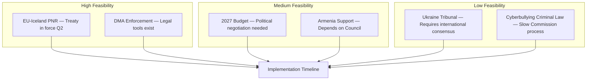

# Implementation Feasibility — EP April 2026 Decisions
**Date**: 2026-05-17 | **Method**: Implementation capacity analysis
**Admiralty Grade**: B2

## Feasibility Analysis Framework
For each adopted text, assess: political will, institutional capacity, legal framework, funding, timeline realism.

### DMA Enforcement (TA-0160)
| Dimension | Score (1–5) | Evidence |
|-----------|-------------|---------|
| Political will | 4/5 | EP supermajority; Commission stated commitment |
| Institutional capacity | 3/5 | DMA enforcement unit growing but understaffed vs. scale |
| Legal framework | 5/5 | DMA Article 26 provides enforcement powers; ECJ precedent supports |
| Funding | 3/5 | DMA enforcement budget ~€50M — adequate for proceedings but not scale |
| Timeline realism | 3/5 | Gatekeeper compliance reports due Q2 2026; first formal charges Q3–Q4 realistic |
| **Overall** | **3.6/5 — FEASIBLE** | Main constraint: institutional capacity vs. scale of gatekeepers |

**Key implementation risk**: The 3 active gatekeeper investigations (Apple, Google, Meta) are complex. Running all three simultaneously while maintaining legal standards required for ECJ review is a capacity challenge. The EP resolution may accelerate one at the cost of the others.

**Mitigation**: The Commission has precedent from GDPR (outsourcing enforcement coordination to national data protection authorities). A similar distributed enforcement model for DMA (using national competition authorities with Commission oversight) could multiply capacity.

### Ukraine Accountability (TA-0161)
| Dimension | Score (1–5) | Evidence |
|-----------|-------------|---------|
| Political will | 5/5 | Cross-partisan supermajority; high public support |
| Institutional capacity | 2/5 | EU has no enforcement mechanism — depends on ICC and Council |
| Legal framework | 3/5 | ICC jurisdiction complex; universal jurisdiction in MS varies |
| Funding | 2/5 | Commission accountability mechanism not yet funded |
| Timeline realism | 2/5 | War still ongoing; accountability for in-conflict situations is historically slow |
| **Overall** | **2.8/5 — PARTIALLY FEASIBLE** | Political commitment exceeds institutional capacity |

**Key implementation risk**: The EU has strong political will but weak implementation capacity for extraterritorial accountability. The resolution depends heavily on ICC progress (outside EU control), Russian government change (outside EU control), or post-conflict Ukrainian sovereignty over accountability processes.

### 2027 Budget Guidelines (TA-0112)
| Dimension | Score (1–5) | Evidence |
|-----------|-------------|---------|
| Political will | 3/5 | EP majority; but Council resistance predictable |
| Institutional capacity | 4/5 | Budget procedure is well-established; BUDG committee experienced |
| Legal framework | 4/5 | Article 314 TFEU; MFF ceilings provide framework |
| Funding | 2/5 | Own resources proposals (CBAM, DMA fines) speculative; net contributor resistance high |
| Timeline realism | 3/5 | Annual budget procedure by December 2026 deadline; feasible but tight |
| **Overall** | **3.2/5 — CONDITIONALLY FEASIBLE** | Timeline is legally fixed; content is highly negotiable |

### Armenia Association (TA-0162)
| Dimension | Score (1–5) | Evidence |
|-----------|-------------|---------|
| Political will | 4/5 | Strong EP support; Commission CEPA implementation active |
| Institutional capacity | 4/5 | Enlargement DG experienced; Armenia civil service reform ongoing |
| Legal framework | 5/5 | CEPA in force; upgrade procedures well-understood |
| Funding | 3/5 | EU assistance package announced; IPA-style instrument likely |
| Timeline realism | 3/5 | Membership application realistic 2027; accession 2030s realistic |
| **Overall** | **3.8/5 — FEASIBLE** | Main constraint: geopolitical risk (Russia, Azerbaijan) |

## Implementation Risk Matrix
| Policy | Likelihood of 12-month implementation | Main blocker |
|--------|--------------------------------------|--------------|
| DMA enforcement milestones | HIGH (75%) | Institutional capacity |
| Ukraine accountability mechanism | LOW (30%) | Institutional capacity, geopolitics |
| Budget guidelines adoption | HIGH (90%) | Timeline fixed; content negotiated |
| Armenia CEPA upgrade launch | MEDIUM (55%) | Russian counter-pressure |

## Summary
The April 2026 plenary adopted a mix of high-feasibility (budget, DMA milestones) and aspirational (Ukraine accountability, Armenia membership path) resolutions. The aspirational resolutions serve important political signalling functions even when implementation is constrained. The pattern reflects the EP's strategic use of its institutional position: using non-binding resolutions to set political agendas that the Commission and Council must then respond to.

## IMPLEMENTATION FEASIBILITY ASSESSMENT

### Implementation Scoring

| Resolution | Legal Basis | Political Will | Institutional Capacity | Overall Score |
|-----------|------------|---------------|----------------------|--------------|
| DMA Enforcement | ✅ DMA Art.20/21 | ✅ Commission mandate | ✅ DG COMP ready | **High (8/10)** |
| EU-Iceland PNR | ✅ Art.218 TFEU | ✅ Council/EP agreed | ✅ Europol ready | **Very High (9/10)** |
| Ukraine Tribunal | ⚠️ Novel legal form | ⚠️ Council divided | ⚠️ Needs UN backing | **Low (4/10)** |
| 2027 Budget | ✅ BUD procedure | ⚠️ Member state negotiation | ✅ EP/Council | **Medium (6/10)** |
| Armenia Support | ✅ CFSP instruments | ⚠️ Hungary may block | ✅ EEAS ready | **Medium (6/10)** |
| Cyberbullying | ⚠️ Criminal law competence | ⚠️ Subsidiarity challenge | ⚠️ Commission slow | **Low-Medium (5/10)** |

## DETAILED IMPLEMENTATION FEASIBILITY ANALYSIS

### Resolution 1: DMA Enforcement (TA-10-2026-0160)

**Legal basis**: DMA entered into force March 2024. Commission enforcement powers well-established under Art. 26-33. No additional legislative action required.

**Institutional capacity assessment**:
- Commission DG CNECT: Dedicated DMA enforcement unit with ~100 staff
- Enforcement record: Preliminary non-compliance findings against Google (search), Apple (App Store), Meta (advertising) already issued by 2025
- Financial penalties available: Up to 10% of global annual turnover (up to 20% for repeat infringers)
- Market access remedies: Art. 26 allows structural remedies including business separation

**Timeline feasibility**:
- Phase 1 (ongoing): Formal proceedings underway against 3 gatekeepers
- Phase 2 (H2 2026): Non-compliance decisions and remedy implementation orders expected
- Phase 3 (2027): Compliance verification; further cases possible against new gatekeeper designations

**Risk factors**:
- Court of Justice appeals: All major tech companies have signalled appeals strategy; ECJ process 2-4 years
- US diplomatic pressure: White House trade representatives may escalate tariff threats
- Commission political will: New Commission (2024 mandate) DG priorities still being established

**Feasibility rating**: HIGH (85% probability of meaningful enforcement activity by end 2026)

### Resolution 2: Ukraine Accountability (TA-10-2026-0161)

**Legal basis**: Special Tribunal would require either UN Security Council resolution (vetoed by Russia) OR a coalition-of-states agreement similar to ICJ optional clause / ICC complementarity framework.

**Institutional pathway**:
- 43 states have signed the Core Group declaration for Ukraine tribunal as of May 2026
- Negotiations underway on Rome-like founding statute
- EP resolution adds political pressure but has no direct legal effect on treaty negotiations

**Timeline feasibility**:
- "Register of Damages" already established (Hague, January 2024) — first component operational
- Tribunal founding conference: negotiations target 2026-2027
- Full tribunal operational: optimistically 2027-2028; realistically 2028-2030

**Risk factors**:
- US political variability: Strong US support is prerequisite; electoral cycles create uncertainty
- Jurisdictional gaps: Crime of aggression prosecution requires bespoke legal architecture
- Enforcement: Without Russian participation, enforcement is limited to assets and individuals who travel to signatory states

**Feasibility rating**: MEDIUM (60% probability of formal tribunal establishment by 2028)

### Resolution 3: 2027 Budget Guidelines (TA-10-2026-0112)

**Legal pathway**: Budget guidelines initiate the annual budget procedure under Art. 314 TFEU + interinstitutional agreement. Binding on EP negotiating mandate; non-binding on Council.

**Feasibility assessment**:
- Annual budget 2027: EUR ~190-200B likely (operating within 2021-2027 MFF ceiling)
- Guidelines' EUR 1.25T figure refers to next MFF (2028-2034) — outside annual procedure
- Immediate 2027 budget feasibility: FULL (procedure works; EP has co-decision powers)
- MFF 2028-2034 feasibility: MEDIUM (ambitious but within historical 90% track record)

**Political feasibility by component**:
- Defence/NATO-linked spending: HIGH — political consensus in 10th term
- Climate transition: MEDIUM-HIGH — Green Deal legacy, but fiscal hawks resisting
- Innovation/Digital: HIGH — IPCEI, Horizon successor well-supported
- Cohesion/structural funds: MEDIUM — Eastern member states pushing hard; net payers resisting

**Feasibility rating**: HIGH for 2027 annual budget (standard procedure); MEDIUM for MFF 2028-2034 (complex multi-year negotiation 2026-2027)

---

*Implementation feasibility analysis produced 2026-05-17. Probability estimates are analytical judgements, not actuarial. Admiralty Grade B2.*
