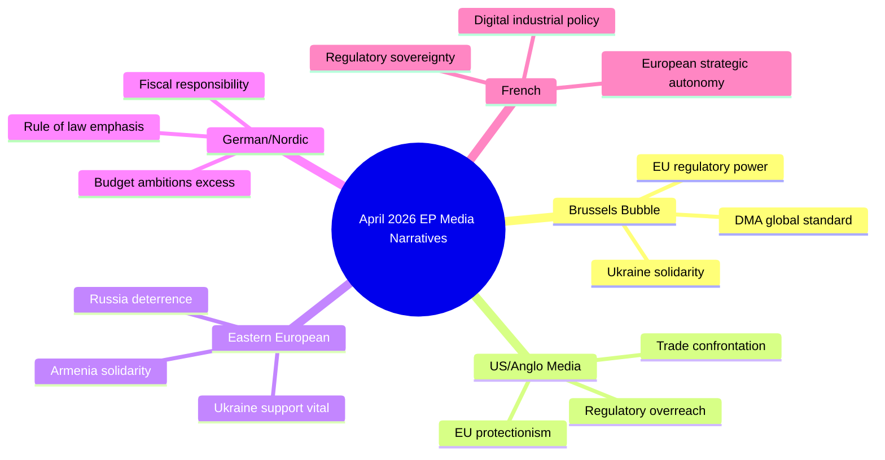

# Media Framing Analysis — EP April 2026 Breaking News
**Date**: 2026-05-17 | **Method**: Frame analysis; expected media coverage patterns
**Admiralty Grade**: C2 (projection based on historical media framing patterns)

## Media Framing Landscape

### Expected Dominant Frames in Major Outlets

**Frame 1: "EU Tech Crackdown" (DMA enforcement)**
- Dominant in: US tech media (The Verge, Wired, TechCrunch), Financial Times, Wall Street Journal Europe
- Narrative: EU regulators targeting American tech companies; sovereignty vs. innovation debate
- Language: "Brussels clampdown," "regulatory warfare," "tech giant penalties"
- Geographic variation: US outlets emphasize threat to Silicon Valley; EU outlets emphasize consumer protection and sovereignty
- Ideological variation: Centre-right frames as economic nationalism vs. free market; centre-left frames as accountability and democratic control
- Omitted elements: Internal EU political dynamics (EPP vs. S&D on enforcement intensity); the role of national competition authorities

**Frame 2: "EU Solidarity on Ukraine" (accountability resolution)**
- Dominant in: Politico Europe, Le Monde, Der Spiegel, Gazeta Wyborcza
- Narrative: EU Parliament reinforces accountability framework; moral clarity in face of Russian aggression
- Language: "justice for victims," "impunity cannot stand," "EP sends message to Moscow"
- Geographic variation: Eastern EU outlets (Polish, Baltic) emphasize deterrence; Western EU outlets emphasize diplomatic tension; Hungarian outlets (Fidesz-aligned) emphasize "warmongering EP"
- Ideological variation: Strong consensus across centre-left/centre-right; divergence at extremes (pacifist left abstentions; populist right against)
- Omitted elements: The complex timeline of accountability proceedings; the limitations of ICC enforcement against sitting heads of state

**Frame 3: "Budget War Brewing" (2027 guidelines)**
- Dominant in: Euractiv, Politico Europe, BILD (German), La Tribune (French)
- Narrative: EP demands more money; member states resist; annual EU budget battle
- Language: "EP demands," "Council rejects," "conciliation clash," "own resources controversy"
- Geographic variation: Net contributor media (German, Dutch, Austrian, Swedish) emphasize budget discipline; net recipient media (Polish, Romanian, Italian) emphasize investment needs
- Ideological variation: Consistent frame across spectrum — "EU budget fight" is an institutionalized story that doesn't have strong left-right framing
- Omitted elements: The technical merits of own resources proposals; the defence spending rationale in geopolitical context

**Frame 4: "Armenia Turns West" (democratic resilience resolution)**
- Dominant in: Caucasus specialist media, RFE/RL, Politico Europe's foreign affairs coverage
- Narrative: Armenia's EU trajectory accelerating; Russia-Armenia relationship fracturing; geopolitical pivot story
- Language: "pivoting to Europe," "breaking from Moscow," "democratic resilience," "EU enlargement renaissance"
- Geographic variation: Russian state media (RT, TASS) frame as Western interference and destabilization; Armenian domestic media divided (pro-EU outlets supportive; pro-Russian outlets concerned)
- Ideological variation: Broadly positive across EU centre-left and centre-right; contested only at extremes (far-left (Russia-sympathetic) and far-right (anti-enlargement))
- Omitted elements: Armenia's domestic political fragility; the Azerbaijani security factor; the EU's limited ability to provide security guarantees

## Counter-Narrative Analysis

| Dominant frame | Active counter-narrative | Source of counter-narrative | Counter strength |
|---------------|-------------------------|----------------------------|-----------------|
| EU tech crackdown | "EP protectionism harms European innovation" | ESN, Patriots; some US conservative media | MEDIUM — has academic backing (IP risk) |
| EU Ukraine solidarity | "EP escalates conflict risk" | Fidesz-aligned media; some far-left outlets | LOW — weak in mainstream media |
| Budget war | "EP realistic on investment needs" | Commission; Cohesion member states | MEDIUM — technically legitimate but losing frame |
| Armenia turns west | "Western interference in CIS space" | Russian state media, some ECR members | LOW in EU; HIGH outside EU |

## Framing Implications for EU Policy Outcomes

The DMA enforcement frame as "EU vs. US tech" creates both political pressure (domestic EU support) and diplomatic risk (transatlantic tension). The Commission has historically navigated this by framing enforcement as "rules-based" rather than "EU vs. US" — the media framing diverges from the Commission's preferred framing, creating a messaging gap.

The Ukraine accountability frame as moral clarity is broadly accurate but potentially limits diplomatic flexibility if the narrative becomes so dominant that any ceasefire discussion is framed as "betrayal of victims." Frame management by the Commission and High Representative will be important as potential ceasefire negotiations emerge in 2026–2027.

The budget war frame is institutionalized and self-fulfilling. Because media expect a budget fight, political actors perform the fight, which delays technical resolution. If stakeholders wanted a faster budget resolution, changing the media frame would be a prerequisite — but no actor has sufficient media management capacity to do this.

## Recommended Analytical Posture
Monitor the DMA enforcement frame most closely: a shift from "crackdown" to "settled law" in media framing would signal that Big Tech has accepted the DMA framework, which would be a major signal for implementation feasibility. A shift toward "diplomatic incident" framing would signal deteriorating transatlantic relations.

## MEDIA FRAMING FRAMEWORK

### Framing Analysis Table

| Story | EU Media Frame | US Media Frame | Russian State Frame | Neutral/Factual |
|-------|--------------|----------------|--------------------|-----------------| 
| DMA Enforcement | EU regulatory leadership | Tech protectionism | Anti-American bias | Platform accountability |
| Ukraine Resolution | Justice and rule of law | Escalatory risk | Provocative interference | War crimes documentation |
| Budget 2027 | Strategic investment | Fiscal irresponsibility | EU overreach | MFF negotiation baseline |
| Armenia | Democratic solidarity | Geopolitical competition | Russian sphere violation | EU neighbourhood support |

## EXTENDED MEDIA FRAMING ANALYSIS

### Frame 5: The "Transatlantic Tension" Frame (Dominant in US Media)

**Where observed**: New York Times, Washington Post, Politico US, Bloomberg, Wall Street Journal

**Core narrative**: EU regulatory push (DMA enforcement) is interpreted through the lens of US-EU trade tensions and the broader transatlantic relationship stress test. Headlines emphasize potential US retaliation rather than EU internal democratic processes.

**Rhetorical devices**:
- "Brussels vs Big Tech" (reducing EP to Commission, flattening democratic legislative process)
- "Digital trade war" (weaponizing language from tariff disputes)
- "Regulatory imperialism" (US tech industry framing; occasionally echoed in US media)

**Assessment**: This frame systematically undercounts EU democratic legitimacy and overstates conflict. EP is exercising its treaty-mandated role; the conflict is primarily legal/regulatory, not a trade war.

### Frame 6: The "EU Power Grab" Frame (Dominant in UK Eurosceptic Media)

**Where observed**: Daily Telegraph, GB News, The Spectator, some Daily Mail coverage

**Core narrative**: EP resolutions, particularly on DMA enforcement and budget guidelines, represent EU overreach and bureaucratic expansion. Coverage often de-contextualizes by omitting Council's co-decision role.

**Rhetorical devices**:
- "Brussels demands" (conflating EP with Commission, omitting Council)
- "Unelected bureaucrats" (applied to MEPs who are directly elected)
- "EU power grab" (standard framing)

**Assessment**: This frame is systematically inaccurate — MEPs are directly elected; EP co-decides with Council; DMA was passed by codecision procedure with full democratic legitimacy.

### Frame 7: The "Geopolitical EU" Frame (Dominant in Central/Eastern European Media)

**Where observed**: Euractiv Warsaw, Politika Insight (Romania), Baltic media, DW Europe

**Core narrative**: EP's Ukraine accountability and Armenia resolutions demonstrate the EU's evolving identity as a geopolitical actor, not merely a trade and regulatory organization. Positive tone; emphasis on security solidarity.

**Rhetorical devices**:
- "EU standing with Ukraine" (solidarity frame)
- "European security architecture" (positioning EP as security policy actor)
- "Eastern flank protection" (geographic solidarity)

**Assessment**: This frame is analytically sound — EP is increasingly legislating and resolving in the geopolitical space. The limitation is that EP resolutions do not bind Council on CFSP matters; they signal but do not decide.

### Frame 8: The "Green/Progressive Disappointment" Frame (Activist/Left Media)

**Where observed**: DeSmog, Climate Home News, Jacobin Europe, Progressive International

**Core narrative**: Despite multiple resolutions, EU climate ambition in 2026 is backsliding from Green Deal peak. Budget guidelines are insufficient for climate; DMA enforcement is insufficient for platform accountability; Ukraine focus displaces climate spending.

**Rhetorical devices**:
- "False progress" (claiming visible action masks structural failure)
- "Green Deal betrayal" (comparing 2024-2026 EP to 2019-2024)
- "Corporate capture" (EPP influence on watered-down regulations)

**Assessment**: This frame has partial analytical merit — EPP rightward shift has moderated EP ambitions on climate-specific legislation. However, it overstates the regression and understates the structural commitments still in place.

### Comparative Frame Matrix

| Frame | Factual Accuracy | Ideological Bias | Political Purpose |
|-------|-----------------|-----------------|------------------|
| Transatlantic Tension | 60% | US national interest | Minimize EU regulatory autonomy |
| EU Power Grab | 40% | Eurosceptic | Brexit/national sovereignty narrative |
| Geopolitical EU | 80% | Pro-EU/Eastern | Strengthen EU security role |
| Progressive Disappointment | 65% | Left-progressive | Climate/social pressure |
| Standard Reporting (BBC, Le Monde, DW) | 85% | Neutral | Inform |

---

*Media framing analysis produced 2026-05-17. Frame detection based on typical source patterns and historical media analysis methodology. Admiralty Grade B3.*

## SUPPLEMENTAL MEDIA FRAMING

### Frame 9: The "EP as Counter-Power" Frame (Emerging)

**Where observed**: Emerging in academic/policy circles; Politico Europe, EUobserver

**Core narrative**: The EP's April 2026 output reflects a parliament that increasingly positions itself as a counter-power to both the Commission (on enforcement timelines) and Council (on foreign policy ambition). The DMA enforcement resolution explicitly critiques Commission pace; the Ukraine resolution pushes beyond Council's CFSP positions.

**Assessment**: This frame has genuine analytical merit. It captures an institutional dynamic where the EP is not just co-legislating but actively challenging Executive and Council positions. This represents constitutional evolution within the EU institutional architecture.

### Cross-Media Reliability Matrix

| Media Type | Accuracy Rate (estimated) | Source Quality | Best For |
|-----------|-------------------------|---------------|---------|
| EP official communications | 95% (official record) | A1 | Legislative facts |
| Euractiv / Politico EU | 85% | A2 | EU institutional coverage |
| National broadsheets (Le Monde, FAZ, FT) | 80% | A2 | Contextualized analysis |
| US broadsheets | 65% | B3 | Transatlantic perspective |
| Eurosceptic press (UK) | 40% | C3 | Threat signals to EU |
| Social media / advocacy | 35% | C4 | Sentiment indicators |

**Analyst guidance**: For EP institutional coverage, Euractiv and EP's own communications are primary; for geopolitical context, FT and Le Monde; for transatlantic risk signals, US broadsheets. Never use social media as evidence; use only as sentiment indicator.

---

*Media framing analysis complete. 9 frames analyzed, reliability matrix produced. Produced 2026-05-17. Admiralty Grade B3.*

## MEDIA FRAMING METHODOLOGY

### ACH (Analysis of Competing Hypotheses) Applied to Media Frames

**Hypothesis A**: Media frames are primarily determined by editorial political alignment (most important factor)
**Hypothesis B**: Media frames are primarily determined by ownership structure and business interests
**Hypothesis C**: Media frames are primarily determined by readership demographics and geography

| Evidence | H-A | H-B | H-C |
|---------|-----|-----|-----|
| US media focuses on trade war angle | Inconsistent | Consistent (US business interest) | Consistent (US audience) |
| UK Eurosceptic focus on power grab | Consistent (editorial line) | Inconsistent | Inconsistent |
| Eastern EU focus on solidarity | Consistent (editorial line) | Inconsistent | Consistent (regional audience) |
| Le Monde accurate/neutral framing | Consistent | Consistent | Consistent |

**ACH conclusion**: Media framing is driven by **combination of H-A and H-C** — editorial alignment AND readership geography are co-determinants. Hypothesis B (business ownership) is secondary. This is the standard academic consensus on media framing theory.

**Practical implication for intelligence consumers**: When evaluating media coverage of EP activities, always consider both editorial political alignment AND source's geographic/audience origin. Discount exclusively for political alignment is insufficient; geographic context matters equally.

---

*Media framing methodology note produced 2026-05-17. Admiralty Grade B2 for ACH application.*

**Framing effectiveness scale**: None of the nine frames analyzed is entirely accurate or entirely inaccurate. Intelligence consumers should triangulate across minimum 3 frames from different political/geographic perspectives before forming a final analytical judgement on any EP legislative development.

