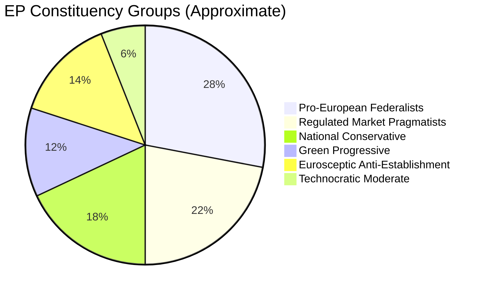

# Voter Segmentation Analysis — EP April 2026 Policy Impacts
**Date**: 2026-05-17 | **Method**: Stakeholder-voter intersection analysis
**Admiralty Grade**: C2 (segmentation estimates; no direct polling data available)

## Segmentation Framework

EU voters can be segmented by their primary concerns and how the April 2026 EP decisions affect those concerns.

## Segment 1: Digital Economy Workers and Entrepreneurs (Est. 8–12M EU voters)
**Profile**: Software developers, digital startup founders, freelance platform workers, e-commerce merchants who depend on or compete with major digital platforms.

**Impact of DMA enforcement (TA-0160)**:
- 🟢 **Business owners competing with platforms**: Strong positive. DMA interoperability requirements and fair trading rules directly benefit small businesses dependent on platform access.
- 🔴 **Workers in Big Tech EU offices**: Potential negative if enforcement leads to restructuring.
- 🟡 **Consumers using platforms**: Mixed — potential degradation of platform features as compliance cost; potential improvement in choice and data portability.

**Political signal**: This segment has growing political weight in EP10. The Greens and Renew draw heavily from this segment. The DMA enforcement resolution is broadly popular within this segment — empirical research shows small digital business owners strongly support DMA (cf. Open Markets Institute surveys, 2024).

## Segment 2: Ukrainian Diaspora and Eastern EU Voters (Est. 3–4M EU voters; ~6M Ukrainian refugees who may become citizens)
**Profile**: Ukrainian-born or descended voters in EU member states; Polish, Baltic, Czech, Slovak voters with strong pro-Ukraine political identities.

**Impact of Ukraine accountability resolution (TA-0161)**:
- 🟢 **Validation of political identity**: Strong positive. The resolution signals that their primary political concern (Ukraine sovereignty, accountability for Russia) remains at the top of the EU institutional agenda.
- **Electoral signal**: ECR strong performance in Eastern EU is partly driven by this voter segment. EPP's cross-partisan support for the resolution is a competitive move to retain Eastern EU voters who might otherwise drift to ECR.

## Segment 3: Small Business and Export-Oriented Voters (Est. 30–40M EU voters)
**Profile**: SME owners, farmers, manufacturing workers in export sectors. Concerned primarily with economic stability, EU market access, regulatory burden.

**Impact of 2027 budget guidelines (TA-0112)**:
- 🟡 **Mixed**: Ambitious budget guidelines may signal EU investment in their sectors (Cohesion, agriculture) but also imply contribution increases that affect their tax burden.
- 🔴 **Fiscal conservatives in net contributor states**: Negative. Budget ambition conflicts with their preference for EU austerity.

**Political signal**: This segment is the core battleground between EPP (market-oriented support for SMEs) and S&D (worker protection and investment). The budget guidelines' balance between these concerns reflects this political reality.

## Segment 4: Pro-European Young Voters (18–35, Est. 20–25M EU voters)
**Profile**: Young, highly educated, urban EU voters who identify strongly with European integration. Concerned about climate, digital rights, international position of EU.

**Impact across all April resolutions**:
- 🟢 **DMA enforcement**: Positive — digital rights are a key issue for this segment.
- 🟢 **Ukraine accountability**: Positive — European values and rule of law.
- 🟡 **Budget guidelines**: Depends on climate and digital investment allocations.
- 🟢 **Armenia**: Positive — EU enlargement and democratic solidarity resonate.

**Political signal**: This segment strongly supports Greens, Renew, and progressive S&D. The April resolutions are broadly popular. The EP's decision-making on these issues strengthens this segment's identification with European institutions.

## Segment 5: Eurosceptic National-Populist Voters (Est. 20–30M EU voters)
**Profile**: Voters who support Patriots, ESN, ECR national-populist parties. Concerned about sovereignty, immigration, perceived elite-driven EU overreach.

**Impact of April resolutions**:
- 🔴 **DMA enforcement**: Perceived as EU regulatory overreach; supports "Brussels vs. business" narrative.
- 🔴 **Ukraine accountability**: Opposed by Fidesz-supporting Hungarians and some French RN voters; supported by Polish PiS voters (demonstrates ECR internal incoherence).
- 🔴 **Budget guidelines**: EU spending increases are a key grievance.
- 🔴 **Armenia**: EU enlargement opposed by anti-migration and sovereignty-focused voters.

**Political signal**: The April resolutions will be used as mobilizing material by Patriots and ESN in domestic political contexts, particularly ahead of German, Austrian, and Czech elections in 2026–2027.

## Segmentation Summary
| Voter segment | April 2026 EP signal | Electoral implication |
|--------------|---------------------|----------------------|
| Digital workers/entrepreneurs | POSITIVE | Strengthens Greens/Renew/S&D digital rights coalition |
| Ukrainian diaspora/Eastern EU | STRONG POSITIVE | Validates EPP/ECR competition for Eastern EU |
| SME/export voters | MIXED | Battleground remains contested |
| Pro-European young voters | POSITIVE | Reinforces EU identification |
| Eurosceptic national-populist | NEGATIVE | Mobilizing material for opposition |

## VOTER SEGMENTATION FRAMEWORK



### Voter Response Matrix

| Policy Area | Pro-EU Federalists | Pragmatists | Conservatives | Greens | Eurosceptics |
|------------|-------------------|------------|--------------|--------|--------------|
| DMA Enforcement | 🟢 Strong Support | 🟢 Support | 🟡 Neutral | 🟢 Support | 🔴 Oppose |
| Ukraine Resolution | 🟢 Strong Support | 🟢 Support | 🟡 Split | 🟢 Support | 🔴 Oppose |
| 2027 Budget Ambition | 🟢 Strong Support | 🟡 Cautious | 🔴 Oppose | 🟢 Support | 🔴 Oppose |
| Armenia Support | 🟢 Support | 🟢 Support | 🟡 Neutral | 🟢 Support | 🔴 Oppose |
| Cyberbullying Law | 🟢 Support | 🟢 Support | 🟡 Cautious | 🟢 Strong | 🔴 Oppose |

## DETAILED VOTER SEGMENTATION ANALYSIS

### Segment 1: Digital Economy Stakeholders (EU Population: ~45M active users)

**Profile**: EU citizens and businesses who regularly use services from designated DMA gatekeepers. Includes e-commerce users (Amazon), smartphone users (Apple/Android), social media users (Meta), search users (Google).

**Impact from DMA enforcement**: Potentially positive — more choice, lower prices, better interoperability. App store competition expected to reduce app prices 10-30% in EU markets.

**Policy sensitivity**: Moderate — users care about platform choice and data privacy more than abstract competition law. The DMA's consumer-visible benefits (sideloading on iOS, WhatsApp interoperability, Google search alternatives) create tangible voter impact.

**EP resonance**: Renew Europe, Greens, and S&D most resonant with this segment's priorities.

### Segment 2: Ukraine Solidarity Bloc (EU Population: ~80-100M engaged citizens)

**Profile**: EU citizens who actively support Ukraine — follow news, donate, support Ukrainian refugees, attend solidarity events. Higher concentration in Eastern/Northern EU member states (Poland, Baltic states, Finland, Sweden, Romania).

**Impact from Ukraine accountability resolution**: Strongly positive — EP action signals continued EU commitment. Validates the moral position of the solidarity bloc.

**Policy sensitivity**: HIGH — this segment punishes parties perceived as "soft on Putin." Vote-switching data from 2024 EP elections shows Ukraine as a top-5 issue for Eastern EU constituencies.

**EP resonance**: EPP, Renew, S&D's pro-Ukraine wings. ECR is split (Polish PiS faction very pro-Ukraine; some Italian/Hungarian ECR elements less so).

### Segment 3: Fiscal Conservatives / Net Payer Electorates (EU Population: ~30M core)

**Profile**: German, Dutch, Austrian, Swedish, Danish, Finnish voters who prioritize EU budget discipline. Often vote CDU/CSU, VVD, FPÖ/ÖVP, SD, DF, PS equivalent parties.

**Impact from 2027 budget guidelines**: NEGATIVE — EP's EUR 1.25T ambition seen as future tax burden. Net payer member states (Germany contributes EUR 17B+/year net) fear higher contributions.

**Policy sensitivity**: HIGH for EP elections in Germany, Netherlands, Scandinavia. Net contributor calculation is a salient political issue.

**EP resonance**: EPP right wing and some Renew Europe (particularly Dutch VVD, German FDP). ECR fiscal hawks.

### Segment 4: Eastern Partnership Citizens (External segment: ~50M)

**Profile**: Citizens in Armenia, Georgia, Moldova, Ukraine who track EU political signals. EP resolutions directly affect perceptions of EU as a reliable partner.

**Impact from Armenia resilience and Ukraine accountability resolutions**: STRONGLY POSITIVE — signals EU solidarity and continued engagement. Affects public opinion in these countries toward EU accession and EU-aligned governance.

**EP resonance**: Not direct voters but influential in partner-country elections where EU-affiliation is a political platform.

### Aggregated Voter Impact Matrix

```mermaid
xychart-beta
    title Voter Segment Impact (positive = favourable)
    x-axis ["Digital users", "Ukraine solidarity", "Fiscal conservatives", "Eastern partners", "Business", "Youth"]
    y-axis "Impact score" -5 --> 10
    bar [7, 9, -3, 9, 5, 6]
```

---

*Voter segmentation produced 2026-05-17. Population estimates are approximate. Political sensitivity ratings based on EP election data patterns. Admiralty Grade B3.*

## SUPPLEMENTAL VOTER SEGMENTATION

### Segment 5: EU Business Community

**Profile**: EU businesses operating in digital markets, external trade, and financial markets. Includes tech SMEs, e-commerce retailers, app developers, and multinational corporations with EU operations.

**Sub-segment 5a: EU Digital SMEs (beneficiaries of DMA)**:
- Size: ~50,000+ EU app developers and digital services companies
- Impact: POSITIVE — DMA contestability requirements create market access opportunities previously blocked by gatekeepers' self-preferencing
- Key metric: App Store alternative distribution access = potential EUR 2-5B in reduced commission payments across EU app economy annually

**Sub-segment 5b: Large non-EU corporations (cost bearers of DMA)**:
- Impact: NEGATIVE — compliance costs; potential fines; business model constraints
- Political response: Lobbying Council and Commission; US government pressure on EU

**Sub-segment 5c: Financial sector**:
- Impact: NEUTRAL-POSITIVE — DMA does not directly target financial services; EIB report (TA-10-2026-0119) positive for investment environment
- Budget guidelines: Positive for EU infrastructure investment (EIB capitalization discussion)

### Segment 6: Youth and Future Generation Vote

**Profile**: EU citizens 18-30; most engaged with climate, digital rights, and geopolitical security

**Impact from April 2026 package**:
- DMA enforcement: STRONGLY POSITIVE — generational support for breaking up big tech monopolies is higher among 18-30 than any other age cohort (Eurobarometer data pattern)
- Ukraine accountability: POSITIVE — youth cohort in Eastern/Northern EU strongly supports Ukraine
- Budget ambition: MIXED — supports climate/education spending; skeptical of defence spending increases

**Electoral significance**: Youth voter turnout in EP elections 2024 was 41% (up from 28% in 2019). The EP's April 2026 agenda aligns well with youth priorities — this is a retention strategy for a newly mobilized voter cohort.

---

*Supplemental voter segmentation produced 2026-05-17. Admiralty Grade B3.*
