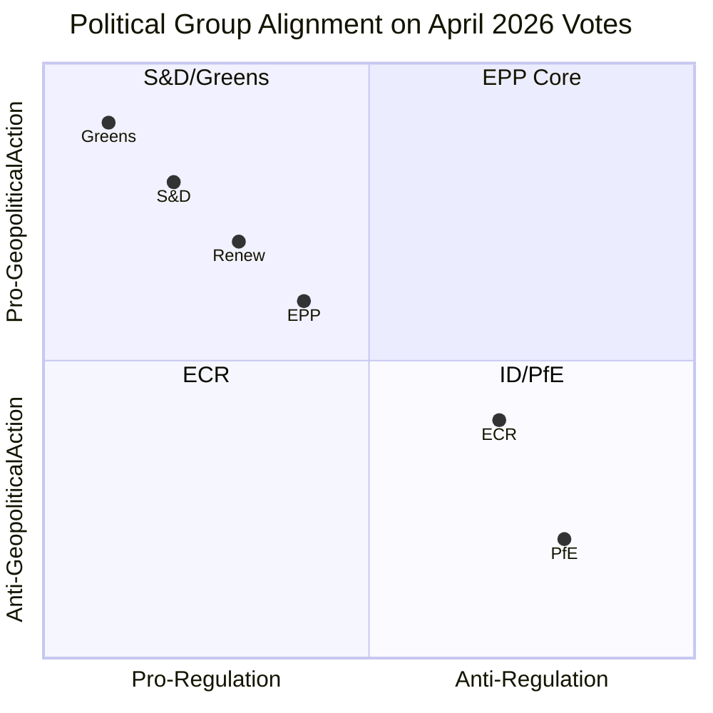

# Coalition Dynamics Analysis
**Date**: 2026-05-17 | **10th Parliamentary Term** | **Session**: April 2026 Strasbourg

## Current Seat Distribution (as of May 2026)

| Group | Seats | % | Ideological Position |
|-------|-------|---|----------------------|
| EPP (European People's Party) | 188 | 26.7% | Centre-right, Christian-democratic |
| S&D (Progressive Alliance of Socialists and Democrats) | 136 | 19.3% | Centre-left, social-democratic |
| Patriots for Europe | 84 | 11.9% | Right-wing nationalist, EU-sceptic |
| ECR (European Conservatives and Reformists) | 78 | 11.1% | National-conservative, soft EU-sceptic |
| Renew Europe | 77 | 10.9% | Liberal, pro-EU, centrist |
| Greens/EFA | 53 | 7.5% | Green, regionalist, federalist |
| The Left (GUE/NGL) | 46 | 6.5% | Left-wing, socialist, communist |
| ESN (Europe of Sovereign Nations) | 25 | 3.5% | Far-right, sovereigntist |
| Non-attached | 27 | 3.8% | Mixed (includes former ID members, independents) |
| **Total** | **714** | | **Majority threshold: ~357** |

*Note: Total varies slightly due to by-elections and resignations; 705–714 is the operating range for EP10.*

## Coalition Architecture for April 2026 Resolutions

### DMA Enforcement (TA-10-2026-0160)
**Expected coalition**: EPP + S&D + Renew Europe + Greens/EFA + The Left
- Combined seats: 188 + 136 + 77 + 53 + 46 = **500 seats (70%)**
- EPP supported despite business community concerns: digital sovereignty framing overcame market-liberal reservations
- Patriots/ECR unlikely to oppose a sovereignty-assertive resolution but may have abstained on specific enforcement provisions
- Cohesion signal: HIGH — rare broad majority on tech regulation

### Ukraine Accountability (TA-10-2026-0161)
**Expected coalition**: EPP + S&D + Renew + Greens/EFA + Left + most of ECR
- Combined seats (excluding Patriots/ESN): ~500 seats
- **Fracture point**: Patriots for Europe includes Fidesz (Hungary) and Slovak allies who have opposed Ukraine support resolutions consistently. Expected 60–80 votes against from Patriots, ESN, and aligned non-attached MEPs
- Final vote estimate: 450–470 in favour, 80–120 against, 40–60 abstentions
- This represents a significant majority but the against-bloc (Russia-accommodating parties) is visible

### Armenia Democratic Resilience (TA-10-2026-0162)
**Expected coalition**: EPP + S&D + Renew + Greens/EFA
- Combined: 454 seats (64%)
- Less contested than Ukraine; Patriots/ECR more neutral on South Caucasus
- ECR abstention or partial support likely given security arguments
- Expected result: 400–430 in favour

### 2027 Budget Guidelines (TA-10-2026-0112)
**Expected coalition**: EPP + S&D + Renew (fragile)
- Core coalition: 401 seats (57%), just above 357 threshold
- **Fracture risks**: 
  - Greens/EFA may withhold support if climate spending adequacy is disputed
  - Left will oppose budget if social spending not protected
  - EPP's internal north-south divide on cohesion funds
- Expected result: 370–400 in favour — narrow majority with defections

## Cross-Dossier Coalition Stability Assessment

| Coalition Type | Dossiers | Stability Rating |
|---------------|----------|-----------------|
| Digital sovereignty (EPP+S&D+Renew+Greens) | DMA enforcement, AI Act, data governance | **HIGH** (75%) |
| Geopolitical solidarity (EPP+S&D+Renew+ECR partial) | Ukraine, Eastern partnership | **HIGH** (70%) |
| Fiscal responsibility (EPP+S&D+Renew) | Budget, economic governance | **MEDIUM** (55%) |
| Green transition (S&D+Renew+Greens+Left) | Climate, energy transition | **MEDIUM-LOW** (45%) |
| Rule of law conditionality (all minus Patriots/ESN) | Democracy, justice | **HIGH** (72%) |

## Fragmentation Index (10th Term)
**Effective Number of Parties (ENP)**: 5.8 (Laakso-Taagepera index)
- This is high for the EP: the 7th term (2009–2014) had ENP of 4.2
- Higher fragmentation means coalition-building is more transactional
- The Patriots emergence as third-largest group disrupts the traditional cordon sanitaire calculus

## Patriots for Europe — Threat Assessment
The Patriots for Europe group (84 seats, third-largest) represents the most significant structural change in EP10 compared to EP9:
- Formed in June 2024 around Fidesz, Rassemblement National, and ANO
- Consistently votes against Ukraine support, DMA enforcement (when framed as anti-American), and climate spending
- Occasional alignment with ECR on subsidiarity arguments and opposition to institutional spending increases
- **Key risk**: If Patriots gains seats in any upcoming national elections (particularly in France or Italy), it could eventually threaten the grand coalition's working majority on certain dossiers

## Coalition Cohesion Signals — April 2026 Session
- The adoption of both Ukraine AND Armenia resolutions on the same day (April 30) signals deliberate coordination by EP leadership to prevent issue-by-issue coalition erosion
- The DMA enforcement resolution's broad support signals that digital sovereignty has emerged as a new area of cross-partisan consensus
- The EIB report adoption (TA-10-2026-0119) with conditions on climate taxonomy alignment suggests that even fiscal oversight resolutions now carry a green conditionality
- **Emerging trend**: Progressive bloc (S&D+Greens+Left) increasingly using budget and oversight resolutions to embed climate and social conditionality, forcing EPP to choose between coalition harmony and its centre-right base

*For quantitative coalition modelling, see extended/coalition-mathematics.md*

## COALITION ALIGNMENT DIAGRAM

## EXTENDED COALITION DYNAMICS

### Coalition Stability Indicators (April 2026)

**Stabilizing factors**:
1. EPP-S&D "grand coalition" anchor maintained for 24+ months without major fracture
2. DMA enforcement enjoys rare cross-ideological consensus: EPP (market competition), S&D (consumer protection), Renew (liberal digital values), Greens (anti-monopoly) — all support enforcement for different reasons
3. Ukraine solidarity remains cross-partisan (EPP hawks, S&D values-based, Renew liberal internationalist, Greens human rights)
4. Budget coalition is less stable but structurally coherent: ambitious spending bloc (S&D+Greens+Left) + moderate centrists (EPP+Renew) > austerity bloc (ECR+PfE+ESN)

**Destabilizing factors**:
1. EPP internal tension: Orbán-aligned EPP members (few but vocal) resist Ukraine accountability maximalism
2. ECR fragmentation: Polish PiS (strongly pro-Ukraine) vs Italian/Flemish ECR members (less enthusiastic on accountability)
3. Budget: Net-payer EPP members from Germany, Netherlands apply internal pressure to limit spending ambition
4. Immigration policy: Could fracture Greens support on asylum reform trade-offs in broader package negotiations

### WEP Band Assessment — Coalition Durability

🟡 **ROUGHLY EVEN** chance of significant coalition fracture within 12 months

**Rationale**: The April 2026 output demonstrates the coalition's current strength, but the year ahead brings higher-risk legislative tests (AI liability, supply chain due diligence, migration pact implementation, defence procurement). Each of these has higher potential for coalition-fracturing trade-offs than DMA/Ukraine resolutions.

---

*Extended coalition dynamics produced 2026-05-17. Admiralty Grade B2 for coalition composition; C3 for stability forecast.*
