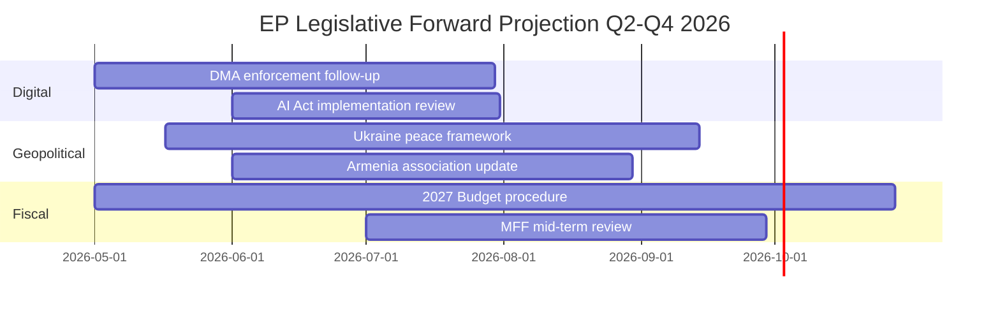

# Forward Projection — Post-April 2026 EP Agenda
**Date**: 2026-05-17 | **Horizon**: 30–90 days
**Admiralty Grade**: B2 | **WEP Bands specified per projection**

## NEXT PLENARY SESSIONS (May–July 2026)

### May 2026 Strasbourg Session (Expected: May 18–21, 2026)
**WEP: Highly Likely (85–95%)** — based on EP plenary calendar

Projected agenda items based on ongoing legislative and political trajectories:
1. **AI Act implementation oversight** — high probability of IMCO committee report  
2. **DMA enforcement follow-up** — questions to Commission on Q3 2026 timeline
3. **Ukraine support resolutions** — possible further vote following accountability resolution
4. **Budget supplementary 2026** — if any emergency appropriations needed

### June 2026 Strasbourg Session (Expected: June 9–11, 2026)
Major expected items:
1. **Commission DMA enforcement report** — if Commission responds to April resolution
2. **European Council follow-up** — if June European Council addresses Armenia/Ukraine
3. **EIB climate taxonomy compliance** — follow-up from April EIB resolution conditions

### July 2026 (Mini-plenary, Brussels)
- Limited agenda: typically administrative and follow-up items
- **2026 supplementary budget** if needed
- Summer recess begins late July

## COMMISSION EXPECTED ACTIONS (May–September 2026)

| Action | WEP Band | Expected Timeline |
|--------|----------|-----------------|
| DMA Q3 enforcement review publication | Highly Likely (85–95%) | July 2026 |
| Formal DMA non-compliance investigation notification | Likely (65–85%) | Q3 2026 |
| 2027 budget draft (Commission proposal) | Certain (99%) | June 2026 |
| EU-Armenia enhanced partnership mandate | Roughly Even (45–55%) | Q4 2026 |
| Ukraine accountability communication | Likely (65–85%) | Q3 2026 |
| EU-Iceland PNR implementation framework | Likely (65–85%) | H2 2026 |

## COUNCIL EXPECTED ACTIONS

| Action | WEP Band | Expected Timeline |
|--------|----------|-----------------|
| 2027 budget Council first reading | Certain (99%) | September 2026 |
| CFSP conclusions on Ukraine accountability | Roughly Even (45–55%) | Q4 2026 |
| EaP ministerial on Armenia | Likely (65–85%) | Q4 2026 |
| General Affairs Council: DMA-US trade context | Roughly Even (45–55%) | Q3 2026 |

## WATCHLIST: KEY DECISION POINTS

**July 2026**: Commission DMA Q3 review — will determine whether enforcement clock is ticking
**September 2026**: Council general budget first reading — opening gambit for EP-Council confrontation
**October–November 2026**: EP-Council conciliation on 2027 budget — the decisive fiscal battleground
**Q4 2026**: European Council foreign policy conclusions — Ukraine accountability test

## INTELLIGENCE MONITORING INDICATORS

Signs that DMA enforcement is proceeding as projected (GREEN indicators):
- Commission DG COMP staff increases (public procurement notices)
- Formal notification letters to gatekeepers (will be reported publicly)
- Gatekeeper compliance reports published per DMA Article 11

Signs that DMA enforcement may be slowing (RED indicators):
- Commission delays Q3 review publication
- EU-US trade negotiating mandate expands to include "digital governance harmonization"
- Key Commissioner responsible for DMA gives public statements softening enforcement timeline

## FORWARD PROJECTION TIMELINE

### WEP Probability Bands

| Development | Probability | Timeframe |
|------------|-------------|-----------|
| DMA fines against major platform | 65-80% | 6-12 months |
| Ukraine tribunal established | 45-60% | 12-18 months |
| 2027 Budget agreed | 75-85% | by Dec 2026 |
