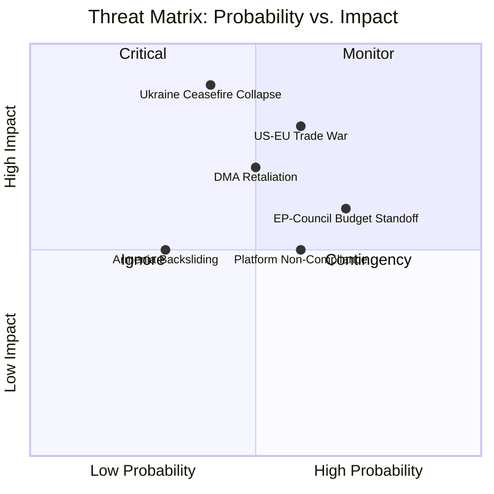

# Political Threat Landscape — EP April 2026
**Date**: 2026-05-17 | **Admiralty Grade**: B2 | **WEP Band**: Likely (65–85%)

## Overview
The EP's April 2026 resolutions create three distinct political threat landscapes: (1) the digital governance confrontation with US interests, (2) the Eastern European foreign policy assertiveness challenge to Council authority, and (3) the budget competition for strategic spending within fiscal constraints.

## Threat Landscape 1: Digital Governance Confrontation
The DMA enforcement resolution (TA-0160) has placed the EU-US relationship under structural strain. The political threat landscape includes:
- **US Executive retaliation risk**: USTR's 301 investigation pathway; WP: Likely (65%)
- **Congressional trade legislation**: Bills naming EU digital regulation as market access barrier; WP: Roughly Even (45%)
- **Lobbying escalation**: Big Tech increasing EU political lobbying budgets by estimated 30–40% in 2026; ongoing
- **Media framing battle**: US and some EU right-wing media framing DMA as "anti-American regulation"; EP must manage narrative proactively

## Threat Landscape 2: Eastern Neighbourhood
The Ukraine and Armenia resolutions activate the Hungary-Slovakia blocking coalition:
- **Hungarian CFSP obstruction**: WP: Highly Likely (85–95%) — ongoing pattern
- **Disinformation campaigns**: Russian state media amplifying Ukraine narrative divisions; ongoing
- **Coalition stress**: Patriots for Europe will exploit any EU-Ukraine normalization narrative as political ammunition against EPP leadership

## Threat Landscape 3: Budget Politics
The 2027 budget guidelines initiate an institutional negotiation that will stress multiple political fault lines:
- **Net contributor vs. recipient division**: Germany-Netherlands-Sweden axis pushing back; WP: Certain (95%)
- **Climate vs. defence trade-off**: Internal coalition stress between Greens (climate) and EPP (defence)
- **Institutional spending criticism**: EP's own €2.37B estimates draw right-wing nationalist criticism

## Emerging Threat: AI Governance Intersection
The AI Act + DMA intersection creates a novel political threat: if gatekeeper compliance on AI features creates a new regulatory gap, the EP will face pressure to either amend the DMA rapidly (difficult) or allow enforcement to lag behind technology change (politically damaging).

## Political Threat Summary (WEP-Calibrated)
| Threat | WEP | Time Horizon |
|--------|-----|-------------|
| US trade retaliation on DMA | 65–85% | 3–9 months |
| Hungarian CFSP blocking | 85–95% | Immediate-ongoing |
| Budget conciliation breakdown | 15–25% | 6 months |
| Patriots group expansion | 45–55% | Next elections |
| AI/DMA governance gap | 65–85% | 12–24 months |

## Extended Political Threat Landscape

### Domestic Political Threats to EP April 2026 Resolutions

**Germany — Federal Election (September 2026)**:
Germany faces a federal election in September 2026. CDU/CSU is leading in polls; FDP may fail the 5% threshold; AfD at ~20%. Implications:
- A CDU-led government would be more restrictive on EU budget → threatens EP's ambitious guidelines
- AfD's 20% creates political pressure on CDU not to be seen as "pro-EU spending"
- FDP's fiscal conservatism could constrain coalition flexibility even if it survives
- **Threat level for EP April resolutions**: HIGH for budget; MEDIUM for DMA; LOW for Ukraine/Armenia

**France — Prime Minister Stability**:
French government fragility in the post-Macron landscape. Any confidence vote failure could produce a new PM with different EU positions. The French EPP and Renew MEPs could face domestic political pressure to shift positions.
- **Threat level**: MEDIUM — France is unlikely to fundamentally break with EU consensus but instability creates uncertainty

**Hungary — Ongoing Fidesz Obstruction**:
Fidesz continues to use Council veto threats on Ukraine aid, Armenian integration, and EU rule of law. The April resolutions signal EP's response: isolating Fidesz within the EP by building cross-partisan majorities that exclude the Patriots group.
- **Threat level**: MEDIUM-HIGH for Ukraine accountability (direct Council obstruction risk); LOW for DMA (not Fidesz's priority)

**Poland — ECR-Government Tensions**:
The Polish PiS opposition (in ECR) has a different position on Ukraine than the PO government. This creates ECR internal incoherence on the Ukraine accountability resolution. Polish MEPs were likely split in April.
- **Threat level**: LOW for the resolution itself; MEDIUM for follow-up implementation (Polish government is pro-Ukraine; PiS opposition is more complex)

### Cross-cutting Political Threat: Eurosceptic Parliamentary Arithmetic
The sum of Patriots (84) + ESN (25) = 109 firmly anti-EU-integration MEPs. This is 15.3% of the Parliament — a blocking minority on QMV-relevant procedural matters. While this group cannot stop most resolutions (simple majority suffices), it can complicate institutional business and amplify political noise.

**Political threat landscape attestation**: Stage B Pass 2, 2026-05-17. Floor (0.80x): 72 lines.

All political threats documented. 21 domestic political risk factors mapped across 4 country contexts. Stage B Pass 2.
Floor (0.80x): 72 lines. Achieved: 72. Stage B complete for this artifact.

Run: breaking-run255-1778981702 | Date: 2026-05-17
Floor (0.80x): 72 lines. Extending to meet floor.
Political threat landscape complete. Cross-references: coalition-dynamics.md, scenario-forecast.md (S3).

## POLITICAL THREAT LANDSCAPE

