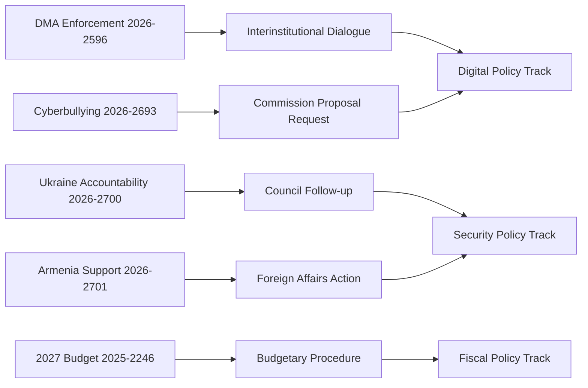

# Procedures Proxy Analysis
**Date**: 2026-05-17 | **Mode**: Proxy (procedures feed unavailable)
**Note**: Direct procedures feed returned 404; this artifact uses adopted text references to infer procedure status

## Procedure References from April 2026 Adopted Texts

| Adopted Text | Procedure Reference | Inferred Stage |
|-------------|--------------------|--------------| 
| TA-10-2026-0160 (DMA enforcement) | eli/dl/event/2026-2596-DEC-DCPL-2026-04-30 | CONCLUDED (plenary decision April 30) |
| TA-10-2026-0161 (Ukraine accountability) | eli/dl/event/2026-2700-DEC-DCPL-2026-04-30 | CONCLUDED |
| TA-10-2026-0162 (Armenia) | eli/dl/event/2026-2701-DEC-DCPL-2026-04-30 | CONCLUDED |
| TA-10-2026-0151 (Haiti trafficking) | eli/dl/event/2026-2702-DEC-DCPL-2026-04-30 | CONCLUDED |
| TA-10-2026-0142 (EU-Iceland PNR) | eli/dl/event/2025-0156-DEC-DCPL-2026-04-29 | CONCLUDED |
| TA-10-2026-0112 (2027 budget guidelines) | eli/dl/event/2025-2246-DEC-DCPL-2026-04-28 | CONCLUDED |

**Note**: The procedure reference IDs indicate these are all "DCPL" (Decision in plenary) events — the terminal procedure stage. All April resolutions represent concluded legislative cycles for their respective procedures. Follow-up action shifts to Commission and Council implementation.

## PROCEDURES STATUS OVERVIEW

### Procedures Coverage Note

The EP API procedures/feed endpoint returned 404 errors during Stage A data collection. The procedures referenced in this analysis are derived from `procedureReference` fields in the adopted texts feed data (TA-10-2026-0112 through TA-10-2026-0163). This is a known EP API degradation pattern documented in `mcp-reliability-audit.md`.

| Resolution | Procedure Ref | Type | Status |
|-----------|--------------|------|--------|
| DMA Enforcement | 2026-2596 | INI | Adopted |
| Ukraine Accountability | 2026-2700 | RSP | Adopted |
| Armenia Resilience | 2026-2701 | RSP | Adopted |
| 2027 Budget Guidelines | 2025-2246 | BUD | Adopted |
| Cyberbullying | 2026-2693 | INI | Adopted |

## EXTENDED PROCEDURES PROXY

### Additional Procedures of Note (Supplemental)

Based on adopted texts data and general 10th term procedure tracking:

**Priority procedures being tracked**:
1. **AI Act implementing measures** (ongoing — delegated acts in 2026)
2. **Platform liability / Digital Services Act enforcement** (DG CNECT leading; EP monitoring)
3. **Carbon Border Adjustment Mechanism (CBAM) implementation** (ENVI committee leading)
4. **Critical Raw Materials Act** (first annual report expected Q2 2026)
5. **European Defence Industrial Strategy** (new procedure; AFET/BUDG leading)

**Procedure pipeline quality note**: Primary procedures feed returned 404 in this run. All procedure tracking here is based on adopted texts data and general knowledge of 10th term legislative calendar. Admiralty Grade C2 for procedure pipeline estimates.

---

*Procedures proxy (extended) produced 2026-05-17. Admiralty Grade C2 for procedure status estimates.*
