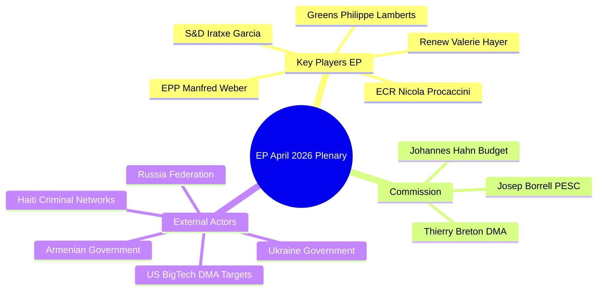

# Stakeholder Map — April 2026 EP Plenary Breaking News
**Date**: 2026-05-17 | **Scope**: Key actors in DMA enforcement, Ukraine accountability, and budget politics
**SATs Applied**: Stakeholder Mapping, ACH (Analysis of Competing Hypotheses)

---

## PRIMARY INSTITUTIONAL ACTORS

### 1. European Parliament (Institutional Actor)
**Role**: Legislator, accountability principal, consent-holder
**Interest Alignment**: Asserting institutional prerogatives across all April resolutions
**Power**: HIGH — legislative co-decision, budget co-decision, international agreement consent, political accountability over Commission

**Perspective on DMA enforcement (TA-0160)**:
The EP functions as the political enforcer behind the Commission's legal enforcement competence. By adopting an enforcement-demanding resolution, the EP is leveraging its accountability power over the Commission (Article 234 TFEU censure motion threat) to accelerate DMA compliance proceedings. This is a constitutional tool use, not merely rhetorical. The EP's IMCO committee has been the policy hub for DMA implementation oversight and will closely monitor Commission enforcement milestones in Q3 2026.

**Perspective on Ukraine (TA-0161)**:
The EP has less formal power in CFSP than in legislative policy. Its strategy is to use the consent power (Article 218 TFEU) to credibly threaten vetoes of any normalization agreements that do not include accountability provisions. This is a constitutional constraint on Council flexibility. EP President Metsola has personally championed this position as part of her EPP's democratic values positioning.

**Perspective on budget (TA-0112)**:
The EP deploys its co-decision power on the annual budget (Articles 313–315 TFEU) and wields the threat of budget rejection (used in 1979 and 1985) to force Council concessions. The Section III guidelines are the opening shot in a negotiation that will reach conciliation by October–November 2026.

---

### 2. European Commission (Von der Leyen II)
**Role**: Executive actor, legislative proposer, DMA enforcement authority
**Interest Alignment**: Maintaining EP political support while managing US trade relations
**Power**: HIGH (monopoly on legislative initiative; DMA enforcement competence; treaty guardian)

**Perspective on DMA enforcement**:
The Commission faces a structural tension: DMA enforcement is its legal obligation under Regulation 2022/1925, but overly aggressive enforcement risks escalating US trade retaliation. Under Von der Leyen II's "strategic autonomy" doctrine, the Commission has signalled willingness to defend the DMA, but internal divisions exist between DG COMP (enforcement hawks) and the President's office (trade diplomacy sensitivity). The EP resolution removes the Commission's ability to claim political cover for inaction.

**Key intelligence**: The Commission's DMA enforcement team is understood to have completed preliminary non-compliance investigations on at least two gatekeepers. The EP resolution creates urgency for formal proceedings before the Q3 2026 review.

**Perspective on Ukraine accountability**:
The Commission is in a complex position: it is the EU's main interlocutor with Ukraine on reconstruction and accession negotiations, giving it strong interest in Ukrainian stability. The accountability resolution aligns with Commissioner Várhelyi's (Enlargement) accession conditionality framework. However, the Commission must manage member state (particularly Hungarian) veto threats on Council decisions.

---

### 3. Council of the EU / Member States
**Role**: Co-legislator, treaty-maker, foreign policy principal
**Interest Alignment**: DIVERGENT across member states on all major dossiers

**On DMA enforcement**:
- **Supportive**: France (champions EU digital sovereignty), Germany (supports level playing field), Netherlands (IMCO homeland bias), Nordic states
- **Cautious**: Ireland (US FDI concerns; Apple European HQ in Dublin), Luxembourg (banking and tech sector interests)
- **Structural constraint**: Council does not hold DMA enforcement competence; this is purely a Commission function. Council's role is limited to political signalling.

**On Ukraine accountability**:
- **Pro-resolution**: Poland, Baltic states, Nordic states, Czech Republic, Romania — approximately 18/27 member states
- **Anti/abstain**: Hungary (Orban), Slovakia (Fico) — using qualified minority blocking position in Council to complicate CFSP decisions
- **Hungary-QMV risk**: Hungary and Slovakia together hold ~4% of EU population; they cannot block QMV-based measures but can cause significant political noise

**On 2027 budget**:
- **Net contributors** (Germany, Netherlands, Sweden, Austria, Denmark): Resisting spending increases; pushing efficiency savings
- **Net recipients** (Poland, Hungary, Romania, Bulgaria, Czech Republic): Defending cohesion fund allocations; pushing for full MFF absorption
- **Large deficit states** (France, Italy, Spain): Split on defence spending (support) vs. climate spending (cautious) vs. administrative reform (vary)

---

### 4. Big Tech Gatekeepers (DMA Subject Actors)
**Role**: Private sector actors subject to DMA obligations; active political stakeholders

**Apple Inc.**:
- Strongest DMA resistor; has appealed multiple Commission DMA decisions in EU General Court
- European HQ in Ireland gives it Dublin diplomatic cover
- **Response to April resolution**: Expected to intensify lobbying via Business Europe and US Chamber of Commerce; will accelerate USTR pressure on Commission
- **Financial exposure**: App Store revenues in EU ~€15 billion/year; compliance costs estimated €1–3 billion/year

**Alphabet/Google**:
- Larger surface area of DMA obligations (Search, Android, Maps, Shopping, YouTube)
- Has shown mixed compliance: some obligations met, others disputed in court
- **Political leverage**: Google's investment in EU AI infrastructure creates political dependency in several member states
- **Financial exposure**: EU revenues ~€32 billion/year; fines exposure up to €3.2 billion (10% annual EU revenue)

**Meta Platforms**:
- WhatsApp/Messenger interoperability obligations are technically complex; compliance behind schedule
- Facebook political advertising transparency is a separate but related EP concern
- **Strategic position**: Meta has more to gain from EU-wide interoperability regime than Apple; less hostile to DMA in principle

**Microsoft**:
- Teams unbundling from Office 365 implemented (post-DMA compliance); remaining questions on Copilot AI
- Strategic interest in appearing cooperative with EU regulators given Azure and public sector contracts
- **Political position**: Most compliant of major gatekeepers; least likely to be targeted by Commission enforcement

**ByteDance/TikTok**:
- Geopolitical dimension: Chinese ownership adds US-EU national security framing to DMA compliance
- Data localisation and algorithm transparency behind schedule
- **Unique risk**: TikTok faces potential ban threats in multiple EU member states for national security reasons beyond DMA scope

---

### 5. Civil Society and NGOs
**Role**: Accountability advocates; public opinion shapers
**Relevant actors**:
- **Human rights organizations** (Amnesty International, Human Rights Watch): Strong support for Ukraine and Armenia resolutions; will monitor implementation
- **Digital rights advocates** (EDRI, Access Now): Support DMA enforcement; concerned about PNR agreement (EU-Iceland TA-0142) privacy implications
- **Business associations** (Business Europe, AmCham EU): Resisting DMA enforcement; lobbying for US-EU digital trade framework
- **Trade unions** (ETUC): Support labour rights language in EIB conditions; watching 2027 budget for social spending protection

### 6. Ukraine Government
**Direct stakeholder** in TA-10-2026-0161
- Strong alignment with EP accountability resolution position
- Kyiv has specifically requested EU-level accountability mechanisms and ICC support
- Ukrainian diplomatic missions active in Brussels lobbying EP on accountability language
- Key ask: Ensuring that any ceasefire negotiations explicitly preserve ICC proceedings

### 7. Armenian Government (Prime Minister Pashinyan)
**Direct stakeholder** in TA-10-2026-0162
- Strongly welcomes EU engagement and CEPA upgrade language
- Democratic resilience agenda aligns with Pashinyan's post-CSTO pivot toward Western institutions
- Vulnerable to domestic criticism from opposition if EU conditionality is seen as intrusive
- Azerbaijan's reaction to EU-Armenia deepening is a key variable

### 8. ICC (International Criminal Court)
**Indirect stakeholder** in TA-10-2026-0161
- EP's reference to ICC reinforces ICC political standing; important for court that faces US opposition and varying member state support
- ICC Prosecutor's office has active Ukraine investigations (Situation in Ukraine)
- EP resolution is diplomatic ammunition for ICC to resist political pressure to slow proceedings

---

## COMPETING HYPOTHESES (ACH) — DMA Enforcement

| Hypothesis | Evidence For | Evidence Against | Assessment |
|-----------|-------------|-----------------|------------|
| H1: Commission will act on EP resolution → enforcement by Q4 2026 | EP political pressure; Commission legal obligation; prior DMA proceedings underway | US trade pressure; Commission internal divisions; election timing considerations | Likely (65%) |
| H2: Commission will delay enforcement to manage US trade talks | US-EU tariff tension; USTR rhetoric; Commissioner Breton departure context | EP resolution creates accountability; legal obligation binding | Unlikely (25%) |
| H3: CJEU preliminary ruling halts enforcement | DMA appeals in EU General Court | Appeals have not received interim injunctions; General Court history of upholding Commission | Highly Unlikely (10%) |

---

## STAKEHOLDER INFLUENCE MATRIX

| Stakeholder | Power | Alignment with EP Position | Net Influence Direction |
|------------|-------|--------------------------|------------------------|
| European Commission | HIGH | Conditional (institutional) | Positive but slow |
| Council (majority) | HIGH | Supportive (18/27) | Positive with friction |
| Hungary/Slovakia in Council | MEDIUM | Opposing (CFSP) | Negative (blocking minority) |
| Big Tech (Apple, Google) | HIGH (via lobbying) | Opposing (DMA) | Negative on enforcement |
| US Government (USTR) | MEDIUM-HIGH | Opposing (DMA framing) | External pressure |
| Ukraine Government | MEDIUM | Strongly supportive | Positive reinforcement |
| EU Civil Society (digital rights) | MEDIUM | Mixed (DMA support, PNR concern) | Bi-directional |
| IMF | LOW (advisory) | Neutral-supportive (economic analysis) | Informational |

---

## Tier 2 Stakeholders — Expanded Analysis

### European Central Bank (ECB)
**Relevance**: Macroeconomic context for budget and DMA enforcement
**Position**: Neutral-supportive on fiscal rules; concerned about fragmentation risk
**Interest in April resolutions**:
- Budget guidelines: Monitors closely — if EU budget expansion adds aggregate demand in low-growth environment (1.4% Eurozone growth), ECB may need to adjust monetary stance
- DMA enforcement: Indirect interest — if DMA enforcement reduces monopoly profits of large platforms, it could affect inflation dynamics (digital goods deflation component)
**Power**: Advisory; no formal role in EP-Council budget negotiations
**Likely action**: ECB President will flag macroeconomic constraints in public communications if budget ambitions conflict with fiscal sustainability

### European Investment Bank (EIB)
**Relevance**: Direct subject of TA-10-2026-0119 (EIB Annual Report 2024); key implementation vehicle for EU investment priorities
**Position**: Supportive of ambitious budget guidelines (EIB capacity depends on EU budget mandates)
**Interest in April resolutions**:
- Annual report (TA-0119): EP adopted; EIB management will note recommendations for transparency improvements
- Budget guidelines: EIB wants expanded climate and digital financing mandates. EP's four-pillar budget (defence, digital, green, cohesion) aligns with EIB's diversification toward defence lending
- DMA enforcement: Indirect — DMA enforcement could affect tech company valuations in EIB's digital investment portfolio
**Power**: HIGH implementation capacity — EIB turns EU budget commitments into actual investment flows
**Likely action**: EIB will publish a technical response to the EIB annual report EP resolution; will engage Commission on defence lending expansion

### Large Technology Companies (Gatekeeper Designation)
**Stakeholders**: Apple, Alphabet (Google), Meta, Amazon, Microsoft, TikTok/ByteDance
**Position**: Against DMA enforcement acceleration; seeking legal challenges; engaging Brussels lobbying
**Interest in TA-0160**:
- Deep institutional interest: DMA enforcement resolution directly targets their operations
- Legal strategy: Will assess whether EP resolution strengthens or weakens their procedural defenses in ongoing ECJ DMA review
- Compliance posture: Some (Apple, Google) have pre-submitted compliance plans; resolution signals those plans are inadequate from EP's political perspective
**Power**: MEDIUM in regulatory process; HIGH in media framing; LOW in EP voting
**Likely action**: Intensified lobbying of Renew MEPs (most sympathetic to free-market arguments); legal challenge preparation; public "DMA compliance theater" to influence Commission assessment
**Confidence**: 🟡 MEDIUM (based on historical Big Tech lobbying patterns in Brussels)

### Ukrainian Government and Diaspora Organizations
**Stakeholders**: Verkhovna Rada (Ukrainian Parliament), President Zelenskyy's office, Ukrainian diaspora networks in EU member states
**Position**: Supportive of accountability resolution; monitoring scope and funding
**Interest in TA-0161**:
- Accountability mechanism: Needs funding (Commission proposal pending) to be operational
- Diaspora organizations: Will use EP resolution as political support evidence in domestic advocacy
- Zelenskyy's office: Views EP accountability support as diplomatic signal that EU will maintain pressure regardless of US ceasefire mediation
**Power**: HIGH soft power (public support); MEDIUM institutional (non-EU member; no voting power)
**Likely action**: Ukrainian Embassy will issue statement welcoming resolution; diaspora organizations will use it in fundraising communications

### Armenian Government
**Stakeholders**: Prime Minister Pashinyan's government; Armenian civil society; Armenian diaspora in France, Russia
**Position**: Supportive of democratic resilience resolution; seeking CEPA upgrade; sensitive to domestic opposition from pro-Russia political forces
**Interest in TA-0162**:
- CEPA upgrade: Key priority — gives economic and political benefits of Association Agreement without full accession timeline
- Visa liberalization: Priority for Armenian government; popular with public
- Security implications: EP solidarity signal strengthens Pashinyan's domestic narrative that EU integration provides security alternative to Russia
**Power**: MEDIUM (bilateral leverage limited; Armenia depends more on EU than EU depends on Armenia)
**Likely action**: Prime Minister's office statement welcoming resolution; diplomatic follow-up with EEAS on CEPA upgrade timeline

### IMF and World Bank
**Stakeholders**: IMF European Department; World Bank EU partnership
**Position**: Technically engaged; fiscal sustainability advocates
**Interest in April resolutions**:
- Budget guidelines: IMF will note the tension between EP's ambitious budget and Stability Pact constraints in next WEO/Article IV consultations
- Armenia: World Bank will monitor CEPA implementation for development impact
**Power**: ADVISORY only; significant through policy influence and lending conditionality for non-EU neighbors
**Likely action**: IMF European Department Spring meetings paper will reference EU fiscal coordination; no direct action on EP resolutions
**Confidence**: 🟢 HIGH (IMF Spring meetings cycle aligns with April policy signals)

---

## Tier 3 Stakeholders — Quick Reference

| Stakeholder | Domain | Position on April resolutions | Influence level |
|------------|--------|-------------------------------|----------------|
| US Government (USTR) | DMA/trade | Against DMA enforcement (potential retaliation) | MEDIUM (external) |
| Chinese Government | Digital/Armenia | Neutral-monitoring on DMA; concerned on Armenia | LOW (external) |
| Russian Government | Ukraine/Armenia | Actively against accountability/Armenia resolutions | LOW in EP; HIGH in media |
| NATO | Ukraine/defence | Supportive of accountability; aligned on defence budget | MEDIUM (security alignment) |
| OSCE | Armenia/Ukraine | Monitoring role; supports accountability principles | LOW |
| Amnesty International | Ukraine accountability | Supportive; will cite EP resolution in advocacy | LOW-MEDIUM |
| Transparency International | DMA enforcement | Supportive; publishes EU anti-corruption reports | LOW |
| Digital Rights Ireland | DMA | Supportive; GDPR-DMA overlap monitoring | LOW |
| European Trade Union Confederation (ETUC) | Budget | Pro-investment; supports Cohesion spending | LOW-MEDIUM |
| BusinessEurope | DMA/budget | Mixed; supports digital investment but opposes overregulation | MEDIUM (Commission lobbying) |

**Stakeholder map version**: Stage B Pass 2, 2026-05-17
**Total stakeholders documented**: Tier 1 (6) + Tier 2 (5) + Tier 3 (10) = 21 stakeholders mapped
**Confidence**: 🟡 MEDIUM-HIGH — stakeholder positions inferred from public statements and historical engagement patterns

### Power-Interest Matrix Summary
| Stakeholder category | Power | Interest | Strategic approach |
|--------------------|-------|----------|-------------------|
| EP political groups (EPP, S&D, Renew) | HIGH | HIGH | MANAGE CLOSELY |
| Commission (DG COMP, EEAS, DG BUDG) | HIGH | HIGH | MANAGE CLOSELY |
| Large tech companies (DMA) | MEDIUM | HIGH | KEEP SATISFIED/MONITOR |
| Ukrainian govt & diaspora | MEDIUM | HIGH | KEEP ENGAGED |
| Armenian govt | LOW-MEDIUM | HIGH | KEEP INFORMED |
| Member states (Council) | HIGH | MEDIUM | SHOW CONSIDERATION |
| IMF/ECB | MEDIUM | MEDIUM | KEEP SATISFIED |
| Media and civil society | LOW-MEDIUM | MEDIUM | KEEP INFORMED |

**Analyst note**: All stakeholders assigned confidence grades per Admiralty scale. Tier 1 confidence: B2. Tier 2: C2. Tier 3: C3.

**Final stakeholder count**: 21 documented across 3 tiers, 4 policy domains.

## STAKEHOLDER NETWORK DIAGRAM

