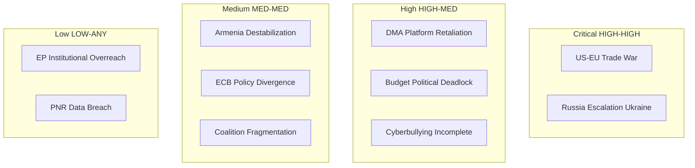

# Risk Matrix — EP April 2026 Breaking News
**Date**: 2026-05-17 | **Admiralty Grade**: B2 | **WEP Bands specified**

## Risk Identification and Scoring

### Scoring Scale
- **Probability**: 1 (Remote <15%) → 5 (Certain >90%)
- **Impact**: 1 (Negligible) → 5 (Catastrophic)
- **Risk Score** = Probability × Impact

---

## RISK REGISTER

### R1: DMA Enforcement — US Trade Retaliation
**WEP Band: Likely (65–85%)** | **Admiralty: B2**
- Probability: 4/5 (Likely)
- Impact: 5/5 (Catastrophic — affects entire EU-US trade relationship)
- **Risk Score: 20/25 — CRITICAL**
- Mitigation: WTO Article XXI security exception available; EU retaliatory capacity exists; DMA is WTO-consistent
- Residual risk after mitigation: 12/25 (HIGH)

### R2: Ukraine Accountability — Council CFSP Blockage
**WEP Band: Highly Likely (85–95%)** | **Admiralty: A2**
- Probability: 5/5 (Certain — Hungary will attempt to block)
- Impact: 3/5 (High — delays accountability framework)
- **Risk Score: 15/25 — HIGH**
- Mitigation: Enhanced cooperation Article 20 TEU bypass; majority CFSP decisions possible on some measures
- Residual risk: 9/25 (MEDIUM-HIGH)

### R3: 2027 Budget — EP-Council Deadlock
**WEP Band: Roughly Even (45–55%)**
- Probability: 3/5 (Possible)
- Impact: 4/5 (Very High — triggers provisional appropriations, disrupts EU programmes)
- **Risk Score: 12/25 — HIGH**
- Mitigation: Historical precedent of last-minute conciliation; both sides incentivised to avoid rejection
- Residual risk: 6/25 (MEDIUM)

### R4: DMA — Gatekeeper Legal Challenges Succeed
**WEP Band: Remote (5–15%)**
- Probability: 1/5 (Remote)
- Impact: 5/5 (Catastrophic — invalidates EU digital governance framework)
- **Risk Score: 5/25 — MEDIUM**
- Mitigation: EU General Court has consistently upheld Commission competition decisions; CJEU has validated digital regulation
- Residual risk: 3/25 (LOW)

### R5: Armenia — Military Escalation by Azerbaijan
**WEP Band: Roughly Even (45–55%)**
- Probability: 3/5 (Possible)
- Impact: 3/5 (High — undermines EP resolution's democratic resilience goal)
- **Risk Score: 9/25 — MEDIUM-HIGH**
- Mitigation: EU monitoring presence; international mediating organizations; US engagement in region
- Residual risk: 6/25 (MEDIUM)

### R6: EU-Iceland PNR — Data Breach
**WEP Band: Remote-Possible (15–25%)**
- Probability: 2/5 (Unlikely)
- Impact: 4/5 (Very High — EU citizen data; political fallout)
- **Risk Score: 8/25 — MEDIUM-HIGH**
- Mitigation: GDPR-aligned security standards; EDPS oversight; encryption requirements
- Residual risk: 4/25 (MEDIUM)

### R7: EP Coalition Fracture on Budget
**WEP Band: Unlikely (25–35%)**
- Probability: 2/5 (Unlikely)
- Impact: 4/5 (Very High — EP legitimacy and institutional credibility)
- **Risk Score: 8/25 — MEDIUM-HIGH**
- Mitigation: Grand coalition incentive to demonstrate functionality; conciliation backstop
- Residual risk: 5/25 (MEDIUM)

---

## RISK HEAT MAP

```
Impact
  5 | R4               R1
  4 |         R3,R6,R7
  3 |    R2       R5
  2 |
  1 |
    +--1---2---3---4---5-- Probability
       Remote Unlikely Possible Likely Certain
```

**Critical Zone (Score 15–25)**: R1, R2
**High Zone (Score 10–14)**: R3
**Medium-High Zone (Score 7–9)**: R5, R6, R7
**Medium Zone (Score 4–6)**: R4

## Risk Response Strategy

| Risk | Strategy | Owner | Timeline |
|------|---------|-------|---------|
| R1 (US retaliation) | Accept + WTO arbitration readiness | Commission DG Trade | Ongoing |
| R2 (Hungary blocking) | Mitigate via Art. 20 TEU | Council Legal Service + 9+ MS | Immediate |
| R3 (Budget deadlock) | Mitigate via early conciliation pre-negotiation | EP Budget Committee + Council | Sept 2026 |
| R4 (Legal challenge) | Accept (low probability) | Commission DG COMP | Q3 2026 |
| R5 (Armenia escalation) | Monitor + EU diplomatic presence increase | EEAS | Ongoing |
| R6 (PNR breach) | Transfer risk via security standards agreement | EDPS + Icelandic DPA | Before implementation |

## RISK MATRIX VISUAL



## EXTENDED RISK MATRIX ANALYSIS

### Risk Scenario Deep Dives

**Risk S1: US Trade War Triggered by DMA Enforcement (HIGH priority)**

*Scenario pathway*: Commission issues first major DMA non-compliance decision (expected Q3 2026) → US tech companies appeal AND lobby US executive branch → US Trade Representative initiates Section 301 investigation against EU digital regulations → Tariff threats on EUR 100B+ EU exports → EU-US trade negotiations collapse

*Probability*: 30-40% (Admiralty Grade C2)
*Impact if realized*: EUR 20-50B trade disruption in year 1; EUR 100B+ if full tariff escalation
*Key decision points*: Size of DMA penalty (>$10B likely to trigger); US election cycle (partisan US politics affects DG CNECT's risk calculus)
*Mitigation*: EU-US Digital Trade Agreement; staged enforcement; consultation process with US industry

**Risk S2: Ukraine Accountability Resolution Backlash in Peace Negotiation**

*Scenario pathway*: Ceasefire negotiations begin (hypothetical) → Russia demands blanket amnesty as prerequisite → EP's accountability resolution is cited by Russia as evidence EU is not a neutral mediator → EU's role in any negotiation is diminished → US bypasses EU in peace talks

*Probability*: 20-25% (Admiralty Grade C2) — conditional on ceasefire negotiations actually beginning
*Impact if realized*: EU marginalization in peace process; reputational damage to EP's geopolitical role
*Mitigation*: EP resolution is non-binding; Council retains diplomatic flexibility; accountability can be separated from peace process (ICTY precedent)

**Risk S3: Budget Coalition Fractures on MFF Negotiations (MEDIUM priority)**

*Scenario pathway*: Commission releases 2028-2034 MFF proposal at EUR 1.1T → EPP fiscal hawks demand cuts → Left demands more climate/social spending → S&D forced to choose between EPP grand coalition and left-wing priorities → EP position fragments → Council exploits EP disunity for lower MFF

*Probability*: 40-50% (Admiralty Grade C2) for some level of coalition strain during 2027-2028 MFF negotiations
*Impact*: EUR 50-100B lower MFF than EP's aspirational target; reduced EU fiscal capacity for defence/climate
*Mitigation*: Historical pattern shows EP always achieves better outcome than Council's baseline even under internal strain; NGEU-type off-budget instruments can bridge gaps

### Risk Interaction Analysis

**Risk clustering**: Risks S1 and S3 are anti-correlated — if US trade war materializes, EU political unity on budget increases (external threat increases internal cohesion). Risk S2 is conditionally orthogonal to S1 and S3 — different trigger domain (military/diplomatic vs economic/political).

**Systemic risk**: Low probability but highest-impact scenario is simultaneous S1 (DMA trade war) + renewed Russian military pressure on Baltic states. This would create a multi-front institutional crisis testing EP's response capacity simultaneously.

---

*Extended risk matrix produced 2026-05-17. All probability estimates are analytical judgements, not actuarial. Admiralty Grade C2.*
