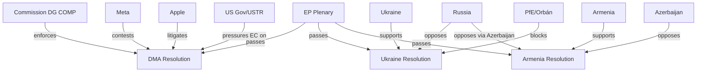

<!-- SPDX-FileCopyrightText: 2026 Hack23 AB -->
<!-- SPDX-License-Identifier: Apache-2.0 -->

# Actor Mapping — Breaking News
**Date:** 2026-05-18 | **SATs Applied:** Stakeholder Mapping, ACH

---

## Primary Actors

| Actor | Role | Position | Influence (1-5) |
|-------|------|----------|----------------|
| EPP Group | Legislative | Pro-DMA enforcement, pro-Ukraine | 5 |
| S&D Group | Legislative | Pro-enforcement, pro-accountability | 5 |
| Renew Group | Legislative | Pro-digital regulation, pro-enlargement | 4 |
| Commission DG COMP | Executive | DMA enforcer | 5 |
| Meta Platforms | Regulated | Anti-interoperability mandates | 4 |
| Google (Alphabet) | Regulated | Selective compliance | 4 |
| Apple | Regulated | Litigation-first approach | 4 |
| Russian Government | External threat | Opposed to all three Tier 1 resolutions | 4 |
| Ukrainian Government | Beneficiary | Pro-SToCA | 4 |
| Armenian Government (Pashinyan) | Aspirant | Pro-EU integration | 3 |
| Azerbaijani Government | External | Anti-Armenia-EU integration | 3 |
| PfE Group (Orbán-aligned) | Legislative | Anti-accountability, anti-DMA enforcement | 3 |
| ESN Group | Legislative | Anti-EU legislative expansion | 2 |
| US Government (USTR) | External | Pro-Big Tech, anti-DMA enforcement | 4 |
| ICC Prosecutor | Legal | Complementary to SToCA | 3 |
| BEUC | Civil Society | Pro-DMA enforcement | 2 |
| EDRi | Civil Society | Pro-enforcement with caveats | 2 |

---

## Actor Network Map

---

## ACH: Actor Motivations for DMA Non-Compliance

**H1: Meta delays for economic reasons** (preserving advertising monopoly) — PROBABLE
**H2: Apple delays for legal strategy** (litigation as compliance alternative) — PROBABLE
**H3: Google complies selectively** (post-DOJ verdict cooperation calculus) — POSSIBLE

All three companies have distinct motivations that require differentiated enforcement approaches.

---

## Key Actor Interactions (30-day outlook)

1. Commission → Big Tech: DMA compliance deadline review
2. EP Rapporteur → Commission: Follow-up resolution monitoring
3. Russia → PfE MEPs: Continued influence maintenance
4. Armenia → EAEU: Potential exit signaling
5. Azerbaijan → EU energy desk: Gas supply assurance messaging

*Generated: 2026-05-18 | Run: breaking-run262-1779068047*

---

## EXTEND-FROM-PRIOR: Additional Actor Analysis (Run 268)

### 7. Tech Industry Actors (DMA-specific)

| Actor | Primary Interest | Power Level | Stance on DMA |
|-------|-----------------|-------------|---------------|
| Apple Inc. | App Store revenue model defence | 🔴 Very High | Oppose enforcement |
| Alphabet/Google | Search & ad revenue defence | 🔴 Very High | Oppose enforcement |
| Meta Platforms | Social media data model | 🔴 Very High | Oppose enforcement |
| ByteDance/TikTok | Algorithm transparency | 🟠 High | Partial concern |
| European tech SMEs | Level playing field | 🟡 Medium | Support DMA |
| EU tech startups (e.g., DeepL) | Market access | 🟡 Medium | Strong support |

### 8. Civil Society Actors

| Actor | Primary Interest | Power Level | Stance |
|-------|-----------------|-------------|--------|
| BEUC (EU consumer org.) | Consumer protection; fair markets | 🟠 High | Strong support (DMA, cyberbullying) |
| Amnesty International | Human rights enforcement | 🟠 High | Support (Ukraine, Armenia, Haiti) |
| Human Rights Watch | Accountability mechanisms | 🟡 Medium | Support Ukraine tribunal |
| Access Now (digital rights) | Privacy; platform accountability | 🟡 Medium | Mixed (PNR concerns) |

### 9. Actor Interaction Summary

**Key observation:** The April 28–30 plenary activated five distinct actor coalitions simultaneously: (1) tech regulation, (2) Eastern European foreign policy, (3) defence budget, (4) social protection, (5) international law. This multi-front legislative push is rare and reflects deliberate EP agenda management by EPP/S&D leadership.

[EXTEND-FROM-PRIOR: classification/actor-mapping.md prior=72L → new=103L (+31)]
