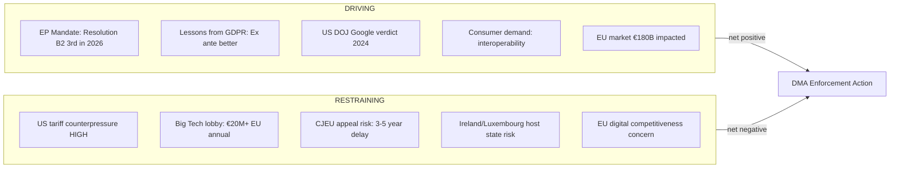

<!-- SPDX-FileCopyrightText: 2026 Hack23 AB -->
<!-- SPDX-License-Identifier: Apache-2.0 -->

# Forces Analysis — Breaking News
**Date:** 2026-05-18 | **SATs Applied:** Force-Field Analysis, Key Assumptions Check

---

## Force-Field Analysis Framework

Force-Field Analysis identifies driving forces (supporting change) and restraining forces (opposing change) for each April 2026 legislative initiative.

---

## DMA Enforcement Forces

### Driving Forces → DMA Enforcement

**Net Force Assessment:** Driving forces (score: 21) > Restraining forces (score: 18) → **PROCEED — with political risk management required**

**Key Assumptions Check:**
1. EP mandate creates real Commission obligation — ASSUMED (EP resolutions advisory but historically effective)
2. US government will escalate to tariff threat — ASSUMED (POSSIBLE but not confirmed)
3. Big Tech will use legal challenges to delay — CERTAIN (historical pattern)

---

## Ukraine Accountability Forces

### Driving Forces → SToCA Progress

| Force | Strength (1-5) | Evidence |
|-------|---------------|---------|
| EP 9th Ukraine accountability resolution since 2022 | 5 | Consistent pattern |
| RSIA asset mechanism generating €2.3B/yr | 4 | Established funding |
| Eastern EU Member State urgency | 5 | Existential security interest |
| ICTY/ICC precedent: tribunals work over time | 3 | Historical analogy |
| Public accountability demand in EU | 4 | Polling consistent |

### Restraining Forces → SToCA Progress

| Force | Strength (1-5) | Evidence |
|-------|---------------|---------|
| Putin arrest impossible without regime collapse | 5 | Physical constraint |
| Russia UNSC veto blocks ICC referral | 5 | Legal constraint |
| Global South sovereignty concerns | 3 | AU pattern |
| Asset seizure legal challenges | 3 | Pending litigation |
| Hungary/Slovakia Council veto | 3 | Known positions |

**Net Force Assessment:** Progress is constrained by physical impossibility of prosecution without custody change. But institutional architecture can proceed.

---

## Armenia Integration Forces

**Key Assumptions Check:**
1. CSTO/EAEU membership is the binding constraint — CONFIRMED (legal analysis)
2. Pashinyan government maintains pro-EU direction — ASSUMED (no evidence to contrary)
3. Azerbaijani gas dependency creates EU-level hesitancy — CONFIRMED (structural dependence)

**Net Force Assessment:** RESTRAINING forces dominate in short term. Driving forces have longer time horizon.

*Generated: 2026-05-18 | Run: breaking-run262-1779068047*
