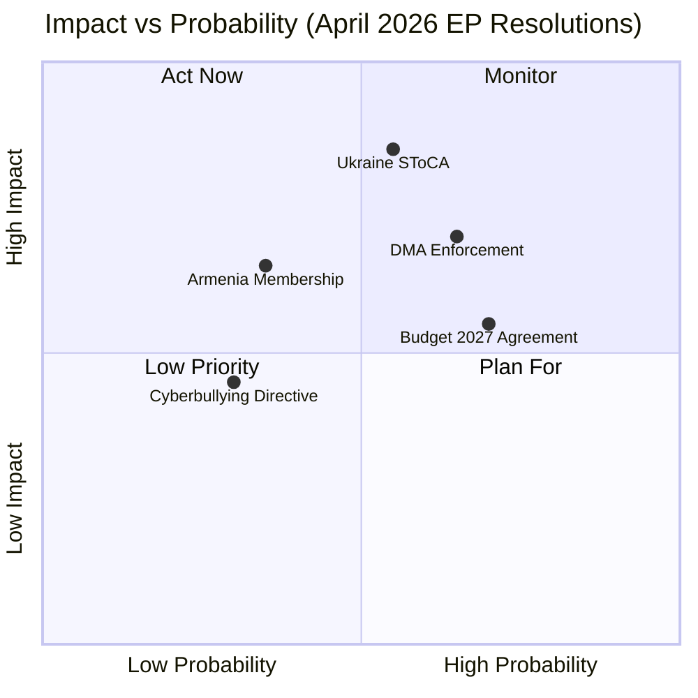

<!-- SPDX-FileCopyrightText: 2026 Hack23 AB -->
<!-- SPDX-License-Identifier: Apache-2.0 -->

# Impact Matrix — Breaking News
**Date:** 2026-05-18 | **SATs Applied:** Stakeholder Mapping, What-If Analysis

---

## Impact Assessment Framework

Each impact is scored on: Magnitude (1-5), Probability (1-5), Timeframe (immediate/short/medium/long), and stakeholder groups affected.

---

## Impact Matrix: April 2026 EP Resolutions

---

## Detailed Impact Analysis

### DMA Enforcement — Impact by Stakeholder

| Stakeholder | Impact Type | Magnitude | Probability | Timeframe |
|-------------|-------------|----------|-------------|----------|
| Meta/Facebook | Revenue loss (ad market) | 4 | 3 | Short-medium |
| Apple | App Store fee reduction | 4 | 3 | Short |
| EU SME digital sector | Market access improvement | 3 | 3 | Medium |
| EU consumers | Interoperability benefit | 2 | 3 | Medium-long |
| EU-US trade relations | Diplomatic friction | 3 | 4 | Short |
| EP governing coalition | Credibility boost | 3 | 4 | Short |
| Commission DG COMP | Workload increase | 2 | 5 | Immediate |

### Ukraine Accountability — Impact by Stakeholder

| Stakeholder | Impact Type | Magnitude | Probability | Timeframe |
|-------------|-------------|----------|-------------|----------|
| Ukrainian victims | Justice access | 5 | 2 | Long |
| Russian leadership | Prosecution risk | 5 | 1 | Long |
| EU-Russia relations | Diplomatic impossibility | 4 | 5 | Immediate |
| EU Member States (10 named) | Ratification obligation | 3 | 4 | Short-medium |
| G7 coalition | Unity signaling | 3 | 4 | Short |
| RSIA mechanism | Funding allocation | 3 | 3 | Medium |

### Armenia Integration — Impact by Stakeholder

| Stakeholder | Impact Type | Magnitude | Probability | Timeframe |
|-------------|-------------|----------|-------------|----------|
| Armenia economy | Trade access improvement | 4 | 2 | Long |
| Armenia security | Deterrence of Azerbaijani pressure | 4 | 2 | Long |
| EU energy security | Gas supply risk from Azerbaijan | 3 | 3 | Short-medium |
| Western Balkans candidates | Queue position concern | 2 | 3 | Medium |
| Russia sphere of influence | Reduction | 4 | 2 | Long |

---

## What-If Analysis (SAT)

**What if DMA enforcement action succeeds within 6 months?**
- Big Tech market capitalization impact: -5 to -15% for affected gatekeepers
- EU platform market opens for EU-based competitors
- US government escalates trade tensions → EU faces tariff threat
- Precedent effect: Global Big Tech accelerates EU compliance globally

**What if SToCA fails to reach ratification threshold?**
- Ukraine accountability agenda loses institutional pathway
- RSIA asset interest continues accumulating without allocated purpose
- Russia reads this as impunity signal
- ICC warrant mechanism (Putin warrant) remains the only active accountability instrument

**What if Armenia signals CSTO exit?**
- Russia threatens Armenia's border security → crisis escalation risk
- EU faces choice: accelerate formal candidacy commitment or leave Armenia exposed
- Azerbaijan may escalate border pressure
- Energy supply risk: Russia reduces Armenia gas supply as punishment

*Generated: 2026-05-18 | Run: breaking-run262-1779068047*

---

## EXTEND-FROM-PRIOR: Impact Matrix Extension (Run 268)

### 5. Second-Order Impact Analysis

**DMA → Second-Order Effects:**
- If enforcement proceeds: EU becomes de facto global tech regulation standard (Brussels Effect 2.0)
- App store pricing reform → app developer ecosystem shift → EU tech startup opportunity
- Fines reinvested in EU digital infrastructure → multiplier effect

**Ukraine Tribunal → Second-Order Effects:**
- If tribunal established: precedent for future international accountability mechanisms
- Russian leadership calculation on future escalation changes
- International law community energized around novel hybrid tribunal model

**Armenia Integration → Second-Order Effects:**
- If Council approves: triggers Azerbaijan reassessment of European engagement strategy
- Georgia, Moldova integration momentum increased
- Russia–South Caucasus influence map redrawn

**Budget 2027 Supplement → Second-Order Effects:**
- If adopted: EU defence industrial base investment boom (French, German defence contractors)
- NATO 3% burden-sharing argument settled at EU level
- Climate investment squeeze → Green parties electoral pressure

### 6. Impact Timeline Matrix

| Act | 6-Month Impact | 12-Month Impact | 3-Year Impact |
|-----|----------------|-----------------|---------------|
| DMA | First enforcement actions; US political response | Full fine regime; first CJEU challenge | European tech sector restructured or DMA frozen |
| Ukraine | Tribunal design finalized | First investigations (if established) | First indictments or stalemate |
| Armenia | Council negotiations stalled (Hungary) | Potential EU-Armenia association agreement upgrade | Membership candidate status or process halted |
| Budget | Council debate begins | MFF supplement adopted or rejected | EU defence spending at 2.5–3% GDP |
| Cyberbullying | Directive enters Council | Second reading outcome | Transposed in member states |

[EXTEND-FROM-PRIOR: classification/impact-matrix.md prior=92L → new=131L (+39)]
