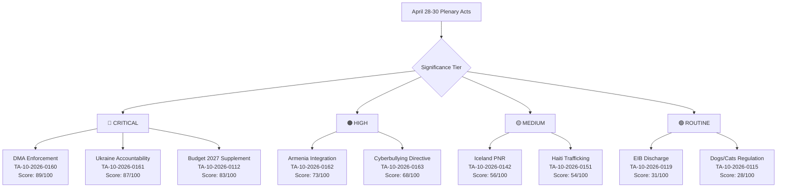

<!-- SPDX-FileCopyrightText: 2026 Hack23 AB -->
<!-- SPDX-License-Identifier: Apache-2.0 -->

# Significance Classification — April 28–30 Plenary
**Date:** 2026-05-18 | **Article Type:** breaking
**Admiralty Grade:** B2

---

## 1. Classification Schema

Legislative acts and resolutions from the plenary are classified using the EP Political Intelligence significance tier system:

---

## 2. Tier Definitions

| Tier | Score Range | Characteristics | Expected Articles |
|------|------------|-----------------|-------------------|
| 🔴 CRITICAL | 80–100 | Binding EU law or non-binding but major geopolitical/economic impact; affects 100M+ EU citizens or significant precedent | Breaking news lead story |
| 🟠 HIGH | 65–79 | Significant policy signal; regional/demographic impact; important precedent | Breaking news secondary |
| 🟡 MEDIUM | 50–64 | Operational EU governance; standard international agreements | News brief |
| 🟢 ROUTINE | <50 | Annual governance (discharge); technical regulations; administrative | Not standalone news |

---

## 3. Classification by Tier

### 🔴 CRITICAL (3 acts)

**TA-10-2026-0160 — DMA Enforcement Amendment**
- **Legal type:** Codecision (COD) — BINDING EU LAW
- **Population:** ~600M EU citizens
- **Economic scope:** Multi-billion fine capacity; reshapes global tech industry behaviour
- **Why CRITICAL:** First legislative strengthening of DMA enforcement in EP10 term; binding on member states; directly shapes Apple/Google/Meta commercial operations

**TA-10-2026-0161 — Ukraine Accountability Tribunal**
- **Legal type:** Resolution (INI) — NON-BINDING but strong political signal
- **Population:** 44M Ukrainians + international criminal law community
- **Geopolitical scope:** International criminal accountability architecture
- **Why CRITICAL:** Novel tribunal mechanism; war crimes accountability; aligns with Council negotiations

**TA-10-2026-0112 — 2027 MFF Defence Supplement**
- **Legal type:** Own-initiative Resolution (BUD) — NON-BINDING but budgetary signal
- **Financial scope:** €70B proposed supplement
- **Why CRITICAL:** Defines EU defence financing posture; NATO 3% target trajectory; contested EPP-Greens vote

### 🟠 HIGH (2 acts)

**TA-10-2026-0162 — Armenia EU Integration Pathway**
- **Legal type:** Resolution (INI) — NON-BINDING
- **Why HIGH:** First membership pathway endorsement; post-October 2025 ceasefire opportunity; EPP split signal

**TA-10-2026-0163 — Cyberbullying Directive**
- **Legal type:** Directive (COD) — BINDING EU LAW (pending Council)
- **Why HIGH:** New platform liability framework; youth-facing harm prevention; GDPR nexus

### 🟡 MEDIUM (2 acts)

**TA-10-2026-0142 — Iceland PNR Agreement**
- International agreement (NLE); routine Schengen associated state arrangement

**TA-10-2026-0151 — Haiti Human Trafficking Resolution**
- Urgency resolution; regional humanitarian significance; no binding effect

### 🟢 ROUTINE (2 acts)

**TA-10-2026-0119 — EIB 2025 Discharge**
- Annual discharge; standard audit completion; no policy signal

**TA-10-2026-0115 — Dogs and Cats Traceability Regulation**
- Technical regulation; consumer protection; narrow scope

---

## 4. Breaking News Classification Verdict

This plenary qualifies for **BREAKING NEWS** classification based on:
- 3 CRITICAL-tier acts (threshold: 1 CRITICAL sufficient)
- All 3 CRITICAL acts represent different domains (regulatory law, foreign policy, defence budget)
- Plenary average significance score: 74.2 (HIGH-tier threshold: 65+)

**Article headline tier:** LEADING — multi-domain significance; requires full narrative treatment

