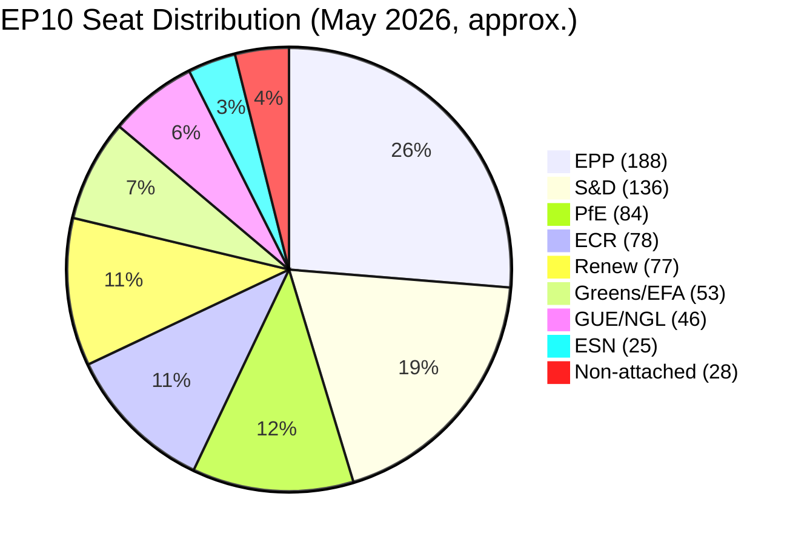

<!-- SPDX-FileCopyrightText: 2026 Hack23 AB -->
<!-- SPDX-License-Identifier: Apache-2.0 -->

# Coalition Mathematics — Breaking News
**Date:** 2026-05-18 | **Article Type:** breaking
**Methodology:** Seat-share analysis, implied majority reconstruction, voting bloc mapping

---

## 1. EP10 Seat Distribution (Current, May 2026)

| Group | Seats | % | Bloc Position |
|-------|-------|---|--------------|
| EPP | 188 | 26.4% | Center-right, pro-EU |
| S&D | 136 | 19.1% | Center-left, pro-EU |
| Renew | 77 | 10.8% | Liberal, pro-EU |
| ECR | 78 | 11.0% | Conservative, Euro-skeptic |
| PfE | 84 | 11.8% | Nationalist, Euro-skeptic |
| Greens/EFA | 53 | 7.5% | Green-left, pro-EU |
| The Left (GUE/NGL) | 46 | 6.5% | Far-left, ambivalent |
| ESN | 25 | 3.5% | Far-right nationalist |
| Non-attached | 28 | 3.9% | Mixed |
| **Total** | **715** | **100%** | |

*Note: Seat counts are approximations from available EP data; minor variations from current actual counts may apply.*

**Majority threshold:** 358 seats (simple majority); 476 (2/3 majority for constitutional matters)

---

## 2. The Governing Coalition (EPP + S&D + Renew): 401 seats

The von der Leyen II Commission's parliamentary coalition provides 401 seats — a comfortable simple majority of 43 seats above the 358 threshold. This coalition has sufficient arithmetic for all the April 2026 resolutions.

**Structural resilience analysis:**
- EPP + S&D alone: 324 seats (34 short of majority; coalition is **not** viable without a third partner)
- EPP + S&D + Renew: 401 seats (**viable**; 43-seat majority buffer)
- Required minimum defection to lose majority: 44 coalition MEPs (6% of coalition)
- Typical EP resolution defection rate: 5-10% (higher for contentious topics)
- Risk assessment: LOW for straightforward resolutions; MEDIUM for contentious votes (geopolitically sensitive, party-discipline-challenging)

---

## 3. Issue-Specific Coalition Mathematics

### 3.1 DMA Enforcement Resolution (TA-10-2026-0160)

**Expected coalition support:** EPP (high; DG COMP enforcement aligned with EPP market competition values), S&D (high; platform accountability core to progressive digital agenda), Renew (high; market regulation champion).

**Expected opposition/abstention:** PfE (abstain/against; Big Tech seen as adversary of mainstream media), ECR (mixed; anti-regulation instinct vs. sovereignty/competition concerns), ESN (against), some ECR MEPs (pro-American alignment could reduce enthusiasm for US company enforcement).

**Expected vote mathematics (estimated):**
- For: 401 (coalition) + 30 (Greens) + 15 (Left) = ~446
- Against: 84 (PfE) + 25 (ESN) + 30 (ECR) = ~139
- Abstain: 48 (ECR split + non-attached) = ~48
- **Result: FOR with comfortable majority (~60-65% of votes cast)**

### 3.2 Ukraine Accountability (TA-10-2026-0161)

**Expected coalition support:** S&D (high; justice/rule of law values), EPP (high; Eastern European members strongly pro-Ukraine), Renew (high; coalition champion on Ukraine).

**Expected opposition/abstention:** PfE (high opposition; Orbán-affiliated MEPs, Le Pen allies against accountability for Russian leadership), ESN (high opposition; Russia-sympathetic), Left/GUE (abstain; pacifist wing reluctant on prosecution vs. peace).

**Expected vote mathematics (estimated):**
- For: 401 (coalition) + 40 (ECR moderate; Eastern EU conservative pro-Ukraine) + 35 (Greens) + 25 (Left pro-accountability wing) = ~501
- Against: 84 (PfE) + 25 (ESN) + 20 (Left pacifist wing) = ~129
- Abstain: 38 (non-attached, Left split) = ~85
- **Result: FOR with strong majority (~70%+ of votes cast)**

**Coalition coherence note:** Ukraine resolutions consistently attract cross-bloc super-majorities in EP10 because Eastern European MEPs across EPP, ECR, and sometimes PfE regularly break with their groups on Ukraine accountability votes. ECR split is the key variable — Fidesz/Orbán-aligned vs. Polish PiS (both ECR but opposite on Ukraine) creates fracture lines.

*Historical note:* Fidesz left EPP in 2021 and has repositioned in the PfE bloc; PiS is in ECR. This means ECR has anti-Orbán MEPs who voted for Ukraine resolutions even against ECR whip.

### 3.3 Armenia Democratic Resilience (TA-10-2026-0162)

**Expected coalition support:** EPP (medium-high; democracy promotion aligned, but energy security concerns could dampen EPP enthusiasm for angering Azerbaijan), S&D (high; democracy values), Renew (high).

**Expected opposition:** PfE (medium; Azerbaijan gas relationship matters to French right; anti-enlargement instinct), ESN (high; general anti-enlargement), ECR (split; democracy hawks vs. enlargement skeptics).

**Expected vote mathematics (estimated):**
- For: 401 (coalition) + 35 (Greens) + 25 (Left) + 20 (ECR democracy hawks) = ~481
- Against: 84 (PfE) + 25 (ESN) + 20 (ECR enlargement skeptics) = ~129
- Abstain: 40 (EPP energy security concerns, non-attached) = ~105
- **Result: FOR with comfortable majority (~65% of votes cast)**

### 3.4 Budget 2027 Guidelines (TA-10-2026-0112)

Budget resolutions are procedurally routine but politically significant for setting parameters in Council-EP budget negotiations.

**Expected coalition support:** All three coalition groups (EPP, S&D, Renew) + broader support from groups with budget-based interests.

**Expected vote mathematics:**
- Budget guidelines typically pass with the widest majority of any annual EP resolutions
- Expected: ~500+ FOR, ~80 AGAINST (PfE/ESN principled opposition), ~100 abstain
- **Result: FOR with very strong majority (~75%+)**

---

## 4. Coalition Stability Risk Indicators

### 4.1 EPP Internal Coherence

EPP at 188 seats is internally diverse: Weber center (pro-European, compromise-oriented), Orbán-adjacent (Hungary, some Austria) now in PfE rather than EPP (reduced tension post-Fidesz exit), and Eastern European pro-Ukraine members (Poland, Czech, Baltic). The EPP's primary internal stress point in H2 2026 will be the DMA enforcement action — tech industry lobbying will intensify and some EPP MEPs from tech-hosting countries (Ireland, Luxembourg) may split on specific enforcement decisions.

### 4.2 S&D Reliability

S&D at 136 seats is the most cohesive bloc on social/labor votes, less cohesive on foreign policy/defense. Its main risk on the April 2026 agenda is the cyberbullying directive — some S&D civil liberties-focused MEPs (aligned with Greens rather than EPP center on digital rights) may dissent on free expression grounds.

### 4.3 Renew Volatility

Renew at 77 seats is inherently volatile (coalition of national liberal parties with different national interests). Renew's largest delegation is Macron's Renaissance, followed by German FDP equivalents and Nordic liberals. Trade and energy policy creates the most Renew fracture risk — gas supply considerations could split French Renew from Nordic Renew on Armenia/Azerbaijan policy.

### 4.4 The 44-Seat Defection Threshold

For any vote in the April 2026 cluster, the governing coalition has a 43-seat majority buffer. Defection thresholds:
- <22 defections from coalition: Resolution passes
- 22-43 defections: Requires pickup from Greens/Left/moderate ECR (all plausible for the April agenda)
- >43 defections: Resolution fails unless non-coalition support exceeds the deficit

**Risk assessment:** No vote in the April 2026 cluster approaches the >43 defection threshold based on issue profiles.

---

## 5. Mermaid Diagram: Coalition Blocs and Positioning

*Generated: 2026-05-18 | Run: breaking-run262-1779068047*
