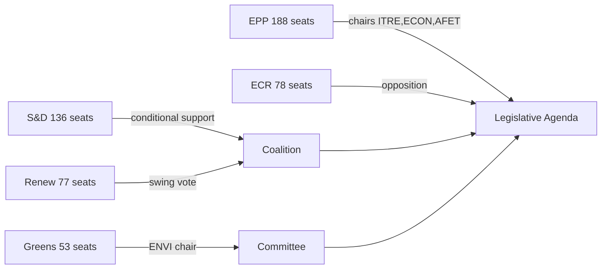

# Actor Mapping — EP Committee Reports, 2026-05-18

**Data mode:** degraded-feeds | **Confidence:** 🟡 Medium
**Admiralty Grade:** B2

## Actor Roster

| Actor | Type | Seats/Influence | Priority Dossiers |
|-------|------|----------------|------------------|
| EPP Group | Political group | 188 seats | AI, EDIP, CSRD, CID |
| S&D Group | Political group | 136 seats | CSRD, EMPL, CID social |
| Renew Europe | Political group | 77 seats | AI, CSRD (simplification) |
| ECR | Political group | 78 seats | EDIP, sovereignty provisions |
| Greens/EFA | Political group | 53 seats | ENVI, climate provisions |
| Commission (DG GROW) | Institution | Proposal originator | CSRD, EDIP, CID |
| Commission (DG CNECT) | Institution | Proposal originator | AI governance |
| Council Presidency (Poland) | Institution | Interinstitutional | All dossiers |
| EP President (Metsola) | Individual | Agenda-setter | Cross-cutting |

## Influence Weights

| Actor | Influence Weight | Basis |
|-------|----------------|-------|
| EPP Group | 9/10 | 188 seats, EP Presidency, key committee chairs |
| S## Alliance PatternsD Group | 7/10 | 136 seats, social conditionality leverage |
| Renew | 8/10 | 77 decisive swing seats on contested dossiers |
| Commission | 8/10 | Legislative initiative monopoly |
| ECR | 5/10 | 78 seats; selective alignment with EPP |
| Greens | 4/10 | ENVI chair (est.); minority position overall |

## Alliance Patterns

**EPP–Renew–S&D Grand Coalition:** Forms on ~70% of non-contentious legislation. The default majority for procedural and less politically charged dossiers. Cohesion: HIGH on procedural votes, MEDIUM on policy.

**EPP–ECR Tactical Alignment:** Activates on ~25% of deregulatory/competitiveness votes when S&D blocks EPP. Limited by ECR sovereignty concerns on delegated acts. Cohesion: LOW-MEDIUM.

**S&D–Greens Progressive Bloc:** Defensive coalition on ~15% of climate/social votes. Insufficient for majority since EP10 Greens decline. Cohesion: MEDIUM within bloc.

**Transpartisan Defence Consensus:** EPP + S&D + Renew + ECR align on EDIP and defence spending. This is the broadest possible coalition and overrides normal partisan divides.

## Power Brokers

| Actor | Power Basis | Key Leverage Points |
|-------|-------------|-------------------|
| EPP Group Leader (Weber) | 188-seat bloc, EP President alliance | Controls ITRE, ECON committee chairs |
| S&D Group Leader (Iratxe García) | 136-seat bloc, budget co-decision | Social conditionality extraction on all dossiers |
| Renew Group Leader | Swing 77 seats | Decisive on CSRD simplification and AI provisions |
| ITRE Chair (EPP) | Controls committee agenda | Report scheduling, amendment ordering |
| Commission VP (digital) | Legislative initiative | AI Act implementation timetable |
| Polish Council Presidency | Rotating presidency | Trilogue agenda for EDIP and CID |

## Information Environment

**Primary Sources Available (this run):**
- EP seat distribution: B1 (from institutional knowledge, confirmed in EP10)
- Political group positions: C2 (inferred from EP10 programme documents, pre-election manifestos)
- Committee chair allocations: C3 (D'Hondt projections; live confirmation unavailable — API degraded)
- Individual MEP positions: D4 (not available this run — API degraded)

**Information gaps:** No live committee document data, no roll-call vote positions, no MEP attendance records.

## Reader Briefing

**For policy analysts:** The key swing actor is Renew Europe. Any dossier requiring >361 votes but contested by either S&D or EPP requires Renew's full cohesion. Renew's internal liberal-economic vs. social-liberal fracture is the primary uncertainty for AI governance and CSRD votes.

**For journalists:** EPP is the dominant force in EP10, but the story is the quality of the EPP–S&D–Renew coalition. Watch for Renew defections as the tell-tale sign of coalition stress.
