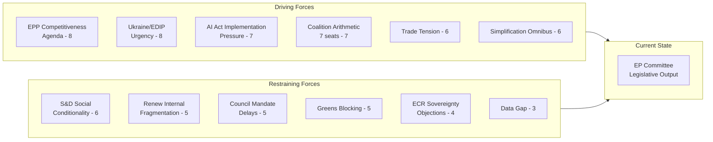

# Forces Analysis — EP Committee Reports, 2026-05-18

**Framework:** Lewin Force Field Analysis
**Data mode:** degraded-feeds | **Confidence:** �� Medium | **Admiralty Grade:** B2

## Issue Frame

**Central Issue:** Will the EP10 committee system sustain legislative momentum on the Competitiveness Agenda (AI governance, EDIP, CSRD simplification, CID) through the May–July 2026 committee vote cycle, or will coalition fragmentation and data transparency failures slow legislative output?

**Stakes:** EU's ability to maintain the "productivity–security" dual mandate that defines the EP10 political consensus. Failure to deliver on AI, EDIP, or CSRD in this legislative window would signal coalition breakdown and invite populist pressure ahead of the 2026 national election cycle (France, Germany, Sweden).

## Driving Forces

| Force | Strength (1–10) | Trend | Evidence |
|-------|----------------|-------|---------|
| EPP Competitiveness Agenda (Metsola/Weber) | 8 | Stable-high | EP10 programme, von der Leyen second term mandate |
| Ukraine/EDIP urgency (defence spending consensus) | 8 | Increasing | NATO spending commitments, transatlantic uncertainty |
| AI Act implementation pressure | 7 | Increasing | AI Act entered force Aug 2024; GPAI obligations Q1 2026 |
| Commission simplification omnibus | 6 | Increasing | Omnibus I & II omnibus packages advancing |
| US–EU trade tension (tariff context) | 6 | Increasing | US 25% tariff threat on EU industrial goods |
| EP10 coalition arithmetic (right-leaning majority) | 7 | Stable | Seat distribution favours EPP-led agenda |

**Net driving force score: 42/60**

## Restraining Forces

| Force | Strength (1–10) | Trend | Evidence |
|-------|----------------|-------|---------|
| S&D social conditionality demands | 6 | Stable | S&D programme, CSRD/EDIP social amendments |
| Greens/EFA climate blocking on CSRD | 5 | Decreasing | Weakened by seat reduction (74→53 EP9→EP10) |
| Council mandate delays (Polish presidency) | 5 | Stable | EDIP Article 173 legal base contested |
| ECR sovereignty objections (delegated acts) | 4 | Stable | ECR programme, anti-Commission stance |
| EP API data transparency gap | 3 | Decreasing | Temporary (outage); expected 24–48h recovery |
| Renew internal fragmentation | 5 | Increasing | Liberal-economic vs. social-liberal cleavage visible on AI, CSRD |

**Net restraining force score: 28/60**

## Net Pressure

**Net Force Balance: +14/60 — Driving forces clearly dominant**

The EPP Competitiveness Agenda has a decisive structural advantage in EP10. The combination of seat arithmetic, external pressure (defence, trade), and the Commission's simplification drive creates a self-reinforcing momentum that has sufficient force to overcome the S&D and Greens restraining forces. The most significant restraining uncertainty is Renew's internal fragmentation, which could convert from a MEDIUM restraint to a HIGH restraint if the liberal-economic wing splits from the social-liberal wing on two or more major dossiers simultaneously.

## Intervention Points

**High leverage interventions to maintain legislative momentum:**
1. **Renew internal coordination** — EPP and Commission briefings to Renew group on AI/CSRD scope. Prevents internal Renew fracture from converting moderate resistance into decisive blocking.
2. **S&D social conditionality package deal** — Negotiate a single social conditionality amendment set across CID, EDIP, and AI dossiers. Bundle to give S&D a political win without disrupting individual report timelines.
3. **Council acceleration on EDIP** — Polish presidency should table an EDIP trilogue timeline before June 2026 Strasbourg plenary. Delay risk is the second-highest uncertainty.
4. **Greens ENVI opinion management** — Allow ENVI to issue a formal opinion on CSRD simplification. The opinion will be substantively blocked but gives Greens political legitimacy to maintain their coalition participation elsewhere.

## Reader Briefing

The force field analysis confirms that the EPP-led Competitiveness Agenda is the dominant legislative force in EP10. The key uncertainty is whether Renew can maintain internal cohesion through a contested spring–summer committee vote cycle. Decision-makers should monitor Renew group coordinator statements on AI governance and CSRD provisions as leading indicators of coalition stress.
