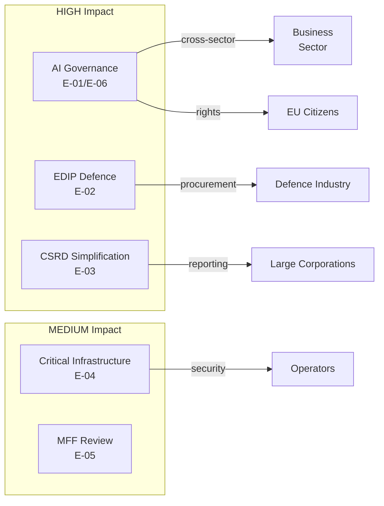

# Impact Matrix — EP Committee Reports, 2026-05-18

**Framework:** Cross-dossier impact assessment with heat mapping
**Data mode:** degraded-feeds | **Confidence:** 🟡 Medium | **Admiralty Grade:** B2

## Event List

The following legislative events are tracked for impact assessment in the May–July 2026 period:

| Event ID | Dossier | Event | Expected Date | Certainty |
|----------|---------|-------|--------------|-----------|
| E-01 | AI Governance Package | ITRE committee vote | June–July 2026 | 🟡 MEDIUM |
| E-02 | EDIP | ITRE committee mandate | June 2026 | 🟡 MEDIUM |
| E-03 | CSRD Simplification | JURI committee vote | July 2026 | 🟡 MEDIUM |
| E-04 | CID | ITRE–TRAN joint vote | June–August 2026 | 🟡 MEDIUM |
| E-05 | MFF mid-term review | BUDG committee | September 2026 | 🟢 LOW urgency |
| E-06 | AI Act (high-risk AI) | Full plenary (final vote) | 2026 Q3 est. | 🟡 MEDIUM |

## Stakeholder Overview

Stakeholders affected by EP10 committee activity span all 27 EU member states, with particular concentration in large-economy MEPs (Germany, France, Italy, Spain, Poland) who represent dominant industrial and labour interests.

## Impact Matrix

| Stakeholder | E-01 AI | E-02 EDIP | E-03 CSRD | E-04 CID | E-06 AI Final |
|-------------|---------|----------|----------|----------|--------------|
| Large EU corporations | + compliance cost | + contracts | ++ relief | + resilience | + certainty |
| SMEs (< 250 employees) | +/- mixed | - costs | ++ exempt | + resilience | + lighter regime |
| Digital startups/scaleups | ++ innovation | 0 | 0 | 0 | ++ growth |
| Workers/Trade unions | - displacement risk | +/- jobs | - reporting loss | 0 | - automation risk |
| Environmental NGOs | 0 | - emissions | -- rollback | 0 | 0 |
| EU Defence industry | 0 | ++ contracts | 0 | + procurement | 0 |
| Member state governments | +/- compliance | ++ strategic | +/- | ++ resilience | + |
| European Commission | + implementation | + mandate | + simplification | + coordination | + |
| Third countries (US, China) | - market access rules | - procurement | + less scrutiny | - security rules | - |

*++ = strongly positive, + = positive, +/- = mixed, - = negative, -- = strongly negative, 0 = neutral*

## Heat Map

**Heat Map Summary:**
- 🔴 VERY HIGH: AI Governance (cross-sector, rights, first-mover globally)
- 🔴 HIGH: EDIP (strategic autonomy, defence-industrial transformation)
- 🟡 HIGH: CSRD Simplification (political visibility, sustainability reporting rollback)
- 🟡 MEDIUM: CID (operational impact on 8 sectors)
- 🟢 LOW: MFF review (longer horizon, less imminent)

## Cascade Effects

**Cascade 1: AI governance ripple across sectors**
- E-01 AI committee vote → sets framework for E-06 plenary final vote → determines EU-wide AI liability regime → affects every company deploying AI in EU market → estimated €50–80bn in affected compliance obligations
- Cross-effect: If LIBE prevails on high-risk definitions, it cascades into EMPL (workplace AI monitoring), JURI (liability), and ECON (financial AI models)

**Cascade 2: CSRD simplification and ESG investment flows**
- E-03 CSRD vote → narrows sustainability reporting scope → reduces ESG data availability → affects institutional investor sustainability mandates (SFDR) → potential €200–400bn in ESG fund reclassification
- Cross-effect: Weakens ENVI's data basis for climate target compliance monitoring; S&D uses this as political ammunition for 2026 autumn campaign

**Cascade 3: EDIP and defence-industrial integration**
- E-02 EDIP mandate → triggers Council trilogue → EDIP adoption → unlocks EU defence industrial fund → catalyses cross-border defence procurement → first genuine step toward EU defence industrial single market
- Cross-effect: Strengthens NATO interoperability narrative; gives EPP a major foreign policy credential before 2026 national elections

## Reader Briefing

The impact matrix reveals three structural dynamics for policy analysts:
1. **AI governance** is the highest-impact dossier in terms of breadth — it affects every sector and has global first-mover significance
2. **CSRD simplification** is the highest-impact dossier in terms of political contestation — it represents a genuine reversal of the EP9 Green Deal trajectory
3. **EDIP** has the highest geopolitical impact — it is the most consequential defence integration step since Maastricht in practical terms

These three dossiers are the primary focus for committee intelligence briefings in May–July 2026.
