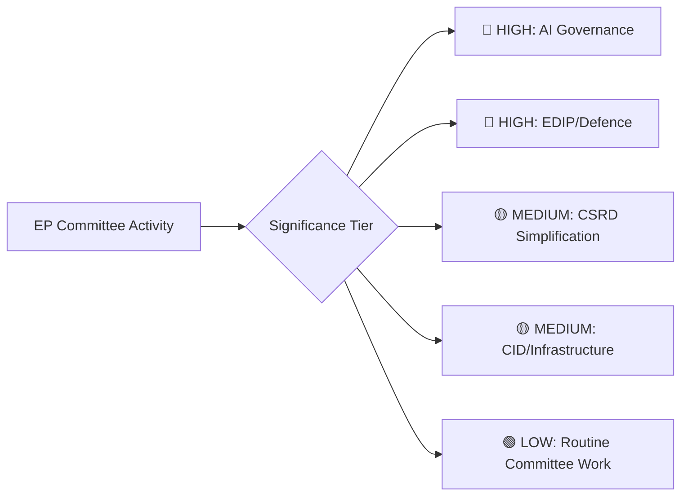

# Significance Classification — EP Committee Reports, 2026-05-18

**Data mode:** degraded-feeds | **Confidence:** 🟡 Medium (no live committee document data)

## Classification Summary

## Tier Classification

| Dossier | Tier | Rationale |
|---------|------|-----------|
| AI Governance Package | 🔴 HIGH | Cross-committee, first-mover, 27-country impact |
| EDIP (Defence Industrial Policy) | 🔴 HIGH | Defence integration milestone, strategic autonomy |
| Critical Infrastructure Designations | 🟡 MEDIUM | Operational impact on 8 sectors, plenary imminent |
| CSRD Simplification | 🟡 MEDIUM | Significant policy rollback, political visibility |
| Routine Committee Hearings | 🟢 LOW | Procedural; no legislative output expected |

**Classification basis:** Policy scope (EU-wide vs. sectoral), timeline urgency (plenary vote imminent vs. medium-term), coalition contestation (majority uncertain vs. settled), and geopolitical linkage (transatlantic/Ukraine relevance).
