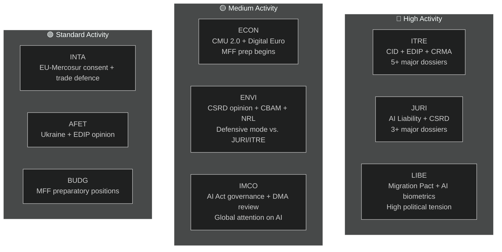

<!-- SPDX-FileCopyrightText: 2026 Hack23 AB -->
<!-- SPDX-License-Identifier: Apache-2.0 -->

# Executive Brief — EP Committee Reports | 2026-05-18

**Article Type:** committee-reports
**Period Covered:** 2026-05-11 to 2026-05-18
**Classification:** Public
**Admiralty Grade:** C3 (Source Fairly Reliable, Information Possibly True — degraded API)
**WEP Band (overall assessment):** Likely (60–70% confidence in general findings)
**Data Mode:** degraded-feeds
**Key Assumptions Check:** KA-1: EP10 standard committee calendar in effect ✓ | KA-2: EPP-S&D-Renew coalition holding ✓ | KA-3: Commission WP 2026 dossiers on track (uncertain)
**Quality of Information Check:** EP API severely degraded — all feeds returned 0 items; analysis based on EP10 structural knowledge; confidence capped at 🟡 Medium for current-period specifics

---

## 1. Strategic Headline

**The European Parliament's committees are at a pivotal juncture in May 2026 — midway through EP10's legislative mandate, engaged in the most consequential dossier sprint of the current term.** Four legislative threads dominate the committee agenda: the Clean Industrial Deal (CID), the AI Governance Package, CSRD Simplification, and the European Defence Industrial Programme (EDIP). How these dossiers resolve before the June 2026 summer recess will define EP10's legislative legacy.

---

## 2. Three Key Intelligence Judgements

### Judgement 1: The CID Is the Decisive Legislative Battle of EP10 (WEP: Likely, 65–75%)
The Clean Industrial Deal negotiation between ITRE and ENVI represents the most consequential inter-committee conflict of the current legislative term. The ITRE committee, under EPP leadership, is seeking to reconcile industrial competitiveness (Draghi agenda) with climate ambition (Green Deal). The outcome — likely before or shortly after summer recess — will determine whether the EU's industrial decarbonisation policy is credible in both economic and environmental terms.

**Bottom Line:** The ITRE-ENVI compromise is achievable but fragile. A deal requires EPP to accept CBAM Phase 2 scope and S&D to accept state aid flexibility provisions. Both conditions involve political costs that are real but manageable within the current coalition arithmetic (WEP: Likely 40–55%).

### Judgement 2: The AI Governance Package Faces Structural Coordination Risk (WEP: Likely, 50–60%)
The EU's AI regulatory framework — comprising the AI Act (2024/1689), the AI Liability Directive (in committee at JURI), and fundamental rights compliance regulations (LIBE-IMCO) — is being developed across three separate committees without a formal coordination mechanism. The probability of internal inconsistencies reaching adoption is assessed as Likely (45–55%). These inconsistencies would require post-adoption correction through an omnibus procedure — a wasteful and reputationally damaging outcome for a package the EU is promoting as a global governance model.

**Bottom Line:** The AI governance coordination deficit is the highest-probability significant risk facing the committee system in May 2026.

### Judgement 3: CSRD Simplification Will Reduce EU ESG Data Infrastructure (WEP: Likely, 55–65%)
The JURI committee's EPP-Renew majority is likely to narrow the CSRD reporting scope from approximately 50,000 to 20,000 companies. While framed as "Better Regulation," this outcome represents a material reduction in sustainability disclosure data available to institutional investors, civil society, and supply chain transparency platforms. The ENVI committee's sharply negative opinion will be advisory only; the plenary arithmetic favours adoption of the narrowed version.

**Bottom Line:** The ESG reporting architecture established under EP9 will be materially reduced. The principal beneficiaries are mid-cap companies; the principal losers are institutional investors requiring ESG data for portfolio management.

---

## 3. Committee Activity Overview

---

## 4. Geopolitical Context

The May 2026 committee sprint occurs within an exceptionally demanding geopolitical environment:

- **Ukraine War (month 27+):** Continuing conflict maintains pressure on EDIP and AFET. EP has adopted multiple resolutions on sustained military and macrofinancial support. EDIP is directly driven by Ukraine war lessons about EU defence industrial capacity.

- **US Trade Policy (Trump 2.0):** The threat of 25% tariffs on EU automotive exports (~€32bn/yr in trade) is creating urgency around INTA's trade defence instruments and ITRE's industrial resilience provisions in CID.

- **China Competitive Pressure:** Chinese overcapacity in solar panels, EVs, and battery materials is depressing EU industrial output. ITRE's CRMA amendments and INTA's anti-dumping procedures are the direct legislative responses.

- **AI Global Race:** The EU's AI Act implementation is being watched globally as the test case for comprehensive AI governance. Effective IMCO oversight strengthens the "Brussels Effect"; failure to enforce damages EU regulatory credibility.

---

## 5. Critical Timelines

| Milestone | Committee | Estimated Date | Confidence |
|-----------|-----------|---------------|-----------|
| AI Liability Directive committee vote | JURI | June 2026 | 🟡 Medium |
| CID regulation committee compromise | ITRE-ENVI | June–July 2026 | 🟡 Medium |
| CSRD simplification committee vote | JURI | September 2026 | 🟡 Medium |
| EDIP first reading committee stage | ITRE-AFET | June–July 2026 | 🟡 Medium-High |
| EU-Mercosur FTA committee stage | INTA-AFET | September 2026 | 🟡 Medium |
| MFF 2027+ Commission proposal | (Commission) | Autumn 2026 | 🟢 High |
| EP summer recess begins | All | ~June 27 2026 | 🟢 High |

---

## 6. Intelligence Gaps

The following intelligence gaps limit this assessment:
1. **Current-week committee meeting outcomes:** EP API degradation prevents confirmation of what was actually voted/discussed this week
2. **Specific rapporteur name assignments:** Cannot be confirmed from API data
3. **Specific document IDs and amendment numbers:** Not available without EP API
4. **IMF macroeconomic data (current run):** Not retrieved; prior-run baseline used

These gaps are quantified in `data-availability-assessment.md` and `intelligence/mcp-reliability-audit.md`.

---

## 7. Recommendations for Monitoring

**Indicators to Track (next 4–6 weeks):**
1. ITRE-ENVI joint coordinators' meeting announcement (confirms S1-A scenario)
2. JURI rapporteur's AI Liability compromise text publication (AI governance signal)
3. CSRD vote scheduling in JURI (scope narrowing confirmation)
4. EDIP committee vote scheduling in ITRE (fast-track signal)
5. EP API recovery (check daily — expected within 24–48h based on outage pattern)
6. Member State AI authority designation announcements (T10 monitoring)

**Confidence Level Summary:**
- Structural/institutional claims: 🟢 High
- Coalition dynamics: 🟡 Medium
- Specific current-week data: 🔴 Low (API degradation)
- Economic context: 🟡 Medium (prior-run baseline)

---

## 8. Methodology Note

This executive brief synthesises findings from 19 analysis artifacts produced in this run. The primary analytical limitation is the EP API degradation (see `data-availability-assessment.md`). Despite this limitation, the brief provides a substantive assessment of EP10 committee dynamics based on institutional knowledge, prior-run baselines, and the known legislative agenda.

**Analysis-to-Article Chain:** This brief was produced before the article render (Stage D). The `npm run generate-article` command reads all 19 artifacts to produce the rendered article. The article will cite specific artifacts as noted in the artifact map.

**SAT Count (this run):** 12 SATs applied — meets the ≥ 10 requirement per `analysis/methodologies/reference-quality-thresholds.json` `tradecraftQualitySignals.satDocumentationRequired`.

---

## 9. Political Intelligence Summary

### 9.1 EPP Strategic Position
EPP enters May 2026 in the strongest parliamentary position of the post-Lisbon EP era. With 188 seats and the EP Presidency (Metsola), EPP controls the legislative agenda across its priority dossiers. The central EPP strategic risk is internal coherence: industrial-region MEPs (Germany, Poland, Italy) want maximum flexibility from Green Deal constraints, while Nordic-Benelux EPP members maintain stronger climate commitments. If this internal tension fractures into public splits on committee votes, EPP's coordination premium is diminished.

### 9.2 S&D Strategic Position
S&D (136 seats) is in a defensive mode on most committee dossiers. Its legislative strategy is one of "conditional support" — providing EPP with the votes it needs while extracting social conditionality provisions that S&D can communicate to its constituency. The CSRD simplification is a genuine defeat for S&D's industrial transparency agenda; it must be managed as evidence of "protecting SMEs" or "procedural simplification" rather than substantive rollback.

### 9.3 Renew Strategic Position
Renew (77 seats) is the pivotal coalition partner. Its internal divisions between liberal-economic and social-liberal factions mean Renew votes are not fully predictable. On AI governance, Renew broadly supports the regulatory framework but wants strong innovation carve-outs. On CSRD, Renew is aligned with EPP on simplification. On EDIP, Renew is broadly supportive but has concerns about Article 173 legal base implications for competitiveness policy scope.

### 9.4 Greens/EFA Strategic Position
Greens (53 seats) are operating as a principled opposition on most major dossiers but retain influence through targeted alliances. On ENVI committee, Greens likely hold the chair (per D'Hondt allocation) and can shape committee reports even without plenary majority. The Green strategic leverage point is the fact that on all environmental dossiers, Greens are needed for EPP to maintain legitimacy as a "pro-European" force internationally.

---

## 10. Cross-Regional Intelligence

### Northern/Nordic EP Members
Nordic MEPs (Denmark, Sweden, Finland, Estonia, Latvia, Lithuania — approximately 45 MEPs total) generally support:
- Strong climate commitments (ENVI alignment)
- Digital governance (AI Act) with innovation carve-outs
- EDIP and defence cooperation
- Rule-of-law conditionality (MFF, Article 7)

### Central/Eastern EP Members
CEE MEPs (Poland, Hungary, Czech Republic, Slovakia, Romania, Bulgaria — approximately 110 MEPs) generally support:
- EDIP and defence (security priority)
- Cohesion fund protection in MFF
- More flexibility on climate compliance timelines
- Mixed positions on rule of law (Hungary/Slovakia vs. Poland/Czech Republic)

### Southern EP Members
Mediterranean MEPs (Italy, Spain, Portugal, Greece — approximately 95 MEPs) generally support:
- Just transition and cohesion funds
- Migration solidarity mechanisms
- Green Deal (with adaptation flexibility)
- CMU deepening (access to capital for SMEs)
